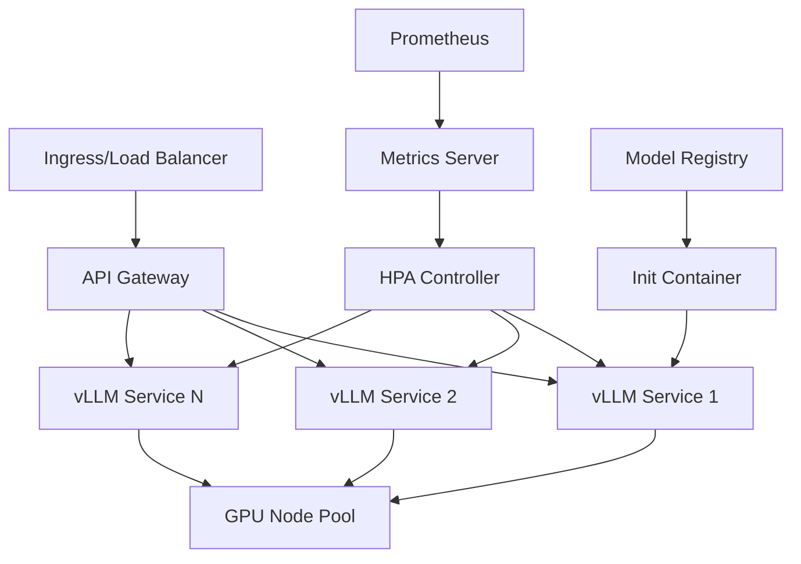

# Despliegue de LLMs a Escala con Kubernetes

Guía completa para desplegar y escalar modelos de lenguaje grandes (LLMs) en entornos de producción usando Kubernetes, vLLM y estrategias de optimización avanzadas.

## 🎯 Objetivos de Aprendizaje

Después de completar esta guía, podrás:

- Desplegar LLMs usando vLLM en Kubernetes
- Configurar auto-scaling basado en métricas de GPU
- Implementar estrategias de caching y optimización
- Gestionar múltiples modelos en producción
- Monitorear rendimiento y costos de inferencia

## 📋 Prerrequisitos

- Conocimientos básicos de Kubernetes
- Experiencia con Docker y Helm
- Familiaridad con LLMs y vLLM
- Cluster Kubernetes con GPUs (opcional pero recomendado)

## 🏗️ Arquitectura de Despliegue

### Componentes Principales



### Estrategias de Despliegue

1. **Single Model per Pod**: Aislamiento completo
2. **Multi-Model per Pod**: Optimización de recursos
3. **Model Sharding**: Distribución de modelos grandes
4. **Dynamic Loading**: Carga bajo demanda

## 🚀 Despliegue Básico con vLLM

### 1. Preparación del Cluster

```bash
# Verificar GPUs disponibles
kubectl get nodes -o json | jq '.items[].status.capacity."nvidia.com/gpu"'

# Instalar NVIDIA GPU Operator (si no está instalado)
helm repo add nvidia https://nvidia.github.io/gpu-operator
helm repo update
helm install gpu-operator nvidia/gpu-operator \
  --create-namespace \
  --namespace gpu-operator
```

### 2. Crear Namespace y ConfigMaps

```yaml
# vllm-namespace.yaml
apiVersion: v1
kind: Namespace
metadata:
  name: vllm-system
  labels:
    name: vllm-system
```

```yaml
# vllm-config.yaml
apiVersion: v1
kind: ConfigMap
metadata:
  name: vllm-config
  namespace: vllm-system
data:
  MODEL_NAME: "microsoft/DialoGPT-medium"
  MODEL_REVISION: "main"
  DTYPE: "float16"
  MAX_MODEL_LEN: "2048"
  GPU_MEMORY_UTILIZATION: "0.9"
  MAX_NUM_SEQS: "256"
  TENSOR_PARALLEL_SIZE: "1"
```

### 3. Despliegue con Helm

```yaml
# vllm-deployment.yaml
apiVersion: apps/v1
kind: Deployment
metadata:
  name: vllm-deployment
  namespace: vllm-system
spec:
  replicas: 1
  selector:
    matchLabels:
      app: vllm
  template:
    metadata:
      labels:
        app: vllm
    spec:
      containers:
      - name: vllm
        image: vllm/vllm-openai:latest
        ports:
        - containerPort: 8000
        envFrom:
        - configMapRef:
            name: vllm-config
        resources:
          limits:
            nvidia.com/gpu: 1
          requests:
            nvidia.com/gpu: 1
        livenessProbe:
          httpGet:
            path: /health
            port: 8000
          initialDelaySeconds: 30
          periodSeconds: 10
        readinessProbe:
          httpGet:
            path: /health
            port: 8000
          initialDelaySeconds: 5
          periodSeconds: 5
```

### 4. Servicio y Ingress

```yaml
# vllm-service.yaml
apiVersion: v1
kind: Service
metadata:
  name: vllm-service
  namespace: vllm-system
spec:
  selector:
    app: vllm
  ports:
  - port: 80
    targetPort: 8000
  type: ClusterIP
```

```yaml
# vllm-ingress.yaml
apiVersion: networking.k8s.io/v1
kind: Ingress
metadata:
  name: vllm-ingress
  namespace: vllm-system
  annotations:
    nginx.ingress.kubernetes.io/rewrite-target: /
spec:
  rules:
  - host: vllm.yourdomain.com
    http:
      paths:
      - path: /
        pathType: Prefix
        backend:
          service:
            name: vllm-service
            port:
              number: 80
```

## 📊 Auto-Scaling con HPA

### Configuración de Métricas

```yaml
# metrics-server.yaml (si no está instalado)
apiVersion: v1
kind: ServiceAccount
metadata:
  name: metrics-server
  namespace: kube-system
---
apiVersion: apps/v1
kind: Deployment
metadata:
  name: metrics-server
  namespace: kube-system
spec:
  template:
    spec:
      containers:
      - name: metrics-server
        image: k8s.gcr.io/metrics-server/metrics-server:v0.6.3
        args:
        - --kubelet-insecure-tls
        - --kubelet-preferred-address-types=InternalIP
```

### HPA para vLLM

```yaml
# vllm-hpa.yaml
apiVersion: autoscaling/v2
kind: HorizontalPodAutoscaler
metadata:
  name: vllm-hpa
  namespace: vllm-system
spec:
  scaleTargetRef:
    apiVersion: apps/v1
    kind: Deployment
    name: vllm-deployment
  minReplicas: 1
  maxReplicas: 10
  metrics:
  - type: Resource
    resource:
      name: cpu
      target:
        type: Utilization
        averageUtilization: 70
  - type: Resource
    resource:
      name: memory
      target:
        type: Utilization
        averageUtilization: 80
  - type: External
    external:
      metric:
        name: nvidia_com_gpu_utilization
        selector:
          matchLabels:
            app: vllm
      target:
        type: AverageValue
        averageValue: 80
```

## 🔧 Optimizaciones Avanzadas

### 1. Model Caching y Warm-up

```yaml
# vllm-deployment-optimized.yaml
apiVersion: apps/v1
kind: Deployment
metadata:
  name: vllm-deployment-optimized
  namespace: vllm-system
spec:
  template:
    spec:
      initContainers:
      - name: model-cache
        image: vllm/vllm-openai:latest
        command: ["/bin/sh", "-c"]
        args:
        - |
          python -c "
          from vllm import LLM
          llm = LLM(model='microsoft/DialoGPT-medium', download_dir='/tmp/models')
          print('Model cached successfully')
          "
        volumeMounts:
        - name: model-cache
          mountPath: /tmp/models
      containers:
      - name: vllm
        image: vllm/vllm-openai:latest
        env:
        - name: VLLM_CACHE_DIR
          value: /tmp/models
        volumeMounts:
        - name: model-cache
          mountPath: /tmp/models
      volumes:
      - name: model-cache
        emptyDir: {}
```

### 2. Multi-Model Deployment

```yaml
# multi-model-config.yaml
apiVersion: v1
kind: ConfigMap
metadata:
  name: multi-model-config
  namespace: vllm-system
data:
  models.json: |
    [
      {
        "name": "gpt2-medium",
        "model": "microsoft/DialoGPT-medium",
        "max_model_len": 1024
      },
      {
        "name": "gpt2-large",
        "model": "microsoft/DialoGPT-large",
        "max_model_len": 1024
      }
    ]
```

### 3. GPU Memory Optimization

```yaml
# vllm-gpu-optimized.yaml
apiVersion: apps/v1
kind: Deployment
metadata:
  name: vllm-gpu-optimized
  namespace: vllm-system
spec:
  template:
    spec:
      containers:
      - name: vllm
        env:
        - name: VLLM_GPU_MEMORY_UTILIZATION
          value: "0.95"
        - name: VLLM_MAX_NUM_SEQS
          value: "128"
        - name: VLLM_MAX_NUM_BATCHED_TOKENS
          value: "4096"
        - name: VLLM_ENABLE_CHUNKED_PREFILL
          value: "true"
        resources:
          limits:
            nvidia.com/gpu: 1
            memory: 32Gi
          requests:
            nvidia.com/gpu: 1
            memory: 16Gi
```

## 📈 Monitoreo y Observabilidad

### Métricas de vLLM

```yaml
# prometheus-service-monitor.yaml
apiVersion: monitoring.coreos.com/v1
kind: ServiceMonitor
metadata:
  name: vllm-monitor
  namespace: vllm-system
spec:
  selector:
    matchLabels:
      app: vllm
  endpoints:
  - port: metrics
    path: /metrics
    interval: 30s
```

### Dashboard de Grafana

```json
{
  "dashboard": {
    "title": "vLLM Performance Dashboard",
    "panels": [
      {
        "title": "GPU Utilization",
        "type": "graph",
        "targets": [
          {
            "expr": "nvidia_gpu_utilization{namespace=\"vllm-system\"}",
            "legendFormat": "{{pod}}"
          }
        ]
      },
      {
        "title": "Request Latency",
        "type": "graph",
        "targets": [
          {
            "expr": "histogram_quantile(0.95, rate(vllm_request_duration_seconds_bucket[5m]))",
            "legendFormat": "95th percentile"
          }
        ]
      }
    ]
  }
}
```

## 🔄 Estrategias de Actualización

### Rolling Updates

```yaml
# vllm-deployment-rolling.yaml
apiVersion: apps/v1
kind: Deployment
metadata:
  name: vllm-deployment
  namespace: vllm-system
spec:
  strategy:
    type: RollingUpdate
    rollingUpdate:
      maxSurge: 1
      maxUnavailable: 0
  template:
    # ... resto de la configuración
```

### Blue-Green Deployment

```yaml
# blue-green-deployment.sh
#!/bin/bash

# Crear nueva versión (green)
kubectl apply -f vllm-deployment-green.yaml

# Esperar a que esté listo
kubectl wait --for=condition=available --timeout=300s deployment/vllm-deployment-green -n vllm-system

# Cambiar el servicio al green
kubectl patch service vllm-service -n vllm-system -p '{"spec":{"selector":{"version":"green"}}}'

# Verificar que funciona
# ... tests ...

# Eliminar blue
kubectl delete deployment vllm-deployment-blue -n vllm-system
```

## 🛡️ Seguridad y Compliance

### Network Policies

```yaml
# vllm-network-policy.yaml
apiVersion: networking.k8s.io/v1
kind: NetworkPolicy
metadata:
  name: vllm-network-policy
  namespace: vllm-system
spec:
  podSelector:
    matchLabels:
      app: vllm
  policyTypes:
  - Ingress
  - Egress
  ingress:
  - from:
    - namespaceSelector:
        matchLabels:
          name: ingress-nginx
    ports:
    - protocol: TCP
      port: 8000
  egress:
  - to:
    - podSelector:
        matchLabels:
          k8s-app: kube-dns
    ports:
    - protocol: UDP
      port: 53
```

### Secret Management

```yaml
# vllm-secrets.yaml
apiVersion: v1
kind: Secret
metadata:
  name: vllm-secrets
  namespace: vllm-system
type: Opaque
data:
  huggingface-token: <base64-encoded-token>
  api-key: <base64-encoded-key>
```

## 📊 Cost Optimization

### Spot Instances y Preemptible

```yaml
# spot-deployment.yaml
apiVersion: apps/v1
kind: Deployment
metadata:
  name: vllm-spot
  namespace: vllm-system
spec:
  template:
    spec:
      tolerations:
      - key: "cloud.google.com/gke-spot"
        operator: "Equal"
        value: "true"
        effect: "NoSchedule"
      nodeSelector:
        cloud.google.com/gke-spot: "true"
      # ... resto de configuración
```

### Auto-scaling basado en costos

```yaml
# cost-based-hpa.yaml
apiVersion: autoscaling/v2
kind: HorizontalPodAutoscaler
metadata:
  name: vllm-cost-hpa
  namespace: vllm-system
spec:
  scaleTargetRef:
    apiVersion: apps/v1
    kind: Deployment
    name: vllm-deployment
  minReplicas: 1
  maxReplicas: 5
  metrics:
  - type: External
    external:
      metric:
        name: cloud_provider_cost_per_hour
      target:
        type: AverageValue
        averageValue: 2.0
```

## 🔍 Troubleshooting

### Problemas Comunes

1. **Out of Memory (OOM)**:
   ```bash
   # Verificar logs
   kubectl logs -f deployment/vllm-deployment -n vllm-system

   # Ajustar configuración
   kubectl edit configmap vllm-config -n vllm-system
   ```

2. **GPU Not Available**:
   ```bash
   # Verificar GPU allocation
   kubectl describe node <node-name>

   # Check GPU operator
   kubectl get pods -n gpu-operator
   ```

3. **Slow Inference**:
   ```bash
   # Verificar métricas
   kubectl exec -it deployment/vllm-deployment -n vllm-system -- curl http://localhost:8000/metrics

   # Ajustar batch size
   kubectl edit configmap vllm-config -n vllm-system
   ```

## 🎯 Mejores Prácticas

### Performance
- Usa GPU A100/H100 para mejor rendimiento
- Configura `tensor_parallel_size` para múltiples GPUs
- Implementa caching de modelos
- Monitorea constantemente métricas

### Reliability
- Implementa health checks apropiados
- Usa rolling updates para zero-downtime
- Configura resource limits y requests
- Implementa circuit breakers

### Security
- Usa secrets para tokens de API
- Implementa network policies
- Audita logs de acceso
- Mantén modelos actualizados

### Cost Management
- Usa spot instances cuando sea posible
- Implementa auto-scaling inteligente
- Monitorea costos en tiempo real
- Optimiza uso de GPU

## 📚 Recursos Adicionales

- [vLLM Documentation](https://vllm.readthedocs.io/)
- [Kubernetes GPU Guide](https://kubernetes.io/docs/tasks/manage-gpus/)
- [NVIDIA GPU Operator](https://docs.nvidia.com/datacenter/cloud-native/gpu-operator/)
- [Prometheus Metrics](https://prometheus.io/docs/)

## 🤝 Contribuir

Esta guía es parte del proyecto Frikiteam Docs. Si encuentras errores o quieres contribuir mejoras:

1. Fork el repositorio
2. Crea una rama para tu feature
3. Envía un Pull Request

¡Gracias por contribuir al conocimiento compartido!