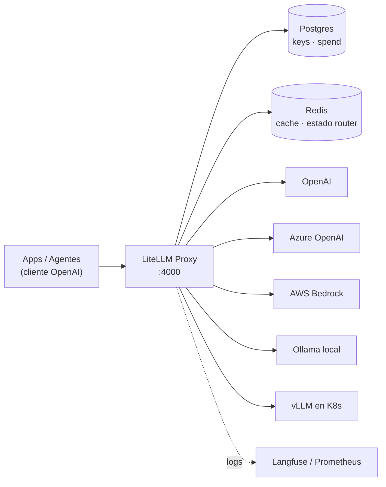

# LiteLLM: gateway unificado para LLMs

Empiezas con OpenAI. Luego el equipo de datos quiere Claude. Marketing pide Gemini. Y tú, que ya montaste [Ollama](ollama_basics.md) para lo que no puede salir de la red interna, acabas con cuatro SDKs distintos, cuatro formatos de error y cero idea de cuánto está gastando cada equipo.

LiteLLM resuelve exactamente eso: **una sola API OpenAI-compatible por delante de 100+ proveedores**. Tu código habla siempre `/v1/chat/completions`; el gateway decide si eso acaba en Azure, en Bedrock, en un vLLM de tu cluster o en el Ollama del portátil de alguien.

## 🎯 Qué problema resuelve

| Sin gateway | Con LiteLLM |
| --- | --- |
| Un SDK por proveedor | Un solo cliente OpenAI |
| Claves de proveedor repartidas por el código | Claves virtuales revocables |
| Coste real desconocido hasta la factura | Cost tracking por token, equipo y usuario |
| Caída de proveedor = caída de tu app | Fallbacks automáticos entre proveedores |
| Rate limits gestionados a mano | Load balancing entre despliegues |



## 🐍 SDK Python vs Proxy Server

LiteLLM son dos cosas que se suelen confundir:

- **SDK Python** (`pip install litellm`): una librería que normaliza llamadas dentro de **tu** proceso. Ideal para un script o un servicio único.
- **Proxy Server** (`litellm[proxy]`): un servidor HTTP centralizado con claves virtuales, presupuestos, logging y UI. Es lo que quieres cuando hay **más de un consumidor**.

```python
# SDK: mismo código, distinto proveedor
from litellm import completion

resp = completion(
    model="anthropic/claude-sonnet-4-5",
    messages=[{"role": "user", "content": "Explica Kubernetes en 3 líneas"}],
)
print(resp.choices[0].message.content)
```

!!! tip "Regla práctica"
    Si necesitas responder "¿cuánto gastó el equipo de datos este mes?", necesitas el **Proxy**. Si no, el SDK sobra y basta.

## ⚙️ Configuración con `config.yaml`

El corazón del proxy es `config.yaml`. Su bloque principal es `model_list`, que mapea un **nombre virtual** (`model_name`, lo que piden tus apps) a los parámetros reales (`litellm_params`, lo que se envía al proveedor).

```yaml
model_list:
  - model_name: gpt-4o                      # nombre que usan tus apps
    litellm_params:
      model: azure/gpt-4o-eu                # modelo real enviado al proveedor
      api_base: https://my-endpoint-europe.openai.azure.com/
      api_key: "os.environ/AZURE_API_KEY_EU"
      rpm: 6                                # rate limit de este despliegue

  - model_name: anthropic-claude
    litellm_params:
      model: bedrock/anthropic.claude-instant-v1
      aws_region_name: us-east-1

  - model_name: local-llama                 # tu Ollama, misma API
    litellm_params:
      model: ollama/llama3
      api_base: http://ollama:11434

  - model_name: vllm-models
    litellm_params:
      model: openai/facebook/opt-125m       # el prefijo openai/ = API compatible
      api_base: http://0.0.0.0:8000/v1
      api_key: none

litellm_settings:
  drop_params: True                         # ignora params no soportados por el proveedor
  success_callback: ["langfuse"]

general_settings:
  master_key: sk-1234                       # exige Authorization: Bearer en toda llamada
  alerting: ["slack"]
```

Arráncalo y consúmelo como si fuera OpenAI:

```bash
litellm --config config.yaml --port 4000
```

```bash
curl http://0.0.0.0:4000/v1/chat/completions \
  -H "Authorization: Bearer sk-1234" \
  -H "Content-Type: application/json" \
  -d '{
    "model": "local-llama",
    "messages": [{"role": "user", "content": "Hola"}]
  }'
```

```python
# Cualquier cliente OpenAI vale: solo cambia base_url
from openai import OpenAI

client = OpenAI(api_key="sk-1234", base_url="http://0.0.0.0:4000")
resp = client.chat.completions.create(
    model="gpt-4o",
    messages=[{"role": "user", "content": "Resume este incidente"}],
)
```

!!! note "El comodín"
    Una entrada `model_name: "*"` con `model: "*"` deja pasar cualquier modelo del proveedor usando las credenciales del entorno. Cómodo en desarrollo, mala idea en producción: pierdes el control de qué modelos se pueden invocar.

## 🔑 Claves virtuales y presupuestos

Tus apps nunca deberían ver una clave de proveedor. En su lugar, el proxy emite **claves virtuales** contra `/key/generate`, autenticándote con el `master_key`.

```bash
curl -X POST 'http://0.0.0.0:4000/key/generate' \
  -H 'Authorization: Bearer sk-1234' \
  -H 'Content-Type: application/json' \
  -d '{
    "models": ["gpt-4o", "local-llama"],
    "max_budget": 50,
    "duration": "30d",
    "team_id": "equipo-datos"
  }'
```

El spend se atribuye de forma jerárquica y los presupuestos se heredan hacia abajo:

```text
Organization Spend
    ├── Team 1 Spend
    │   ├── User A Spend
    │   │   ├── Key 1 Spend
    │   │   └── Key 2 Spend
    │   └── Service Account Spend
    └── Team 2 Spend
```

Se puede poner budget en cualquier nivel, con una regla estricta: **el presupuesto de un equipo no puede exceder el de su organización, ni el de un usuario el de su equipo**. Si algún nivel de la jerarquía se pasa, la petición se bloquea en tiempo real.

!!! warning "Requiere base de datos"
    Claves virtuales, equipos y spend persistente necesitan Postgres (`database_url` en `general_settings`). Sin BD, el proxy funciona pero es efímero: no hay gobernanza ni histórico.

## 💰 Cost tracking

Cada petición genera una entrada en `LiteLLM_SpendLogs` con la atribución completa:

```json
{
  "api_key": "fe6b0cab4ff5a5a8df823196cc8a450*****",
  "user": "default_user",
  "team_id": "e8d1460f-846c-45d7-9b43-55f3cc52ac32",
  "request_tags": ["jobID:214590dsff09fds", "taskName:run_page_classification"],
  "end_user": "palantir",
  "model_group": "llama3",
  "api_base": "https://api.groq.com/openai/v1/",
  "spend": 0.000002,
  "total_tokens": 100,
  "completion_tokens": 80,
  "prompt_tokens": 20
}
```

Con `request_tags` puedes responder preguntas del tipo "¿cuánto nos costó el batch nocturno de clasificación?" sin instrumentar nada en la aplicación: basta con etiquetar la petición.

## 🔁 Fallbacks, reintentos y load balancing

Aquí es donde el gateway deja de ser comodidad y pasa a ser disponibilidad. Todo vive en `router_settings`.

### Load balancing

Repite el **mismo `model_name`** en varias entradas: LiteLLM las trata como despliegues intercambiables del mismo grupo.

```yaml
model_list:
  - model_name: gpt-3.5-turbo
    litellm_params:
      model: azure/gpt-turbo-small-ca
      api_base: https://my-endpoint-canada.openai.azure.com/
      api_key: os.environ/AZURE_API_KEY_CA
      rpm: 6
  - model_name: gpt-3.5-turbo
    litellm_params:
      model: azure/gpt-turbo-large
      api_base: https://openai-france-1234.openai.azure.com/
      api_key: os.environ/AZURE_API_KEY_FR
      rpm: 1440

router_settings:
  routing_strategy: simple-shuffle   # simple-shuffle | least-busy | usage-based-routing | latency-based-routing
  num_retries: 2
  timeout: 30                        # segundos, para la llamada completa
  redis_host: os.environ/REDIS_HOST  # obligatorio con varias réplicas del proxy
  redis_port: os.environ/REDIS_PORT
  redis_password: os.environ/REDIS_PASSWORD
```

| `routing_strategy` | Cuándo usarla |
| --- | --- |
| `simple-shuffle` | Por defecto. Reparto aleatorio ponderado por rpm/tpm |
| `least-busy` | Despliegues con latencias muy dispares bajo carga |
| `usage-based-routing` | Exprimir cuotas TPM/RPM sin tocar los límites |
| `latency-based-routing` | Prioridad a la respuesta más rápida observada |

!!! danger "Redis no es opcional en HA"
    El estado del router (uso, latencias, budgets) es local a cada réplica. Con más de un pod y sin Redis, cada instancia contará por su cuenta y los rate limits y presupuestos se te irán de las manos.

### Fallbacks entre proveedores

```yaml
router_settings:
  fallbacks: [{"gpt-4": ["azure/gpt-4", "anthropic-claude"]}]
  num_retries: 2
```

Si el grupo `gpt-4` agota sus reintentos, la petición salta al siguiente modelo de la lista de forma transparente para el cliente. Un patrón muy útil: **cloud primero, modelo local como último recurso** para degradar en vez de caer.

## ⚡ Caching

Respuestas idénticas no deberían pagarse dos veces. LiteLLM cachea en Redis desde `litellm_settings`:

```yaml
litellm_settings:
  cache: true
  cache_params:
    type: redis
    host: os.environ/REDIS_HOST
    port: 6379
    ttl: 600            # segundos en Redis
  enable_redis_auth_cache: true   # comparte auth de claves entre workers y réplicas

general_settings:
  user_api_key_cache_ttl: 300     # opcional, en segundos
```

`enable_redis_auth_cache` es el detalle que suele faltar: sin él, cada worker valida las claves virtuales contra Postgres y la BD se convierte en el cuello de botella.

## 📈 Logging y observabilidad

```yaml
litellm_settings:
  success_callback: ["langfuse", "prometheus"]
  failure_callback: ["langfuse"]
```

El endpoint `/metrics` expone métricas Prometheus listas para alertar, entre ellas:

- `litellm_api_key_max_budget_metric` — presupuesto asignado a la clave
- `litellm_remaining_api_key_budget_metric` — saldo restante
- `litellm_api_key_budget_remaining_hours_metric` — horas hasta el reset

!!! tip "Alerta antes del corte"
    Alerta sobre `litellm_remaining_api_key_budget_metric` cuando baje del 20 %. Enterarte de que un equipo se quedó sin presupuesto por los tickets de "la IA no funciona" es un mal día.

## 🐳 Despliegue

### Docker

```bash
docker run --rm \
  --name litellm-proxy \
  -p 4000:4000 \
  -e OPENAI_API_KEY=$OPENAI_API_KEY \
  -e DATABASE_URL=$DATABASE_URL \
  -v $(pwd)/config.yaml:/app/config.yaml \
  docker.litellm.ai/berriai/litellm:latest \
  --config /app/config.yaml
```

La UI de administración (claves, equipos, spend) queda en `http://localhost:4000/ui`.

### Kubernetes

```yaml
apiVersion: apps/v1
kind: Deployment
metadata:
  name: litellm-proxy
spec:
  replicas: 3
  selector:
    matchLabels:
      app: litellm
  template:
    metadata:
      labels:
        app: litellm
    spec:
      containers:
        - name: litellm
          image: docker.litellm.ai/berriai/litellm:latest
          args: ["--config", "/app/config.yaml", "--port", "4000"]
          ports:
            - containerPort: 4000
          env:
            - name: DATABASE_URL
              valueFrom:
                secretKeyRef: { name: litellm-secrets, key: database-url }
            - name: REDIS_HOST
              value: redis.default.svc.cluster.local
            - name: LITELLM_MASTER_KEY
              valueFrom:
                secretKeyRef: { name: litellm-secrets, key: master-key }
          volumeMounts:
            - name: config
              mountPath: /app/config.yaml
              subPath: config.yaml
      volumes:
        - name: config
          configMap:
            name: litellm-config
```

Existe además un chart oficial de Helm que resuelve Postgres, Redis (incluido modo cluster) y secretos sin escribir estos manifiestos a mano.

!!! warning "El master key es la llave del reino"
    `master_key` permite crear claves, cambiar presupuestos y leer el spend de todos. Va en un Secret o en un gestor externo, nunca en el `config.yaml` versionado en Git.

## 🔗 Relacionados

- [Ollama: instalación y primeros pasos](ollama_basics.md) — el backend local que pones detrás del gateway
- [LLaMA.cpp](llama_cpp.md) — servidor OpenAI-compatible, se enchufa con el prefijo `openai/`
- [LM Studio](lm_studio.md) — otro backend local expuesto vía API
- [Ecosistemas locales](local_ecosystems.md) — visión de conjunto del stack local
- [Documentación oficial de LiteLLM](https://docs.litellm.ai/)
- [Repositorio en GitHub](https://github.com/BerriAI/litellm)
