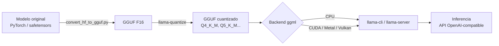

# LLaMA.cpp: Compilación, cuantización y benchmarking

[llama.cpp](https://github.com/ggml-org/llama.cpp) es el motor de inferencia de LLMs escrito en C/C++ que hace posible ejecutar modelos como LLaMA, Mistral, Qwen o Phi en tu portátil, en un servidor sin GPU o incluso en una Raspberry Pi. Es la pieza de bajo nivel sobre la que se construyen herramientas como Ollama o LM Studio: si entiendes llama.cpp, entiendes lo que ocurre por debajo.

Esta guía es **práctica y dedicada**: compilación por backend, el formato GGUF y su cuantización, el uso real del CLI y del servidor, y cómo medir el rendimiento. Si buscas una comparativa entre frameworks, revisa primero [Ecosistema de Modelos Locales](local_ecosystems.md).

!!! info "¿Por qué compilar en lugar de usar Ollama?"
    Con llama.cpp tienes control total: eliges flags de compilación, backend de GPU, tipo de cuantización y parámetros de inferencia. Es la opción para producción en hardware limitado, edge devices y cuando necesitas exprimir cada token/segundo.

## 🧩 Arquitectura en un vistazo



El núcleo es **ggml**, la librería de tensores. Los modelos se distribuyen en **GGUF**, un formato de fichero único que incluye pesos, tokenizer y metadatos.

## 📦 Obtener el código

```bash
git clone https://github.com/ggml-org/llama.cpp
cd llama.cpp
```

!!! warning "El repositorio se movió"
    El proyecto vive ahora en `ggml-org/llama.cpp` (antes `ggerganov/llama.cpp`). El make manual está **deprecado**: la vía oficial es **CMake**.

## 🔨 Compilación por backend

### CPU (por defecto)

```bash
# Configuración y build en Release (optimizado)
cmake -B build
cmake --build build --config Release -j $(nproc)

# Los binarios quedan en build/bin/
ls build/bin/
# llama-cli  llama-server  llama-quantize  llama-bench ...
```

En CPU, llama.cpp usa automáticamente las instrucciones SIMD disponibles (AVX2, AVX-512, NEON en ARM). Para forzar optimización nativa del host:

```bash
cmake -B build -DCMAKE_C_FLAGS="-march=native" -DCMAKE_CXX_FLAGS="-march=native"
cmake --build build --config Release -j $(nproc)
```

### CUDA (NVIDIA)

```bash
# Requiere el CUDA Toolkit instalado (nvcc en el PATH)
cmake -B build -DGGML_CUDA=ON
cmake --build build --config Release -j $(nproc)
```

!!! tip "Compilación más rápida y binario más ligero"
    Limita las arquitecturas de GPU a la tuya con `-DCMAKE_CUDA_ARCHITECTURES=86` (86 = Ampere/RTX 30xx, 89 = Ada/RTX 40xx, 90 = Hopper). Reduce mucho el tiempo de build.

### Metal (Apple Silicon)

```bash
# En macOS con chips M1/M2/M3/M4, Metal se activa por defecto.
cmake -B build
cmake --build build --config Release -j $(sysctl -n hw.ncpu)
```

Metal aprovecha la memoria unificada del Apple Silicon, así que puedes cargar modelos grandes sin GPU dedicada. Para forzarlo explícitamente: `-DGGML_METAL=ON`.

### Vulkan (GPU multiplataforma: AMD, Intel, NVIDIA)

```bash
# Requiere el Vulkan SDK (headers y glslc)
cmake -B build -DGGML_VULKAN=ON
cmake --build build --config Release -j $(nproc)
```

Vulkan es la mejor opción para GPUs AMD/Intel sin depender de ROCm, y funciona en Windows, Linux y ChromeOS.

| Backend | Flag CMake | Hardware objetivo |
|---------|-----------|-------------------|
| CPU     | (por defecto) | Cualquier x86_64 / ARM |
| CUDA    | `-DGGML_CUDA=ON` | GPUs NVIDIA |
| Metal   | `-DGGML_METAL=ON` | Apple Silicon (M1+) |
| Vulkan  | `-DGGML_VULKAN=ON` | AMD / Intel / NVIDIA |
| HIP/ROCm | `-DGGML_HIP=ON` | GPUs AMD (ROCm) |
| SYCL    | `-DGGML_SYCL=ON` | Intel GPU / oneAPI |

## 🗜️ GGUF y cuantización

**GGUF** (GPT-Generated Unified Format) es el formato de modelo de llama.cpp. La **cuantización** reduce la precisión de los pesos (de 16 bits a 4-8 bits) para bajar el uso de RAM/VRAM y acelerar la inferencia, a cambio de una pérdida controlada de calidad.

### Descargar un modelo ya en GGUF

La forma más rápida: descargar un GGUF cuantizado directamente. `llama-cli` y `llama-server` aceptan `-hf` para tirar de Hugging Face:

```bash
# Descarga automática desde Hugging Face (repo:quant)
./build/bin/llama-cli -hf ggml-org/gemma-3-1b-it-GGUF
```

### Convertir y cuantizar tú mismo

```bash
# 1. Convertir el modelo Hugging Face a GGUF en F16
python convert_hf_to_gguf.py ./models/mi-modelo --outfile modelo-f16.gguf --outtype f16

# 2. Cuantizar a Q4_K_M (el mejor equilibrio calidad/tamaño)
./build/bin/llama-quantize modelo-f16.gguf modelo-q4_k_m.gguf Q4_K_M
```

### Tipos de cuantización habituales

| Tipo | Bits aprox. | Uso de RAM | Calidad | Recomendación |
|------|------------|-----------|---------|---------------|
| `Q8_0` | 8 | Alta | Casi idéntica a F16 | Máxima calidad práctica |
| `Q6_K` | 6.5 | Media-alta | Excelente | Muy buena opción |
| `Q5_K_M` | 5.5 | Media | Muy buena | Alternativa de calidad |
| `Q4_K_M` | 4.5 | Baja | Buena | **Por defecto recomendado** |
| `Q3_K_M` | 3.5 | Muy baja | Aceptable | Hardware muy limitado |
| `Q2_K` | 2.6 | Mínima | Degradada | Solo si no hay otra opción |

!!! note "Regla práctica"
    `Q4_K_M` es el punto dulce para la mayoría de casos. Baja a `Q3`/`Q2` solo si no te entra en memoria, y sube a `Q6`/`Q8` si te sobra VRAM y quieres máxima fidelidad.

## 💻 Uso del CLI: `llama-cli`

### Chat interactivo

```bash
./build/bin/llama-cli -m modelo-q4_k_m.gguf
```

### Un prompt único (modo no interactivo)

```bash
./build/bin/llama-cli -m modelo-q4_k_m.gguf \
  -p "Explica qué es Kubernetes en 3 líneas" \
  -n 256 \
  --no-display-prompt
```

### Flags esenciales

| Flag | Descripción |
|------|-------------|
| `-m` | Ruta al fichero GGUF |
| `-p` | Prompt de entrada |
| `-n` | Número máximo de tokens a generar (`-1` = infinito) |
| `-c` | Tamaño del contexto (por defecto 4096; `0` = el del modelo) |
| `-ngl` | Capas descargadas a la GPU (*n-gpu-layers*) |
| `-t` | Número de hilos de CPU |
| `--temp` | Temperatura de muestreo (0 = determinista) |
| `-cnv` | Fuerza modo conversación |

### Descarga a GPU (GPU offload)

```bash
# -ngl 99 intenta cargar todas las capas en la GPU
./build/bin/llama-cli -m modelo-q4_k_m.gguf -ngl 99 -p "Hola"
```

!!! tip "¿Cuántas capas caben?"
    Empieza con `-ngl 99` (todas). Si te quedas sin VRAM, baja el número hasta que cargue. Las capas no descargadas se ejecutan en CPU (más lento pero funcional).

## 🌐 Servidor con API compatible con OpenAI: `llama-server`

`llama-server` levanta un servidor HTTP con endpoints **compatibles con la API de OpenAI**, además de una interfaz web en `http://localhost:8080`.

```bash
./build/bin/llama-server \
  -m modelo-q4_k_m.gguf \
  -c 8192 \
  -ngl 99 \
  --host 0.0.0.0 \
  --port 8080
```

### Llamar al endpoint de chat (OpenAI-compatible)

```bash
curl http://localhost:8080/v1/chat/completions \
  -H "Content-Type: application/json" \
  -d '{
    "model": "local",
    "messages": [
      {"role": "system", "content": "Eres un asistente DevOps conciso."},
      {"role": "user", "content": "Dame un script bash para backup de PostgreSQL"}
    ],
    "temperature": 0.7
  }'
```

### Con el SDK oficial de OpenAI en Python

```python
from openai import OpenAI

# Apunta al servidor local; la api_key es un placeholder
client = OpenAI(base_url="http://localhost:8080/v1", api_key="sk-no-key-required")

resp = client.chat.completions.create(
    model="local",
    messages=[{"role": "user", "content": "Explica Docker en 3 líneas"}],
)
print(resp.choices[0].message.content)
```

!!! info "Compatibilidad drop-in"
    Como el endpoint imita a OpenAI, cualquier librería o herramienta que hable con la API de OpenAI (LangChain, LlamaIndex, continue.dev...) funciona cambiando solo `base_url`. Igual que [LM Studio](lm_studio.md), que también expone un servidor OpenAI-compatible.

## 📊 Benchmarking con `llama-bench`

`llama-bench` mide el rendimiento de forma reproducible, separando dos métricas clave:

- **pp (prompt processing)**: velocidad de ingesta del prompt (tokens/s).
- **tg (text generation)**: velocidad de generación de tokens (tokens/s).

```bash
# Benchmark básico: 512 tokens de prompt, 128 de generación
./build/bin/llama-bench -m modelo-q4_k_m.gguf -p 512 -n 128
```

```bash
# Barrido de niveles de GPU offload para encontrar el óptimo
./build/bin/llama-bench -m modelo-q4_k_m.gguf -ngl 0,20,40,99
```

Salida típica (resumida):

```
| model            | size   | backend | ngl | test  |    t/s |
| ---------------- | ------ | ------- | --- | ----- | ------ |
| llama 7B Q4_K_M  | 3.8GiB | CUDA    |  99 | pp512 | 2450.3 |
| llama 7B Q4_K_M  | 3.8GiB | CUDA    |  99 | tg128 |  118.7 |
```

!!! tip "Compara peras con peras"
    Para comparar cuantizaciones o backends, fija siempre los mismos `-p` y `-n`. Repite (`-r 5`) para promediar y reducir ruido.

## ⚡ Optimización CPU/GPU

### En CPU

```bash
# Ajusta los hilos al número de núcleos físicos (no lógicos)
./build/bin/llama-cli -m modelo.gguf -t 8 -p "..."

# En NUMA (servidores multi-socket)
./build/bin/llama-cli -m modelo.gguf --numa distribute -p "..."
```

- Usa **núcleos físicos**, no hilos lógicos: el hyperthreading rara vez ayuda en inferencia.
- Compila con `-march=native` para aprovechar AVX-512 si tu CPU lo soporta.
- Cuantizaciones `_K` (K-quants) están optimizadas para CPU moderna.

### En GPU

- Maximiza `-ngl` hasta llenar la VRAM disponible.
- Usa **flash attention** para ahorrar memoria de contexto: `-fa on`.
- Para contextos largos, activa la cache KV cuantizada: `--cache-type-k q8_0 --cache-type-v q8_0`.

```bash
./build/bin/llama-server -m modelo.gguf -ngl 99 -fa on \
  --cache-type-k q8_0 --cache-type-v q8_0 -c 16384
```

!!! warning "Contexto = memoria"
    El tamaño de contexto (`-c`) consume VRAM de forma proporcional. Un contexto de 32k puede duplicar el uso de memoria de la cache KV. Cuantízala o reduce `-c` si te quedas corto.

## 🎯 Cuándo elegir llama.cpp

- **Edge / hardware limitado**: Raspberry Pi, mini-PCs, servidores sin GPU.
- **Producción con control fino**: eliges cuantización, backend y sampling.
- **Máximo rendimiento por vatio**: kernels optimizados a mano.
- Si quieres una experiencia *plug and play*, usa [Ollama](ollama_basics.md) (que usa llama.cpp por debajo) o [LM Studio](lm_studio.md) para una interfaz gráfica.

## 🔗 Recursos adicionales

- [Repositorio oficial (ggml-org/llama.cpp)](https://github.com/ggml-org/llama.cpp)
- [Documentación de build](https://github.com/ggml-org/llama.cpp/blob/master/docs/build.md)
- [Documentación de llama-server](https://github.com/ggml-org/llama.cpp/tree/master/tools/server)
- [Modelos GGUF en Hugging Face](https://huggingface.co/models?library=gguf)
- [Ecosistema de Modelos Locales](local_ecosystems.md) · [Ollama](ollama_basics.md) · [LM Studio](lm_studio.md)
