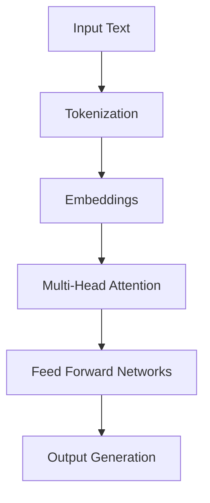

# Introducción a Large Language Models (LLMs)

Los Large Language Models (LLMs) son modelos de inteligencia artificial capaces de comprender y generar texto de manera similar a los humanos. Esta guía explica los conceptos fundamentales y su aplicación en entornos DevOps.

## 🤔 ¿Qué son los LLMs?

Los LLMs son modelos de machine learning entrenados en enormes cantidades de texto que pueden:

- **Comprender lenguaje natural**: Interpretar preguntas y comandos en lenguaje humano
- **Generar texto coherente**: Crear documentación, código, o respuestas
- **Resolver problemas**: Ayudar en troubleshooting, análisis de logs, generación de configuraciones
- **Automatizar tareas**: Crear scripts, IaC, o workflows

## 🏗️ Arquitectura básica

### Transformers: el corazón de los LLMs

Los LLMs modernos se basan en la arquitectura Transformer, introducida en 2017:



**Componentes clave:**
- **Tokenización**: Divide el texto en unidades procesables
- **Embeddings**: Convierte tokens en vectores numéricos
- **Attention**: Permite al modelo enfocarse en partes relevantes del contexto
- **Decoder/Encoder**: Arquitecturas para diferentes tareas

## 🔄 Open-source vs Proprietary

### Modelos Open-source
**Ventajas:**
- ✅ Control total sobre los datos
- ✅ Personalización y fine-tuning
- ✅ Ejecutable localmente (privacidad)
- ✅ Costo: solo hardware

**Desventajas:**
- ❌ Requiere infraestructura
- ❌ Mantenimiento y actualizaciones
- ❌ Puede ser menos "inteligente" que modelos propietarios

**Ejemplos:** LLaMA, Mistral, Phi-2, Qwen

### Modelos Proprietary
**Ventajas:**
- ✅ Fácil de usar (APIs)
- ✅ Actualizaciones automáticas
- ✅ Alto rendimiento
- ✅ Soporte técnico

**Desventajas:**
- ❌ Dependencia de proveedores
- ❌ Costos por uso
- ❌ Preocupaciones de privacidad
- ❌ Limitaciones de rate limiting

**Ejemplos:** GPT-4, Claude, Gemini

## 🚀 Casos de uso en DevOps

### 1. Análisis y troubleshooting
```bash
# Ejemplo: Analizar logs de error
Usuario: "Mi aplicación Kubernetes está fallando con 'ImagePullBackOff'"
LLM: "Este error indica que Kubernetes no puede descargar la imagen del contenedor. Posibles causas: ..."
```

### 2. Generación de documentación
- Crear README.md automáticamente
- Documentar APIs y configuraciones
- Generar guías de troubleshooting

### 3. Automatización IaC
```yaml
# Generar configuración Terraform
Usuario: "Crea un cluster EKS con 3 nodos t3.medium"
LLM: [Genera código Terraform completo]
```

### 4. Code review y mejoras
- Revisar código en busca de bugs
- Sugerir optimizaciones
- Explicar código complejo

### 5. ChatOps y automatización
- Chatbots para soporte técnico
- Automatización de respuestas a incidentes
- Generación de runbooks

## 🛠️ Herramientas para ejecutar LLMs localmente

### Ollama
```bash
# Instalación simple
curl -fsSL https://ollama.ai/install.sh | sh

# Ejecutar un modelo
ollama run llama2
```

### LM Studio
- Interfaz gráfica intuitiva
- Descarga y gestión de modelos
- Testing interactivo de prompts

### LLaMA.cpp
- Optimización extrema para CPU
- Bajo consumo de recursos
- Ideal para entornos limitados

## ⚡ Consideraciones de rendimiento

### Requisitos de hardware
- **CPU básica**: 4-8 GB RAM, modelos pequeños (7B parámetros)
- **GPU recomendada**: NVIDIA con 8GB+ VRAM para modelos medianos
- **Producción**: Múltiples GPUs para inferencia distribuida

### Optimizaciones
- **Cuantización**: Reduce tamaño del modelo (GGUF, AWQ)
- **Caching**: Almacenar prompts frecuentes
- **Batch processing**: Procesar múltiples requests juntos

## 🔒 Consideraciones de seguridad

### Privacidad de datos
- Modelos locales: datos nunca salen del entorno
- APIs externas: revisar políticas de retención
- Sanitización: evitar datos sensibles en prompts

### Seguridad del modelo
- **Prompt injection**: Ataques que manipulan el comportamiento
- **Jailbreaking**: Técnicas para bypass de restricciones
- **Hallucinations**: Respuestas incorrectas presentadas como hechos

## 🚀 Próximos pasos

1. **Elige tu herramienta**: Ollama para simplicidad, LM Studio para testing
2. **Selecciona un modelo**: Empieza con algo pequeño como Llama 2 7B
3. **Experimenta**: Prueba prompts simples y mide respuestas
4. **Integra**: Conecta con tus herramientas DevOps existentes

## 📚 Recursos adicionales

- [The Illustrated Transformer](http://jalammar.github.io/illustrated-transformer/)
- [Hugging Face Model Hub](https://huggingface.co/models)
- [Papers with Code - Language Models](https://paperswithcode.com/task/language-modelling)
- [LLM Comparison](https://llm-comparison.com/)