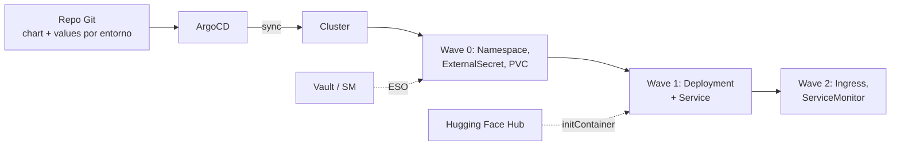
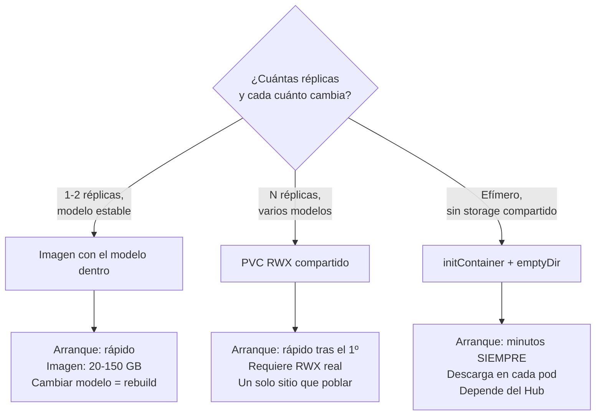

## Qué cubre esta guía (y qué no)

Esta guía trata de **empaquetado y entrega**: cómo convertir un servicio de inferencia en un chart de Helm versionado y cómo dejar que ArgoCD lo sincronice desde Git sin que un `helm upgrade` a mano se convierta en la fuente de verdad.

No trata del motor: si buscas PagedAttention, cuantización o cómo elegir `--max-model-len`, eso está en otro sitio.

!!! info "Dónde encaja esta guía"
    - Motor de vLLM: PagedAttention, tuning, benchmarking → [vLLM](vllm.md)
    - Manifiestos crudos, HPA por GPU, optimizaciones de coste → [Despliegue a escala con Kubernetes](despliegue_kubernetes.md)
    - Inferencia local de un nodo → [Ollama](ollama_basics.md), [llama.cpp](llama_cpp.md)
    - Gateway y routing por delante de N réplicas → [LiteLLM](litellm.md)
    - Cifrado de secretos en el repositorio → [Secretos en GitOps](../cybersecurity/secrets_gitops.md)
    - Fundamentos de ArgoCD → [ArgoCD](../cicd/argocd.md)

Lo que sí encontrarás aquí: el chart, el `values.yaml`, los probes que no rompen, el `Application` de ArgoCD, el problema real del rollout de un modelo y cómo servir cinco modelos con un solo chart.

## Por qué un servicio de inferencia no es una app web

Las plantillas de Helm que usas para una API en Go no sirven tal cual. Cuatro diferencias cambian todo el diseño:

| | App web típica | Servicio de inferencia |
|---|---|---|
| Arranque | 1-5 segundos | 2-15 minutos (descarga + carga en VRAM) |
| Recurso escaso | CPU / memoria | GPU, indivisible y cara |
| Réplica extra | Barata, elástica | Puede no haber nodo libre |
| Rollout | Dos pods conviven un segundo | Dos pods conviven minutos, **cada uno con su GPU** |
| Señal de saturación | CPU al 80% | Cola de peticiones creciendo, CPU al 3% |

Cada fila rompe una asunción por defecto de Kubernetes. El resto de la guía es deshacerlas una por una.



## Anatomía del chart

Un chart, no uno por modelo. La diferencia entre servir Llama y servir Qwen son valores, no plantillas.

```text
charts/inference/
├── Chart.yaml
├── values.yaml              # defaults sensatos, todo desactivado por defecto
├── values-vllm-llama8b.yaml # un fichero por release
├── values-ollama-dev.yaml
└── templates/
    ├── _helpers.tpl
    ├── deployment.yaml, service.yaml, ingress.yaml
    └── pvc.yaml, externalsecret.yaml, servicemonitor.yaml  # opcionales
```

`Chart.yaml` no tiene misterio, pero fija dos versiones distintas y conviene entender cuál mueves cuándo:

```yaml
apiVersion: v2
name: inference
description: Servicio de inferencia LLM (vLLM u Ollama)
type: application
version: 0.3.0        # versión del CHART: la mueves al tocar plantillas
appVersion: "0.11.0"  # versión de la app empaquetada, informativa
```

!!! warning "El modelo no es el `appVersion`"
    Es tentador poner el nombre del modelo en `appVersion`. No lo hagas: `appVersion` describe el runtime, y el mismo chart sirve N modelos. El modelo va en `values`, y cambiarlo es un cambio de release, no de chart.

## values.yaml comentado

Este es el contrato del chart. Todo lo específico de un modelo vive aquí y nada más que aquí.

```yaml
# values.yaml — defaults conservadores. Cada release sobrescribe lo suyo.

# vllm | ollama. Selecciona qué probes y qué args renderiza la plantilla.
engine: vllm

image:
  repository: vllm/vllm-openai
  tag: "v0.11.0"          # NUNCA "latest": rompe la reproducibilidad de GitOps
  pullPolicy: IfNotPresent

model:
  # Identificador en el Hub o ruta local dentro del volumen de pesos
  name: "meta-llama/Llama-3.1-8B-Instruct"
  # Alias que expone la API. Permite cambiar de checkpoint sin tocar clientes.
  servedName: "llama3-8b"
  # Estrategia de pesos: pvc | initContainer | baked
  weightsStrategy: pvc

# Args extra pasados al binario del engine. Se concatenan tal cual.
# Ver la guía de vLLM para el significado de cada uno.
extraArgs:
  - "--max-model-len=8192"
  - "--gpu-memory-utilization=0.92"
  - "--enable-prefix-caching"

resources:
  limits:
    nvidia.com/gpu: 1     # limits y requests DEBEN coincidir: la GPU no es divisible
    memory: 32Gi
    cpu: "8"
  requests:
    nvidia.com/gpu: 1
    memory: 24Gi
    cpu: "4"

# Selección de nodo. Las etiquetas dependen de tu cluster; estas son las
# que publica el NVIDIA GPU Operator via node-feature-discovery.
nodeSelector:
  nvidia.com/gpu.present: "true"

tolerations:
  - key: nvidia.com/gpu
    operator: Exists
    effect: NoSchedule

# Tiempo máximo que damos al modelo para cargar antes de declarar el pod muerto.
# failureThreshold * periodSeconds = presupuesto total. Ver sección de probes.
startupProbe:
  periodSeconds: 10
  failureThreshold: 90    # 15 minutos

persistence:
  enabled: true
  existingClaim: "llm-weights"   # PVC RWX compartido entre releases
  mountPath: /models

secrets:
  # Nombre del Secret ya materializado en el cluster (por ESO o Sealed Secrets)
  hfTokenSecret: "hf-credentials"
  hfTokenKey: "token"
  apiKeySecret: "inference-api-key"
  apiKeyKey: "key"

service:
  port: 8000

ingress:
  enabled: false
  className: nginx
  host: ""
```

!!! tip "Un valor por decisión, no por campo"
    `weightsStrategy: pvc` es mejor que exponer diez flags de volúmenes. El chart traduce una decisión en la configuración correcta; el operador elige entre tres opciones con nombre, no monta un puzzle. Si te encuentras documentando combinaciones inválidas de values, es que has expuesto demasiado.

## Plantillas: Deployment, Service, Ingress

El `Deployment`. Lo relevante está en los comentarios; el resto es Helm rutinario.


```yaml
{{- $isVllm := eq .Values.engine "vllm" -}}
apiVersion: apps/v1
kind: Deployment
metadata:
  name: {{ include "inference.fullname" . }}
  labels: {{- include "inference.labels" . | nindent 4 }}
  annotations:
    argocd.argoproj.io/sync-wave: "1"
spec:
  replicas: {{ .Values.replicaCount | default 1 }}
  strategy:
    type: Recreate          # ver sección "Rollout de modelo"
  selector:
    matchLabels: {{- include "inference.selectorLabels" . | nindent 6 }}
  template:
    metadata:
      labels: {{- include "inference.selectorLabels" . | nindent 8 }}
    spec:
      nodeSelector: {{- toYaml .Values.nodeSelector | nindent 8 }}
      tolerations: {{- toYaml .Values.tolerations | nindent 8 }}
      {{- if eq .Values.model.weightsStrategy "initContainer" }}
      initContainers:
        - name: fetch-weights
          image: python:3.12-slim
          command: ["/bin/sh", "-c"]
          args:
            - |
              pip install --no-cache-dir "huggingface_hub[cli]"
              hf download {{ .Values.model.name }} --local-dir \
                {{ .Values.persistence.mountPath }}/{{ .Values.model.servedName }}
          env:
            - name: HF_TOKEN
              valueFrom:
                secretKeyRef:
                  name: {{ .Values.secrets.hfTokenSecret }}
                  key: {{ .Values.secrets.hfTokenKey }}
          volumeMounts:
            - name: weights
              mountPath: {{ .Values.persistence.mountPath }}
      {{- end }}
      containers:
        - name: engine
          image: "{{ .Values.image.repository }}:{{ .Values.image.tag }}"
          imagePullPolicy: {{ .Values.image.pullPolicy }}
          {{- if $isVllm }}
          args:
            - "--model={{ .Values.model.name }}"
            - "--served-model-name={{ .Values.model.servedName }}"
            - "--download-dir={{ .Values.persistence.mountPath }}"
            {{- toYaml .Values.extraArgs | nindent 12 }}
          {{- end }}
          ports:
            - name: http
              containerPort: {{ .Values.service.port }}
          {{- if not $isVllm }}
          env:
            - name: OLLAMA_MODELS
              value: {{ .Values.persistence.mountPath }}
          {{- end }}
          resources: {{- toYaml .Values.resources | nindent 12 }}
          # startup / readiness / liveness: ver la sección de probes
          startupProbe:
            httpGet:
              path: {{ $isVllm | ternary "/health" "/api/tags" }}
              port: http
            periodSeconds: {{ .Values.startupProbe.periodSeconds }}
            failureThreshold: {{ .Values.startupProbe.failureThreshold }}
          volumeMounts:
            - name: weights
              mountPath: {{ .Values.persistence.mountPath }}
            - name: shm
              mountPath: /dev/shm
      volumes:
        - name: weights
          {{- if .Values.persistence.enabled }}
          persistentVolumeClaim:
            claimName: {{ .Values.persistence.existingClaim }}
          {{- else }}
          emptyDir: {}
          {{- end }}
        - name: shm
          emptyDir:
            medium: Memory
            sizeLimit: 8Gi
```


!!! danger "`/dev/shm` es obligatorio en vLLM multi-GPU"
    El `/dev/shm` por defecto de un contenedor son 64 MB. vLLM usa memoria compartida entre procesos para el tensor parallelism y con 64 MB el arranque se cuelga sin un error claro. El `emptyDir` con `medium: Memory` es el equivalente en Kubernetes de `--ipc=host` en Docker. Este volumen es la causa del 90% de los "se queda parado en el arranque y no dice nada".

El `Service` es un `ClusterIP` corriente apuntando al puerto `http`, sin nada particular. El `Ingress` sí tiene dos ajustes que no puedes omitir:


```yaml
{{- if .Values.ingress.enabled }}
apiVersion: networking.k8s.io/v1
kind: Ingress
metadata:
  name: {{ include "inference.fullname" . }}
  annotations:
    argocd.argoproj.io/sync-wave: "2"
    # Una generación larga puede tardar minutos. El timeout por defecto
    # de nginx-ingress (60s) corta el stream a mitad de respuesta.
    nginx.ingress.kubernetes.io/proxy-read-timeout: "600"
    nginx.ingress.kubernetes.io/proxy-send-timeout: "600"
    nginx.ingress.kubernetes.io/proxy-buffering: "off"   # necesario para SSE
    {{- toYaml .Values.ingress.annotations | nindent 4 }}
spec:
  ingressClassName: {{ .Values.ingress.className }}
  rules:
    - host: {{ .Values.ingress.host }}
      http:
        paths:
          - path: /
            pathType: Prefix
            backend:
              service:
                name: {{ include "inference.fullname" . }}
                port:
                  name: http
{{- end }}
```


!!! warning "`proxy-buffering: off` no es opcional si haces streaming"
    Con buffering activado, el proxy acumula la respuesta SSE y la entrega de golpe al final. Funcionalmente "funciona", pero el usuario ve una pantalla en blanco durante 40 segundos y luego un muro de texto. Es el bug que más tarda en diagnosticarse porque no aparece en ningún log.

## El peso del modelo: dónde vive

Aquí está la decisión de arquitectura real. Tres opciones, tres compromisos.



| Estrategia | Arranque en frío | Coste | Cuándo |
|---|---|---|---|
| **PVC RWX compartido** | Segundos-minutos (solo carga a VRAM) | Storage compartido, a menudo NFS o CephFS | Por defecto. Varias réplicas o varios modelos |
| **Imagen con el modelo** | Rápido si la imagen está en caché del nodo | Registry enorme, pulls lentos la primera vez | Air-gapped, o inmutabilidad estricta |
| **initContainer** | Minutos, en **cada** pod | Ancho de banda en cada arranque | Entornos efímeros, PoCs, sin RWX |

!!! danger "El initContainer que descarga en cada arranque es una trampa"
    Funciona en la demo y te arruina el día en producción. Un escalado de 3 a 6 réplicas dispara seis descargas simultáneas de 16 GB. Si el nodo se recicla de madrugada, el pod tarda ocho minutos en volver y tu SLO ya se ha ido. Úsalo para poblar el PVC **una vez** (como Job, no como initContainer de cada pod) y luego monta el PVC.

El patrón sensato es separar poblado de arranque: un `Job` en wave 0 que descarga si falta, y un `Deployment` en wave 1 que solo monta. Un detalle de storage que muerde: si eliges PVC compartido necesitas **ReadWriteMany de verdad**. Un `ReadWriteOnce` sobre un disco de bloque solo se monta en un nodo, así que tus réplicas se apiñan en esa máquina o se quedan en `Pending` sin explicación útil.

## Probes: por qué los valores por defecto te rompen el despliegue

Este es el fallo número uno al llevar un LLM a Kubernetes, y es un fallo silencioso: el pod entra en `CrashLoopBackOff` y los logs solo muestran el modelo cargando tranquilamente.

La secuencia del desastre:

1. El pod arranca y empieza a cargar 16 GB de pesos a VRAM. Tarda 4 minutos.
2. El `livenessProbe` con `initialDelaySeconds: 30` empieza a preguntar al minuto medio.
3. `/health` no responde porque el servidor HTTP aún no escucha.
4. Tres fallos y kubelet mata el contenedor.
5. Vuelta al paso 1. Para siempre.

La solución es el `startupProbe`. **Mientras un `startupProbe` está en curso, liveness y readiness quedan deshabilitados.** El contenedor tiene `failureThreshold × periodSeconds` para arrancar, sin que nadie lo mate; cuando el startup pasa, los otros dos toman el relevo con umbrales normales.

```yaml
# El presupuesto de arranque: 90 × 10s = 15 minutos
startupProbe:
  httpGet: { path: /health, port: http }
  periodSeconds: 10
  failureThreshold: 90

# Agresivo, porque solo actúa con el modelo ya cargado
readinessProbe:
  httpGet: { path: /health, port: http }
  periodSeconds: 5
  failureThreshold: 3

# Conservador: un liveness nervioso mata pods sanos bajo carga
livenessProbe:
  httpGet: { path: /health, port: http }
  periodSeconds: 20
  failureThreshold: 6
```

Endpoints reales por engine:

| Engine | Endpoint | Qué confirma |
|---|---|---|
| vLLM | `/health` | El servidor responde; devuelve 200 cuando el engine está listo |
| vLLM | `/v1/models` | Además, qué `served-model-name` está activo |
| Ollama | `/api/tags` | El daemon responde y qué modelos tiene descargados |
| Ollama | `/` | Solo que el proceso vive; menos informativo |

!!! tip "No uses `/v1/chat/completions` como probe"
    Es tentador porque prueba el camino completo, pero cada probe consumiría GPU real y compite con el tráfico de usuarios. Un probe cada 5 segundos generando tokens es una carga sintética permanente sobre tu recurso más caro. Health checks baratos; la validación end-to-end va en el smoke test post-despliegue, una vez.

Ajusta el presupuesto de `startupProbe` a tu caso: descarga desde el Hub incluida puede irse a 20 minutos con un 70B. Mide una vez con `kubectl logs -f` y pon el doble.

## Secretos: HF_TOKEN sin meterlo en Git

Un servicio de inferencia necesita al menos dos secretos: el `HF_TOKEN` para descargar modelos gated y la clave de API que protege el endpoint. Ninguno puede vivir en `values.yaml`.

El chart **no gestiona secretos, los consume**: referencia un `Secret` por nombre y da por hecho que alguien lo ha materializado antes. Ese alguien es External Secrets Operator o Sealed Secrets, y el mecanismo de orden es la sync wave.


```yaml
# templates/externalsecret.yaml — wave 0: existe antes que el Deployment
{{- if .Values.externalSecret.enabled }}
apiVersion: external-secrets.io/v1
kind: ExternalSecret
metadata:
  name: {{ .Values.secrets.hfTokenSecret }}
  annotations:
    argocd.argoproj.io/sync-wave: "0"
spec:
  refreshInterval: 1h
  secretStoreRef:
    name: {{ .Values.externalSecret.storeRef }}
    kind: ClusterSecretStore
  target:
    name: {{ .Values.secrets.hfTokenSecret }}
  data:
    - secretKey: {{ .Values.secrets.hfTokenKey }}
      remoteRef:
        key: {{ .Values.externalSecret.remoteKey }}
        property: token
{{- end }}
```


La comparativa completa entre SOPS, Sealed Secrets y ESO —modelo de amenaza, rotación, qué pasa cuando pierdes la clave— está en [Secretos en GitOps](../cybersecurity/secrets_gitops.md). Para este caso concreto, el criterio corto:

- **ESO**: el token ya vive en Vault o en el gestor de tu cloud. Rotarlo no toca Git. Es la opción por defecto si tienes ese backend.
- **Sealed Secrets**: sin backend externo. El secreto cifrado se versiona y solo el controlador del cluster lo abre. Rotar implica commit.

!!! warning "El `HF_TOKEN` es una credencial de descarga, no de runtime"
    Solo hace falta para bajar pesos gated. Si usas PVC compartido poblado por un Job, el contenedor de inferencia **no necesita el token en absoluto**. Quítaselo: menos superficie, y un pod comprometido no filtra tu cuenta del Hub.

## ArgoCD: la Application

Con el chart en el repo, el `Application` es corto. Los campos son los del CRD `argoproj.io/v1alpha1`.

```yaml
apiVersion: argoproj.io/v1alpha1
kind: Application
metadata:
  name: llm-llama3-8b
  namespace: argocd
  finalizers:
    - resources-finalizer.argocd.argoproj.io
spec:
  project: platform
  source:
    repoURL: https://github.com/tu-org/infra-llm.git
    targetRevision: HEAD
    path: charts/inference
    helm:
      valueFiles:
        - values-vllm-llama8b.yaml
  destination:
    server: https://kubernetes.default.svc
    namespace: llm
  syncPolicy:
    automated:
      prune: true
      selfHeal: true
    syncOptions:
      - CreateNamespace=true
    retry:
      limit: 3
      backoff:
        duration: 30s
        maxDuration: 5m
```

Dos advertencias específicas de cargas con GPU:

!!! danger "`selfHeal: true` y los cambios manuales"
    Con `selfHeal` activo, cualquier `kubectl edit` sobre el Deployment se revierte en el siguiente ciclo de reconciliación. Eso es lo que quieres —es el punto de GitOps— pero significa que **no puedes ajustar `--max-model-len` en caliente para salir de un incidente**. Si necesitas esa vía de escape, documenta que se hace con un commit y un sync, o tendrás a alguien peleándose con ArgoCD a las 3 de la mañana sin entender por qué sus cambios desaparecen.

El otro punto: el timeout por defecto del sync no tiene por qué cubrir un arranque de 12 minutos. Si tu pipeline espera a `Healthy`, dale margen explícito.

```bash
# Timeout acorde a lo que tarda el modelo, no el de por defecto
argocd app sync llm-llama3-8b
argocd app wait llm-llama3-8b --health --timeout 1200
# Por qué sigue Progressing y no Healthy
kubectl -n llm describe pod -l app.kubernetes.io/instance=llm-llama3-8b | tail -30
```

## Sync waves: el orden importa

ArgoCD aplica los recursos en orden de `argocd.argoproj.io/sync-wave` (números menores primero, por defecto 0) y **espera a que los de una wave estén sanos antes de pasar a la siguiente**. Para un servicio de inferencia eso resuelve dos dependencias reales.

| Wave | Recursos | Por qué ahí |
|---|---|---|
| `-1` | Namespace, ResourceQuota, PVC | Nada existe sin esto |
| `0` | ExternalSecret / SealedSecret, ConfigMap, Job de descarga | El Secret debe estar materializado antes de que el pod lo monte |
| `1` | Deployment, Service | El grueso |
| `2` | Ingress, ServiceMonitor, HPA | No tiene sentido exponer un backend que aún no responde |

La anotación va en `metadata.annotations` de cada recurso, como en las plantillas de arriba. Sin waves, ArgoCD aplica todo a la vez y el pod arranca antes de que ESO haya escrito el `Secret`. El resultado es un `CreateContainerConfigError` que se resuelve solo al segundo intento —lo cual es peor que un fallo limpio, porque enseña al equipo a ignorar el primer error de cada despliegue.

## Rollout de modelo: no es un rollout de app

Aquí está la diferencia que más gente pilla por sorpresa. `RollingUpdate` con `maxSurge: 1` significa: *levanta un pod nuevo, espera a que esté listo, mata el viejo*. Con una app web eso son dos segundos de solape. Con un LLM:

- El pod nuevo pide **su propia GPU**. Si tu pool tiene exactamente las GPUs de las réplicas actuales, el pod nuevo se queda `Pending` para siempre y el rollout se cuelga.
- Aunque haya GPU libre, el solape dura **los minutos que tarde en cargar**, pagando dos GPUs todo ese rato.

```yaml
# A) Recreate — sin GPU de sobra. Hay corte de servicio durante la carga.
strategy:
  type: Recreate

# B) RollingUpdate — exige al menos una GPU libre en el pool.
strategy:
  type: RollingUpdate
  rollingUpdate:
    maxSurge: 1
    maxUnavailable: 0
```

La opción C es blue/green a nivel de release: dos `Application` de ArgoCD apuntando al mismo chart con distinto `model.name`, y el corte se hace moviendo el routing. Es la única que te permite validar el modelo nuevo con tráfico real antes de comprometerte.

!!! tip "El gateway hace el blue/green mejor que Kubernetes"
    Si ya tienes [LiteLLM](litellm.md) delante, el corte de tráfico es un cambio de pesos de routing en el gateway, no una danza de selectores de Service. Registra `llama3-8b-v2` como modelo nuevo, mándale el 5% del tráfico, mira las métricas, sube. Kubernetes se limita a lo que sabe hacer: mantener pods vivos.

Y una regla que ahorra incidentes: **cambiar el modelo debería cambiar el nombre del release**, no editar el existente. Un modelo distinto es un servicio distinto con distinto perfil de latencia, distinto consumo y distinta calidad. Tratarlo como "una versión más" es cómo acabas explicando en una reunión por qué el p99 se triplicó sin que nadie tocara el código.

## Multi-modelo y multi-tenant: un chart, varios releases

Un chart, N ficheros de values, N releases. Nada de `if` por modelo dentro de las plantillas.

```bash
# Cada release es independiente: su propio Deployment, Service y GPU
helm upgrade --install llama3-8b ./charts/inference -n llm -f values-vllm-llama8b.yaml
helm upgrade --install qwen-coder ./charts/inference -n llm -f values-vllm-qwen.yaml
helm upgrade --install ollama-dev ./charts/inference -n llm-dev -f values-ollama-dev.yaml
```

En GitOps, generar esos `Application` a mano es repetitivo y se desincroniza. El `ApplicationSet` con generador `list` los deriva de una sola definición:


```yaml
apiVersion: argoproj.io/v1alpha1
kind: ApplicationSet
metadata:
  name: llm-fleet
  namespace: argocd
spec:
  goTemplate: true
  goTemplateOptions: ["missingkey=error"]
  generators:
    - list:
        elements:
          - name: llama3-8b
            valuesFile: values-vllm-llama8b.yaml
            ns: llm
          - name: ollama-dev
            valuesFile: values-ollama-dev.yaml
            ns: llm-dev
  template:
    metadata:
      name: 'llm-{{.name}}'
    spec:
      project: platform
      source:
        repoURL: https://github.com/tu-org/infra-llm.git
        targetRevision: HEAD
        path: charts/inference
        helm:
          valueFiles:
            - '{{.valuesFile}}'
      destination:
        server: https://kubernetes.default.svc
        namespace: '{{.ns}}'
      syncPolicy:
        automated:
          prune: true
          selfHeal: true
```


Añadir un modelo pasa a ser tres líneas en el generador y un fichero de values. Quitarlo es borrar esas tres líneas: con `prune: true`, ArgoCD elimina el release completo. Para multi-tenant, la separación fuerte no la da Helm sino Kubernetes: un `Namespace` por tenant con `ResourceQuota` sobre `requests.nvidia.com/gpu`, de modo que ningún equipo acapare el pool.

!!! warning "Aislamiento de GPU: el límite real"
    Dos pods no comparten una GPU salvo que uses time-slicing o MIG explícitamente, y con time-slicing **no hay aislamiento de memoria**: un tenant que pide demasiado contexto provoca un OOM en la GPU que tumba al vecino. Si los tenants no confían entre sí, dales GPUs enteras o particiones MIG. La cuota reparte cantidad, no protege del ruido.

## Escalado: por qué el HPA por CPU no sirve

Un HPA por CPU sobre un servicio de inferencia es peor que no tener HPA: da la sensación de que hay autoscaling cuando en realidad no escala nunca.

El trabajo lo hace la GPU. Mientras un pod atiende cincuenta peticiones concurrentes y va saturado, su CPU está al 3-8%: solo hace parsing de HTTP y tokenización. El umbral del 70% no se cruza jamás, y si lo cruza es porque algo va mal, no porque haya demanda. La utilización de GPU tampoco sirve, aunque suene mejor: llega al 90% con una sola petición larga en curso. Te dice que la GPU trabaja, no que haya usuarios esperando.

La señal que sí correlaciona con dolor del usuario es la **cola**. vLLM la expone en `/metrics`:

| Métrica | Qué significa | Uso |
|---|---|---|
| `vllm:num_requests_waiting` | Peticiones encoladas sin empezar | **La señal de escalado** |
| `vllm:num_requests_running` | En proceso ahora mismo | Contexto, no umbral |
| `vllm:kv_cache_usage_perc` | Ocupación del KV cache | Saturación de memoria |
| `vllm:time_to_first_token_seconds` | TTFT observado | Validar el SLO |

Si `num_requests_waiting` crece de forma sostenida y `kv_cache_usage_perc` está cerca del 100%, no hay tuning que valga: faltan réplicas.

```yaml
# Requiere prometheus-adapter exponiendo la métrica al API de custom metrics
apiVersion: autoscaling/v2
kind: HorizontalPodAutoscaler
metadata:
  name: llama3-8b
  annotations:
    argocd.argoproj.io/sync-wave: "2"
spec:
  scaleTargetRef:
    apiVersion: apps/v1
    kind: Deployment
    name: llama3-8b
  minReplicas: 1
  maxReplicas: 4
  metrics:
    - type: Pods
      pods:
        metric:
          name: vllm_num_requests_waiting
        target:
          type: AverageValue
          averageValue: "5"
  behavior:
    scaleUp:
      stabilizationWindowSeconds: 60
    scaleDown:
      stabilizationWindowSeconds: 900   # 15 min: replegar es caro de deshacer
```

!!! danger "El autoscaling de LLMs es lento por naturaleza"
    Una réplica nueva tarda minutos en servir tráfico. Para cuando arranca, el pico puede haber pasado. Eso hace del HPA una herramienta para **tendencias**, no para picos: ventanas de estabilización largas, `scaleDown` mucho más lento que `scaleUp`, y un `minReplicas` que cubra tu carga base sin depender de que nada arranque a tiempo. Si tu tráfico es realmente puntiagudo, sobreaprovisiona y acéptalo como coste; el autoscaling reactivo no llega.

Los detalles de HPA por métricas externas de GPU y las optimizaciones de coste (spot, preemptibles) están en [Despliegue a escala con Kubernetes](despliegue_kubernetes.md).

## Checklist de operación

!!! success "Antes de dar por bueno el chart"
    1. `image.tag` fijado a una versión concreta, nunca `latest`.
    2. `startupProbe` con presupuesto medido (el doble del arranque real observado).
    3. `/dev/shm` como `emptyDir` con `medium: Memory` si usas vLLM.
    4. `limits` y `requests` de `nvidia.com/gpu` idénticos.
    5. Pesos en PVC RWX, poblado por un Job, no descargados en cada pod.
    6. Secretos por ESO o Sealed Secrets en wave 0; el `HF_TOKEN` fuera del pod de runtime si puedes.
    7. Timeouts del Ingress subidos y `proxy-buffering: off` si haces streaming.
    8. HPA por `num_requests_waiting`, no por CPU, con `scaleDown` lento.
    9. Estrategia de rollout decidida a conciencia: `Recreate` si no hay GPU de sobra.
    10. Un `ApplicationSet` en cuanto tengas el segundo modelo.

## Recursos relacionados

- [vLLM](vllm.md) — el motor: PagedAttention, tuning de memoria y benchmarking
- [Despliegue a escala con Kubernetes](despliegue_kubernetes.md) — manifiestos, HPA por GPU y optimización de coste
- [Ollama](ollama_basics.md) — el engine alternativo, más simple de operar
- [LiteLLM](litellm.md) — gateway, routing y blue/green de modelos por delante del cluster
- [Secretos en GitOps](../cybersecurity/secrets_gitops.md) — SOPS, Sealed Secrets y External Secrets Operator
- [ArgoCD](../cicd/argocd.md) — fundamentos de la herramienta, y su [documentación de sync waves](https://argo-cd.readthedocs.io/en/stable/user-guide/sync-waves/)
- [Kubernetes: configurar probes](https://kubernetes.io/docs/tasks/configure-pod-container/configure-liveness-readiness-startup-probes/) · [NVIDIA GPU Operator](https://docs.nvidia.com/datacenter/cloud-native/gpu-operator/latest/index.html)
