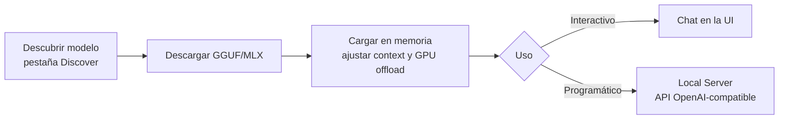

# LM Studio: LLMs locales con interfaz gráfica

[LM Studio](https://lmstudio.ai/) es una aplicación de escritorio (Windows, macOS y Linux) para **descargar, gestionar y ejecutar LLMs localmente** desde una interfaz gráfica. Si [llama.cpp](llama_cpp.md) es el motor y la línea de comandos, LM Studio es el asiento del conductor: buscas un modelo, lo descargas con un clic y chateas con él sin tocar una terminal.

Por debajo usa los mismos motores que conoces —**llama.cpp** para modelos GGUF y **Apple MLX** en Apple Silicon— pero añade una capa visual para descubrir modelos, ajustar parámetros y levantar un servidor con API compatible con OpenAI. Esta guía es dedicada y práctica; para comparar frameworks entre sí, revisa [Ecosistema de Modelos Locales](local_ecosystems.md).

!!! info "¿LM Studio u Ollama?"
    [Ollama](ollama_basics.md) es CLI-first y encaja mejor en automatización y despliegues. LM Studio brilla en el uso interactivo: explorar modelos, probar prompts y ajustar parámetros visualmente. Ambos exponen una API compatible con OpenAI.

## 🧭 Flujo de trabajo



## 📦 Instalación

Descarga el instalador desde la web oficial y sigue el asistente:

```bash
# Página oficial de descargas
# https://lmstudio.ai/download
```

- **Windows**: instalador `.exe` (requiere Windows 10/11, preferible con soporte AVX2).
- **macOS**: `.dmg` para Apple Silicon (M1/M2/M3/M4) — aprovecha MLX y la memoria unificada.
- **Linux**: `AppImage` (x64 con AVX2).

!!! warning "Requisito de CPU"
    LM Studio necesita instrucciones **AVX2** en x86. En equipos antiguos sin AVX2 no arrancará; en ese caso usa [llama.cpp](llama_cpp.md) compilado a medida.

## 🔍 Descubrir y descargar modelos

En la pestaña **Discover** (🔍) buscas modelos por nombre (p. ej. `Llama 3.1`, `Qwen2.5`, `Phi-4`). LM Studio lista las variantes disponibles en **GGUF** (y **MLX** en Mac) con distintos niveles de cuantización.

Para cada modelo verás una recomendación según tu hardware:

| Etiqueta | Significado |
|----------|-------------|
| **Full GPU Offload Possible** | El modelo cabe entero en tu GPU/VRAM |
| **Partial GPU Offload Possible** | Cabe parcialmente; el resto irá a CPU/RAM |
| **Likely too large** | Excede tu memoria; evítalo o baja de cuantización |

!!! tip "Qué cuantización elegir"
    Como en [llama.cpp](llama_cpp.md), **Q4_K_M** es el equilibrio recomendado. Sube a Q5/Q6/Q8 si te sobra memoria; baja a Q3 solo si un modelo no te entra.

## 💬 Cargar un modelo y chatear

1. Ve a la pestaña **Chat** (💬).
2. En el selector superior, elige el modelo descargado: LM Studio lo **carga en memoria**.
3. Escribe tu prompt y conversa.

Antes de cargar, el panel de configuración deja ajustar los parámetros clave.

## ⚙️ Configuración de parámetros

### Parámetros de carga (load-time)

| Parámetro | Descripción |
|-----------|-------------|
| **Context Length** | Tokens de contexto que "recuerda" el modelo. Más contexto = más RAM/VRAM |
| **GPU Offload** | Cuántas capas se descargan a la GPU (equivale a `-ngl` de llama.cpp) |
| **CPU Threads** | Hilos de CPU para la inferencia |
| **Evaluation Batch Size** | Tokens procesados por lote al ingerir el prompt |
| **Keep Model in Memory** | Mantiene el modelo cargado aunque no se use |
| **Flash Attention** | Reduce el uso de memoria del contexto (experimental) |

!!! note "GPU Offload al máximo"
    Sube el deslizador de **GPU Offload** todo lo que permita tu VRAM (etiqueta "max"). Si al cargar hay errores de memoria, redúcelo un poco. Las capas no descargadas corren en CPU.

### Parámetros de inferencia (sampling)

Se ajustan por conversación o preset: **Temperature**, **Top P**, **Top K**, **Repeat Penalty** y **Max Tokens**. Puedes guardar combinaciones como **presets** reutilizables.

## 🌐 Servidor local con API compatible OpenAI

La pestaña **Developer** (o **Local Server**) levanta un servidor HTTP con endpoints **compatibles con la API de OpenAI**. Perfecto para conectar tus scripts, IDEs o apps a un modelo local.

1. Abre la pestaña **Developer**.
2. Selecciona el modelo a servir y pulsa **Start Server** (puerto por defecto `1234`).

### Llamar al endpoint de chat con curl

```bash
curl http://localhost:1234/v1/chat/completions \
  -H "Content-Type: application/json" \
  -d '{
    "model": "local-model",
    "messages": [
      {"role": "system", "content": "Eres un asistente DevOps conciso."},
      {"role": "user", "content": "Dame un comando para ver los pods de un namespace"}
    ],
    "temperature": 0.7
  }'
```

### Con el SDK de OpenAI en Python

```python
from openai import OpenAI

# base_url apunta al servidor local de LM Studio; la api_key es un placeholder
client = OpenAI(base_url="http://localhost:1234/v1", api_key="lm-studio")

resp = client.chat.completions.create(
    model="local-model",
    messages=[{"role": "user", "content": "Explica qué es un Deployment en Kubernetes"}],
)
print(resp.choices[0].message.content)
```

Endpoints disponibles: `/v1/chat/completions`, `/v1/completions`, `/v1/embeddings` y `/v1/models`.

!!! info "Compatibilidad drop-in"
    Igual que [llama-server](llama_cpp.md) de llama.cpp, cualquier herramienta que hable con la API de OpenAI funciona cambiando solo `base_url`. Cambiar el puerto: `1234` es el valor por defecto de LM Studio.

## 🖥️ CLI `lms`: automatización desde terminal

LM Studio incluye `lms`, una CLI para scripting y CI. Primero, actívala:

```bash
# Registra el comando lms en el PATH (una sola vez)
npx lmstudio install-cli
```

```bash
# Listar modelos descargados
lms ls

# Cargar un modelo en memoria con contexto y GPU al máximo
lms load llama-3.1-8b-instruct --context-length 8192 --gpu max

# Descargar (unload) el modelo de la memoria
lms unload --all

# Arrancar el servidor local vía CLI
lms server start --port 1234
```

!!! tip "Interactivo para explorar, CLI para automatizar"
    Usa la interfaz gráfica para descubrir y probar; usa `lms` cuando quieras reproducir la configuración en scripts o pipelines.

## 🎯 Casos de uso e integración

- **Prototipado y evaluación de prompts** sin coste ni fugas de datos a la nube.
- **Backend local para IDEs**: apunta extensiones como *Continue* al servidor `http://localhost:1234/v1`.
- **RAG local**: usa el endpoint `/v1/embeddings` con un modelo de embeddings para indexar documentos privados.
- **Demos offline**: lleva la app y los modelos en un portátil, sin conexión.

Para despliegues automatizados en servidores o Kubernetes, [Ollama](ollama_basics.md) o [llama.cpp](llama_cpp.md) encajan mejor por su naturaleza CLI/headless.

## 🔗 Recursos adicionales

- [Sitio oficial de LM Studio](https://lmstudio.ai/)
- [Documentación de LM Studio](https://lmstudio.ai/docs)
- [Referencia de la CLI lms](https://lmstudio.ai/docs/cli)
- [Ecosistema de Modelos Locales](local_ecosystems.md) · [Ollama](ollama_basics.md) · [LLaMA.cpp](llama_cpp.md)
