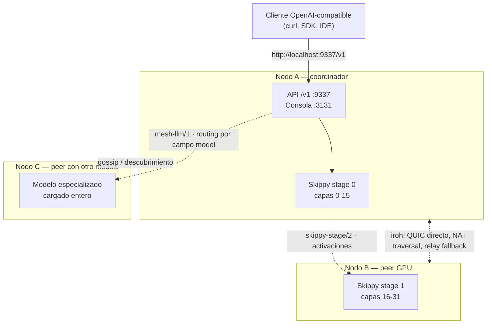

# MeshLLM: inferencia LLM distribuida en malla P2P

Mesh LLM agrupa GPUs y memoria de varias máquinas y expone el resultado como **una sola API OpenAI-compatible** en `http://localhost:9337/v1`. Arrancas un nodo, añades más nodos después, y la malla decide si un modelo se ejecuta localmente, se enruta a un peer, o se reparte en *stage splits* para modelos que no caben en una sola máquina.

Es software libre (Apache-2.0), escrito principalmente en Rust, y construido sobre [iroh](https://www.iroh.computer/) para la capa de red peer-to-peer.

!!! warning "Proyecto joven: la API y el CLI pueden cambiar"
    Mesh LLM se presentó públicamente en julio de 2026 y sus propios mantenedores lo describen como *"experimental distributed-systems software"*. Los comandos, flags y formatos de configuración de esta guía están tomados de la documentación oficial en el momento de la revisión (2026-07-18), pero **pueden cambiar entre versiones**. Antes de automatizar nada, contrasta siempre con `docs/CLI.md` del repositorio oficial.

## 🎯 Qué problema resuelve

El escenario típico de un homelab o de un equipo de investigación es tener varias máquinas con GPU (o CPU) *infrautilizadas*: un portátil con Apple Silicon, un sobremesa con una NVIDIA, un mini-PC. Cada una por separado sólo puede cargar modelos pequeños, y las tres pasan la mayor parte del día ociosas.

Mesh LLM ataca eso desde tres ángulos:

| Situación | Qué hace la malla |
|---|---|
| El modelo cabe entero en un nodo | Lo sirve **localmente**, sin tráfico de stages |
| Otro peer ya tiene ese modelo cargado | **Enruta** la petición a ese peer según el campo `model` |
| El modelo no cabe en ninguna máquina | Lo parte por **rangos de capas** entre varios nodos (*Skippy stage splits*) |

El eslogan del proyecto lo resume bien: *"run bigger models without buying bigger GPUs"*.

## 🧭 Cómo encaja frente a lo que ya conoces

- [Ollama](ollama_basics.md) y [LM Studio](lm_studio.md): un único nodo, cero red, arranque inmediato. Es lo correcto para el 90 % de los casos.
- [llama.cpp](llama_cpp.md): el motor de inferencia. Mesh LLM sigue la paridad de familias de modelos de llama.cpp con GGUF.
- [Despliegue con Kubernetes](despliegue_kubernetes.md): inferencia en un clúster gestionado (vLLM y similares), con nodos homogéneos, orquestador y red de datacenter.
- **Mesh LLM**: cómputo distribuido **entre tus propias máquinas heterogéneas**, sin orquestador central ni servidor de coordinación en el plano de datos.

Consulta también [Ecosistemas locales](local_ecosystems.md) para situar todas estas piezas.

## 🏗️ Arquitectura P2P sobre iroh

Cada nodo levanta un *endpoint* de iroh cuya clave pública es su identidad de red. iroh se encarga del **hole-punching**, el **NAT traversal** y el *fallback* a relays, de forma que los nodos establecen conexiones **QUIC directas** entre sí sin servidor central en el plano de datos.

Sobre QUIC, Mesh LLM define varios ALPN según la documentación de iroh:

- `mesh-llm/1` — gossip, routing, túneles HTTP y canales de plugins.
- `mesh-llm-control/1` — plano de control: configuración y ownership del operador.
- `skippy-stage/2` — transporte de activaciones, sensible a latencia.



!!! info "Descubrimiento público vs. privado"
    Las mallas **publicadas** se anuncian mediante descubrimiento Nostr. Las mallas **privadas** se mantienen basadas en tokens de invitación: sólo entra quien tiene el token.

## 📦 Instalación

El instalador oficial descarga el ejecutable de release. El binario se llama `mesh-llm` (`mesh-llm.exe` en Windows).

```bash
curl -fsSL https://raw.githubusercontent.com/Mesh-LLM/mesh-llm/main/install.sh | bash
```

En Windows, con PowerShell:

```powershell
irm https://raw.githubusercontent.com/Mesh-LLM/mesh-llm/main/install.ps1 | iex
```

Después, completa la configuración inicial:

```bash
mesh-llm setup
```

`mesh-llm setup` configura el runtime nativo y puede instalar el servicio en segundo plano en máquinas macOS y Linux compatibles.

!!! tip "Compilar desde el código fuente"
    ```bash
    git clone https://github.com/Mesh-LLM/mesh-llm
    cd mesh-llm
    just build
    ```
    Requiere `just`, `cmake`, Rust y Node.js 24 + npm. Las builds CUDA necesitan `nvcc`, las de ROCm necesitan ROCm/HIP y las de Vulkan necesitan las cabeceras de Vulkan más `glslc`. Metal es sólo macOS.

Para desinstalar más adelante, previsualiza primero la limpieza:

```bash
mesh-llm uninstall --dry-run
mesh-llm uninstall --yes
```

La desinstalación **preserva** la configuración e identidad en `~/.mesh-llm` salvo que pases explícitamente `--purge-config`.

## 🚀 Primeros pasos

### Unirse a la malla pública

```bash
mesh-llm serve --auto
```

Ese comando elige un *backend flavor*, descarga un modelo adecuado si hace falta, se une a la mejor malla pública descubierta, arranca la API local en el puerto `9337` y la consola web en el `3131`.

Para despliegues en servidor, `--headless` oculta la UI web manteniendo la API de gestión en el puerto de `--console`:

```bash
mesh-llm serve --auto --headless
```

### Consultar modelos y lanzar una petición

```bash
curl -s http://localhost:9337/v1/models | jq '.data[].id'
```

```bash
curl http://localhost:9337/v1/chat/completions \
  -H "Content-Type: application/json" \
  -d '{"model":"GLM-4.7-Flash-Q4_K_M","messages":[{"role":"user","content":"hello"}]}'
```

Al ser OpenAI-compatible, cualquier cliente que apunte a `http://localhost:9337/v1` funciona sin cambios: SDKs oficiales, plugins de IDE o herramientas de agente.

### Malla privada entre tus máquinas

Crear la malla en el primer nodo (imprime un token de invitación):

```bash
mesh-llm serve --model Qwen3-8B-Q4_K_M
```

Unir otro nodo con GPU:

```bash
mesh-llm serve --join <token>
```

Unir un nodo que sólo consume la API, sin servir modelos:

```bash
mesh-llm client --join <token>
```

Publicar tu propia malla en el descubrimiento público:

```bash
mesh-llm serve --model Qwen3-8B-Q4_K_M --publish
```

!!! warning "Hosts Linux con varias interfaces y Docker"
    En hosts con varias interfaces visibles para el kernel —especialmente con `docker run --network host`— iroh puede descubrir y anunciar direcciones de bridge Docker o CNI como `172.17.0.1`. Si todos los hosts comparten esa dirección, los peers pueden intentar la bridge local equivocada en vez de la red real. Fija la interfaz explícitamente con `--bind-ip` y `--bind-port`.

## 🧩 Repartir un modelo grande: Skippy stage splits

Skippy es el runtime *staged* embebido de Mesh LLM. Permite ejecutar modelos que no caben en una sola máquina cargando **stages de capas respaldados por paquetes** en varios peers. El flujo, según la documentación oficial:

1. El coordinador resuelve el modelo o el *layer package* solicitado.
2. El planificador de topología elige peers y rangos de capas **contiguos**.
3. Los stages finales (downstream) cargan primero.
4. El stage 0 sólo se vuelve enrutable cuando **todos** los stages requeridos reportan `ready`.
5. Los clientes OpenAI siguen usando el endpoint normal en `http://localhost:9337/v1`.

Los *layer packages* son repositorios de Hugging Face con un manifiesto `model-package.json` y fragmentos GGUF, de modo que cada peer descarga **sólo** los artefactos compartidos más las capas de su stage asignado.

```bash
mesh-llm serve --model hf://meshllm/Qwen3-235B-A22B-UD-Q4_K_XL-layers@<revision> --split
```

!!! note "Un nodo siempre gana al split"
    Si un nodo puede cargar el modelo completo, Mesh LLM **prefiere** la ruta de un solo nodo. El split se usa cuando el modelo físicamente lo necesita o cuando se pide de forma explícita. Para producción, usa refs inmutables (`@<revision>`) en lugar de refs móviles.

## 🔀 Routing y modelos especializados

Todos los nodos exponen la misma API `/v1`. Las peticiones se enrutan **por el campo `model`** hacia el peer capaz de servir ese modelo. Eso permite un patrón muy natural en un homelab: una máquina con el modelo de código, otra con el modelo generalista grande, otra con un modelo multimodal, y un único endpoint para todos.

Además existe una pasarela **Mixture-of-Agents**: enviando `"model": "mesh"` el proxy abanica la petición a todos los modelos disponibles en la malla en paralelo, arbitra las respuestas con lógica determinista y devuelve una única respuesta OpenAI-compatible. Requiere al menos dos modelos distintos en la malla.

```bash
curl http://localhost:9337/v1/chat/completions \
  -H "Content-Type: application/json" \
  -d '{"model":"mesh","messages":[{"role":"user","content":"What is the capital of Japan?"}]}'
```

!!! danger "MoA está marcado como experimental por el propio proyecto"
    La documentación oficial advierte de que el comportamiento, las heurísticas de routing, las formas de error y los parámetros de ajuste de `"model": "mesh"` **pueden cambiar entre versiones**. Úsalo como *preview*; para semántica estable, indica un id de modelo concreto.

## ⚡ Speculative decoding

Mesh LLM soporta *speculative decoding* en su runtime staged, y expone el ajuste a través de `mesh-llm benchmark tune`, que barre configuraciones y mide tokens/s de decodificación. Los tipos documentados son `auto`, `mtp`, `draft`, `ngram` y `disabled`:

```bash
mesh-llm benchmark tune --model /models/qwen3-mtp.gguf --speculative-types auto
mesh-llm benchmark tune --model /models/qwen3-8b.gguf \
  --speculative-types draft,ngram,disabled \
  --spec-draft-models /models/qwen3-draft.gguf \
  --spec-draft-max-tokens 4,8,16
```

Con `auto`, se prueba primero MTP nativo para objetivos con pinta de MTP, después los modelos *draft* descubribles localmente, después candidatos ngram como alternativa sin modelo, y se incluye una línea base con speculation desactivada para comparar. `--apply` escribe la recomendación en `~/.mesh-llm/config.toml`; `--no-speculative-tune` reproduce el barrido antiguo sólo con la línea base.

!!! info "Alcance del speculative decoding"
    Los controles de *draft* speculation, junto con el dtype de activaciones, los controles de prefill y los rangos de capas manuales, **sólo se ejecutan en modo staged**. La documentación oficial no describe un esquema en el que el modelo *draft* y el *target* residan en peers distintos: no asumas esa topología sin verificarla en el repositorio.

## 🔒 Seguridad y modelo de confianza

Las mallas pueden crearse con **requisitos inmutables** fijados en el momento de creación: versión mínima de nodo, generación de protocolo y política de *release attestation*. Cambiar esos requisitos deriva un identificador de malla nuevo. Las mallas con requisitos usan **tokens de bootstrap firmados**; las privadas y las heredadas sin restricciones siguen usando el camino de tokens de invitación no firmados.

!!! danger "La attestation es procedencia de build, no atestación de runtime"
    La documentación es explícita: una *release attestation* firmada prueba que el binario de un peer fue publicado por un firmante de release de confianza. **No** prueba que el proceso remoto esté ejecutando código sin modificar, ni que el SO o el hardware del host no hayan sido manipulados. Trata a los peers de una malla pública como código y datos no confiables: la inferencia que envías a un peer la ve ese peer.

Verificación de un binario empaquetado y sellado:

```bash
cargo run -p xtask -- release-attestation inspect \
  --binary <path-to-packaged-mesh-llm> \
  --public-key-file <release-signing-public-key.json>
```

Un binario de release empaquetado reporta `valid`, una build local o de desarrollo sin sellar reporta `missing`, y un binario modificado después del empaquetado reporta `invalid`.

## 🧪 Casos de uso realistas

- **Homelab multi-máquina**: tres equipos heterogéneos (Apple Silicon + una NVIDIA + un mini-PC) unidos en malla privada, sirviendo un modelo de 70B+ por splits que ninguno cargaría solo.
- **Equipo de investigación**: cada investigador arranca `mesh-llm serve --join <token>`; el grupo comparte una malla privada con modelos grandes y modelos especializados, y todos apuntan sus scripts al mismo `localhost:9337/v1`.
- **Nodo cliente ligero**: un portátil sin GPU usa `mesh-llm client --join <token>` para consumir la malla como si fuera una API remota, pero sin sacar datos fuera de la red del equipo.
- **Aprovechar horas ociosas**: máquinas de escritorio que fuera del horario laboral aportan su GPU a la malla del equipo.

## ⚠️ Limitaciones y cuándo NO usarlo

!!! warning "Lee esto antes de invertir tiempo"
    - **Latencia de red**: los splits por capas hacen que las activaciones viajen entre máquinas en cada token. Una LAN gigabit ya se nota; sobre WAN o Wi-Fi la degradación es severa. El propio proyecto define un ALPN específico (`skippy-stage/2`) precisamente porque ese transporte es sensible a latencia.
    - **Madurez**: el proyecto se autodescribe como experimental. Funcionalidades como el gateway MoA están marcadas como *preview*. No es una base estable para SLAs.
    - **Superficie de red**: un demonio P2P con NAT traversal y relays crea conectividad que tu red quizá no espera. En mallas públicas, tus prompts salen de tu máquina.
    - **Confianza en peers**: no hay atestación de runtime remoto. En malla pública, un peer malicioso ve el tráfico de inferencia que le enrutas.
    - **Complejidad operativa**: descubrimiento, tokens, política de owner, planificación de stages y compatibilidad entre versiones son piezas que hay que operar.

**No lo uses si**:

- El modelo que necesitas **cabe en una sola máquina**: usa [Ollama](ollama_basics.md) o [llama.cpp](llama_cpp.md) y ahórrate la red entera.
- Necesitas **throughput en producción con SLA**: usa vLLM sobre [Kubernetes](despliegue_kubernetes.md) con nodos homogéneos.
- Tus datos son **sensibles y no controlas todos los nodos**: la malla pública queda descartada; como mínimo, malla privada con tokens y nodos propios.
- Sólo tienes **una máquina**: no hay malla que formar.

!!! tip "Reportar bugs"
    Al reportar un fallo, incluye el comando ejecutado, la plataforma y el *backend flavor*, la salida de `/api/status` si está disponible, y si el nodo era privado, publicado o unido con `--auto`.

## 🔗 Recursos relacionados

- [Ollama: instalación y primeros pasos](ollama_basics.md) — el punto de partida de un solo nodo.
- [llama.cpp](llama_cpp.md) — el motor GGUF cuya paridad de familias sigue Skippy.
- [LM Studio](lm_studio.md) — alternativa gráfica de un solo nodo.
- [Ecosistemas locales](local_ecosystems.md) — panorama de herramientas de LLM local.
- [Despliegue a escala con Kubernetes](despliegue_kubernetes.md) — el otro extremo del espectro.

## 📚 Referencias

Fuentes oficiales consultadas el 2026-07-18:

- [Mesh LLM — sitio oficial](https://meshllm.cloud/)
- [Repositorio oficial: Mesh-LLM/mesh-llm (Apache-2.0)](https://github.com/Mesh-LLM/mesh-llm)
- [Mesh LLM: distributed AI computing on iroh — blog de iroh](https://www.iroh.computer/blog/mesh-llm)
- [`docs/MESHES.md`](https://github.com/Mesh-LLM/mesh-llm/blob/main/docs/MESHES.md) — mallas privadas, publicación, tokens, clientes API-only.
- [`docs/SKIPPY_SPLITS.md`](https://github.com/Mesh-LLM/mesh-llm/blob/main/docs/SKIPPY_SPLITS.md) — splits por capas.
- [`docs/CLI.md`](https://github.com/Mesh-LLM/mesh-llm/blob/main/docs/CLI.md) — referencia completa de comandos y flags.
- [`docs/USAGE.md`](https://github.com/Mesh-LLM/mesh-llm/blob/main/docs/USAGE.md) — guía operativa.
- [Documentación de iroh](https://docs.iroh.computer/)

!!! note "Desambiguación"
    Este artículo trata de **Mesh LLM**, la malla de inferencia distribuida P2P construida sobre iroh. No debe confundirse con el paper académico homónimo sobre generación de mallas 3D (arXiv 2508.01242) ni con `llmesh` de Hewlett Packard Enterprise (*agentic tool mesh*).
