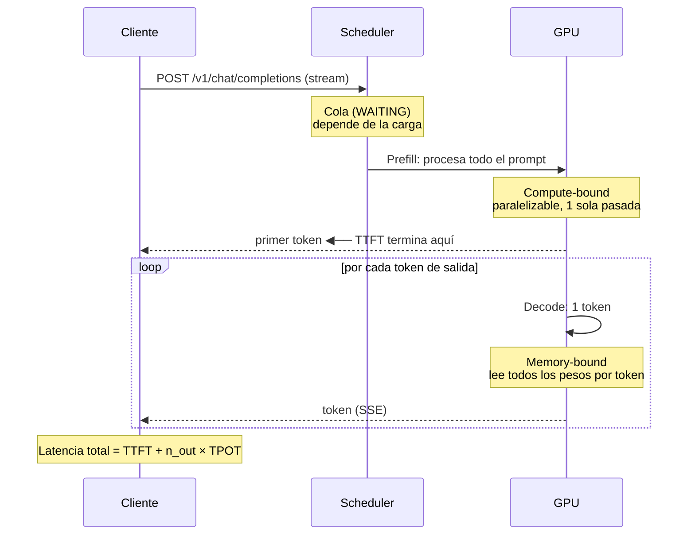
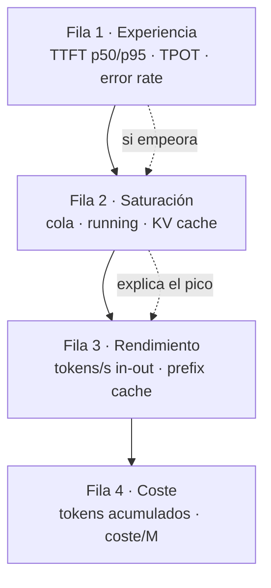

## Por qué un LLM no se monitoriza como una API web

Tienes Prometheus y Grafana funcionando. Apuntas el scrape al servidor de inferencia, importas un dashboard genérico de HTTP y te quedas mirando un panel que dice "p95 de latencia: 47 segundos". ¿Está roto? ¿Está bien? No tienes ni idea, porque la métrica que estás mirando no significa lo que crees.

La observabilidad clásica de servicios web asume tres cosas que en inferencia LLM son **todas falsas**:

!!! warning "Las tres asunciones que se rompen"
    **1. Una petición dura milisegundos.** En inferencia dura entre 2 segundos y varios minutos. Un histograma con buckets hasta 10s se satura en el bucket `+Inf` y pierdes toda la resolución justo donde vive tu tráfico.

    **2. El tiempo de respuesta es un número útil.** Con streaming SSE, el usuario ya está leyendo texto mientras la petición sigue "abierta". La duración total mide sobre todo *cuánto texto se generó*, no *cuán rápido responde el sistema*. Una respuesta de 1500 tokens tarda más que una de 50 aunque el servidor vaya idéntico de rápido.

    **3. El coste es proporcional a las peticiones.** No lo es. Es proporcional a los **tokens**, y con un factor distinto para entrada y salida. Diez peticiones con prompts de 200 tokens cuestan una fracción de una sola petición con 100k tokens de contexto.

La consecuencia práctica: **las métricas HTTP estándar de tu ingress o tu sidecar no sirven para gobernar un servicio de inferencia.** Sirven para saber si el proceso está vivo. Para todo lo demás necesitas métricas que entiendan de tokens.

!!! info "Dónde encaja esta guía"
    - Instalar y operar Prometheus, Grafana, Loki y Alertmanager → [Stack completo de observabilidad](../monitoring/observability_stack.md)
    - Medir la *calidad* de las respuestas con benchmarks → [Evaluación y testing de modelos LLM](model_evaluation.md)
    - Tunear el motor que produce estas métricas → [vLLM](vllm.md)
    - **Esta guía**: qué medir en producción, por qué, y cómo montar el dashboard

## Anatomía de una petición de inferencia

Para entender qué medir, hay que ver dónde se va el tiempo. Una petición pasa por fases con características de rendimiento radicalmente distintas.



Dos fases, dos cuellos de botella distintos:

- **Prefill** procesa los N tokens del prompt de una vez. Está limitado por cómputo (FLOPs). Escala con la longitud del prompt.
- **Decode** genera un token por paso. Está limitado por ancho de banda de memoria: en cada paso hay que leer los pesos completos del modelo desde HBM. Escala con la longitud de la respuesta.

Un modelo puede tener excelente throughput agregado y un TTFT horrible, o al revés. Son ejes independientes y **necesitas medir los dos**.

## Las métricas que importan

### TTFT — time to first token

**Definición precisa**: tiempo transcurrido desde que el servidor acepta la petición hasta que emite el primer token de la respuesta. Incluye el tiempo en cola más el prefill completo.

Es la métrica que **percibe el usuario como "el sistema responde"**. En una interfaz de chat, un TTFT de 400 ms con generación lenta se siente ágil; un TTFT de 8 segundos seguido de generación instantánea se siente roto, aunque la latencia total sea la misma o menor.

Qué la degrada, en orden de frecuencia real:

1. **Tiempo en cola** — hay más peticiones que capacidad. Es el factor dominante bajo carga.
2. **Prompt largo** — el prefill es proporcional a los tokens de entrada. Un RAG que inyecta 30k tokens de contexto paga TTFT alto por diseño.
3. **Preemption** — el scheduler expulsó la petición para hacer sitio y hay que recomputar.

!!! tip "Segmenta el TTFT por longitud de prompt"
    Un p95 de TTFT global mezcla peticiones de 100 tokens con peticiones de 30k. El número resultante no describe a ninguna de las dos. Si tu tráfico es heterogéneo, añade una etiqueta de tramo de longitud de prompt (por ejemplo `corto` / `medio` / `largo`) en tu capa de aplicación y mide por tramo.

### TPOT — time per output token

**Definición precisa**: tiempo medio entre tokens consecutivos durante la fase de decode, una vez emitido el primero. Su inverso son los **tokens por segundo por petición**.

Es la métrica de "velocidad de escritura" percibida. Referencia útil: la lectura humana cómoda ronda los 5-10 tokens/s, así que un TPOT por debajo de ~100 ms suele ser suficiente para chat; para un agente que encadena llamadas sin humano delante, cuanto menor mejor sin umbral perceptual.

!!! note "TPOT y ITL no son exactamente lo mismo"
    La **latencia inter-token (ITL)** es el intervalo observado entre dos tokens concretos. El **TPOT** por petición suele calcularse como `(latencia_total - TTFT) / (tokens_salida - 1)`, es decir, un promedio por petición. La distribución de ITL revela jitter (pausas por preemption o por scheduling) que el promedio de TPOT esconde. Si el usuario reporta "se queda parado a mitad", mira ITL, no TPOT.

### Throughput agregado

**Definición precisa**: tokens de salida generados por segundo sumando **todas** las peticiones concurrentes.

Es la métrica del operador, no del usuario. Determina cuántos usuarios caben por GPU y por tanto el coste unitario. Y aquí está la tensión central de operar inferencia:

**El throughput agregado y el TPOT por petición están en conflicto directo.** Batches más grandes suben el throughput total y bajan la velocidad individual, porque cada paso de decode reparte el ancho de banda de memoria entre más secuencias. Sintonizar un servidor de inferencia es elegir un punto en esa curva, no optimizar ambos a la vez.

### Peticiones en cola y tamaño de batch

- **Peticiones en ejecución**: cuántas secuencias hay en el batch activo del scheduler ahora mismo.
- **Peticiones esperando**: cuántas están admitidas pero aún no entran en el batch.

La cola es tu **indicador adelantado**. Sube antes de que el TTFT se degrade y mucho antes de que aparezcan timeouts. Si vas a alertar de un solo síntoma de saturación, alerta de la cola.

### Utilización de GPU y ocupación del KV cache

Aquí está el error más común: mirar `utilization.gpu` de `nvidia-smi` y concluir que hay margen porque marca 60%.

!!! danger "La utilización de GPU miente en inferencia"
    `utilization.gpu` mide el porcentaje de tiempo en que **hay al menos un kernel ejecutándose**. No mide cuánto del chip se está usando. Durante decode, un kernel memory-bound puede marcar 100% de "utilización" usando una fracción mínima de la capacidad de cómputo. Es un indicador de "está haciendo algo", no de "está lleno".

El límite real de concurrencia es el **KV cache**. Cada secuencia activa guarda las claves y valores de atención de todos sus tokens; ese estado vive en VRAM y crece linealmente con el contexto. Cuando la ocupación del KV cache llega al 100%, el scheduler no puede admitir más secuencias: encola, o **expulsa** (preemption) peticiones ya en vuelo, cuyo estado hay que recomputar después. Eso se ve como picos de TTFT y como jitter en ITL, sin que ningún panel de CPU o de "GPU utilization" se inmute.

Las tres señales de VRAM que sí importan:

| Señal | Qué indica | Umbral de atención |
|---|---|---|
| Ocupación del KV cache | Concurrencia real disponible | > 90% sostenido |
| Preemptions / recomputaciones | Ya estás sobre el límite | cualquier valor sostenido > 0 |
| Aciertos de prefix cache | Eficiencia de prompts compartidos | bajada brusca respecto a la línea base |

La caída de aciertos de prefix cache es un diagnóstico infravalorado: si tu system prompt cambia (una variable dinámica, un timestamp inyectado), el prefijo deja de ser reutilizable, el prefill se dispara y el TTFT sube sin que haya cambiado la carga.

### Errores, timeouts y truncamientos

Los errores 5xx son la parte fácil. Los específicos de LLM son estos, y ninguno aparece como error HTTP:

- **Truncamiento por límite de salida**: la generación se corta al alcanzar `max_tokens`. La petición devuelve **200 OK** con una respuesta incompleta, a veces a mitad de frase o con un JSON sin cerrar. Detectable por la razón de finalización (`length` en lugar de `stop`).
- **Rechazo por límite de contexto**: prompt + salida esperada exceden `max_model_len`. Suele devolver 4xx. En RAG es el fallo más común y su causa es un retriever que devolvió demasiados fragmentos.
- **Timeout de cliente**: el cliente abandona antes de recibir la respuesta completa. Desde el servidor se ve como una petición abortada; desde el usuario, como un fallo total.

!!! warning "El truncamiento silencioso es la avería más cara"
    Un servicio con 3% de respuestas truncadas por `max_tokens` tiene 0% de errores en cualquier dashboard HTTP y un problema de calidad grave aguas abajo, especialmente si algo parsea esa salida como JSON. **Grafica la proporción de finalizaciones por `length` frente a `stop` desde el primer día.**

## Métricas nativas de vLLM

vLLM expone métricas Prometheus en `/metrics` del mismo puerto del servidor OpenAI-compatible, con prefijo `vllm:` y etiqueta `model_name`. No hace falta exporter adicional.

```bash
# Comprobar qué expone tu build concreto (haz esto siempre antes de escribir queries)
curl -s http://localhost:8000/metrics | grep '^# HELP vllm:'
```

Estas son las que puedo confirmar en la documentación oficial actual de vLLM (motor V1):

```promql
# --- Gauges: estado instantáneo del scheduler ---
vllm:num_requests_running          # peticiones en los batches de ejecución
vllm:num_requests_waiting          # peticiones esperando a ser planificadas
vllm:kv_cache_usage_perc           # fracción de bloques de KV cache en uso (0-1)

# --- Counters: acumulados (sufijo _total al exponerse) ---
vllm:prompt_tokens_total           # tokens de prefill procesados
vllm:generation_tokens_total       # tokens de generación producidos
vllm:request_success_total         # peticiones completadas, etiqueta finished_reason
vllm:num_preemptions_total         # expulsiones acumuladas del motor
vllm:prefix_cache_queries_total    # tokens consultados contra el prefix cache
vllm:prefix_cache_hits_total       # tokens servidos desde el prefix cache

# --- Histogramas: distribuciones de latencia ---
vllm:time_to_first_token_seconds        # TTFT
vllm:inter_token_latency_seconds        # ITL, intervalo entre tokens
vllm:request_time_per_output_token_seconds  # TPOT por petición
vllm:e2e_request_latency_seconds        # latencia total extremo a extremo
vllm:request_queue_time_seconds         # tiempo en fase WAITING
vllm:request_inference_time_seconds     # tiempo en fase RUNNING
vllm:request_prefill_time_seconds       # tiempo en fase PREFILL
vllm:request_decode_time_seconds        # tiempo en fase DECODE
```

!!! danger "Verifica los nombres contra tu versión"
    El conjunto de métricas de vLLM ha cambiado entre el motor V0 y el V1, y sigue evolucionando. Algunos nombres históricos (por ejemplo los referidos a la ocupación de caché de GPU en V0) fueron renombrados. **No copies estas queries a producción sin ejecutar antes el `curl` de arriba contra tu propio servidor.** Un panel que consulta una métrica inexistente no da error: dibuja una línea plana vacía, que es peor.

    Además, vLLM expone métricas adicionales sobre bloques de KV cache, decodificación especulativa, adaptadores LoRA y caché multimodal cuya disponibilidad depende de flags de arranque y de la versión. Descúbrelas con el `curl`, no las asumas.

### Configurar el scrape

```yaml
# servicemonitor-vllm.yaml — requiere Prometheus Operator
apiVersion: monitoring.coreos.com/v1
kind: ServiceMonitor
metadata:
  name: vllm
  namespace: observability
  labels:
    release: prometheus
spec:
  namespaceSelector:
    matchNames: ["inference"]
  selector:
    matchLabels:
      app: vllm
  endpoints:
    - port: http
      path: /metrics
      interval: 15s
      scrapeTimeout: 10s
```

Un `interval` de 15s es un buen punto de partida. Con 60s pierdes los picos de cola, que son cortos y son justamente lo que quieres ver.

## Ollama: qué expone y qué no

[Ollama](ollama_basics.md) está diseñado para uso local y de escritorio, y eso se nota: **no publica un endpoint `/metrics` en formato Prometheus**. No hay gauge de cola, ni histograma de TTFT, ni ocupación de KV cache. Si necesitas observabilidad sobre Ollama, la instrumentas por fuera.

La buena noticia es que la propia respuesta de la API trae los datos crudos que necesitas. Con `"stream": false`, `/api/generate` y `/api/chat` devuelven campos de temporización en nanosegundos:

```bash
curl -s http://localhost:11434/api/generate -d '{
  "model": "llama3.1:8b",
  "prompt": "Explica el KV cache en dos frases",
  "stream": false
}' | jq '{
    total_duration, load_duration,
    prompt_eval_count, prompt_eval_duration,
    eval_count, eval_duration
  }'
```

Interpretación de cada campo:

| Campo | Significado |
|---|---|
| `load_duration` | Tiempo de carga del modelo (alto solo en frío) |
| `prompt_eval_count` | Tokens de entrada procesados en prefill |
| `prompt_eval_duration` | Duración del prefill, en nanosegundos |
| `eval_count` | Tokens generados |
| `eval_duration` | Duración de la generación, en nanosegundos |
| `total_duration` | Total de la petición, en nanosegundos |

De ahí salen tus métricas derivadas:

- **tokens/s de generación** = `eval_count / (eval_duration / 1e9)`
- **tokens/s de prefill** = `prompt_eval_count / (prompt_eval_duration / 1e9)`
- **aproximación de TTFT** = `(load_duration + prompt_eval_duration) / 1e9`

!!! note "Ese TTFT es una aproximación, no la métrica real"
    Con `stream: false` no hay un primer token que cronometrar: reconstruyes el TTFT sumando carga y prefill. Es útil como tendencia, pero no incluye tiempo de cola ni el coste del primer paso de decode. Para un TTFT exacto, mide en el cliente con `stream: true` y marca el instante en que llega el primer *chunk*.

Un exporter mínimo: envuelve la llamada y publica las métricas tú mismo.

```python
# ollama_exporter.py — sidecar mínimo para tener métricas Prometheus de Ollama
import requests
from prometheus_client import Counter, Histogram, start_http_server

NS = 1e9

TOKENS_IN = Counter("ollama_prompt_tokens_total", "Tokens de prompt", ["model"])
TOKENS_OUT = Counter("ollama_generation_tokens_total", "Tokens generados", ["model"])
GEN_TPS = Histogram(
    "ollama_generation_tokens_per_second", "Tokens/s en la fase de generación",
    ["model"], buckets=(5, 10, 20, 30, 50, 75, 100, 150, 250, 500),
)
PREFILL = Histogram(
    "ollama_prefill_seconds", "Duración del prefill",
    ["model"], buckets=(0.05, 0.1, 0.25, 0.5, 1, 2, 5, 10, 30, 60),
)
E2E = Histogram(
    "ollama_request_seconds", "Duración total de la petición",
    ["model"], buckets=(0.5, 1, 2, 5, 10, 20, 40, 80, 160, 320),
)


def generate(model: str, prompt: str) -> str:
    r = requests.post(
        "http://localhost:11434/api/generate",
        json={"model": model, "prompt": prompt, "stream": False},
        timeout=600,
    )
    r.raise_for_status()
    d = r.json()

    TOKENS_IN.labels(model).inc(d.get("prompt_eval_count", 0))
    TOKENS_OUT.labels(model).inc(d.get("eval_count", 0))
    E2E.labels(model).observe(d["total_duration"] / NS)

    if d.get("prompt_eval_duration"):
        PREFILL.labels(model).observe(d["prompt_eval_duration"] / NS)
    if d.get("eval_duration") and d.get("eval_count"):
        GEN_TPS.labels(model).observe(d["eval_count"] / (d["eval_duration"] / NS))

    return d["response"]


if __name__ == "__main__":
    start_http_server(9109)
    print(generate("llama3.1:8b", "di hola")[:80])
```

!!! tip "Cuándo migrar de Ollama a vLLM"
    Si necesitas gobernar concurrencia con métricas de cola y KV cache, ya estás fuera del terreno de Ollama. Es una decisión de motor, no de monitorización: mira [vLLM](vllm.md).

## Modelar el coste

El coste por petición no existe como número estable. Lo que existe es **coste por token**, y se calcula de forma completamente distinta según el modelo sea propio o de terceros.

### API de pago

El proveedor publica un precio por millón de tokens, con **entrada y salida tarificadas por separado** (la salida es sensiblemente más cara en la práctica totalidad de proveedores). Muchos aplican además descuento a tokens de entrada servidos desde caché.

```text
coste_periodo = (tokens_entrada  / 1e6) × precio_entrada
              + (tokens_salida   / 1e6) × precio_salida
```

!!! danger "No hardcodees precios"
    Los precios cambian, varían por modelo, por región y por nivel de compromiso, y cualquier cifra escrita aquí estaría obsoleta antes de que la leas. Consulta el tarifario vigente de tu proveedor y **guarda el precio como variable de configuración o como una recording rule**, nunca embebido en una query de dashboard. Si un gateway como [LiteLLM](litellm.md) ya calcula el coste por ti, usa su métrica como fuente única.

### Modelo local

Aquí no pagas por token: pagas por **tiempo de hardware encendido**, y el coste por token depende enteramente de cuántos tokens consigas exprimir de ese tiempo.

```text
coste_hora = amortizacion_hardware_hora + energia_hora + overhead_hora

  amortizacion_hardware_hora = coste_adquisicion / (vida_util_meses × 730)
  energia_hora               = (potencia_media_W / 1000) × precio_kWh × PUE
  overhead_hora              = hosting, red, operación

coste_por_millon_tokens = coste_hora / (tokens_por_segundo × 3600) × 1e6
```

Tres advertencias que separan un modelo útil de uno engañoso:

1. **La utilización lo domina todo.** El denominador es el throughput *real medido*, no el de la ficha técnica. Una GPU que factura 24 h al día y sirve tráfico 3 h tiene un coste por token ocho veces peor que el que sugiere el benchmark. **El coste por token de un modelo local es principalmente una métrica de utilización.**
2. **La potencia media no es el TDP.** Mide el consumo real bajo tu carga; en decode suele quedar por debajo del máximo nominal.
3. **Incluye el PUE.** Refrigeración y pérdidas de alimentación son un multiplicador sobre el consumo del chip, no un redondeo.

Recording rules para tener el dato en Prometheus sin repetir la aritmética en cada panel:

```yaml
# recording-rules-llm-cost.yaml
groups:
  - name: llm-cost
    interval: 1m
    rules:
      # Ajusta estos valores a tu contrato y tu hardware. Son parámetros, no verdades.
      - record: llm:coste_hora_gpu
        expr: vector(0)   # <-- sustituye por tu coste/hora calculado con la fórmula

      - record: llm:tokens_salida_por_segundo
        expr: sum(rate(vllm:generation_tokens_total[5m])) by (model_name)

      # Coste por millón de tokens generados. Sin tráfico el resultado es +Inf: es correcto,
      # una GPU encendida sin uso tiene coste por token infinito.
      - record: llm:coste_por_millon_tokens
        expr: >
          scalar(llm:coste_hora_gpu)
          / (llm:tokens_salida_por_segundo * 3600) * 1e6
```

## Dashboard de Grafana, panel a panel

El orden importa. Un dashboard de inferencia se lee de arriba abajo respondiendo a tres preguntas encadenadas: *¿el usuario está sufriendo?* → *¿por qué?* → *¿cuánto cuesta?*



**Fila 1 — Lo que sufre el usuario.** Time series con TTFT p50 y p95 juntos: la brecha entre ambos dice más que cualquiera de los dos por separado.

```promql
# TTFT p95 por modelo
histogram_quantile(
  0.95,
  sum(rate(vllm:time_to_first_token_seconds_bucket[5m])) by (le, model_name)
)

# TPOT p95: velocidad de escritura percibida
histogram_quantile(
  0.95,
  sum(rate(vllm:request_time_per_output_token_seconds_bucket[5m])) by (le, model_name)
)
```

**Fila 2 — Saturación.** Cola y KV cache en el mismo panel, superpuestos. Cuando el TTFT sube, este panel te dice en un vistazo si fue por cola (falta capacidad) o por prompts largos (la cola está vacía y el TTFT sube igual).

```promql
# Peticiones en cola frente a peticiones en ejecución
vllm:num_requests_waiting
vllm:num_requests_running

# Ocupación del KV cache como porcentaje (unidad del panel: percentunit)
vllm:kv_cache_usage_perc

# Preemptions por segundo: si esto no es cero, estás por encima del límite
sum(rate(vllm:num_preemptions_total[5m])) by (model_name)
```

**Fila 3 — Rendimiento.** Throughput de entrada y de salida separados; la ratio entre ambos caracteriza tu carga de trabajo (RAG y clasificación son intensivos en entrada, generación de texto lo es en salida).

```promql
# Tokens/s de generación y de prefill
sum(rate(vllm:generation_tokens_total[5m])) by (model_name)
sum(rate(vllm:prompt_tokens_total[5m])) by (model_name)

# Ratio de aciertos del prefix cache: una caída explica subidas de TTFT
sum(rate(vllm:prefix_cache_hits_total[5m]))
  / clamp_min(sum(rate(vllm:prefix_cache_queries_total[5m])), 1)
```

**Fila 3b — Salud de la generación.** El panel que casi nadie pone y que casi siempre encuentra algo: la proporción de respuestas cortadas por límite de longitud.

```promql
# Fracción de peticiones truncadas por max_tokens en lugar de terminadas por sí solas
sum(rate(vllm:request_success_total{finished_reason="length"}[15m]))
  / clamp_min(sum(rate(vllm:request_success_total[15m])), 1)
```

**Fila 4 — Coste.** Stat panels con tokens acumulados en el rango del dashboard y coste por millón derivado de las recording rules. Aquí el valor pequeño y aburrido es un stat con el número de GPUs encendidas: multiplicado por el coste/hora, es tu factura mínima independientemente del tráfico.

!!! tip "Elige bien los buckets antes de necesitarlos"
    `histogram_quantile` interpola dentro del bucket. Si tu tráfico real cae entero en el bucket `+Inf`, el p95 que dibuja Grafana es una invención. Los histogramas nativos de vLLM ya vienen con buckets pensados para latencias largas; si instrumentas tú (el caso de Ollama), extiende los buckets hasta cientos de segundos. Cambiar buckets después invalida el histórico, así que decídelo pronto.

## Alertas: las útiles y las que solo hacen ruido

Una alerta debe cumplir dos condiciones: indica daño real al usuario, y hay algo que la persona de guardia puede hacer al recibirla. Casi todas las alertas de LLM que se escriben por defecto fallan la segunda.


```yaml
# alertas-llm.yaml
groups:
  - name: llm-inference
    rules:
      # El motor no responde. Único candidato legítimo a página nocturna.
      - alert: InferenciaCaida
        expr: up{job="vllm"} == 0
        for: 2m
        labels: { severity: critical }
        annotations:
          summary: "Servidor de inferencia {{ $labels.instance }} no responde"

      # Cola sostenida: falta capacidad. Accionable = escalar réplicas.
      - alert: ColaDeInferenciaSostenida
        expr: avg_over_time(vllm:num_requests_waiting[10m]) > 20
        for: 10m
        labels: { severity: warning }
        annotations:
          summary: "Cola sostenida en {{ $labels.model_name }}"
          description: "Media de {{ $value }} peticiones esperando durante 10 min."

      # KV cache saturado + preemptions: degradación real ya en curso.
      - alert: KVCacheSaturado
        expr: |
          vllm:kv_cache_usage_perc > 0.95
          and rate(vllm:num_preemptions_total[10m]) > 0
        for: 10m
        labels: { severity: warning }
        annotations:
          summary: "KV cache saturado con preemptions en {{ $labels.model_name }}"

      # TTFT degradado sostenido: el usuario lo está notando.
      - alert: TTFTDegradado
        expr: |
          histogram_quantile(
            0.95,
            sum(rate(vllm:time_to_first_token_seconds_bucket[10m])) by (le, model_name)
          ) > 10
        for: 15m
        labels: { severity: warning }
        annotations:
          summary: "TTFT p95 de {{ $value | humanizeDuration }} en {{ $labels.model_name }}"

      # Truncamientos masivos: fallo de calidad invisible para el monitoreo HTTP.
      - alert: TruncamientosExcesivos
        expr: |
          sum(rate(vllm:request_success_total{finished_reason="length"}[30m]))
            / clamp_min(sum(rate(vllm:request_success_total[30m])), 1) > 0.25
        for: 30m
        labels: { severity: warning }
        annotations:
          summary: "Más del 25% de respuestas cortadas por max_tokens"

      # Gasto disparado frente a la línea base de ayer. Solo horario laboral.
      - alert: GastoAnomalo
        expr: |
          sum(rate(vllm:generation_tokens_total[1h]))
            > 3 * sum(rate(vllm:generation_tokens_total[1h] offset 1d))
        for: 30m
        labels: { severity: info }
        annotations:
          summary: "Consumo de tokens 3x por encima del mismo tramo de ayer"
```


Y las que **no** deberías crear:

| Alerta ruidosa | Por qué no funciona |
|---|---|
| Utilización de GPU alta | En decode es normal y sostenida. Dispara siempre y no significa nada accionable. |
| Latencia total > N segundos | Una respuesta larga tarda más por definición. Alertas cuando alguien pide un resumen extenso. |
| Ocupación de KV cache > 80% | Es el punto de funcionamiento *deseable*. Bajo ese umbral estás desperdiciando GPU. Alerta de preemptions, no de ocupación sola. |
| Cualquier pico instantáneo sin `for:` | El scheduling de inferencia es intrínsecamente irregular. Sin ventana de sostenimiento, todo alerta. |
| Caída de tokens/s | Se desploma legítimamente cuando baja el tráfico. Mide saturación con la cola, nunca con el throughput. |

## Trazabilidad de calidad en producción

Las métricas te dicen si el sistema es rápido. No te dicen si las respuestas son **correctas**. Para eso necesitas mirar el contenido, y ahí entra un problema que no es técnico.

!!! danger "Un prompt es un dato personal hasta que demuestres lo contrario"
    Los usuarios escriben en un chat cosas que nunca meterían en un formulario: nombres, direcciones, historiales médicos, credenciales, información confidencial de clientes. **Loguear prompts en bruto convierte tu backend de logs en un almacén de datos personales sin base legal, sin política de retención y probablemente sin cifrado en reposo.**

    Antes de escribir un solo prompt a disco:

    - Aplica **redacción de PII antes de la escritura**, nunca después. Un log ya escrito es un log ya filtrado.
    - Fija una **retención corta y explícita** (días, no meses) y haz que la borre el sistema, no una persona.
    - **Restringe el acceso** al índice de prompts como restringirías el acceso a la base de datos de producción.
    - Ofrece un **opt-out** y respétalo en el pipeline, no solo en la interfaz.
    - En cualquier duda, guarda un **hash del prompt** más metadatos y descarta el texto. Un hash te permite detectar duplicados y correlacionar sin conservar el contenido.

Con ese marco puesto, el enfoque práctico:

**Muestrea, no lo guardes todo.** Un 1-2% de tráfico aleatorio basta para vigilar la deriva de calidad y reduce en dos órdenes de magnitud la superficie de riesgo y el coste de almacenamiento. Complementa el muestreo aleatorio con un muestreo dirigido de los casos interesantes: respuestas truncadas, latencias en la cola alta de la distribución, peticiones con feedback negativo del usuario.

**Separa métricas de trazas.** Las métricas de esta guía van a Prometheus, son numéricas y baratas. Las trazas con contenido van a un almacén con control de acceso y retención propios. No mezcles: correlaciónalos con un `request_id` común. El montaje de [Loki y Tempo](../monitoring/observability_stack.md) sirve exactamente para esto, siempre que apliques la redacción antes del envío.

```python
# muestreo_calidad.py — decide qué se guarda y en qué forma
import hashlib
import random
import re

TASA_MUESTREO = 0.02          # 2% del tráfico
RETENCION_DIAS = 7            # aplicada en el backend de logs

PATRONES_PII = [
    (re.compile(r"[\w\.\-]+@[\w\.\-]+\.\w+"), "[EMAIL]"),
    (re.compile(r"\b\d{8}[A-HJ-NP-TV-Z]\b", re.I), "[DNI]"),
    (re.compile(r"\b(?:\d[ -]?){13,19}\b"), "[TARJETA]"),
    (re.compile(r"\b(?:\+34[ -]?)?[6-9]\d{2}[ -]?\d{3}[ -]?\d{3}\b"), "[TELEFONO]"),
]


def redactar(texto: str) -> str:
    for patron, reemplazo in PATRONES_PII:
        texto = patron.sub(reemplazo, texto)
    return texto


def debe_muestrear(finish_reason: str, latencia_s: float, feedback: str | None) -> bool:
    # Siempre los casos interesantes; el resto, aleatorio.
    if finish_reason == "length" or latencia_s > 30 or feedback == "negativo":
        return True
    return random.random() < TASA_MUESTREO


def registro_calidad(request_id, prompt, respuesta, meta):
    base = {
        "request_id": request_id,
        "prompt_sha256": hashlib.sha256(prompt.encode()).hexdigest(),
        "tokens_entrada": meta["prompt_tokens"],
        "tokens_salida": meta["completion_tokens"],
        "finish_reason": meta["finish_reason"],
        "ttft_s": meta["ttft"],
        "modelo": meta["model"],
    }
    if not debe_muestrear(meta["finish_reason"], meta["e2e"], meta.get("feedback")):
        return base  # solo metadatos: sin contenido, sin riesgo

    # ponytail: regex de PII cubre los casos frecuentes; si manejas datos de salud
    # o financieros, sustituye por un detector especializado antes de producción.
    return base | {
        "prompt": redactar(prompt)[:4000],
        "respuesta": redactar(respuesta)[:4000],
    }


if __name__ == "__main__":
    r = registro_calidad(
        "req-1", "Soy Ana, ana@example.com, 12345678Z", "Hola Ana",
        {"prompt_tokens": 12, "completion_tokens": 3, "finish_reason": "length",
         "ttft": 0.4, "e2e": 1.2, "model": "llama3.1:8b"},
    )
    assert "ana@example.com" not in r["prompt"], "fuga de email"
    assert "12345678Z" not in r["prompt"], "fuga de DNI"
    assert len(r["prompt_sha256"]) == 64
    print("ok:", r["prompt"])
```

**Evalúa offline, no en la ruta crítica.** Los datos muestreados alimentan un proceso batch que aplica las técnicas de [evaluación de modelos](model_evaluation.md): comparación contra respuestas de referencia, LLM-as-a-judge, reglas de formato. Ese proceso produce una puntuación agregada que **sí** puedes publicar como métrica Prometheus y graficar junto a las de rendimiento. Nunca ejecutes un juez LLM sincrónicamente dentro de la petición del usuario: duplicas la latencia y el coste para obtener un número que puedes calcular cinco minutos más tarde.

**Vigila la deriva sin leer texto.** Tres señales agregadas detectan cambios de comportamiento sin tocar contenido: longitud media de la respuesta, distribución de razones de finalización, y ratio de aciertos del prefix cache. Un despliegue que cambia el system prompt se ve en las tres a la vez.

## Checklist de implantación

- [ ] `/metrics` del servidor de inferencia inspeccionado con `curl` y nombres verificados contra la versión desplegada
- [ ] Scrape configurado con intervalo de 15s o menor
- [ ] Dashboard ordenado: experiencia → saturación → rendimiento → coste
- [ ] TTFT p50 y p95 en el mismo panel
- [ ] Panel de cola y KV cache superpuestos
- [ ] Panel de finalizaciones por `length` frente a `stop`
- [ ] Buckets de histograma que cubren la cola larga real de tu tráfico
- [ ] Coste/hora del hardware calculado con la fórmula y guardado como recording rule
- [ ] Alertas limitadas a: caída, cola sostenida, preemptions, TTFT degradado, truncamientos
- [ ] Ninguna alerta sobre utilización de GPU o latencia total absoluta
- [ ] Redacción de PII aplicada **antes** de escribir cualquier log de prompts
- [ ] Retención de trazas de contenido fijada en días y forzada por el sistema
- [ ] Evaluación de calidad offline sobre muestreo, publicando su resultado como métrica

## Referencias

- [Stack completo de observabilidad](../monitoring/observability_stack.md) — instalación y operación de Prometheus, Grafana, Loki, Tempo y Alertmanager
- [Evaluación y testing de modelos LLM](model_evaluation.md) — benchmarks y métricas de calidad para la evaluación offline
- [vLLM](vllm.md) — el motor que produce las métricas de esta guía
- [Ollama](ollama_basics.md) — inferencia local y campos de temporización de su API
- [LiteLLM](litellm.md) — gateway con cost tracking integrado por equipo y por clave
- [Despliegue a escala con Kubernetes](despliegue_kubernetes.md) — autoescalado guiado por estas métricas
- [Documentación de métricas de vLLM](https://docs.vllm.ai/en/stable/design/metrics/) — fuente autoritativa de nombres, siempre por versión
- [Prometheus: histogramas y cuantiles](https://prometheus.io/docs/practices/histograms/) — por qué la elección de buckets condiciona tus percentiles
