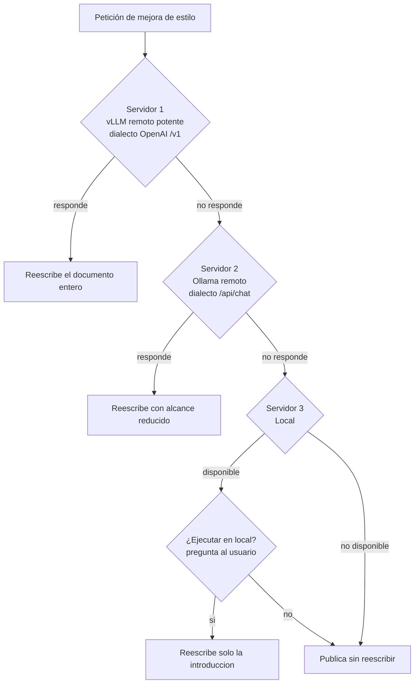

## 🎯 La pregunta está mal planteada

"¿Modelo local o API cloud?" es una pregunta binaria para un problema que no lo es. La respuesta útil casi nunca es una de las dos opciones: es un reparto. Qué peticiones van a dónde, y qué pasa cuando el destino elegido no responde.

Esta guía no compara marcas ni publica una tabla de precios que caducará en tres meses. Hace otra cosa: da los **ejes de decisión con criterio accionable** y documenta una **implementación real de fallback multi-servidor** que vive en este mismo repositorio, en `wordpress_sync.py`.

!!! info "Dónde encaja esta guía"
    - Servir un modelo abierto con throughput alto → [vLLM](vllm.md)
    - Ejecutarlo en tu máquina → [Ollama](ollama_basics.md)
    - Panorama de runtimes y formatos locales → [Ecosistemas locales](local_ecosystems.md)
    - Gateway unificado con routing y fallback gestionado → [LiteLLM](litellm.md)

Los cinco ejes que decides —coste, latencia, privacidad, control y calidad— no tienen el mismo peso en todos los proyectos. Lo que sigue es cómo medir cada uno en lugar de opinar sobre él.

## 💰 Coste: la fórmula, no la intuición

El error clásico es comparar "gratis" contra "0,X € por millón de tokens". El modelo local no es gratis: es **capex amortizado más energía**, y el denominador es el volumen que realmente generas.

### La fórmula

El coste por millón de tokens generados en local es:

```text
coste_local_por_M_tokens =
    ( (precio_hardware / vida_util_meses) + (kWh_mes * precio_kWh) + coste_operacion_mes )
    / (tokens_generados_mes / 1_000_000)
```

Los tres sumandos del numerador son:

| Componente | Cómo obtenerlo |
|---|---|
| Amortización | Precio de compra dividido entre los meses de vida útil que le asignes |
| Energía | Potencia media bajo carga × horas de uso × precio del kWh de tu factura |
| Operación | Horas de mantenimiento al mes × tu coste hora (no lo pongas a cero) |

El denominador es el que la mayoría ignora: **el coste por token es inversamente proporcional al volumen**. La misma máquina que sale carísima con 2 millones de tokens al mes sale ridícula con 800.

### Un ejemplo con supuestos etiquetados

!!! warning "Todos los números de abajo son SUPUESTOS ilustrativos"
    No son precios de mercado ni de ningún proveedor concreto. Los precios de las APIs cambian varias veces al año y cualquier cifra escrita aquí estaría obsoleta antes de que la leas. **Sustituye cada valor por el tuyo** y por la tarifa vigente del proveedor el día que hagas el cálculo.

```text
SUPUESTOS (invéntalos de nuevo con tus datos reales)
  precio_hardware        = 3.000 u.m.
  vida_util_meses        = 36
  potencia_media_carga   = 0,35 kW
  horas_uso_mes          = 200 h
  precio_kWh             = 0,20 u.m./kWh
  coste_operacion_mes    = 100 u.m.   (2 h de mantenimiento a 50 u.m./h)

CÁLCULO
  amortizacion_mes = 3.000 / 36            =  83,33 u.m.
  energia_mes      = 0,35 * 200 * 0,20     =  14,00 u.m.
  operacion_mes    =                          100,00 u.m.
  ------------------------------------------------------
  coste_fijo_mes                           = 197,33 u.m.
```

Ahora el mismo coste fijo repartido entre distintos volúmenes:

```text
ESCENARIO A — volumen bajo
  tokens_mes = 2.000.000
  coste = 197,33 / 2   = 98,67 u.m. por millón de tokens

ESCENARIO B — volumen medio
  tokens_mes = 50.000.000
  coste = 197,33 / 50  =  3,95 u.m. por millón de tokens

ESCENARIO C — volumen alto
  tokens_mes = 500.000.000
  coste = 197,33 / 500 =  0,39 u.m. por millón de tokens
```

La lectura correcta no es "el escenario C gana". Es esta: **el punto de equilibrio existe y sabes calcularlo**. Coge la tarifa por millón de tokens de tu proveedor hoy, ponla en la ecuación y despeja el volumen mensual a partir del cual el local sale más barato:

```text
tokens_equilibrio_mes = (coste_fijo_mes / precio_API_por_M_tokens) * 1.000.000
```

Si tu volumen real está muy por debajo de ese umbral, montar infraestructura de inferencia es una afición, no una decisión económica. Si está muy por encima, seguir pagando por token es una fuga.

### Lo que la fórmula no captura

Tres costes reales que no aparecen en el numerador y conviene anotar aparte:

- **Coste de oportunidad del hardware**: si la máquina ya existe y estaba infrautilizada, la amortización que le imputas es discutible. Si la compras *para esto*, no lo es.
- **Coste de la indisponibilidad**: una API con SLA tiene un valor que tu servidor bajo la mesa no tiene. Cuantifícalo o al menos nómbralo.
- **Coste de los tokens de entrada**: casi todas las APIs cobran entrada y salida a precios distintos, y con prompts largos o RAG la entrada domina la factura. En local, el prompt largo se paga en latencia (prefill), no en dinero.

## ⚡ Latencia: TTFT, tokens/s y el arranque en frío

"Es más rápido" no significa nada sin decir *qué* métrica. Hay dos, y miden cosas distintas:

- **TTFT** (*time to first token*): cuánto tarda en aparecer la primera palabra. Es lo que el usuario percibe como "responde o no responde".
- **Tokens/s** en generación: a qué ritmo sale el resto. Es lo que determina cuánto tarda una respuesta larga en completarse.

### El local pequeño puede ganar en TTFT

Contraintuitivo pero frecuente: **un modelo pequeño en tu propia máquina puede dar un TTFT mejor que una API remota con un modelo enorme**. El motivo no es la potencia, es el presupuesto de tiempo:

```text
TTFT de una API remota =
      latencia de red (ida y vuelta)
    + tiempo en cola del proveedor
    + prefill del prompt en un modelo grande

TTFT de un modelo local pequeño =
      0 de red
    + 0 de cola (eres el único cliente)
    + prefill del prompt en un modelo pequeño
```

Elimina la red y la cola y el local parte con ventaja. En tareas cortas y de baja complejidad —clasificar, extraer un campo, reescribir una frase— esa ventaja es la que se nota, y el modelo grande no aporta lo suficiente para compensarla.

En tokens/s sostenidos, en cambio, la infraestructura del proveedor suele ganar por goleada: hardware dedicado, batching continuo y modelos servidos con motores optimizados. Si generas respuestas largas de forma masiva, mide tokens/s; si generas respuestas cortas e interactivas, mide TTFT.

### El arranque en frío que todo el mundo olvida

Aquí está el coste oculto del local: **cargar los pesos del modelo en memoria**. Un modelo de varios gigabytes tiene que llegar del disco a la RAM o a la VRAM antes de generar el primer token. Ese primer arranque puede costar de segundos a decenas de segundos, según el tamaño del modelo y la velocidad del almacenamiento.

Y no ocurre solo la primera vez:

- Los runtimes suelen **descargar el modelo de memoria** tras un periodo de inactividad para liberar RAM.
- Si alternas entre dos modelos y no caben a la vez, cada cambio es una recarga completa.
- Reiniciar el servicio, actualizar el runtime o reiniciar la máquina reinicia el reloj.

Consecuencia práctica: un benchmark que mide solo la petición número cincuenta miente. Mide la primera también, y decide si tu patrón de uso es de ráfagas espaciadas (donde el arranque en frío domina) o de flujo continuo (donde se amortiza a cero).

!!! tip "Mitigación barata"
    Si tu uso es a ráfagas, mantén el modelo cargado con un *keep-alive* del runtime o con una petición periódica de un token. Gastas un poco de RAM permanentemente a cambio de eliminar el arranque en frío del camino crítico.

## 🔒 Privacidad: qué sale de tu red

Este eje no se negocia por comodidad, y es donde más se confunde una preferencia con una obligación.

### La pregunta operativa

No es "¿confío en el proveedor?". Es: **¿qué bytes exactos cruzan el perímetro de mi red, y qué se puede reconstruir a partir de ellos?**

Con una API cloud sale, como mínimo:

- El prompt completo, incluido todo lo que hayas inyectado en él (fragmentos de RAG, historial de conversación, contenido de ficheros).
- Los metadatos de la petición: cuándo, con qué frecuencia, desde qué identidad de facturación.
- A menudo, la respuesta queda registrada en el lado del proveedor durante una ventana de retención.

Con un modelo local no sale nada de eso. Esa es toda la diferencia, y es enorme cuando el contenido es sensible.

### Cuándo es un requisito legal, no una preferencia

Hay tres situaciones donde "prefiero que no salga" se convierte en "no puede salir":

1. **Datos personales bajo RGPD u otra normativa equivalente.** Enviar datos personales a un tercero requiere base jurídica, un encargado de tratamiento con contrato, y control sobre las transferencias internacionales. No es un checkbox: es documentación que alguien tiene que firmar.
2. **Datos de cliente bajo contrato.** Muchos acuerdos de confidencialidad y de servicio prohíben explícitamente ceder el contenido del cliente a subprocesadores no aprobados. Un proveedor de LLM es un subprocesador. Si no está en la lista, enviarle código o documentos del cliente es un incumplimiento contractual, independientemente de lo buena que sea su política de privacidad.
3. **Sectores regulados.** Sanidad, banca, defensa y administración pública tienen marcos propios que a menudo imponen dónde puede residir y procesarse el dato.

!!! danger "El caso que se cuela siempre"
    Los datos personales rara vez llegan como un campo llamado `dni`. Llegan **incrustados**: en un log que incluye correos de usuario, en un ticket de soporte pegado íntegro, en un fragmento de RAG que arrastró un nombre y una dirección. Si tu pipeline manda contexto sin filtrar a una API, asume que antes o después mandará datos personales. Local, o anonimización real antes de salir.

### La zona gris de la red interna

Un detalle que este repositorio deja escrito en su propio `.env.example`: un servidor de inferencia "propio" al que llamas por `http://` sin cifrar **expone la clave y el contenido a cualquiera que esté en la ruta de red**. "Local" y "privado" no son sinónimos. Si el contenido no es público, usa `https` o una red realmente privada.

## 🎛️ Control: versionado, reproducibilidad y el suelo que se mueve

Con un modelo abierto descargado, tienes un artefacto: unos pesos con un hash, que se comportan igual hoy y dentro de un año. Con una API, tienes un **contrato con un tercero sobre un sistema que él puede cambiar**.

Los tres riesgos concretos:

- **Deprecación.** Un proveedor anuncia el fin de vida de un modelo y tienes una ventana para migrar. Tu evaluación, tus prompts afinados y tus umbrales de calidad se revalidan otra vez.
- **Deriva silenciosa.** El identificador del modelo no cambia, pero el comportamiento sí (nueva versión, cambio en el sistema de moderación, ajuste de parámetros por defecto). Tus prompts empiezan a fallar sin que hayas tocado nada.
- **Cambio de condiciones.** Precios, límites de tasa, políticas de uso y regiones disponibles son unilaterales.

La contramedida no es dejar de usar APIs. Es **no depender de un identificador de modelo como si fuera una constante**:

```python
# Mal: el nombre del modelo, embebido en el código, en veinte sitios.
resp = cliente.chat(model="modelo-generico-v3", messages=mensajes)

# Bien: el modelo es configuración, y el código no sabe cuál es.
#   MODELO=... en el entorno, no en el repositorio
resp = cliente.chat(model=os.getenv("MODELO"), messages=mensajes)
```

Y, sobre todo: **una suite de evaluación que puedas ejecutar contra cualquier candidato**. Sin eso, migrar de modelo es un acto de fe. Con eso, es una tarde. Lo cubre [Evaluación de modelos](model_evaluation.md).

En reproducibilidad, el local gana sin discusión: puedes fijar los pesos, el runtime, la cuantización y la semilla, y archivar todo eso junto al resultado. Si necesitas defender ante un auditor por qué el sistema respondió lo que respondió hace ocho meses, esto deja de ser una preferencia de ingeniería.

## 🧪 Calidad: sé honesto con este eje

Un documento que concluya que lo local siempre gana no sirve para tomar decisiones. La realidad, a día de hoy:

**Los modelos frontera de pago siguen por delante en tareas complejas.** Razonamiento multi-paso, código no trivial con muchas restricciones simultáneas, síntesis de documentos largos manteniendo coherencia, seguimiento fiel de instrucciones con muchas reglas a la vez. En esas tareas, la diferencia no es de matiz: un modelo abierto pequeño falla donde uno frontera acierta.

Este repositorio tiene una prueba empírica de ello, escrita como comentario en el código de `wordpress_sync.py`: al pedirle a un modelo local pequeño que reescribiera un documento entero manteniendo la estructura, **fallaba en el 100 % de los casos**, incluso ocultándole la estructura tras marcadores. La solución no fue insistir: fue **reducir el alcance de la tarea del modelo pequeño** a reescribir solo la introducción, que es donde está el tono y no hay estructura que perder.

Ahí está el criterio accionable, y no es "usa el modelo más grande":

!!! success "Ajusta la tarea al modelo, no al revés"
    Antes de concluir que un modelo local no vale, comprueba si la tarea puede **descomponerse en piezas que sí estén a su alcance**. Muchas tareas que un modelo pequeño falla completas, las resuelve troceadas. Y muchas tareas que parecen difíciles son fáciles con el contexto adecuado.

Dónde el modelo abierto es perfectamente suficiente:

- Clasificación y etiquetado
- Extracción de campos de texto no estructurado
- Reescritura y corrección de estilo en fragmentos cortos
- Resumen de textos de longitud moderada
- Generación de *embeddings* (aquí el local es directamente la opción por defecto)

Dónde conviene el modelo frontera:

- Razonamiento con varios pasos dependientes
- Código con requisitos entrelazados
- Tareas con muchas instrucciones simultáneas que hay que respetar todas
- Cualquier cosa donde el coste de un fallo supere ampliamente el coste de la llamada

## 🖥️ El hardware decide el modelo, no al revés

Un ejemplo concreto y muy común: **un portátil con 18 GB de RAM unificada**.

El techo práctico ahí no son 18 GB de modelo. Hay que descontar el sistema operativo, el navegador, el editor y el margen para el KV cache, que crece con la longitud del contexto. En la práctica, el límite cómodo está en torno a **modelos de unos 10 GB en disco**, lo que en cuantizaciones habituales de 4 bits deja sitio a modelos de un tamaño medio, no a los grandes.

```text
18 GB RAM total
 - 4 a 6 GB   sistema operativo y aplicaciones abiertas
 - margen     KV cache, que crece con el contexto
 ------------------------------------------------
 ~10 GB       techo práctico de pesos del modelo
```

Y la consecuencia importante: si intentas cargar algo mayor, el sistema empieza a paginar a disco y el rendimiento no se degrada suavemente, **se cae por un acantilado**. Pasas de tokens por segundo utilizables a un sistema que no responde.

!!! note "La regla"
    Primero mides tu hardware, después eliges el modelo que cabe con margen, y por último ajustas la tarea a lo que ese modelo sabe hacer. Hacerlo al revés —elegir el modelo que te gustaría usar y luego pelearte con la máquina— es la vía rápida a un sistema lento e inestable. Los detalles de cuantización y tamaños están en [Optimización de modelos](model_optimization.md) y [Ecosistemas locales](local_ecosystems.md).

## 🏗️ Caso práctico: la cadena de fallback de este repositorio

Hasta aquí, ejes. Ahora una implementación real que los aplica todos a la vez.

El script `wordpress_sync.py` de este repositorio publica documentación en WordPress y, con la opción `--enhance`, pide a un LLM que mejore el estilo del texto antes de publicarlo. Ese LLM no es uno: es una **cadena de servidores probados por orden de prioridad**.

### La cadena



Tres niveles, y una decisión distinta en cada uno:

1. **Servidor potente remoto**: un vLLM que habla el dialecto OpenAI. Es el que puede con el documento entero.
2. **Servidor intermedio**: un Ollama remoto, con un modelo más modesto. Alcance reducido.
3. **Local**: último recurso, y el único que **pregunta antes de ejecutarse**.

Y una cuarta rama que casi nunca se implementa y es la más importante: **si no hay nadie, se publica el documento sin reescribir**. La mejora de estilo es opcional; la publicación no. Un fallback que aborta la tarea principal cuando falla la parte opcional está mal diseñado.

## 🔍 Anatomía del código: cuatro funciones

Todo el mecanismo cabe en cuatro funciones pequeñas. Merece la pena verlas porque el patrón es reutilizable tal cual.

### 1. Parsear la configuración

La lista de servidores no está en el código: se lee del entorno, con un formato compacto.

```python
# Servidores de inferencia por orden de prioridad, leídos de .env para no dejar
# ninguna URL de infraestructura en el código. Formato de INFERENCE_SERVERS:
#   url|modelo|clave_opcional ; url|modelo ; ...
# Una URL con /v1 habla el dialecto OpenAI (vLLM); el resto, el de Ollama.
def _parsear_servidores():
    servidores = []
    for entrada in os.getenv('INFERENCE_SERVERS', '').split(';'):
        partes = [p.strip() for p in entrada.split('|')]
        if len(partes) >= 2 and partes[0]:
            servidores.append({
                'url': partes[0].rstrip('/'),
                'modelo': partes[1],
                'clave': os.getenv(partes[2], partes[2]) if len(partes) > 2 and partes[2] else '',
            })
    return servidores
```

Detalle que importa: el tercer campo **no es la clave, es el nombre de la variable de entorno que contiene la clave**. `os.getenv(partes[2], partes[2])` la resuelve. Así el fichero de configuración puede llevar `VLLM_API_KEY` escrito en claro sin que eso sea un secreto, y el secreto vive solo donde debe.

### 2. Comprobar disponibilidad

Antes de mandar un trabajo largo a un servidor, se comprueba que existe. Y el endpoint de comprobación depende del dialecto:

```python
# ¿Responde el servidor? Prueba el endpoint que corresponda a su dialecto.
def servidor_disponible(srv, timeout=8):
    es_openai = '/v1' in srv['url']
    url = f"{srv['url']}/models" if es_openai else f"{srv['url']}/api/tags"
    cabeceras = {'Authorization': f"Bearer {srv['clave']}"} if srv['clave'] else {}
    try:
        return requests.get(url, headers=cabeceras, timeout=timeout).status_code == 200
    except requests.RequestException:
        return False
```

El `timeout=8` es deliberado y corto. Un sondeo de disponibilidad que tarda un minuto en fallar convierte el fallback en algo peor que no tenerlo.

### 3. Resolver el servidor

Aquí está la lógica de prioridad, y la pregunta al usuario:

```python
# Recorre los servidores por prioridad. Si el primero (el potente) no responde,
# avisa y sigue; antes de caer al último (local) pregunta, porque ahí la carga
# la soporta la máquina del usuario.
def resolver_servidor(interactivo=True):
    if not SERVIDORES:
        print('  Aviso: INFERENCE_SERVERS no configurado en .env')
        return None

    for i, srv in enumerate(SERVIDORES):
        es_ultimo_local = 'localhost' in srv['url'] or '127.0.0.1' in srv['url']
        if not servidor_disponible(srv):
            print(f"  Aviso: {srv['url']} no responde.")
            continue
        if es_ultimo_local and i > 0 and interactivo and sys.stdin.isatty():
            if input('  ¿Ejecutar en local? (S/n): ').strip().lower() in ('n', 'no'):
                return None
        return srv

    print('  Ningún servidor de inferencia disponible; se publica sin reescribir.')
    return None
```

Tres decisiones de diseño que conviene copiar:

- **Se resuelve una vez por ejecución**, no por documento. Sondear la cadena entera en cada llamada multiplica la latencia sin aportar nada.
- **`sys.stdin.isatty()`** evita que el script se quede colgado esperando una respuesta cuando corre en CI o en un cron. Sin terminal, no hay pregunta y no hay bloqueo.
- **Devolver `None` es un resultado válido**, no un error. El llamante sabe qué hacer con él: publicar sin reescribir.

### 4. Abstraer el dialecto

Y la llamada real, que es donde se ve lo barata que es la abstracción:

```python
# Una sola llamada de chat, hablando el dialecto que toque.
def chat_inferencia(srv, system_prompt, user_content, timeout=600):
    es_openai = '/v1' in srv['url']
    cabeceras = {'Content-Type': 'application/json'}
    if srv['clave']:
        cabeceras['Authorization'] = f"Bearer {srv['clave']}"
    mensajes = [{'role': 'system', 'content': system_prompt},
                {'role': 'user', 'content': user_content}]

    if es_openai:
        url = f"{srv['url']}/chat/completions"
        payload = {'model': srv['modelo'], 'messages': mensajes, 'max_tokens': 32000}
    else:
        url = f"{srv['url']}/api/chat"
        payload = {'model': srv['modelo'], 'messages': mensajes, 'stream': False}

    resp = requests.post(url, headers=cabeceras, json=payload, timeout=timeout)
    resp.raise_for_status()
    datos = resp.json()
    if es_openai:
        return datos['choices'][0]['message']['content'].strip()
    return datos.get('message', {}).get('content', '').strip()
```

### La heurística del dialecto

El truco entero es una línea: **`'/v1' in srv['url']`**.

| Si la URL contiene | Dialecto | Endpoint de chat | Endpoint de sondeo | Extracción de la respuesta |
|---|---|---|---|---|
| `/v1` | OpenAI (vLLM y compatibles) | `/chat/completions` | `/models` | `choices[0].message.content` |
| cualquier otra cosa | Ollama | `/api/chat` | `/api/tags` | `message.content` |

Es una heurística, no un estándar, y eso es exactamente lo que la hace buena aquí: **la información de qué dialecto habla un servidor ya estaba en su URL**, así que no hace falta un campo de configuración extra que alguien pueda rellenar mal. El formato del cuerpo de mensajes (`role` / `content`) es idéntico en ambos, así que la divergencia se reduce a tres cosas: la ruta, el nombre del parámetro de longitud y la forma de la respuesta.

!!! tip "Cuándo esto deja de bastar"
    Con dos dialectos y cuatro funciones, esto es la solución correcta. Cuando necesites reintentos con *backoff*, límites de tasa por proveedor, contabilidad de coste, caché o media docena de dialectos, el sitio al que mudarse es un gateway hecho: [LiteLLM](litellm.md). No reimplementes eso a mano.

## ❓ Por qué el fallback a local pregunta antes

Es la decisión menos obvia de todo el diseño, y la que más se copia mal.

Cuando el fallback va de un servidor remoto a otro servidor remoto, no hay nada que preguntar: la carga la sigue soportando una máquina que está ahí para eso. Pero **cuando el último eslabón es local, el que paga es el ordenador de quien lanzó el comando**. Y eso cambia la naturaleza del fallback:

- La máquina se queda ocupada durante lo que dure la generación, que con un documento largo son minutos, no segundos.
- La RAM se llena con los pesos del modelo, con el efecto acantilado descrito antes si el usuario tenía otras cosas abiertas.
- Los ventiladores, el consumo y la batería son del usuario.
- Y la calidad será menor que la del servidor que falló, así que puede que ni siquiera valga la pena.

Un fallback silencioso a local es una degradación que el usuario descubre cuando su portátil se vuelve inusable. La pregunta convierte una sorpresa en una elección:

```text
  Aviso: http://tu-servidor:8000/v1 no responde.
  ¿Ejecutar en local? (S/n):
```

El principio general, que vale mucho más allá de los LLMs:

!!! warning "Regla de degradación"
    Un fallback puede ser automático mientras el coste lo siga pagando el mismo que lo pagaba antes. **En cuanto el coste se traslada a otro —la máquina del usuario, su batería, su tiempo, su factura— deja de ser un detalle de implementación y pasa a ser una decisión que le corresponde a él.**

Y la excepción está también en el código: `sys.stdin.isatty()`. Si no hay nadie mirando, no hay a quién preguntar, así que la pregunta se salta y no se ejecuta en local. Preguntar en un contexto sin terminal no es prudente, es colgarse.

## ⚙️ Configuración externalizada en `.env`

La cadena entera se define en una sola variable de entorno. Este es el `.env.example` del repositorio, sin ningún valor real:

```bash
# --- Inferencia para la mejora de estilo con --enhance ---
#
# Lista de servidores por ORDEN DE PRIORIDAD, separados por ';'.
# Formato de cada uno:  url|modelo|nombre_de_variable_con_la_clave
#
#   - Una url que contenga /v1 habla el dialecto OpenAI (vLLM, etc.)
#   - El resto se tratan como Ollama (/api/chat)
#   - El tercer campo es opcional; nombra la variable que guarda la clave,
#     para no escribirla dentro de esta línea
#
# Se prueban en orden: si uno no responde, se pasa al siguiente. Antes de usar
# un servidor local (cuando no es el primero) el script pregunta, porque ahí la
# carga la soporta tu máquina.

VLLM_API_KEY=TU_CLAVE
INFERENCE_SERVERS=https://tu-servidor:8000/v1|tu-modelo-grande|VLLM_API_KEY;https://tu-ollama:11434|tu-modelo-medio;http://localhost:11434|tu-modelo-local
```

Desglosada, la cadena de arriba son tres entradas separadas por `;`:

```text
1)  https://tu-servidor:8000/v1 | tu-modelo-grande | VLLM_API_KEY
       ^ contiene /v1 -> dialecto OpenAI    ^ nombre de la variable, NO la clave

2)  https://tu-ollama:11434 | tu-modelo-medio
       ^ sin /v1 -> dialecto Ollama         ^ sin tercer campo: no necesita clave

3)  http://localhost:11434 | tu-modelo-local
       ^ local -> preguntará antes de usarse
```

!!! danger "Nunca escribas la clave en `INFERENCE_SERVERS`"
    El tercer campo es **el nombre de una variable**, no su valor. Escribir la clave ahí la mete en una línea que se copia, se pega en incidencias y acaba en capturas de pantalla. `VLLM_API_KEY` en esa línea no es un secreto; el secreto vive en su propia variable, y `.env` no se versiona nunca. Comprueba que está en tu `.gitignore` antes de crearlo.

Cambiar la topología entera —añadir un servidor, reordenar prioridades, quitar el local— es editar una línea de texto. Ningún despliegue, ningún cambio de código.

## 🔀 El patrón híbrido como conclusión razonable

Los cinco ejes no apuntan todos al mismo sitio, y por eso la respuesta binaria falla. Puestos juntos:

| Eje | Favorece local cuando | Favorece cloud cuando |
|---|---|---|
| Coste | El volumen mensual supera el punto de equilibrio | El volumen es bajo o muy irregular |
| Latencia | Tareas cortas, TTFT crítico, uso continuo | Respuestas largas, tokens/s sostenidos |
| Privacidad | Hay datos personales, de cliente o regulados | El contenido es público o ya anonimizado |
| Control | Necesitas reproducibilidad o auditoría | Aceptas migrar cuando el proveedor cambie |
| Calidad | La tarea está al alcance de un modelo pequeño | Razonamiento complejo, código difícil |

El reparto que se deduce de la tabla es el mismo que implementa este repositorio:

**Local para el volumen y los datos sensibles. Cloud para lo difícil.**

Traducido a reglas de enrutado concretas:

```text
si el contenido contiene datos personales o de cliente
    -> local, siempre, sin excepción

si la tarea es clasificar, extraer, etiquetar o embeber
    -> local (volumen alto, tarea al alcance de un modelo pequeño)

si la tarea es razonamiento multi-paso o código complejo
    -> cloud (la diferencia de calidad justifica el coste)

si el destino elegido no responde
    -> siguiente de la cadena; y si el siguiente es local, pregunta
```

Lo que hace que el híbrido funcione no es tener las dos opciones disponibles. Es haber decidido **de antemano** qué va a cada sitio, y haber escrito esa decisión en configuración en lugar de dejarla al criterio de quien lanza el comando.

## ✅ Checklist de decisión

Antes de comprometerte con una arquitectura:

- [ ] He calculado el **coste fijo mensual** de la opción local con mis números reales, incluida la operación.
- [ ] He calculado el **volumen de equilibrio** con la tarifa vigente del proveedor, consultada hoy.
- [ ] Sé si mi carga es de **ráfagas** o **continua**, y he medido el arranque en frío en el caso de ráfagas.
- [ ] He medido **TTFT y tokens/s por separado**, no "la latencia".
- [ ] He revisado si mi contenido incluye datos personales o de cliente, **incluidos los incrustados** en logs y contexto de RAG.
- [ ] Si uso una API, tengo el proveedor **aprobado como subprocesador** en los contratos que aplican.
- [ ] Tengo una **suite de evaluación** que puedo ejecutar contra un modelo nuevo el día que el actual desaparezca.
- [ ] He verificado que el modelo local **cabe con margen** en la RAM disponible, contando KV cache.
- [ ] Mi fallback **no aborta la tarea principal** cuando falla la parte opcional.
- [ ] Mi fallback **pregunta** antes de trasladar la carga a la máquina del usuario.
- [ ] Ninguna clave está escrita en el repositorio, y `.env` está en `.gitignore`.

## 🚫 Errores comunes

**Comparar "gratis" con el precio de la API.** El local no es gratis. Si no has puesto la amortización y la operación en la ecuación, no has hecho la comparación.

**Medir la latencia con la petición número cincuenta.** El arranque en frío es real y tu benchmark caliente lo esconde.

**Tratar "local" como sinónimo de "privado".** Un servidor propio por `http://` en una red compartida no protege nada.

**Embeber el identificador del modelo en el código.** El día que el proveedor lo deprece, el cambio será de veinte ficheros en lugar de una variable.

**Concluir que el modelo local no vale sin haber troceado la tarea.** La lección del `wordpress_sync.py` de este repositorio: el documento entero fallaba el 100 % de las veces; la introducción sola funciona.

**Fallback silencioso a local.** El usuario descubre la degradación cuando su portátil deja de responder.

**Un fallback que aborta cuando no queda nadie.** Si la parte que falló era opcional, sigue adelante sin ella.

**Elegir el modelo antes de mirar la RAM.** El hardware decide, y cuando no cabe el rendimiento no baja: se desploma.

## 📚 Siguientes pasos

- [vLLM](vllm.md) — servir modelos abiertos con throughput alto, el primer eslabón de la cadena
- [Ollama](ollama_basics.md) — el eslabón intermedio y el local
- [Ecosistemas locales](local_ecosystems.md) — qué modelos y formatos caben en tu hardware
- [LiteLLM](litellm.md) — el gateway al que mudarte cuando la heurística de dos dialectos se quede corta
- [Evaluación de modelos](model_evaluation.md) — la suite sin la cual migrar de modelo es un acto de fe
- [Optimización de modelos](model_optimization.md) — cuantización y el techo real de tu memoria
