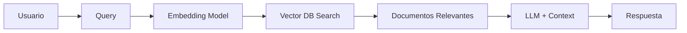

# RAG: Retrieval-Augmented Generation

## Introducción

**RAG (Retrieval-Augmented Generation)** es una técnica que combina modelos de lenguaje grandes (LLMs) con sistemas de recuperación de información para mejorar la precisión y relevancia de las respuestas generadas. En lugar de depender únicamente del conocimiento preentrenado del modelo, RAG permite al LLM acceder a información externa actualizada.

## Arquitectura de RAG



### Componentes Principales

1. **Embedding Model**: Convierte texto en vectores numéricos (embeddings)
2. **Vector Database**: Almacena y busca documentos por similitud semántica
3. **Retriever**: Busca documentos relevantes basándose en la consulta
4. **LLM**: Genera respuesta usando contexto recuperado

## Casos de Uso en DevOps

### 1. Knowledge Base Interna
```python
from langchain.embeddings import OpenAIEmbeddings
from langchain.vectorstores import Chroma
from langchain.llms import Ollama
from langchain.chains import RetrievalQA

# Inicializar embedding model
embeddings = OpenAIEmbeddings()

# Cargar documentos en vector DB
vectorstore = Chroma.from_documents(
    documents=docs,
    embedding=embeddings,
    persist_directory="./chroma_db"
)

# Crear chain RAG
llm = Ollama(model="llama2")
qa_chain = RetrievalQA.from_chain_type(
    llm=llm,
    retriever=vectorstore.as_retriever()
)

# Consultar
response = qa_chain.run("¿Cómo configurar Prometheus en Kubernetes?")
```

### 2. Análisis de Logs
```python
from langchain.document_loaders import DirectoryLoader
from langchain.text_splitter import RecursiveCharacterTextSplitter

# Cargar logs
loader = DirectoryLoader('/var/log/', glob='**/*.log')
documents = loader.load()

# Dividir en chunks
text_splitter = RecursiveCharacterTextSplitter(
    chunk_size=1000,
    chunk_overlap=200
)
chunks = text_splitter.split_documents(documents)

# Crear RAG para análisis
vectorstore = Chroma.from_documents(chunks, embeddings)
```

### 3. Documentación Técnica Asistida
```python
# Cargar documentación de proyectos
from langchain.document_loaders import UnstructuredMarkdownLoader

docs = []
for md_file in ["README.md", "CONTRIBUTING.md", "docs/**/*.md"]:
    loader = UnstructuredMarkdownLoader(md_file)
    docs.extend(loader.load())

# RAG para responder sobre el proyecto
qa = RetrievalQA.from_chain_type(
    llm=Ollama(model="mistral"),
    retriever=Chroma.from_documents(docs, embeddings).as_retriever()
)
```

## Frameworks y Herramientas

### LangChain
Framework más popular para RAG con Python.

**Ventajas:**
- Amplia integración con LLMs y vector DBs
- Componentes modulares (chains, agents)
- Gran comunidad y documentación

**Instalación:**
```bash
pip install langchain chromadb openai
```

### LlamaIndex
Especializado en indexación y consulta de documentos.

**Ventajas:**
- Optimizado para grandes volúmenes de datos
- Indexación eficiente
- Soporte para múltiples backends

**Instalación:**
```bash
pip install llama-index
```

### Haystack
Framework de búsqueda y RAG de Deepset.

**Ventajas:**
- Pipelines flexibles
- Integración con Elasticsearch
- Soporte para semantic search

## Optimización de RAG

### 1. Chunking Strategy
```python
# Estrategia recursiva con overlap
text_splitter = RecursiveCharacterTextSplitter(
    chunk_size=1000,
    chunk_overlap=200,
    separators=["\n\n", "\n", " ", ""]
)
```

### 2. Reranking
```python
from langchain.retrievers import ContextualCompressionRetriever
from langchain.retrievers.document_compressors import LLMChainExtractor

# Usar LLM para reordenar resultados
compressor = LLMChainExtractor.from_llm(llm)
compression_retriever = ContextualCompressionRetriever(
    base_compressor=compressor,
    base_retriever=vectorstore.as_retriever()
)
```

### 3. Hybrid Search
```python
# Combinar búsqueda semántica con keyword search
from langchain.retrievers import BM25Retriever, EnsembleRetriever

bm25_retriever = BM25Retriever.from_documents(docs)
ensemble_retriever = EnsembleRetriever(
    retrievers=[bm25_retriever, vectorstore.as_retriever()],
    weights=[0.3, 0.7]
)
```

## Métricas de Evaluación

### 1. Relevancia de Documentos Recuperados
```python
from langchain.evaluation import RetrievalQAEvalChain

# Evaluar calidad de retrieval
eval_chain = RetrievalQAEvalChain.from_llm(llm)
results = eval_chain.evaluate(
    examples=test_cases,
    predictions=predictions
)
```

### 2. Latencia
```python
import time

start = time.time()
response = qa_chain.run(query)
latency = time.time() - start
print(f"Latencia: {latency:.2f}s")
```

### 3. Costos
```python
from langchain.callbacks import get_openai_callback

with get_openai_callback() as cb:
    response = qa_chain.run(query)
    print(f"Tokens: {cb.total_tokens}")
    print(f"Costo: ${cb.total_cost}")
```

## Arquitectura en Producción

### Docker Compose
```yaml
version: '3.8'
services:
  rag-api:
    image: rag-service:latest
    ports:
      - "8000:8000"
    environment:
      - OLLAMA_HOST=ollama:11434
      - CHROMA_HOST=chromadb:8000
    depends_on:
      - ollama
      - chromadb

  ollama:
    image: ollama/ollama:latest
    ports:
      - "11434:11434"
    volumes:
      - ollama_data:/root/.ollama

  chromadb:
    image: chromadb/chroma:latest
    ports:
      - "8001:8000"
    volumes:
      - chroma_data:/chroma/chroma

volumes:
  ollama_data:
  chroma_data:
```

### Kubernetes Deployment
```yaml
apiVersion: apps/v1
kind: Deployment
metadata:
  name: rag-service
spec:
  replicas: 3
  selector:
    matchLabels:
      app: rag-service
  template:
    metadata:
      labels:
        app: rag-service
    spec:
      containers:
      - name: rag
        image: rag-service:latest
        ports:
        - containerPort: 8000
        env:
        - name: OLLAMA_HOST
          value: "ollama-service:11434"
        - name: CHROMA_HOST
          value: "chroma-service:8000"
        resources:
          requests:
            memory: "2Gi"
            cpu: "1000m"
          limits:
            memory: "4Gi"
            cpu: "2000m"
```

## Mejores Prácticas

### 1. Seguridad
- **Sanitización de inputs**: Validar consultas de usuarios
- **Control de acceso**: Implementar autenticación para RAG API
- **Encriptación**: Proteger datos sensibles en vector DB

### 2. Rendimiento
- **Caché de embeddings**: Evitar recalcular embeddings repetidos
- **Batch processing**: Procesar documentos en lotes
- **Indexación incremental**: Actualizar solo documentos nuevos/modificados

### 3. Monitoreo
```python
from prometheus_client import Counter, Histogram

rag_queries = Counter('rag_queries_total', 'Total RAG queries')
rag_latency = Histogram('rag_query_duration_seconds', 'RAG query duration')

@rag_latency.time()
def query_rag(question):
    rag_queries.inc()
    return qa_chain.run(question)
```

## Troubleshooting

### Problema: Respuestas irrelevantes
**Solución:**
- Ajustar tamaño de chunks
- Mejorar calidad de embeddings
- Usar reranking

### Problema: Alta latencia
**Solución:**
- Implementar caché
- Reducir número de documentos recuperados
- Usar índices aproximados (ANN)

### Problema: Costos elevados
**Solución:**
- Usar modelos locales (Ollama)
- Implementar caché de respuestas
- Optimizar número de tokens en contexto

## Referencias

- [LangChain Documentation](https://python.langchain.com/docs/get_started/introduction)
- [LlamaIndex](https://docs.llamaindex.ai/)
- [RAG Paper - Lewis et al.](https://arxiv.org/abs/2005.11401)
- [Chroma DB](https://www.trychroma.com/)

## Próximos Pasos

- [Vector Databases](vector_databases.md) - Profundizar en bases de datos vectoriales
- [Ollama Basics](ollama_basics.md) - Modelos LLM locales
- [Model Evaluation](model_evaluation.md) - Evaluación de rendimiento
