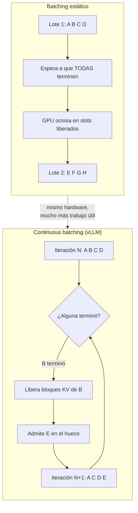

# vLLM: servir LLMs a escala con alto throughput

Tienes un modelo de 8B funcionando en tu portátil con [Ollama](ollama_basics.md). Genial. Ahora te piden servirlo a 300 usuarios concurrentes con SLA de latencia. Ahí es donde el enfoque de escritorio se rompe y aparece vLLM.

vLLM no es "otro runtime de inferencia": es un motor diseñado desde cero para **maximizar el throughput de un servidor GPU**, no para que un modelo quepa en tu Mac. Esta guía cubre el motor: cómo funciona por dentro, cómo instalarlo, cómo tunearlo y cómo medirlo.

!!! info "Dónde encaja esta guía"
    - Inferencia local de un nodo / escritorio → [Ollama](ollama_basics.md), [llama.cpp](llama_cpp.md), [LM Studio](lm_studio.md)
    - Despliegue de vLLM en Kubernetes con auto-scaling → [Despliegue a escala con Kubernetes](despliegue_kubernetes.md)
    - Gateway, routing y fallback por delante de vLLM → [LiteLLM](litellm.md)
    - Teoría general de cuantización → [Optimización de modelos](model_optimization.md)

## 🎯 Qué problema resuelve

La inferencia ingenua (un `model.generate()` por petición, o batching estático) desperdicia GPU de dos formas:

**1. Fragmentación del KV cache.** Cada secuencia en generación necesita guardar las claves y valores de atención de todos los tokens anteriores. El enfoque clásico reserva un bloque contiguo del tamaño de `max_model_len` por petición. Si el modelo admite 32k tokens y la petición usa 500, has reservado 64 veces lo que necesitas. La GPU se queda sin memoria con 4 peticiones en vuelo cuando podría llevar 60.

**2. Batching estático.** Agrupas 8 peticiones, esperas a que **todas** terminen y lanzas el siguiente lote. La petición que genera 20 tokens espera bloqueada a la que genera 800. Durante ese tiempo, esos slots de GPU no hacen nada.

vLLM ataca ambas: **PagedAttention** contra la fragmentación, **continuous batching** contra el desperdicio de slots.

| | Inferencia ingenua | vLLM |
|---|---|---|
| KV cache | Bloque contiguo pre-reservado | Bloques paginados bajo demanda |
| Batching | Estático, espera al lote completo | Continuo, entra/sale por iteración |
| Prompts compartidos | Se recomputan siempre | Prefix caching automático |
| Concurrencia útil | Unidades | Decenas o cientos |
| Caso de uso | Un usuario, un modelo | Servicio multiusuario |

## 🧠 PagedAttention, explicado sin matemáticas

PagedAttention aplica al KV cache la misma idea que la **memoria virtual paginada** de cualquier sistema operativo.

En vez de un bloque contiguo por secuencia, vLLM divide el KV cache en **bloques de tamaño fijo** (`block_size`, típicamente 16 tokens). Cada secuencia mantiene una tabla que mapea sus posiciones lógicas a bloques físicos, que pueden estar dispersos por la VRAM.

Consecuencias prácticas:

- **Sin sobre-reserva**: se asigna un bloque nuevo solo cuando el anterior se llena. El desperdicio máximo es de un bloque parcial por secuencia, no de miles de tokens.
- **Compartición de bloques**: dos peticiones con el mismo system prompt apuntan a los mismos bloques físicos. Esto es la base del *automatic prefix caching* (`--enable-prefix-caching`), que evita recomputar prefijos idénticos.
- **Copy-on-write**: en generación paralela (varias muestras del mismo prompt), los bloques del prompt se comparten y solo se duplican cuando divergen.
- **Preemption**: si falta memoria, vLLM puede desalojar bloques de una secuencia y recomputarla o recuperarla después, en vez de fallar con OOM.



El scheduler de vLLM decide **en cada paso de decodificación** qué peticiones entran en el batch, en función de los bloques KV libres. Una petición que termina libera sus bloques inmediatamente y otra entra en el mismo paso.

!!! tip "La cifra que importa no es tokens/s de una petición"
    En una sola petición secuencial, vLLM no será dramáticamente más rápido que otros runtimes: está limitado por el ancho de banda de memoria igual que todos. La ganancia aparece en **throughput agregado bajo concurrencia**. Mide con carga real, no con un `curl` suelto.

## 📦 Instalación

### Con pip (o uv)

vLLM se distribuye con binarios CUDA precompilados. Requiere Linux, Python 3.9+ y una GPU NVIDIA con capacidad de cómputo 7.0 o superior (V100, T4, A100, L4, H100, RTX 30xx/40xx…).

```bash
# Entorno aislado (recomendado: uv es mucho más rápido resolviendo torch)
uv venv --python 3.12 --seed
source .venv/bin/activate
uv pip install vllm

# Alternativa con pip clásico
python -m venv .venv && source .venv/bin/activate
pip install vllm
```

Verificación:

```bash
vllm --version
nvidia-smi   # confirma driver y VRAM disponible
```

### Con Docker

La imagen oficial `vllm/vllm-openai` ya trae CUDA, PyTorch y vLLM. Es la vía recomendada para producción porque elimina el infierno de versiones de CUDA.

```bash
docker run --runtime nvidia --gpus all \
    -v ~/.cache/huggingface:/root/.cache/huggingface \
    --env "HF_TOKEN=$HF_TOKEN" \
    -p 8000:8000 \
    --ipc=host \
    vllm/vllm-openai:latest \
    --model Qwen/Qwen3-0.6B
```

!!! warning "`--ipc=host` no es opcional"
    vLLM usa memoria compartida entre procesos para el tensor parallelism. Sin `--ipc=host` (o `--shm-size` suficientemente grande), el arranque falla o se cuelga en multi-GPU. Es el error número uno al dockerizar vLLM.

El volumen sobre `~/.cache/huggingface` evita volver a descargar 140 GB de pesos cada vez que reinicias el contenedor. Móntalo siempre.

## 🚀 Servidor OpenAI-compatible

El comando `vllm serve` levanta un servidor HTTP que implementa la API de OpenAI. Cualquier SDK, librería o herramienta que hable con OpenAI funciona contra él cambiando la `base_url`.

```bash
vllm serve NousResearch/Meta-Llama-3-8B-Instruct \
  --dtype auto \
  --api-key token-abc123
```

Petición de prueba:

```bash
curl http://localhost:8000/v1/chat/completions \
  -H "Content-Type: application/json" \
  -H "Authorization: Bearer token-abc123" \
  -d '{
    "model": "NousResearch/Meta-Llama-3-8B-Instruct",
    "messages": [{"role": "user", "content": "Explica PagedAttention en dos frases."}],
    "max_tokens": 200
  }'
```

Desde el SDK de OpenAI:

```python
from openai import OpenAI

client = OpenAI(
    api_key="token-abc123",
    base_url="http://localhost:8000/v1",
)

# El id del modelo lo expone el propio servidor
model = client.models.list().data[0].id

resp = client.chat.completions.create(
    model=model,
    messages=[{"role": "user", "content": "¿Qué es continuous batching?"}],
    stream=True,
)
for chunk in resp:
    print(chunk.choices[0].delta.content or "", end="")
```

Endpoints principales expuestos:

| Endpoint | Uso |
|---|---|
| `/v1/chat/completions` | Chat con plantilla del modelo aplicada |
| `/v1/completions` | Completado crudo, sin plantilla |
| `/v1/models` | Lista el modelo servido y su id |
| `/v1/embeddings` | Si el modelo cargado es de embeddings |
| `/health` | Liveness probe |
| `/metrics` | Métricas Prometheus |

!!! note "Un proceso, un modelo"
    Cada instancia de `vllm serve` sirve **un** modelo. Si necesitas varios modelos tras un único endpoint, con routing, fallback y control de coste, pon [LiteLLM](litellm.md) delante de N instancias de vLLM. Es el patrón estándar.

## 🔗 Tensor parallelism y multi-GPU

Cuando el modelo no cabe en una GPU, se reparte. vLLM implementa el algoritmo de tensor parallel de Megatron-LM.

La regla de decisión según la documentación oficial:

| Situación | Estrategia |
|---|---|
| El modelo cabe en 1 GPU | Sin paralelismo. `tensor_parallel_size=1` |
| No cabe en 1 GPU, sí en 1 nodo | Tensor parallelism: `--tensor-parallel-size = GPUs del nodo` |
| No cabe en 1 nodo | TP + pipeline: `--tensor-parallel-size = GPUs por nodo`, `--pipeline-parallel-size = nº de nodos` |

```bash
# Modelo de 70B repartido en 4 GPUs de un mismo nodo
vllm serve meta-llama/Llama-3.3-70B-Instruct \
  --tensor-parallel-size 4 \
  --dtype auto
```

Y desde la API Python, combinando ambos ejes para 2 nodos de 4 GPUs:

```python
from vllm import LLM

llm = LLM(
    model="meta-llama/Llama-3.3-70B-Instruct",
    tensor_parallel_size=4,     # GPUs por nodo
    pipeline_parallel_size=2,   # número de nodos
)
```

Notas de despliegue:

- El runtime distribuido por defecto es `multiprocessing` nativo de Python en un nodo, y **Ray** en multi-nodo.
- `tensor_parallel_size` debe dividir de forma exacta el número de attention heads del modelo. Un modelo con 32 heads acepta TP de 1, 2, 4, 8, 16 o 32; no acepta 6.
- El tensor parallelism es **sensible al interconnect**: reparte por todas las capas y sincroniza en cada una. Con NVLink escala bien; sobre PCIe el coste de comunicación se nota. Mantén los rangos adyacentes en la misma máquina.
- El pipeline parallelism comunica mucho menos (solo activaciones entre etapas), por eso es el que se usa para cruzar la red entre nodos.

!!! danger "TP no es gratis"
    Duplicar GPUs con TP no duplica el throughput. Añade comunicación colectiva por capa. Úsalo porque el modelo **no cabe**, no como primera palanca de rendimiento. Si el modelo cabe en una GPU, **N réplicas independientes rinden más que una instancia con TP=N**.

## ⚙️ Tuning: memoria, contexto y batching

Estos son los parámetros que de verdad mueven la aguja. Todos existen como flag CLI (`--kebab-case`) y como argumento de `LLM()` (`snake_case`).

### `--gpu-memory-utilization`

Fracción de la VRAM que el ejecutor puede usar, entre 0 y 1. **Valor por defecto: 0.92**.

vLLM arranca, carga los pesos, hace un *profiling run* para medir el pico de activaciones, y **todo lo que sobra hasta ese límite se convierte en bloques de KV cache**. Más KV cache = más peticiones concurrentes.

```bash
# GPU dedicada: exprime la memoria
vllm serve mistralai/Mistral-7B-Instruct-v0.3 --gpu-memory-utilization 0.95

# GPU compartida con otro proceso: deja aire
vllm serve mistralai/Mistral-7B-Instruct-v0.3 --gpu-memory-utilization 0.70
```

!!! warning "Es un límite por instancia, no global"
    Si lanzas dos instancias de vLLM en la misma GPU con 0.9 cada una, cada una cree que puede usar el 90% del total. La segunda muere con OOM. Reparte a mano: 0.45 y 0.45.

Para control determinista existe `--kv-cache-memory`, que fija los bytes exactos de KV cache y **salta el profiling de memoria**, ignorando `gpu_memory_utilization`. El propio log de arranque te sugiere el valor concreto a usar; es la opción para entornos donde la memoria libre inicial varía entre arranques.

### `--max-model-len`

Longitud máxima de contexto (prompt + generación). Por defecto toma la del `config.json` del modelo.

El coste de KV cache crece **linealmente** con esta cifra multiplicada por la concurrencia. Un modelo que anuncia 128k de contexto te obliga a reservar KV para 128k por secuencia si lo dejas al máximo. Si tus prompts reales no pasan de 8k, recórtalo:

```bash
vllm serve meta-llama/Llama-3.1-8B-Instruct --max-model-len 8192
```

Esta suele ser la palanca más efectiva contra un OOM al arrancar, y la que más concurrencia gana. En versiones recientes, `--max-model-len -1` hace que vLLM busque por búsqueda binaria el contexto máximo que cabe en la memoria disponible.

### `--max-num-batched-tokens` y `--max-num-seqs`

Controlan el tamaño del batch por iteración y el número máximo de secuencias concurrentes.

Con chunked prefill, `max_num_batched_tokens` marca el compromiso clásico:

- **Valor bajo** → mejor ITL (inter-token latency): la generación no se ve interrumpida por prefills largos. Streaming más fluido.
- **Valor alto** → mejor TTFT (time to first token) y mejor throughput agregado. La documentación recomienda `> 8192` para maximizar throughput, especialmente con modelos pequeños en GPUs grandes.

```bash
vllm serve meta-llama/Llama-3.1-8B-Instruct --max-num-batched-tokens 16384
```

### `--enable-prefix-caching`

Reutiliza los bloques KV de prefijos idénticos entre peticiones. Si tu carga tiene un system prompt largo y compartido, un few-shot fijo o conversaciones multi-turno, el ahorro en prefill es sustancial y **no altera la salida del modelo**. Actívalo salvo que tus prompts sean completamente disjuntos.

### Cuantización

Reducir la precisión de los pesos baja la VRAM necesaria y suele mejorar el throughput. vLLM carga formatos ya cuantizados desde el Hub:

| Formato | Bits | Cuándo usarlo |
|---|---|---|
| **AWQ** | 4 | Buen equilibrio calidad/tamaño, amplio soporte de checkpoints |
| **GPTQ** | 3-4 | Muy extendido en el Hub, calidad comparable a AWQ |
| **FP8** | 8 | Hopper (H100) y Ada (L40S) con soporte nativo: pérdida de calidad mínima y aceleración real |
| **BitsAndBytes** | 4-8 | Cuantización on-the-fly, cómoda para probar; no la más rápida |

```bash
# Checkpoint AWQ del Hub
vllm serve TheBloke/Mistral-7B-Instruct-v0.2-AWQ --quantization awq

# FP8 en hardware Hopper/Ada
vllm serve meta-llama/Llama-3.1-70B-Instruct --quantization fp8 --tensor-parallel-size 2
```

Independiente de los pesos, puedes cuantizar el **propio KV cache** con `--kv-cache-dtype fp8`. Duplica aproximadamente los tokens que caben en cache, a costa de algo de precisión en la atención. Es la palanca a probar cuando el cuello de botella es contexto largo, no tamaño de modelo.

Los fundamentos de cada método están en [Optimización de modelos](model_optimization.md).

## 📊 Benchmarking

No tunees a ciegas. vLLM trae su propio benchmark en el CLI: `vllm bench` con los subcomandos `serve` (throughput online), `throughput` (offline) y `latency`.

Con el servidor ya levantado en otra terminal:

```bash
vllm bench serve \
  --model meta-llama/Llama-3.1-8B-Instruct \
  --dataset-name random \
  --random-input-len 1024 \
  --random-output-len 256 \
  --num-prompts 500 \
  --request-rate 10 \
  | tee benchmark.log
```

Para saturar deliberadamente y medir el techo del sistema, fija la concurrencia:

```bash
vllm bench serve \
  --base-url http://127.0.0.1:8000 \
  --model meta-llama/Llama-3.1-8B-Instruct \
  --dataset-name random --random-input-len 4000 --random-output-len 200 \
  --max-concurrency 64
```

Métricas a mirar:

| Métrica | Qué te dice |
|---|---|
| **TTFT** (p50/p99) | Latencia percibida al inicio. La sensible al prefill |
| **TPOT / ITL** | Velocidad de generación una vez arrancada |
| **Output tokens/s** | Throughput agregado. La métrica de coste por token |
| **Request throughput** | Peticiones completadas por segundo |

!!! tip "Metodología antes que números"
    Cualquier cifra absoluta que leas depende de GPU, modelo, longitud de prompt, longitud de salida y tasa de llegada. Los benchmarks publicados por el proyecto vLLM y por terceros sitúan la mejora de throughput frente a serving basado en HuggingFace Transformers en **órdenes de magnitud** bajo alta concurrencia; la referencia original es el [paper de PagedAttention (SOSP 2023)](https://arxiv.org/abs/2309.06180) y el [dashboard de benchmarks del proyecto](https://blog.vllm.ai/). No extrapoles esas cifras a tu hardware: **corre `vllm bench serve` con tu distribución real de prompts** y compara configuraciones entre sí, no contra números de un blog.

Procedimiento sensato: fija la carga, varía **un** parámetro cada vez (`max-num-batched-tokens`, luego `max-model-len`, luego cuantización), y quédate con la configuración que cumple tu p99 de TTFT al menor coste por token.

## 🏭 Notas de producción

- **Observabilidad**: `/metrics` expone métricas Prometheus listas para scrapear. Las clave son `vllm:num_requests_running`, `vllm:num_requests_waiting` y `vllm:kv_cache_usage_perc`. Si la cola de espera crece de forma sostenida y el uso de cache está al 100%, necesitas más réplicas, no más tuning.
- **Health checks**: usa `/health` como liveness. Ojo con el readiness: cargar un modelo de 70B puede tardar varios minutos, así que ajusta los `initialDelaySeconds` o usarás un CrashLoopBackOff como método de despliegue.
- **Autenticación**: `--api-key` es un token estático compartido. Para gestión de claves por usuario, cuotas y presupuestos, esa responsabilidad es del gateway ([LiteLLM](litellm.md)).
- **Descarga de pesos**: precarga el modelo en un volumen persistente. Descargar 140 GB en cada arranque de pod es el error más caro y menos interesante que puedes cometer.
- **Escalado horizontal**: vLLM escala replicando instancias tras un balanceador, no haciendo una instancia más grande. El detalle de HPA, probes y node affinity está en [Despliegue a escala con Kubernetes](despliegue_kubernetes.md).

!!! success "Resumen operativo"
    1. Empieza con Docker, `--gpu-memory-utilization 0.90` y `--max-model-len` ajustado a tu caso real.
    2. Activa `--enable-prefix-caching` si compartes system prompts.
    3. Cuantiza (AWQ/GPTQ, o FP8 si tienes Hopper/Ada) antes de añadir GPUs.
    4. Usa tensor parallelism solo cuando el modelo no quepa; si cabe, replica.
    5. Mide con `vllm bench serve` con tu carga real, no con la del blog de otro.

## 🔗 Recursos relacionados

- [Despliegue a escala con Kubernetes](despliegue_kubernetes.md) — HPA, probes y operación de vLLM en clúster
- [LiteLLM (Gateway)](litellm.md) — routing, fallback y control de coste por delante de vLLM
- [Optimización de modelos](model_optimization.md) — fundamentos de cuantización y compresión
- [Ollama](ollama_basics.md) · [llama.cpp](llama_cpp.md) · [LM Studio](lm_studio.md) — inferencia local de un solo nodo
- [Documentación oficial de vLLM](https://docs.vllm.ai/en/stable/)
- [PagedAttention: Efficient Memory Management for LLM Serving (SOSP 2023)](https://arxiv.org/abs/2309.06180)
