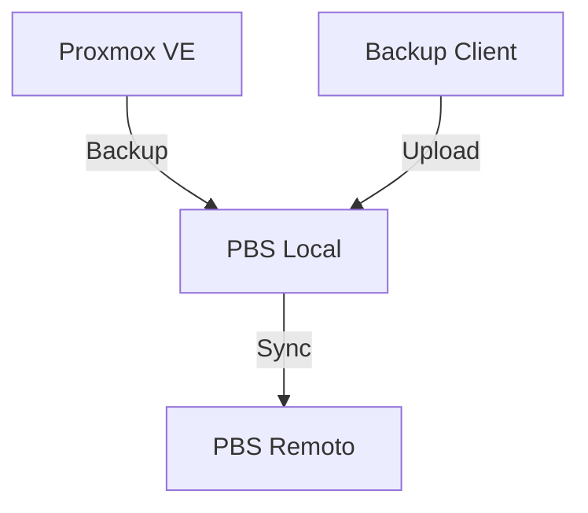

---
tags:
  - backups
  - proxmox
  - pbs
updated: 2026-01-25
---

# Proxmox Backup Server (PBS)

El compañero ideal de Proxmox VE. Permite backups incrementales deduplicados de ultra alta velocidad.

## Instalación

Se puede instalar como ISO independiente o sobre Debian.

```bash
apt update
apt install proxmox-backup-server
```

## Conceptos Clave

- **Datastore:** Donde se guardan los datos (disco dedicado recomendado, ZFS es ideal).
- **Remote:** Otro servidor PBS para replicación (Off-site backup).
- **Prune:** Políticas de retención (ej. mantener últimas 7 diarias, 4 semanales).

## Integración con PVE

En Proxmox VE: `Datacenter -> Storage -> Add -> Proxmox Backup Server`.
Introduce la IP y el `Fingerprint` (copiado del Dashboard de PBS).

## Topología de Ejemplo


