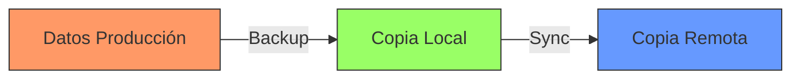

---
tags:
  - backups
  - theory
  - best-practices
updated: 2026-01-25
---

# Estrategia de Backup 3-2-1

Es la regla de oro para la protección de datos.

1.  Mantén **3** copias de tus datos (1 producción + 2 backups).
2.  Almacénalas en **2** tipos de medios diferentes (ej. disco local NAS + cinta/nube).
3.  Mantén **1** copia fuera del sitio (Off-site: Cloud, casa de un amigo, oficina remota).

## Aplicación Práctica

- **Copia 1 (Producción):** Datos en vivo en el servidor (NVMe).
- **Copia 2 (Local):** Backup diario en un NAS local o PBS local (HDD).
- **Copia 3 (Remota):** Sync del NAS a Backblaze B2, AWS S3 o un PBS remoto vía VPN.

## Flujo de Datos

