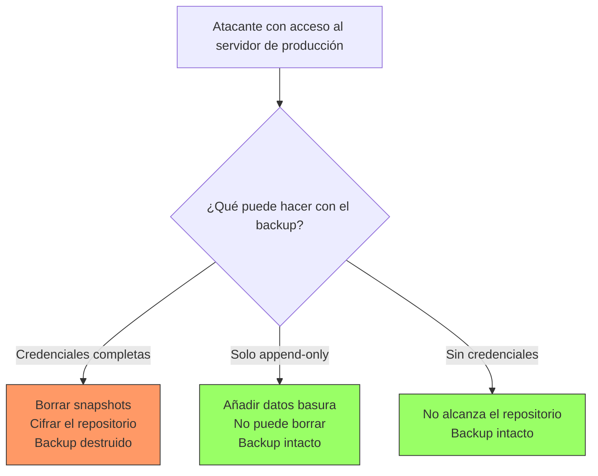
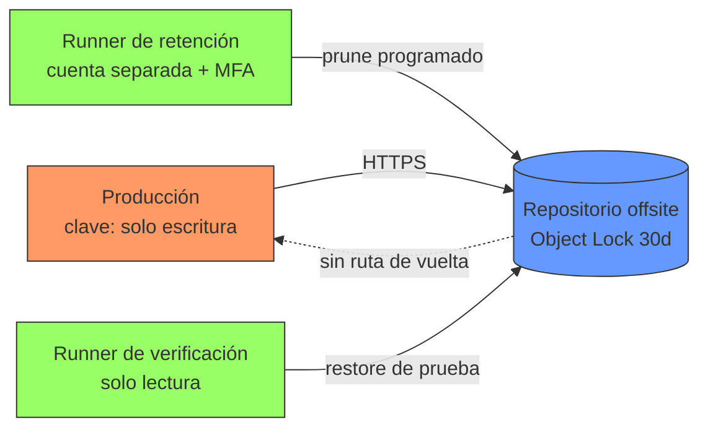

## El backup que no te salva

Casi todo el mundo tiene backups. Muy poca gente tiene backups que sobrevivan a un atacante, y menos aún ha comprobado alguna vez que se pueden restaurar. Son dos problemas distintos y ambos se descubren el mismo día: el peor.

El ransomware moderno no empieza cifrando. Empieza haciendo reconocimiento durante semanas, localiza el repositorio de backup, borra o cifra las copias, **y solo entonces** cifra producción. Un backup accesible con las credenciales del servidor comprometido no es una copia de seguridad: es un directorio más dentro del radio de la explosión.

!!! info "Alcance de esta guía"
    Aquí no se explica cómo usar restic o borg —eso está en [Backups Agnósticos: Restic y Borg](../backups/restic_borg.md)— ni la regla 3-2-1, que está en [Estrategia de Backup 3-2-1](../backups/strategy_321.md). Esta guía cubre la capa que falta encima: **cifrado, inmutabilidad, separación de credenciales y verificación de restauración**.

## Modelo de amenaza del backup

Antes de configurar nada, conviene escribir contra qué te estás defendiendo. Los cuatro escenarios que de verdad importan:



### 1. Ransomware que también cifra los backups

El escenario dominante. El atacante obtiene ejecución en el servidor, lee `/root/.restic-env` o el cron de borg, y usa esas mismas credenciales contra el repositorio. Si el servidor puede escribir y borrar, el ransomware también.

Es el motivo por el que **la inmutabilidad importa más que el cifrado**. Un backup cifrado pero borrable no protege de nada contra ransomware.

### 2. Insider

Un administrador descontento, o una cuenta de administrador comprometida. Tiene credenciales legítimas y sabe dónde está todo. La defensa aquí no es técnica al 100%: es retención inmutable con ventana temporal (nadie, ni el root del repositorio, puede borrar antes de que expire el lock) más alertado sobre operaciones destructivas.

### 3. Robo de credenciales del repositorio

Una clave de API de S3 filtrada en un log, en un `docker inspect`, en una variable de entorno de CI. Distingue dos permisos que se suelen confundir en la misma clave: **escribir** backups y **borrar** backups. Nunca deberían vivir juntos en el host que hace el backup.

### 4. Borrado malicioso o accidental

Un `restic forget --prune` con un filtro mal escrito, un `rm -rf` sobre el datastore, un script de retención con un bug. La mitad de los desastres de backup no tienen atacante: tienen un fallo humano. Las mismas defensas sirven para ambos.

!!! warning "El principio que resume todo"
    **El servidor de producción no debe poder destruir sus propios backups.** Si puede, tus backups tienen exactamente la misma superficie de ataque que los datos que protegen.

## Cifrado: en reposo y en tránsito

### Qué hace restic

restic cifra **siempre**, no es opcional ni configurable. Cada blob se cifra con AES-256 en modo CTR y se autentica con Poly1305-AES. Las claves de cifrado y de MAC se derivan de tu passphrase mediante scrypt y se almacenan dentro del repositorio, cifradas con la clave maestra.

Consecuencia práctica importante: la passphrase no cifra los datos directamente. Cifra la clave maestra. Por eso puedes **añadir varias passphrases al mismo repositorio** sin recifrar nada:

```bash
# Añadir una segunda clave de acceso (p. ej. la de recuperación del responsable)
restic -r s3:s3.eu-west-1.amazonaws.com/mi-bucket key add

# Listar las claves que tienen acceso
restic -r s3:s3.eu-west-1.amazonaws.com/mi-bucket key list

# Revocar una clave concreta por su ID
restic -r s3:s3.eu-west-1.amazonaws.com/mi-bucket key remove <id>
```

Esto es la base de una custodia sensata: una clave para el proceso automático, otra distinta para la recuperación manual, y revocar la del proceso si el servidor se compromete sin perder el acceso.

### Qué hace borg

borg usa AES-256 en modo CTR con autenticación HMAC-SHA256, y ofrece una decisión que restic no te da: **dónde vive la clave**.

```bash
# La clave se guarda DENTRO del repositorio, protegida por la passphrase
borg init --encryption=repokey /ruta/al/repo

# La clave se guarda en ~/.config/borg/keys/ del cliente, NO en el repositorio
borg init --encryption=keyfile /ruta/al/repo
```

- `repokey`: cómodo. Con la passphrase basta para restaurar desde cualquier máquina. Si alguien roba el repositorio, solo le falta la passphrase.
- `keyfile`: más seguro. Quien robe el repositorio no tiene nada que atacar por fuerza bruta, porque el material de clave no está ahí. A cambio, **si pierdes el fichero de clave, el repositorio es ruido aleatorio para siempre**.

Las variantes `repokey-blake2` / `keyfile-blake2` sustituyen HMAC-SHA256 por BLAKE2b, más rápido en CPU sin aceleración SHA.

Exportar la clave es obligatorio con `keyfile`, y muy recomendable también con `repokey`:

```bash
# Exportar a fichero
borg key export /ruta/al/repo /ruta/segura/borg-key-backup

# Exportar como texto imprimible en papel (QR + base64), para caja fuerte
borg key export --paper /ruta/al/repo
```

### En tránsito

El cifrado at-rest de restic y borg es de extremo a extremo: los datos salen ya cifrados del cliente, así que el transporte solo añade una capa. Aun así, no lo dejes en claro:

- **SFTP/SSH**: cifrado por definición. Restringe la clave del cliente en el servidor (más abajo).
- **S3 y compatibles**: usa siempre endpoints HTTPS. Verifica que el cliente no está aceptando certificados inválidos.
- **rest-server**: despliégalo detrás de TLS, nunca en HTTP plano aunque sea "red interna".

!!! danger "Si pierdes la clave, se acabó"
    No hay recuperación, no hay soporte, no hay puerta trasera. El cifrado de restic y borg está diseñado para que nadie —incluido tú— pueda leer el repositorio sin la clave. Un backup de 3 TB sin passphrase son 3 TB de bytes aleatorios.

    Custodia mínima aceptable: (1) la passphrase en un gestor de secretos con backup propio, (2) una copia impresa o en almacenamiento offline en ubicación física distinta, (3) al menos dos personas con acceso. Ver [Gestión de Secretos](gestion_secretos.md).

## Inmutabilidad: la defensa real contra ransomware

Este es el punto que separa un backup de verdad de un directorio con copias. La idea: **el proceso que escribe backups no tiene permiso para borrarlos**.

### borg: `--append-only`

borg lo implementa en el lado servidor, restringiendo la clave SSH del cliente. En el `~/.ssh/authorized_keys` del servidor de backup:

```text
command="borg serve --append-only --restrict-to-path /srv/backups/web01",restrict ssh-ed25519 AAAAC3Nza... web01-backup
```

Desglose de por qué cada parte importa:

- `--append-only`: el cliente puede crear archivos nuevos, pero cualquier operación de borrado se registra en la transacción y **no se aplica** al repositorio real. El repositorio conserva los segmentos originales.
- `--restrict-to-path`: aunque el cliente pida otra ruta, no sale de la suya.
- `restrict`: opción de OpenSSH que desactiva port forwarding, agent forwarding, X11 y asignación de pty. Es un atajo seguro que engloba todos los `no-*-forwarding`.

La operación de `prune` real se ejecuta **desde el servidor de backup**, con una clave distinta, en un momento distinto:

```bash
# En el SERVIDOR de backup, no en el cliente
borg prune --keep-daily=7 --keep-weekly=4 --keep-monthly=6 /srv/backups/web01
borg compact /srv/backups/web01
```

!!! warning "append-only no es magia: revisa el repositorio"
    Con `--append-only`, un cliente comprometido puede seguir escribiendo. Puede llenar el disco con basura o crear archives falsos. Lo que no puede es destruir lo anterior. Monitoriza el crecimiento del repositorio: un salto inexplicable es una señal de compromiso, no una anécdota de disco.

### S3: Object Lock + versionado

En almacenamiento de objetos la inmutabilidad la aplica el proveedor, no tu software. Dos mecanismos que se complementan:

- **Versionado de bucket**: un `DELETE` no borra, crea un *delete marker*. La versión anterior sigue ahí.
- **Object Lock en modo compliance**: durante la ventana de retención **nadie** puede borrar el objeto. Ni el root de la cuenta, ni AWS. En modo `GOVERNANCE` sí se puede saltar con un permiso específico (`s3:BypassGovernanceRetention`), lo que lo hace más flexible y bastante menos útil contra un atacante con privilegios.

```bash
# Object Lock solo se puede activar en la CREACIÓN del bucket
aws s3api create-bucket \
  --bucket backups-inmutables-acme \
  --region eu-west-1 \
  --create-bucket-configuration LocationConstraint=eu-west-1 \
  --object-lock-enabled-for-bucket

# Retención por defecto: 30 días en modo compliance
aws s3api put-object-lock-configuration \
  --bucket backups-inmutables-acme \
  --object-lock-configuration '{
    "ObjectLockEnabled": "Enabled",
    "Rule": {
      "DefaultRetention": {
        "Mode": "COMPLIANCE",
        "Days": 30
      }
    }
  }'
```

!!! danger "COMPLIANCE es irreversible por diseño"
    En modo compliance no se puede acortar la retención ni borrar el objeto antes de tiempo, y seguirás pagando el almacenamiento hasta que expire. Prueba primero con `Days: 1` en un bucket de pruebas. Un error de configuración con `Days: 3650` es una factura de diez años.

### restic: permisos restringidos

restic no tiene un modo append-only propio, así que la restricción se aplica en la capa de almacenamiento. Con S3, una política IAM que permite escribir y leer, pero no borrar:

```json
{
  "Version": "2012-10-17",
  "Statement": [
    {
      "Sid": "ListRepo",
      "Effect": "Allow",
      "Action": ["s3:ListBucket", "s3:GetBucketLocation"],
      "Resource": "arn:aws:s3:::backups-inmutables-acme"
    },
    {
      "Sid": "WriteAndReadOnly",
      "Effect": "Allow",
      "Action": ["s3:PutObject", "s3:GetObject"],
      "Resource": "arn:aws:s3:::backups-inmutables-acme/*"
    },
    {
      "Sid": "DenyAllDeletes",
      "Effect": "Deny",
      "Action": [
        "s3:DeleteObject",
        "s3:DeleteObjectVersion",
        "s3:PutBucketVersioning",
        "s3:PutObjectLockConfiguration"
      ],
      "Resource": [
        "arn:aws:s3:::backups-inmutables-acme",
        "arn:aws:s3:::backups-inmutables-acme/*"
      ]
    }
  ]
}
```

Los `Deny` explícitos sobre `PutBucketVersioning` y `PutObjectLockConfiguration` son tan importantes como el de borrado: sin ellos, un atacante desactiva la protección primero y borra después.

Con esta política, `restic backup` funciona con normalidad y `restic forget --prune` falla. El prune se ejecuta desde otra identidad, con otras credenciales, idealmente desde otra máquina.

Con backend SFTP el equivalente es una cuenta dedicada, `chroot` y un sistema de ficheros o ACL que impida el unlink. Y en ZFS, snapshots del propio datastore con `zfs allow` restringido son una segunda red de seguridad barata.

## Offsite con separación real

"Offsite" no significa "en otro sitio". Significa **fuera del dominio de fallo y fuera del dominio de credenciales**. Un bucket S3 en la misma cuenta AWS que tu producción está geográficamente lejos y administrativamente encima.

La separación mínima que aporta valor:

| Eje | Mal | Bien |
| --- | --- | --- |
| Cuenta | Misma cuenta cloud que producción | Cuenta/proyecto separado, facturación aparte |
| Credenciales | La misma clave escribe y borra | Clave de escritura en el host, clave de borrado solo en el runner de retención |
| Identidad | Mismo IdP y mismos admins | Admins distintos, MFA obligatorio en la cuenta de backup |
| Proveedor | Todo en un único proveedor | Al menos una copia en proveedor distinto |
| Red | El host de backup alcanza producción | Flujo unidireccional: producción escribe, no lee ni lista |



Fíjate en las tres identidades distintas: quien escribe no borra, quien borra no vive en producción, y quien verifica no puede modificar nada. Si comprometen el servidor de producción, solo obtienen la primera.

!!! tip "Pull en lugar de push"
    Cuando la topología lo permite, invierte la dirección: que el servidor de backup se conecte a producción y tire de los datos, en vez de que producción empuje. Así producción **nunca** tiene credenciales del repositorio. Es el modelo de los `Remote` de [PBS](../backups/pbs.md) y el que menos superficie deja.

## Testing de restauración

Aquí es donde falla casi todo el mundo. Un backup que nunca se ha restaurado es una hipótesis, no una copia de seguridad. Los modos de fallo son ridículamente comunes y todos silenciosos:

- El cron lleva ocho meses fallando y nadie lee el correo de `MAILTO`.
- Se respalda `/var/lib/mysql` en caliente: ficheros inconsistentes que no arrancan.
- Se excluyó un directorio "temporal" que resultó tener los uploads de usuarios.
- El repositorio tiene bit rot y solo se detecta al leer los datos.
- La passphrase está en el gestor de secretos que se respaldaba en el mismo servidor caído.

### Verificación de integridad ≠ verificación de restauración

Son dos cosas distintas y hacen falta las dos.

```bash
# restic: verifica estructura y metadatos. Rápido, no lee los datos.
restic -r "$RESTIC_REPOSITORY" check

# restic: lee y descifra TODOS los datos. Lento y con coste de egress, pero es
# lo único que detecta corrupción real en los blobs.
restic -r "$RESTIC_REPOSITORY" check --read-data

# restic: compromiso razonable para ejecutar semanalmente.
# Lee un subconjunto del repositorio, rotando la parte verificada.
restic -r "$RESTIC_REPOSITORY" check --read-data-subset=1/10
```

```bash
# borg: verifica consistencia del repositorio y de los archives
borg check /ruta/al/repo

# borg: solo la estructura del repositorio, sin desempaquetar archives
borg check --repository-only /ruta/al/repo

# borg: verificación completa de los archives (equivalente a --read-data)
borg check --verify-data /ruta/al/repo
```

`check` te dice que los bytes están bien. No te dice que el volcado de PostgreSQL se restaure ni que la aplicación arranque con esos ficheros. Para eso hace falta restaurar de verdad.

### Restore parcial vs completo

Dos ejercicios con propósitos distintos. Los dos hay que hacerlos, con cadencia distinta.

**Restore parcial (semanal, automatizable).** Recuperas un conjunto pequeño y conocido de ficheros y compruebas su contenido. Es barato, rápido y detecta el 80 % de los fallos: cron muerto, exclusiones mal puestas, corrupción en zonas activas.

```bash
# Recuperar solo una ruta concreta del último snapshot
restic -r "$RESTIC_REPOSITORY" restore latest \
  --target /tmp/verify \
  --include /etc/nginx/nginx.conf

# borg: extraer un patrón concreto sin desplegar el archive entero
borg extract --strip-components 1 /ruta/al/repo::web01-2026-07-19 etc/nginx/nginx.conf
```

**Restore completo (trimestral, con testigo).** Levantas la aplicación desde cero en una máquina limpia, con la documentación en la mano y sin acceso al sistema original. Es lo único que valida las partes que nadie prueba nunca: el orden de arranque de los servicios, las dependencias que no estaban en el backup, si alguien recuerda la passphrase y cuánto tarda de verdad.

!!! warning "Restaura sin acceso al original"
    Si durante la prueba puedes consultar el servidor de producción, no estás simulando un desastre: estás copiando. La prueba válida es con producción apagada o inaccesible. Si necesitas mirar el original para completar el restore, tienes un agujero documentado en tu plan.

### Montar en lugar de restaurar

Para inspección rápida sin escribir nada a disco, ambas herramientas exponen el repositorio como sistema de ficheros FUSE:

```bash
# restic
mkdir -p /mnt/restic
restic -r "$RESTIC_REPOSITORY" mount /mnt/restic
# los snapshots aparecen en /mnt/restic/snapshots/

# borg
borg mount /ruta/al/repo::web01-2026-07-19 /mnt/borg
borg umount /mnt/borg
```

Es la forma más rápida de responder a "¿está este fichero en el backup de hace tres semanas?" sin descargar 500 GB.

### Automatizar el test periódico

Un test manual es un test que se deja de hacer en el segundo trimestre. Este script hace lo mínimo que aporta valor real: restaura ficheros centinela, compara su hash contra el original vivo, comprueba que el snapshot no es viejo, y falla ruidosamente.

```bash
#!/usr/bin/env bash
# /usr/local/bin/verify-backup.sh
# Verificación automática de restauración. Falla ruidosamente o no sirve.
set -euo pipefail

export RESTIC_REPOSITORY="s3:s3.eu-west-1.amazonaws.com/backups-inmutables-acme"
export RESTIC_PASSWORD_FILE="/etc/restic/verify.passphrase"
export AWS_SHARED_CREDENTIALS_FILE="/etc/restic/verify-readonly.credentials"

WORKDIR="$(mktemp -d)"
MAX_AGE_HOURS=26
# Ficheros centinela: cambian a menudo y son críticos.
SENTINELS=(
  "/etc/nginx/nginx.conf"
  "/var/backups/postgres/latest.dump"
)

verified=0

cleanup() { rm -rf "$WORKDIR"; }
trap cleanup EXIT

fail() { echo "BACKUP-VERIFY FAIL: $*" >&2; exit 1; }

# 1. ¿Existe un snapshot y es reciente?
last_epoch="$(restic snapshots --latest 1 --json | jq -r '.[0].time' \
  | xargs -I{} date -d {} +%s)" || fail "no se pudo leer el último snapshot"
age_hours=$(( ( $(date +%s) - last_epoch ) / 3600 ))
[ "$age_hours" -le "$MAX_AGE_HOURS" ] \
  || fail "el último snapshot tiene ${age_hours}h (máximo ${MAX_AGE_HOURS}h)"

# 2. Integridad estructural + un décimo de los datos (rota entre ejecuciones).
restic check --read-data-subset=1/10 || fail "restic check detectó corrupción"

# 3. Restaurar los ficheros centinela y comparar hashes con el original vivo.
for f in "${SENTINELS[@]}"; do
  restic restore latest --target "$WORKDIR" --include "$f" \
    || fail "no se pudo restaurar $f"
  [ -s "${WORKDIR}${f}" ] || fail "$f restaurado vacío o ausente"

  if [ -f "$f" ]; then
    orig="$(sha256sum "$f" | cut -d' ' -f1)"
    rest="$(sha256sum "${WORKDIR}${f}" | cut -d' ' -f1)"
    [ "$orig" = "$rest" ] || echo "AVISO: $f difiere del original (cambió tras el backup)"
  fi
  verified=$(( verified + 1 ))
done

# 4. Validación semántica: el dump debe ser restaurable, no solo existir.
dump="${WORKDIR}/var/backups/postgres/latest.dump"
if [ -f "$dump" ]; then
  pg_restore --list "$dump" >/dev/null \
    || fail "el dump de PostgreSQL está corrupto o truncado"
fi

echo "BACKUP-VERIFY OK: snapshot de hace ${age_hours}h, ${verified} centinelas verificados"
```

El paso 4 es el que distingue esta comprobación de una inútil: un fichero de 4 GB puede existir, tener el tamaño correcto y estar truncado por la mitad. `pg_restore --list` lo detecta en segundos sin restaurar nada.

Programación en cron, con salida a un fichero de log que el monitoring vigila:

```cron
# Verificación semanal, lunes a las 04:15
15 4 * * 1 root /usr/local/bin/verify-backup.sh >> /var/log/backup-verify.log 2>&1

# Verificación completa mensual (lenta, con coste de egress)
0 3 1 * * root restic check --read-data >> /var/log/backup-verify.log 2>&1
```

!!! danger "Un cron silencioso es un cron que no existe"
    El fallo más común no es que la verificación falle: es que deje de ejecutarse y nadie se entere. Usa *dead man's switch*: el script hace ping a un endpoint de monitorización al terminar bien, y el sistema alerta cuando ese ping **no llega**. Alertar sobre ausencia, no sobre error. En systemd, `OnFailure=` sobre el `.service` cubre el error; el ping cubre el silencio. Ver [Monitoreo de Seguridad](monitoreo_seguridad.md).

### RTO y RPO: pon un número

Dos métricas que convierten "tenemos backups" en un compromiso verificable.

- **RPO** (*Recovery Point Objective*): cuántos datos puedes perder, medido en tiempo. Lo fija la **frecuencia** del backup. Backup diario a las 03:00 y desastre a las 22:00 = 19 horas de datos perdidos.
- **RTO** (*Recovery Time Objective*): cuánto puedes estar caído. Lo fija el **tiempo real de restauración**, y ese número solo se conoce cronometrando un restore completo.

El RTO es donde saltan las sorpresas. Un repositorio de 2 TB en un almacenamiento de archivo tipo Glacier puede tardar horas solo en estar **disponible**, antes de empezar a descargar. Cronométralo por fases:

| Fase | Ejemplo medido |
| --- | --- |
| Detección del incidente | 20 min |
| Decisión y aprobación | 30 min |
| Aprovisionar hardware/VM | 25 min |
| Disponibilidad del repositorio (rehidratación) | 3 h |
| Descarga y descifrado | 2 h 10 min |
| Arranque de servicios y validación | 40 min |
| **RTO real** | **6 h 45 min** |

Si tu SLA dice 4 horas y tu prueba dice 6 h 45 min, tienes datos para pedir presupuesto: una copia local caliente además de la offsite, o una clase de almacenamiento con recuperación inmediata. Sin la prueba, solo tienes una opinión.

!!! tip "Registra el resultado de cada prueba"
    Fecha, quién la ejecutó, qué se restauró, tiempo de cada fase y qué salió mal. La tercera prueba comparada con la primera es la que demuestra si has mejorado. Además es lo primero que pide cualquier auditoría (ISO 27001, ENS, NIS2).

## Rotación y retención con criterio de seguridad

La retención se suele decidir por coste de disco. Deberías decidirla también por **ventana de detección**: cuánto tiempo puede pasar un compromiso sin que lo notes.

Si un atacante entra en enero y lo detectas en marzo, una retención de 30 días significa que **todos** tus snapshots contienen ya la puerta trasera. La retención debe cubrir tu tiempo medio de detección con margen.

```bash
# restic: política escalonada. Se ejecuta desde la identidad con permiso de borrado.
restic forget \
  --keep-daily 14 \
  --keep-weekly 8 \
  --keep-monthly 12 \
  --keep-yearly 3 \
  --prune
```

```bash
# borg: equivalente, ejecutado en el SERVIDOR de backup
borg prune \
  --keep-daily=14 \
  --keep-weekly=8 \
  --keep-monthly=12 \
  --keep-yearly=3 \
  /srv/backups/web01
borg compact /srv/backups/web01
```

Criterios que conviene aplicar:

- **Prueba siempre con `--dry-run` primero.** `restic forget --dry-run` y `borg prune --dry-run --list` muestran qué se eliminaría. Un filtro mal escrito en producción no tiene deshacer.
- **Separa retención de compliance de retención operativa.** Los snapshots mensuales y anuales suelen tener requisitos legales; los diarios, no. Aplícales políticas y almacenamiento distintos.
- **La retención mínima debe superar la ventana de detección.** Si tu MTTD son 45 días, 30 días de retención no te protege. Guarda al menos un punto de restauración anterior a cualquier compromiso plausible.
- **El `prune` es la operación más peligrosa que ejecutas.** Es la única que borra datos por diseño. Que la ejecute una identidad distinta, con log auditado y alerta si borra más de lo esperado.
- **En repositorios con Object Lock, el prune no libera espacio hasta que expira el lock.** Presupuéstalo: durante la ventana de retención pagas por datos que ya has "borrado".

## Checklist accionable

Cifrado y claves:

- [ ] El repositorio está cifrado (restic siempre; borg con `repokey` o `keyfile`).
- [ ] La passphrase está en un gestor de secretos **y** en almacenamiento offline fuera del sistema respaldado.
- [ ] Existe una segunda clave de acceso (`restic key add` / `borg key export`) en custodia de otra persona.
- [ ] Al menos dos personas pueden acceder al repositorio. El bus factor de un backup es 1 con demasiada frecuencia.
- [ ] Todo el transporte va sobre TLS o SSH. Ningún endpoint HTTP plano.

Inmutabilidad:

- [ ] El host de producción **no puede borrar** del repositorio (append-only, IAM `Deny`, o pull desde el servidor de backup).
- [ ] El bucket tiene versionado y Object Lock, con `Deny` explícito sobre `PutBucketVersioning` y `PutObjectLockConfiguration`.
- [ ] El `prune`/`forget` se ejecuta desde una identidad distinta y una máquina distinta.
- [ ] Se monitoriza el crecimiento anómalo del repositorio.

Offsite:

- [ ] La copia offsite vive en una cuenta separada, con administradores distintos y MFA obligatorio.
- [ ] El flujo es unidireccional: producción escribe, no lista ni borra.
- [ ] Las credenciales offsite no están en ningún backup del propio sistema de producción.

Testing (la parte que se salta todo el mundo):

- [ ] Verificación de integridad automatizada (`restic check --read-data-subset` semanal, `--read-data` completo mensual).
- [ ] Restore parcial automatizado semanal, con comparación de hash y validación semántica del contenido.
- [ ] Restore completo cronometrado, al menos trimestral, **sin acceso al sistema original**.
- [ ] Dead man's switch: alerta cuando la verificación **deja de ejecutarse**, no solo cuando falla.
- [ ] RTO y RPO medidos con números reales de una prueba, no estimados.
- [ ] Resultado de cada prueba registrado con fecha, ejecutor y tiempos por fase.

Retención:

- [ ] La retención mínima supera tu tiempo medio de detección de incidentes.
- [ ] Toda política nueva se prueba con `--dry-run` antes de aplicarse.
- [ ] La documentación de restauración está **fuera** del sistema respaldado y alguien que no la escribió la ha seguido con éxito.

## Recursos relacionados

- [Backups Agnósticos: Restic y Borg](../backups/restic_borg.md) — uso básico de ambas herramientas.
- [Estrategia de Backup 3-2-1](../backups/strategy_321.md) — la regla de las 3 copias.
- [Proxmox Backup Server (PBS)](../backups/pbs.md) — datastores, remotes y prune en PBS.
- [Gestión de Secretos](gestion_secretos.md) — dónde custodiar las passphrases del repositorio.
- [Modelo de Amenazas](modelo_amenazas.md) — metodología para construir el modelo de amenaza.
- [Monitoreo de Seguridad](monitoreo_seguridad.md) — alertado sobre operaciones destructivas y ausencia de señal.
- [Hardening de Servidores Linux](hardening_linux.md) — endurecer el host que ejecuta los backups.

## Referencias

- [restic — documentación oficial](https://restic.readthedocs.io/)
- [BorgBackup — documentación oficial](https://borgbackup.readthedocs.io/)
- [AWS S3 Object Lock](https://docs.aws.amazon.com/AmazonS3/latest/userguide/object-lock.html)
