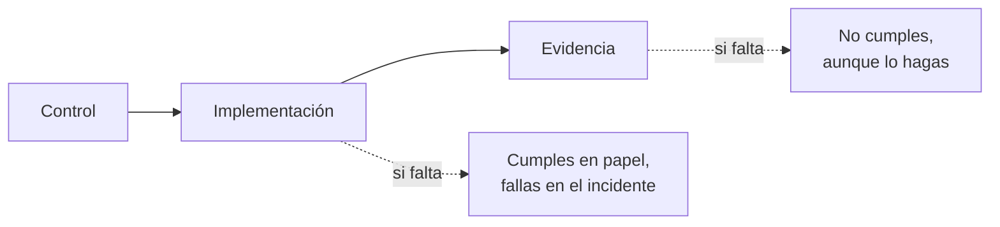

## El problema: nadie te va a preguntar si estás seguro

Te van a preguntar si puedes **demostrarlo**. Y la demostración no es una diapositiva: es un fichero con fecha, generado por un proceso automático, que dice qué estado tenía la máquina X el día Y.

La mayoría de equipos técnicos llegan a la auditoría con la infraestructura razonablemente bien montada y sin ninguna forma de probarlo. Han hecho hardening, escanean vulnerabilidades, rotan secretos. Pero cuando el auditor pide "enséñame el estado de configuración de producción en marzo", la respuesta es un silencio incómodo seguido de un `ssh` en directo. Esta guía cubre esa capa: **cómo se genera y se archiva la evidencia**. No repite lo que ya está en:

- [Hardening de Servidores Linux](hardening_linux.md) — aplicar los controles (Lynis, CIS, auditd básico)
- [Escaneo de Vulnerabilidades](escaneo_vulnerabilidades.md) — Trivy, Grype, Snyk
- [Supply Chain Security](supply_chain_security.md) — SBOMs, firma de artefactos, SLSA
- [CI Security Scanning](ci_security_scanning.md) — integración en pipelines
- [Gestión de Secretos](gestion_secretos.md) — Vault, rotación

!!! warning "Esto no es asesoramiento legal"
    GDPR e ISO 27001 son textos jurídicos y normativos cuya interpretación corresponde a tu DPO, a tu asesoría legal y al auditor certificador. Esta guía traduce **requisitos ya interpretados** a controles técnicos verificables. Si tu duda es qué exige la norma en tu caso concreto, la respuesta no está aquí. Si tu duda es qué comando ejecutar para probar que lo cumples, sí.

## Control, implementación, evidencia

Todo requisito normativo se descompone en tres cosas distintas, y confundirlas es el origen de casi todo el sufrimiento:



Para "el acceso a datos personales debe estar restringido y registrado", la implementación es RBAC, `sudo` con logging y auditd sobre `/var/lib/postgresql`; la evidencia es un export mensual de `ausearch` y un informe OpenSCAP con marca temporal. El auditor evalúa la evidencia, el atacante evalúa la implementación: necesitas ambas, y sólo la primera se puede improvisar (mal) la semana antes.

## GDPR aterrizado en infraestructura

Desde la perspectiva de quien opera servidores, GDPR se reduce a cinco preguntas incómodas.

### 1. ¿Dónde hay datos personales que no sabías que tenías?

Dato personal es cualquier cosa que permita identificar a una persona física, directa o indirectamente. En infraestructura eso incluye sitios donde nadie mira:

| Fuente | Qué contiene | Por qué se olvida |
|---|---|---|
| Logs de acceso (nginx, ALB, CDN) | IPs, User-Agent, cookies de sesión | "Son logs técnicos" |
| Trazas de APM | Emails e IDs en atributos de span | Los mete el SDK sin preguntar |
| Backups y snapshots | Todo producción, congelado | No están en el inventario de apps |
| Colas y topics | Payloads completos, retención de días | Se ven como tránsito, no almacén |
| Logs de error | Parámetros de función, cuerpos de request | Nadie audita lo que imprime un `except` |
| Métricas y staging | `user_id`, copia de producción "para probar" | Retienen meses sin supervisión |

Una IP es dato personal en el contexto habitual de un servicio web, lo que convierte casi cualquier log de acceso en un tratamiento.

```bash
# Inventaría antes de discutir políticas: emails, IPv4 y DNI en logs
grep -rEn -e '[A-Za-z0-9._%+-]+@[A-Za-z0-9.-]+\.[A-Za-z]{2,}' \
  -e '\b([0-9]{1,3}\.){3}[0-9]{1,3}\b' -e '\b[0-9]{8}[A-HJ-NP-TV-Z]\b' \
  /var/log/ 2>/dev/null | head -50

# Snapshots sin etiquetar: los no etiquetados son los peligrosos
aws ec2 describe-snapshots --owner-ids self --output table \
  --query 'Snapshots[?!not_null(Tags)].[SnapshotId,StartTime,VolumeSize]'
```

!!! tip "Etiquetado como control"
    Una etiqueta obligatoria `data-classification: personal|internal|public` impuesta por política en Terraform (ver [Seguridad en IaC](seguridad_iac.md)) convierte el inventario de datos personales en una consulta, no en un proyecto trimestral.

### 2. ¿Guardas más de lo necesario, y más tiempo?

Minimización y limitación del plazo. Traducido: cada campo persistido justifica su existencia, y cada almacén tiene fecha de caducidad **configurada**, no documentada.

```hcl
# La política ES el código. Borrado real, no "archivado indefinido".
resource "aws_s3_bucket_lifecycle_configuration" "logs" {
  bucket = aws_s3_bucket.logs.id
  rule {
    id     = "access-logs-retention"
    status = "Enabled"
    filter { prefix = "access-logs/" }
    transition { days = 30, storage_class = "GLACIER_IR" }
    expiration { days = 180 }   # justificado: análisis de fraude + soporte
    noncurrent_version_expiration { noncurrent_days = 7 }
  }
}
```

El estado de Terraform y la salida de `aws s3api get-bucket-lifecycle-configuration` prueban que la retención se aplica. Un documento que dice "conservamos 180 días" no.

### 3. ¿Puedes borrar a una persona? ¿De verdad?

El derecho de supresión es trivial en la base de datos y brutal en todo lo demás. Un `DELETE` no toca los backups de los últimos N días, los snapshots de volumen, el WAL/binlog, el data warehouse, el índice de Elasticsearch, la caché, ni los logs donde el email aparece 4.000 veces.

**El problema de los backups no tiene solución elegante.** Restaurar, borrar y re-hacer el backup es inviable operativamente. Lo que sí se sostiene: registrar la supresión aparte y re-aplicarla si alguna vez se restaura. La clave es que ese paso esté **probado**, no descrito: un DR test que no aplica los tombstones es un DR test que reintroduce datos borrados.

```sql
-- Tombstone: vive fuera del backup y se re-aplica como paso
-- OBLIGATORIO del runbook de recuperación.
CREATE TABLE erasure_requests (
    subject_hash  TEXT PRIMARY KEY,     -- SHA-256 del identificador, no el dato
    requested_at  TIMESTAMPTZ NOT NULL DEFAULT now(),
    executed_at   TIMESTAMPTZ,
    scopes_done   TEXT[] NOT NULL DEFAULT '{}'
);

-- Control: solicitudes sin completar pasado el plazo interno
SELECT subject_hash, requested_at, scopes_done FROM erasure_requests
WHERE executed_at IS NULL AND requested_at < now() - INTERVAL '30 days';
```

!!! danger "Cifrar no es borrar"
    El *crypto-shredding* (clave por sujeto, destruir la clave para "borrar") es defendible técnicamente, pero su validez legal depende de la jurisdicción y del criterio del regulador. No lo adoptes como estrategia de supresión sin validación de tu DPO.

### 4. ¿Está cifrado, y puedes demostrarlo sin conectarte al servidor?

El cifrado aparece explícitamente como medida técnica ejemplar. Lo que se olvida es que hay que probarlo, con salida guardada y fechada.

```bash
# En reposo: LUKS y volúmenes cloud (esta salida ES la evidencia)
cryptsetup luksDump /dev/sda3 | grep -E 'Cipher|Key|PBKDF'
aws ec2 describe-volumes \
  --query 'Volumes[].{ID:VolumeId,Enc:Encrypted,KMS:KmsKeyId}' --output table

# En tránsito: qué acepta REALMENTE el endpoint, y el TLS hacia la
# base de datos, que es lo que casi nadie comprueba
nmap --script ssl-enum-ciphers -p 443 mi-servicio.example.com
psql "host=db.internal sslmode=verify-full" -c "SHOW ssl;"
```

### 5. Si hay brecha, ¿reconstruyes lo ocurrido en 72 horas?

La notificación a la autoridad de control tiene un plazo de 72 horas desde el conocimiento de la brecha. El plazo no es el problema: el problema es que debe describir naturaleza, categorías y número aproximado de afectados, y medidas adoptadas. Sin telemetría previa, no tienes ninguna de las tres.

| Necesidad en la notificación | Qué lo hace posible | Si falta |
|---|---|---|
| Cuándo empezó | Retención > tiempo típico de detección | "Fecha desconocida" |
| Qué datos se accedieron | auditd sobre rutas de datos, logs de queries | Asumes el peor caso |
| Cuántos sujetos | Correlación log ↔ identificadores | Notificas "todos" |
| Cómo entró y con qué fiabilidad | Logs de auth/red/WAF, envío remoto inmutable | Sin causa raíz, o borrados |

Consecuencia práctica: **el diseño del logging es un control de GDPR**, no una tarea de observabilidad.

### El registro de tratamientos, en formato de ingeniero

La norma exige mantener un registro documental de las actividades de tratamiento. Suele vivir en una hoja de cálculo desactualizada. Vive mejor en el repositorio, junto al código que hace el tratamiento:

```yaml
# processing/analytics-pipeline.yaml
name: Pipeline de analítica de producto
purpose: Medición de uso agregado del producto
legal_basis: interes-legitimo        # validado por DPO, ticket LEGAL-142
data_categories: [identificador_tecnico, datos_de_uso, direccion_ip]
retention: P180D                     # ISO 8601, aplicada en el lifecycle de S3
systems: [s3://ft-analytics-raw, clickhouse://analytics.events]
transfers_outside_eea: false
security_measures: [cifrado-en-reposo, cifrado-en-transito, rbac, auditd]
owner: "@rasty94"
last_reviewed: 2026-07-19
```

Al ser YAML versionado tiene historial, se revisa en PR y se valida en CI: que `retention` case con el lifecycle real, que cada sistema listado exista en el inventario. Un registro que se valida solo es un registro que no se desactualiza.

## ISO 27001: el Anexo A traducido a controles técnicos

El SGSI en una frase: **un sistema donde tú declaras los riesgos que asumes y demuestras que ejecutas los controles que dijiste que ejecutarías.** No hay una lista fija de configuraciones obligatorias; hay dominios de control y la obligación de justificar cuáles aplicas y con qué evidencia.

El auditor no viene a comparar tu `sshd_config` con un baseline suyo. Viene a comprobar tres cosas, en este orden: que existe una decisión documentada sobre ese control, que la implementación coincide con la decisión, y que hay registro de ejecución **continuada**.

Lo tercero es donde se cae todo el mundo. Un informe generado el martes anterior a la auditoría no prueba operación continuada. Doce informes mensuales con marca temporal, sí.

### Gestión de activos

No puedes proteger lo que no está inventariado, y el auditor pedirá el inventario para luego buscar una máquina que no esté en él.

```bash
# Inventario desde el estado real, no desde la wiki
ansible all -i inventory/prod -m setup \
  -a 'filter=ansible_distribution*,ansible_default_ipv4,ansible_product_uuid' \
  --tree /tmp/facts/

# Shadow IT: lo que responde en la red y no está inventariado
nmap -sn 10.0.0.0/16 -oG - | awk '/Up$/{print $2}' | sort > /tmp/vivos.txt
comm -23 /tmp/vivos.txt <(sort inventory/prod-ips.txt)
```

### Control de acceso

El auditor pide: cuentas con privilegio, cuándo se revisaron, y qué pasó con las cuentas de las últimas tres bajas.

```bash
# Cuentas con shell válida y su último acceso
awk -F: '$7 !~ /(nologin|false)$/ {print $1}' /etc/passwd | \
  while read -r u; do printf "%-16s %s\n" "$u" "$(lastlog -u "$u" | tail -1)"; done

# Quién puede escalar a root
grep -rE '^[^#]' /etc/sudoers /etc/sudoers.d/ 2>/dev/null
getent group sudo wheel adm 2>/dev/null

# Kubernetes: quién es cluster-admin de facto
kubectl get clusterrolebindings -o json | jq -r '.items[]
  | select(.roleRef.name=="cluster-admin") | .metadata.name as $n
  | .subjects[]? | "\($n)\t\(.kind)\t\(.name)"'
```

### Operaciones y gestión de cambios

Si ya usas Git y CI, esta evidencia sale casi gratis:

```bash
# Todo cambio en producción vino de un PR aprobado
gh pr list --state merged --limit 200 \
  --json number,mergedAt,author,reviews \
  --jq '.[] | select(.mergedAt >= "2026-01-01") |
        {pr:.number, when:.mergedAt, who:.author.login,
         approvals:[.reviews[]|select(.state=="APPROVED").author.login]|unique}' \
  > /var/evidence/change-management-2026H1.json

# La política, no la costumbre: protección de rama exportada
gh api repos/:owner/:repo/branches/main/protection \
  > /var/evidence/branch-protection-$(date +%F).json
```

### Gestión de incidentes

El auditor pide el registro de incidentes del último año, **incluidos** los cerrados como falso positivo. Un año sin ningún incidente registrado no es buena señal: es señal de que no se registran. Lo mínimo defendible por incidente: detección con timestamp y fuente, clasificación, acciones, resolución y lecciones enlazadas al cambio que las implementó. Si ya escribes post-mortems en el repo, sólo te falta el índice.

!!! info "Declaración de aplicabilidad"
    El documento donde declaras qué controles aplicas y cuáles no, con justificación, es el eje de la certificación. Los "no aplica" son legítimos si están razonados. Lo que no es legítimo es declarar aplicable un control y no tener evidencia de ejecución.

## OpenSCAP: el escáner que habla el idioma del auditor

Lynis da recomendaciones. OpenSCAP da un **resultado por regla contra un perfil nombrado**, en formato estándar (XCCDF/OVAL/ARF) que el auditor reconoce y que es comparable entre fechas. Esa diferencia lo es todo.

```bash
# RHEL / Rocky / AlmaLinux / Fedora
dnf install -y openscap-scanner scap-security-guide

# Debian / Ubuntu
apt install -y openscap-scanner ssg-base ssg-debderived ssg-applications

oscap --version
ls -1 /usr/share/xml/scap/ssg/content/
```

Los ficheros relevantes son los *datastreams*, `ssg-<plataforma>-ds.xml`: el paquete completo (reglas, checks OVAL, remediaciones) para una distribución concreta. Usar el de otra distribución produce resultados sin sentido.

### Ver qué perfiles hay disponibles

```bash
DS=/usr/share/xml/scap/ssg/content/ssg-rhel9-ds.xml
oscap info "$DS"    # perfiles, benchmarks y componentes del datastream

# Descripción detallada de un perfil antes de aplicarlo
oscap info --profile xccdf_org.ssgproject.content_profile_cis "$DS"
```

| Perfil (sufijo del ID) | Origen | Cuándo tiene sentido |
|---|---|---|
| `standard` | Baseline genérico ligero | Punto de partida, poco disruptivo |
| `cis` / `cis_server_l1` | CIS Benchmark nivel 1 | Servidores generales, buen equilibrio |
| `cis_server_l2` | CIS nivel 2 | Entornos sensibles, rompe cosas |
| `pci-dss` | Requisitos de tarjetas de pago | Si procesas pagos |
| `stig` | Departamento de Defensa de EEUU | Muy estricto, contratos públicos |
| `anssi_bp28_*` | Agencia francesa, minimal→high | Alternativa europea bien mantenida |

No existe un perfil "GDPR" ni uno "ISO 27001", y desconfía de quien te venda uno. Lo que se hace es elegir un perfil técnico (habitualmente CIS o ANSSI) y **mapear** sus reglas a los controles que declaraste. El mapeo es tuyo; el escaneo es de OpenSCAP.

### Escanear un host

```bash
DS=/usr/share/xml/scap/ssg/content/ssg-rhel9-ds.xml
PROFILE=xccdf_org.ssgproject.content_profile_cis
STAMP=$(date -u +%Y%m%dT%H%M%SZ)
HOST=$(hostname -f)
OUT=/var/evidence/openscap
mkdir -p "$OUT"

oscap xccdf eval \
  --profile "$PROFILE" \
  --results     "$OUT/${HOST}-${STAMP}-results.xml" \
  --results-arf "$OUT/${HOST}-${STAMP}-arf.xml" \
  --report      "$OUT/${HOST}-${STAMP}-report.html" \
  --oval-results \
  "$DS"
```

Detalles que importan:

- **Código de salida**: `0` = todas las reglas pasaron, `1` = error de ejecución, `2` = al menos una regla falló. En CI, `2` es un resultado normal, no un fallo del job.
- `--results-arf` genera el **Asset Reporting Format**: resultados más información del activo escaneado, autocontenido. Es lo que quieres archivar.
- `--report` produce el HTML navegable con descripción, causa del fallo y remediación sugerida: lo que enseñas a un humano, regenerable después desde el XML.

```bash
R="$OUT/${HOST}-${STAMP}-results.xml"

# Regenerar el HTML desde resultados archivados
oscap xccdf generate report "$R" > /tmp/report.html

# Extraer sólo lo que falló, para abrir tickets
xmllint --xpath '//*[local-name()="rule-result"][*[local-name()="result"]="fail"]/@idref' \
  "$R" 2>/dev/null | tr ' ' '\n' | sed 's/idref=//;s/"//g' | grep -v '^$'
```

Para hosts remotos, `oscap-ssh root@app-01.internal 22 xccdf eval ...` acepta los mismos argumentos sin instalar nada extra en el destino, y `oscap-podman <imagen> xccdf eval ...` escanea una imagen de contenedor.

!!! warning "Escanear una imagen no es escanear el runtime"
    `oscap-podman` inspecciona el sistema de ficheros de la imagen: no ve kernel, sysctl ni systemd, porque el contenedor no los tiene. Muchas reglas de un perfil de host salen `notapplicable` sobre una imagen, y eso es correcto. Para runtime, ver [Seguridad en Kubernetes](kubernetes_security.md) y [Trivy Operator](trivy_operator.md).

### Remediación: automática y en Ansible

```bash
# Modo 1: remediar en caliente durante el escaneo.
# Aplica los scripts de fix INMEDIATAMENTE sobre el sistema.
oscap xccdf eval \
  --profile xccdf_org.ssgproject.content_profile_cis \
  --remediate \
  --results /tmp/post-remediation.xml \
  --report  /tmp/post-remediation.html \
  "$DS"
```

!!! danger "`--remediate` cambia el sistema sin preguntar"
    Puede endurecer SSH y dejarte fuera, deshabilitar servicios en uso, cambiar permisos o modificar módulos del kernel. **Nunca en producción sin ensayo previo.** Prueba en una VM desechable idéntica, revisa el diff, y ten consola fuera de banda.

```bash
# Modo 2 (recomendado): generar Ansible y revisarlo antes de aplicar.
# Desde el PERFIL: remedia todas las reglas del perfil.
oscap xccdf generate fix --fix-type ansible \
  --profile xccdf_org.ssgproject.content_profile_cis \
  --output /tmp/remediate-cis.yml "$DS"

# Desde unos RESULTADOS: sólo lo que falló en ESTE host. Mucho más quirúrgico.
oscap xccdf generate fix --fix-type ansible --result-id "" \
  --output /tmp/remediate-only-failed.yml \
  /var/evidence/openscap/app-01-20260719T101500Z-results.xml

# También como script de shell (--fix-type bash), si no usas Ansible
```

El playbook generado es legible y cada tarea lleva las etiquetas de la regla que la origina. Ese es el punto: puedes filtrar.

```bash
# Ver qué haría, sin hacerlo, y sólo un subconjunto por tags
ansible-playbook -i inventory/prod /tmp/remediate-cis.yml \
  --tags "sshd,accounts" --check --diff

# Excluir lo que ya sabes que rompe tu entorno
ansible-playbook -i inventory/prod /tmp/remediate-cis.yml \
  --skip-tags "package_rsyslog_removed,service_autofs_disabled"
```

Flujo que funciona: escanear → generar playbook desde resultados → revisar en PR → `--check --diff` en staging → aplicar → **re-escanear** → archivar. El re-escaneo posterior es la evidencia de que la remediación funcionó, y es el paso que más se olvida.

### Tailoring: documentar excepciones sin mentir

Habrá reglas que no puedes cumplir por razones legítimas de negocio. La respuesta correcta no es ignorar el fallo, sino declarar la excepción en un fichero de tailoring que se aplica al escaneo y deja constancia.

```bash
oscap xccdf eval \
  --tailoring-file /etc/scap/tailoring-frikiteam.xml \
  --profile xccdf_org.ssgproject.content_profile_cis_customized \
  --results /tmp/results-tailored.xml \
  --report  /tmp/report-tailored.html \
  "$DS"
```

Un auditor acepta "esta regla está desactivada porque X, aprobado por Y el día Z"; no acepta un informe con 40 fallos y un encogimiento de hombros.

## OpenSCAP vs Lynis vs CIS-CAT

| | OpenSCAP | Lynis | CIS-CAT |
|---|---|---|---|
| Licencia | Libre | Libre (Pro de pago) | Comercial, Lite limitado |
| Salida | XCCDF/OVAL/ARF estándar | Texto + log | HTML/CSV/JSON propietario |
| Perfiles | CIS, STIG, PCI-DSS, ANSSI, OSPP | Heurística propia | CIS Benchmarks oficiales |
| Remediación | Automática + Ansible/bash generados | Sólo sugiere | Build Kits (Pro) |
| Comparabilidad entre fechas | Excelente | Pobre | Buena |
| Plataformas | Linux, algo de Windows | Linux/macOS/BSD | Muy amplia, incluye Windows |
| Reconocimiento en auditoría | Alto (estándar SCAP) | Bajo | Alto |

Usa **OpenSCAP** cuando necesitas evidencia archivable, comparable y con un nombre de perfil que el auditor reconozca: es el que va en el pipeline de cumplimiento y en la certificación. Usa **Lynis** para una foto rápida y accionable de una máquina, o para detectar lo que los benchmarks no cubren; es la herramienta del día a día del sysadmin, ya cubierta en [Hardening Linux](hardening_linux.md). Usa **CIS-CAT** si ya pagas la membresía CIS, necesitas cubrir Windows con la misma herramienta, o el requisito contractual dice literalmente "CIS-CAT".

No son excluyentes. Lo sensato: Lynis semanal para ruido operativo, OpenSCAP mensual para el expediente.

## Compliance as code: que la evidencia se genere sola

La regla que resume todo esto: **si un humano tiene que acordarse de generar la evidencia, no existirá cuando la pidan.**


```yaml
# .github/workflows/compliance-scan.yml
name: Compliance scan
on:
  schedule:
    - cron: '0 3 1 * *'    # día 1 de cada mes, 03:00 UTC
  workflow_dispatch:

permissions: { contents: read, id-token: write }   # OIDC, sin claves estáticas

jobs:
  openscap:
    runs-on: ubuntu-latest
    strategy:
      fail-fast: false
      matrix: { host: [app-01, app-02, db-01] }
    steps:
      - run: sudo apt-get update && sudo apt-get install -y openscap-scanner ssg-debderived
      - name: Escanear y archivar ${{ matrix.host }}
        run: |
          STAMP=$(date -u +%Y%m%dT%H%M%SZ)
          set +e
          oscap-ssh ci@${{ matrix.host }}.internal 22 xccdf eval \
            --profile xccdf_org.ssgproject.content_profile_cis \
            --results-arf "arf-${{ matrix.host }}-$STAMP.xml" \
            --report      "report-${{ matrix.host }}-$STAMP.html" \
            /usr/share/xml/scap/ssg/content/ssg-debian12-ds.xml
          rc=$?
          # 0 = todo pasa, 2 = alguna regla falla (esperado), 1 = error real
          [ "$rc" -eq 1 ] && exit 1
          aws s3 cp "arf-${{ matrix.host }}-$STAMP.xml" \
            "s3://ft-compliance-evidence/openscap/$(date -u +%Y/%m)/"
```


La pieza crítica no es el escaneo: es el destino.

```hcl
# Evidencia WORM: ni el CI ni un administrador comprometido
# pueden reescribir el histórico.
resource "aws_s3_bucket" "evidence" {
  bucket              = "ft-compliance-evidence"
  object_lock_enabled = true
}

resource "aws_s3_bucket_object_lock_configuration" "evidence" {
  bucket = aws_s3_bucket.evidence.id
  rule {
    default_retention { mode = "COMPLIANCE", days = 1095 }  # 3 años
  }
}
```

`COMPLIANCE` frente a `GOVERNANCE`: el segundo permite que un usuario con permisos suficientes quite el bloqueo, lo que anula el propósito. Si el auditor pregunta "¿podrías haber modificado esto?", la respuesta debe ser demostrablemente no.

Para reforzar la fecha, un sello de tiempo criptográfico RFC 3161 sobre el informe. Y con los XML archivados, extraer una métrica es trivial: cambia la conversación de "creo que estamos bien" a un número.

```bash
# Sello de tiempo verificable de una TSA pública
REPORT=/var/evidence/openscap/app-01-20260719T101500Z-arf.xml
openssl ts -query -data "$REPORT" -sha256 -cert -out "$REPORT.tsq"
curl -s -H 'Content-Type: application/timestamp-query' \
  --data-binary "@$REPORT.tsq" https://freetsa.org/tsr > "$REPORT.tsr"
openssl ts -verify -data "$REPORT" -in "$REPORT.tsr" -CAfile tsa-cacert.pem

# Porcentaje de reglas superadas por host, desde los ARF archivados
for f in /var/evidence/openscap/*-arf.xml; do
  pass=$(grep -c '<result>pass</result>' "$f")
  total=$((pass + $(grep -c '<result>fail</result>' "$f")))
  [ "$total" -gt 0 ] && printf '%s\t%d%%\n' "$(basename "$f")" $((pass * 100 / total))
done | sort
```

Si ya usas Sigstore para la cadena de suministro, firmar los informes con `cosign` reutiliza infraestructura existente y deja registro en el log de transparencia (ver [Supply Chain Security](supply_chain_security.md)). Exporta la métrica a Prometheus con el textfile collector del node_exporter: una gráfica de cumplimiento subiendo durante doce meses convence más que cualquier documento.

## Auditoría de accesos: quién tocó qué, y que no se pueda borrar

Los logs de aplicación dicen qué hizo la aplicación; auditd dice qué hizo la persona, que es lo que hace falta para responder "¿quién accedió a estos datos?". La instalación básica está en [Hardening Linux](hardening_linux.md); aquí van las reglas orientadas a demostrar acceso a datos.

```bash
# /etc/audit/rules.d/50-compliance.rules
# Las claves (-k) son lo que hace usable a ausearch después.

# Acceso a directorios con datos personales
-w /var/lib/postgresql/ -p rwa -k data-access
-w /srv/uploads/        -p rwa -k data-access
-w /var/backups/        -p rwa -k backup-access

# Identidad y autorización
-w /etc/passwd     -p wa -k identity
-w /etc/shadow     -p wa -k identity
-w /etc/sudoers    -p wa -k privilege-change
-w /etc/sudoers.d/ -p wa -k privilege-change

# Uso efectivo de privilegios y exfiltración
-a always,exit -F arch=b64 -S execve -F euid=0 -F auid>=1000 -F auid!=4294967295 -k root-exec
-a always,exit -F arch=b64 -S mount -F auid>=1000 -F auid!=4294967295 -k mount
-w /usr/bin/scp   -p x -k data-transfer
-w /usr/bin/rsync -p x -k data-transfer

# Manipulación del registro: lo primero que mira un forense
-w /var/log/audit/ -p wa -k audit-tamper

# Reglas inmutables hasta el próximo reinicio. DEBE SER LA ÚLTIMA LÍNEA.
-e 2
```

Consultar es donde auditd pasa de ruido a evidencia:

```bash
augenrules --load
auditctl -s          # 'enabled 2' confirma modo inmutable

# Todo acceso a datos en un rango, formato legible
ausearch -k data-access -ts 2026-07-01 -te 2026-07-31 -i

# Quién ejecutó como root, con el usuario ORIGINAL (auid), no el efectivo
ausearch -k root-exec -ts today -i | grep -oP 'AUID="\K[^"]+' | sort | uniq -c | sort -rn

# Resumen mensual para el expediente
aureport --start 07/01/2026 --end 07/31/2026 --summary -i \
  > /var/evidence/auditd/summary-2026-07.txt
```

!!! warning "auditd local no es evidencia suficiente por sí solo"
    Quien tenga root puede parar el demonio o borrar `/var/log/audit/`. `-e 2` protege las reglas, no los ficheros ya escritos. La evidencia sólida exige que los eventos **salgan de la máquina en tiempo real**.

```bash
# /etc/rsyslog.d/60-audit-forward.conf
# Reenvío a colector remoto con TLS y cola en disco (no perder eventos si cae)
module(load="imfile")
input(type="imfile" File="/var/log/audit/audit.log"
      Tag="auditd" Severity="info" Facility="local6")

global(DefaultNetstreamDriver="gtls"
       DefaultNetstreamDriverCAFile="/etc/ssl/certs/collector-ca.pem")

action(type="omfwd" Target="logs.internal" Port="6514" Protocol="tcp"
       StreamDriverMode="1" StreamDriverAuthMode="x509/name"
       StreamDriverPermittedPeers="logs.internal"
       queue.type="LinkedList" queue.filename="fwd-audit"
       queue.maxdiskspace="1g" queue.saveOnShutdown="on"
       action.resumeRetryCount="-1")
```

El colector debe vivir en una cuenta o red donde los administradores de los hosts **no** tengan permiso de borrado. Esa separación es el control real; el resto es configuración.

## Retención de logs: dos relojes que no marcan lo mismo

Hay un conflicto genuino aquí y conviene resolverlo explícitamente:

- **Técnico**: guardar mucho es caro y, pasado cierto punto, inútil. Casi todo el valor operativo está en las primeras 72 horas.
- **Legal**: los logs con datos personales están sujetos a limitación de plazo. Guardarlos indefinidamente "por si acaso" es lo contrario de la minimización.
- **Forense**: el tiempo medio de detección de una intrusión se mide en meses. Un log de 30 días no sirve para investigar una brecha detectada el día 90.

La solución no es un número único, es segmentar por tipo de log. Los plazos concretos dependen de tu base jurídica y del criterio de tu asesoría: la tabla es una estructura de decisión, no una prescripción.

| Tipo de log | ¿Datos personales? | Retención típica | Qué manda |
|---|---|---|---|
| Debug de aplicación | Frecuente, sin querer | 7 días | Técnico |
| Acceso HTTP (con IP) | Sí | 30–90 días, IP anonimizada | Legal |
| Autenticación y auditd | Sí | 12–24 meses | Forense y auditoría |
| Cambios (Git, CI) | No | Indefinido | Auditoría |
| Informes de cumplimiento | No | Ciclo de certificación + margen | Auditoría |
| Métricas agregadas | No | 13 meses | Técnico |

```yaml
# Retención por clase de log, aplicada en el gestor de logs (Loki).
# No hay retención "por si acaso": hay retención por stream.
limits_config: { retention_period: 720h }   # 30 días, suelo global
overrides:
  "app-debug":   { retention_period: 168h }    # 7 días
  "http-access": { retention_period: 2160h }   # 90 días
  "auth":        { retention_period: 8760h }   # 12 meses
  "auditd":      { retention_period: 17520h }  # 24 meses
compactor: { retention_enabled: true, delete_request_store: s3 }
```

```bash
# Verificar que se aplica de verdad. El fallo clásico: política configurada,
# compactor sin arrancar, datos de hace tres años intactos en el bucket.
aws s3 ls s3://ft-loki-chunks/ --recursive | awk '{print $1}' | sort | head -1
journalctl --disk-usage && journalctl --vacuum-time=90d
```

## Errores comunes

**Confundir cumplir con estar seguro.** Un sistema puede pasar el 100% de un perfil CIS y ser trivialmente vulnerable a una inyección SQL. El cumplimiento cubre configuración de plataforma; no cubre lógica de negocio ni diseño, que es donde vive la mayoría de las brechas reales. El informe es un suelo, nunca un techo.

**Generar toda la evidencia la semana de la auditoría.** Un auditor competente lo detecta en treinta segundos: todos los ficheros con fecha del mismo martes. Y con razón, porque lo que se evalúa es la operación del control durante el periodo. Doce informes mensuales imperfectos valen más que uno perfecto y reciente.

**Políticas que nadie ejecuta.** El documento dice que las claves SSH se rotan cada 90 días. Nadie las ha rotado nunca. Es peor que no tener la política: has documentado un incumplimiento y se lo has entregado al auditor por escrito. Si no vas a ejecutarlo, no lo declares; si lo declaras, automatízalo.

**Escanear sin remediar.** Doce informes mensuales sin acción demuestran, con marca temporal, que conocías el problema y no actuaste. La evidencia corta en las dos direcciones. Y las excepciones sin fecha de caducidad se vuelven permanentes en semanas: toda excepción necesita expiración y responsable, y el CI puede fallar cuando expire. Ojo también con el datastream equivocado: el perfil de RHEL 9 contra un Debian 12 produce un informe lleno de `notapplicable` y `error` que parece un desastre y no significa nada.

**No probar la restauración.** Un backup cifrado y con retención impecable del que nadie ha restaurado nunca no es un control, es una suposición. Y si la restauración no aplica los tombstones, reintroduce datos que debían estar borrados.

**Guardar la evidencia donde el administrador puede borrarla.** Si quien gestiona los servidores puede modificar los informes sobre esos servidores, la evidencia no vale nada frente a un insider.

## Checklist de preparación para auditoría

Con tres meses de antelación mínimo. Si estás a dos semanas, prioriza generar histórico real desde ya: es lo único que no se puede fabricar.

**Inventario, configuración y hardening**

- [ ] Inventario de activos generado automáticamente, con fecha de última ejecución
- [ ] Diagrama de flujos de datos personales, incluyendo backups, colas y terceros
- [ ] Registro de tratamientos versionado y revisado en los últimos 12 meses
- [ ] Perfil OpenSCAP elegido, justificado y aplicado a todo el alcance
- [ ] Fichero de tailoring con las excepciones documentadas, aprobadas y fechadas
- [ ] Al menos 6 informes OpenSCAP mensuales archivados con marca temporal
- [ ] Los hallazgos abiertos tienen ticket, responsable y fecha objetivo

**Accesos**

- [ ] Revisión de accesos privilegiados ejecutada y firmada en el periodo
- [ ] Cuentas de bajas verificadas como deshabilitadas, con evidencia de la fecha
- [ ] MFA activo en todo acceso administrativo, con listado exportado
- [ ] auditd desplegado en el alcance, con reglas inmutables (`-e 2`)
- [ ] Logs de auditoría en un destino que los administradores no pueden borrar

**Datos y retención**

- [ ] Cifrado en reposo y en tránsito verificado y exportado como evidencia
- [ ] Políticas de retención aplicadas en infraestructura, no sólo documentadas
- [ ] Comprobado que el objeto más antiguo de cada almacén respeta su retención
- [ ] Procedimiento de supresión ejecutado end-to-end al menos una vez, con registro
- [ ] Restauración de backup probada, incluyendo el paso de aplicar tombstones

**Operación y documentación**

- [ ] Todo cambio en producción trazable a un PR aprobado, con la protección de rama exportada
- [ ] Escaneo de vulnerabilidades continuo con histórico, no puntual
- [ ] Registro de incidentes del periodo, incluidos los cerrados como falso positivo
- [ ] Simulacro de notificación de brecha ensayado contra el plazo de 72 horas
- [ ] Declaración de aplicabilidad coherente con lo que se ejecuta, sin políticas declaradas sin evidencia, y todas las evidencias en una ubicación única indexada y de sólo lectura

!!! success "La prueba de fuego"
    Elige un servidor al azar y una fecha al azar de hace seis meses. Si en menos de diez minutos puedes enseñar su estado de configuración, quién accedió a él, qué cambios recibió y de qué PR vinieron, estás preparado. Si no, ya sabes qué construir.

## Referencias

- [OpenSCAP](https://www.open-scap.org/) y [contenido ComplianceAsCode](https://github.com/ComplianceAsCode/content)
- [Documentación de Linux Audit (auditd)](https://github.com/linux-audit/audit-documentation)
- [CIS Benchmarks](https://www.cisecurity.org/cis-benchmarks)
- [Hardening de Servidores Linux](hardening_linux.md) y [Monitoreo de Seguridad](monitoreo_seguridad.md)
- [Supply Chain Security](supply_chain_security.md) y [CI Security Scanning](ci_security_scanning.md)
