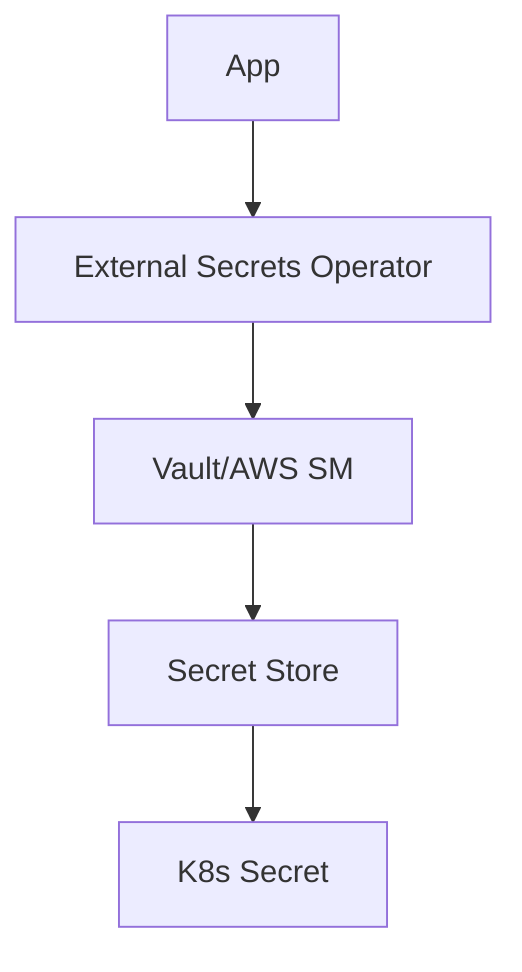

## Resumen

Esta guía compara soluciones para gestión de secretos en entornos DevOps: HashiCorp Vault, AWS Secrets Manager y Kubernetes Secrets. Explica cuándo usar cada uno y mejores prácticas para seguridad.

## Prerrequisitos

- Conocimientos básicos de Kubernetes y cloud providers (AWS/Azure/GCP).
- Entendimiento de conceptos de encriptación y autenticación.

## Soluciones Principales

### HashiCorp Vault

Vault es una herramienta open-source para gestión centralizada de secretos, con encriptación, auditoría y rotación automática.

#### Características

- **Motores de secretos:** KV, databases, cloud providers.
- **Autenticación:** LDAP, JWT, certificates, cloud IAM.
- **Encriptación:** En tránsito y at-rest con claves rotativas.
- **Auditoría:** Logs detallados de acceso.

#### Instalación

```bash
# Usando Helm en Kubernetes
helm repo add hashicorp https://helm.releases.hashicorp.com
helm install vault hashicorp/vault

# O binario
wget https://releases.hashicorp.com/vault/1.15.0/vault_1.15.0_linux_amd64.zip
unzip vault_*.zip
sudo mv vault /usr/local/bin/
```

#### Uso Básico

```bash
# Iniciar servidor
vault server -dev

# Almacenar secreto
vault kv put secret/myapp db_password="supersecret"

# Leer secreto
vault kv get secret/myapp
```

#### Integración con K8s

```yaml
# vault-secrets-operator
apiVersion: secrets.hashicorp.com/v1beta1
kind: VaultStaticSecret
metadata:
  name: my-secret
spec:
  vaultAuthRef: vault-auth
  mount: secret
  path: myapp
  destination:
    create: true
    name: my-secret
```

### AWS Secrets Manager

Servicio gestionado de AWS para almacenar y rotar secretos.

#### Características

- **Integración nativa:** Con Lambda, RDS, ECS.
- **Rotación automática:** Para bases de datos y credenciales.
- **Encriptación:** Usando KMS.
- **Acceso:** IAM policies.

#### Uso

```bash
# CLI
aws secretsmanager create-secret --name my-secret --secret-string '{"username":"admin","password":"secret"}'

# SDK (Python)
import boto3
client = boto3.client('secretsmanager')
response = client.get_secret_value(SecretId='my-secret')
```

### Kubernetes Secrets

Mecanismo nativo de K8s para almacenar datos sensibles.

#### Tipos

- **Opaque:** Datos arbitrarios.
- **TLS:** Certificados.
- **Docker-registry:** Credenciales de registry.

#### Limitaciones

- No encriptados por defecto (etcd).
- Acceso vía RBAC, pero no auditoría avanzada.
- Recomendado solo para no-sensibles o con external secret managers.

#### Ejemplo

```yaml
apiVersion: v1
kind: Secret
metadata:
  name: my-secret
type: Opaque
data:
  username: YWRtaW4=  # base64 encoded
  password: c2VjcmV0
```

#### Mejores Prácticas

- Usar `external-secrets-operator` para integrar con Vault/AWS.
- No almacenar secretos en Git.
- Rotar periódicamente.

## Comparativa

| Aspecto | Vault | AWS Secrets Manager | K8s Secrets |
|---------|-------|---------------------|-------------|
| Costo | Gratuito (open-source) | Pay-per-use | Gratuito |
| Escalabilidad | Alta | Alta | Media |
| Integración Cloud | Buena | Excelente (AWS) | Buena |
| Auditoría | Avanzada | Básica | Limitada |
| Complejidad | Alta | Baja | Media |

## Mejores Prácticas Generales

- **Principio de Least Privilege:** Solo acceso necesario.
- **Rotación:** Automatizar rotación de secretos.
- **Monitoreo:** Alertas en accesos no autorizados.
- **Backup:** Plan de recuperación de secretos.

## Ejemplos de Arquitectura

### Patrón con External Secrets



## Referencias

- [HashiCorp Vault](https://www.vaultproject.io/)
- [AWS Secrets Manager](https://docs.aws.amazon.com/secretsmanager/)
- [Kubernetes Secrets](https://kubernetes.io/docs/concepts/configuration/secret/)
- [External Secrets Operator](https://external-secrets.io/)