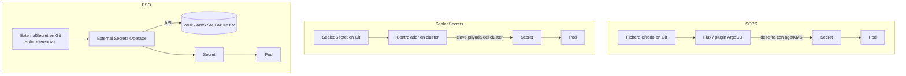

## El problema

GitOps parte de una premisa incómoda: **el repositorio es la fuente de verdad de todo el cluster**. Todo, salvo una cosa. Los `Secret` de Kubernetes no son secretos: son base64, que es codificación, no cifrado. Si haces `git add` de uno, acabas de publicar la contraseña de producción con historial, blame y backups distribuidos entre todos los clones del equipo.

Y borrarlo después no sirve: el commit sigue ahí. Hay tres formas serias de resolverlo, y eligen compromisos distintos sobre quién tiene la clave y qué pasa cuando se pierde.

!!! info "Alcance de esta guía"
    Aquí hablamos de **secretos versionados en Git**. Si lo que buscas es comparar los backends de almacenamiento (Vault vs AWS Secrets Manager vs Kubernetes Secrets), está en [Gestión de Secretos](gestion_secretos.md).

## Las tres estrategias en un vistazo



La diferencia clave: en SOPS y Sealed Secrets **el material cifrado vive en Git**; en ESO en Git solo hay un puntero.

## SOPS: cifrar el fichero, no el repositorio

[SOPS](https://getsops.io/) cifra únicamente los *valores* de un YAML/JSON, dejando las claves en claro. El resultado sigue siendo un diff legible: ves qué campo cambió aunque no puedas leerlo.

### Configuración con age

```bash
# Generar una identidad age
age-keygen -o ~/.config/sops/age/keys.txt
```

Las reglas de cifrado se declaran en `.sops.yaml` en la raíz del repo, y se aplica **la primera regla que hace match**:

```yaml
creation_rules:
  - path_regex: \.dev\.yaml$
    age: age1s3cqcks5genc6ru8chl0hkkd04zmxvczsvdxq99ekffe4gmvjpzsedk23c
  - path_regex: \.prod\.yaml$
    kms: 'arn:aws:kms:eu-west-1:123456789012:key/cb1fab90-8d17-42a1-a9d8-334968904f94'
    age:
      - age1s3cqcks5genc6ru8chl0hkkd04zmxvczsvdxq99ekffe4gmvjpzsedk23c
      - age1qe5lxzzeppw5k79vxn3872272sgy224g2nzqlzy3uljs84say3yqgvd0sw
```

Para un `Secret` de Kubernetes interesa cifrar solo `data`/`stringData` y dejar `metadata` legible:

```bash
sops encrypt --encrypted-regex '^(data|stringData)$' k8s-secrets.yaml
```

Editar sobre la marcha, sin descifrar a disco:

```bash
sops secrets.prod.yaml
```

### Rotación de claves

Dos operaciones distintas que se suelen confundir:

```bash
# Añadir o quitar destinatarios (recipients) de un fichero ya cifrado
sops updatekeys secrets.prod.yaml

# Renovar la clave de datos (data key) y recifrar
sops rotate --in-place secrets.prod.yaml
```

!!! warning "El orden importa si una clave se ha comprometido"
    Primero **elimina la clave comprometida de `.sops.yaml`**, después ejecuta `sops updatekeys` y por último `sops rotate --in-place` en cada fichero afectado. Al revés dejarías la nueva data key accesible a la clave que querías revocar. La rotación periódica de la data key es recomendable aunque no haya incidente.

### Integración con GitOps

- **Flux**: soporte nativo. El `Kustomization` referencia un Secret con la clave age y descifra en el reconcile.
- **ArgoCD**: no descifra SOPS por sí solo. Necesitas un plugin, típicamente **KSOPS** (generador de Kustomize) o un *sidecar* de Config Management Plugin. Eso implica construir una imagen de `argocd-repo-server` con `sops` y `ksops` y montar la clave privada como Secret en el namespace de ArgoCD.

!!! danger "El repo-server pasa a ser objetivo crítico"
    Con SOPS + ArgoCD, la clave privada vive en el `argocd-repo-server`. Quien consiga ejecución en ese pod puede descifrar **todos** los secretos del repositorio. Aplica las mismas protecciones que a un nodo de control-plane: RBAC restrictivo, NetworkPolicies y sin acceso `exec`. Ver [Seguridad en Kubernetes](kubernetes_security.md).

## Sealed Secrets: cifrado asimétrico contra el cluster

[Sealed Secrets](https://github.com/bitnami/sealed-secrets) invierte el modelo: un controlador en el cluster genera un par de claves y publica la pública. Cualquiera puede cifrar; solo el controlador puede descifrar.

```bash
helm repo add sealed-secrets https://bitnami.github.io/sealed-secrets
helm install sealed-secrets-controller sealed-secrets/sealed-secrets \
  --set namespace=kube-system
```

Instalación del CLI:

```bash
wget https://github.com/bitnami/sealed-secrets/releases/download/<release-tag>/kubeseal-<version>-linux-amd64.tar.gz
tar -xvzf kubeseal-<version>-linux-amd64.tar.gz kubeseal
sudo install -m 755 kubeseal /usr/local/bin/kubeseal
```

### Sellar un secreto

```bash
kubectl create secret generic db-credentials \
  --dry-run=client --from-literal=password=s3cr3t -o yaml | \
  kubeseal \
    --controller-name=sealed-secrets-controller \
    --controller-namespace=kube-system \
    --format yaml > sealedsecret.yaml
```

El `SealedSecret` resultante es el fichero que **sí** va a Git. El controlador lo observa y materializa el `Secret` real.

### Scopes

Por defecto un `SealedSecret` está atado a su nombre **y** a su namespace: moverlo lo rompe, por diseño. Si necesitas relajarlo:

```bash
echo -n foo | kubeseal --raw --scope cluster-wide
```

Requiere la anotación `sealedsecrets.bitnami.com/cluster-wide` en el recurso. Úsalo con cuidado: un scope `cluster-wide` permite que cualquiera con permisos de creación en cualquier namespace reutilice ese valor cifrado.

!!! danger "Haz backup de la clave maestra. Hoy."
    Es el fallo operativo número uno con Sealed Secrets. Si pierdes el cluster y no tienes la clave privada del controlador, **todos los `SealedSecret` de tu repositorio son basura irrecuperable** y hay que regenerar cada credencial a mano.

```bash
kubectl get secret -n kube-system \
  -l sealedsecrets.bitnami.com/sealed-secrets-key \
  -o yaml > sealed-secrets-master.key
```

Guarda ese fichero **fuera de Git**, cifrado, en un gestor de secretos o almacenamiento offline. Restaurarlo consiste en aplicar el Secret en el cluster nuevo y reiniciar el controlador.

El controlador rota su clave periódicamente (por defecto cada 30 días) y **conserva las antiguas** para poder seguir descifrando. Para recifrar un `SealedSecret` con la clave más reciente:

```bash
kubeseal --re-encrypt <my_sealed_secret.json >tmp.json \
  && mv tmp.json my_sealed_secret.json
```

Cada rotación genera una clave nueva que también hay que respaldar. Automatiza el backup, no lo dejes en un runbook.

## External Secrets Operator: en Git solo la referencia

[ESO](https://external-secrets.io/) no guarda nada cifrado en Git. Guarda *dónde* está el secreto y deja que el operador lo sincronice desde Vault, AWS Secrets Manager, Azure Key Vault, GCP Secret Manager y una larga lista más.

Dos CRDs principales. El `SecretStore` describe el backend y cómo autenticarse:

```yaml
apiVersion: external-secrets.io/v1
kind: SecretStore
metadata:
  name: vault-backend
  namespace: example
spec:
  provider:
    vault:
      server: "https://vault.acme.org"
      path: "secret"
      version: "v2"
      auth:
        kubernetes:
          mountPath: "kubernetes"
          role: "demo"
          serviceAccountRef:
            name: "my-sa"
```

Para AWS Secrets Manager:

```yaml
apiVersion: external-secrets.io/v1
kind: SecretStore
metadata:
  name: secretstore-sample
spec:
  provider:
    aws:
      service: SecretsManager
      region: eu-west-1
      auth:
        secretRef:
          accessKeyIDSecretRef:
            name: awssm-secret
            key: access-key
          secretAccessKeySecretRef:
            name: awssm-secret
            key: secret-access-key
```

El `ExternalSecret` describe qué traer y en qué `Secret` dejarlo:

```yaml
apiVersion: external-secrets.io/v1
kind: ExternalSecret
metadata:
  name: external-secret-vault
  namespace: default
spec:
  secretStoreRef:
    name: vault-backend
    kind: SecretStore
  refreshPolicy: Periodic
  refreshInterval: "1h"
  target:
    name: creds-secret-vault
    creationPolicy: Owner
  dataFrom:
    - extract:
        key: database-credentials
```

!!! tip "ClusterSecretStore para no repetirte"
    Existe la variante `ClusterSecretStore`, idéntica pero de ámbito cluster: defines la conexión a Vault una vez y todos los namespaces la referencian con `kind: ClusterSecretStore`. Menos duplicación y un único punto donde auditar la autenticación.

`dataFrom` admite además `find` con regex, útil para sincronizar familias enteras de secretos sin listarlos uno a uno:

```yaml
  dataFrom:
    - find:
        name:
          regexp: "^prod-"
```

Con ArgoCD, ESO es la opción con menos fricción: el `ExternalSecret` es un manifiesto normal y corriente, sin plugins ni imágenes personalizadas. La única precaución es marcar los `Secret` generados para que ArgoCD no los reporte como *OutOfSync* (`argocd.argoproj.io/compare-options: IgnoreExtraneous`). Ver [ArgoCD](../cicd/argocd.md).

## Comparativa honesta

| Criterio | SOPS | Sealed Secrets | ESO |
| --- | --- | --- | --- |
| ¿Qué hay en Git? | Valores cifrados | Valores cifrados | Solo referencias |
| Si se filtra el repo | Seguro mientras la clave privada no se filtre | Seguro: solo descifra el controlador | Nada que filtrar |
| Modelo de amenaza | Quien tenga la clave age/KMS lo lee todo | Quien comprometa el cluster lo lee todo | Quien comprometa las credenciales del store |
| Descifrado local | Sí (útil para debug) | No (one-way por diseño) | No |
| Infra extra | Ninguna en el cluster | Un controlador | Un operador + backend externo |
| Coste | Cero (age) o KMS | Cero | Vault/cloud a pagar |
| Rotación | Manual: `updatekeys` + `rotate` | Automática de clave, manual de secretos | En el backend, propagación automática |
| Disaster recovery | Restaurar la clave age/KMS | **Restaurar la master key o perderlo todo** | Reinstalar operador, el backend es la verdad |
| Auditoría de acceso | Git log + logs de KMS | Ninguna nativa | Completa (audit log del backend) |
| ArgoCD | Requiere plugin (KSOPS/CMP) | Nativo | Nativo |
| Multi-cluster | Fácil: comparte la clave | Doloroso: clave por cluster | Trivial |

### Lo que la tabla no dice

- **SOPS con age es el único que funciona sin nada corriendo**. Puedes descifrar en tu portátil, en un pipeline o en un cluster nuevo. Eso es una ventaja operativa enorme y, a la vez, exactamente su riesgo: una clave filtrada compromete todo el historial del repositorio, incluidos secretos ya rotados.
- **Sealed Secrets tiene el mejor modelo de amenaza frente a filtración de repo** y el peor frente a pérdida de cluster. Sin backup de la clave maestra, un desastre de infraestructura se convierte en un incidente de credenciales.
- **ESO no cifra nada**: mueve el problema al backend, que es donde debería estar. A cambio introduce una dependencia en runtime: si Vault cae, los `Secret` existentes sobreviven pero no se refrescan ni se crean nuevos.
- **Ninguno protege contra un atacante con `get secrets` en el cluster.** Los tres terminan en un `Secret` estándar de Kubernetes. El RBAC sigue siendo la última línea de defensa, y el cifrado at-rest de etcd sigue siendo obligatorio.

## Recomendaciones por escenario

### Homelab / proyecto personal

**SOPS + age.** Cero infraestructura, cero coste, funciona en cualquier cluster incluido k3s en una Raspberry. La clave privada, en tu gestor de contraseñas y en un USB. Si usas Flux, la integración es nativa y no hay nada más que hacer.

### Equipo pequeño (3-15 personas)

**Sealed Secrets.** Los desarrolladores cifran con la clave pública sin necesitar acceso a ninguna credencial: eso escala socialmente mucho mejor que repartir claves age. El precio es un runbook de backup de la clave maestra que alguien debe ejecutar de verdad, con verificación de restauración al menos una vez al trimestre.

!!! warning "Prueba la restauración"
    Un backup no verificado no es un backup. Levanta un cluster efímero, restaura la clave y comprueba que un `SealedSecret` real se descifra. Si no lo has hecho nunca, no sabes si funciona.

### Empresa con Vault o cloud

**ESO, sin dudarlo.** Si ya pagas un gestor de secretos, duplicar material cifrado en Git es regalar superficie de ataque a cambio de nada. ESO te da rotación real, audit log, políticas de acceso por identidad y separación limpia entre quién despliega y quién puede leer credenciales.

### Situaciones mixtas

Es perfectamente razonable combinar: ESO para las credenciales de aplicación y SOPS para el puñado de secretos de *bootstrap* que hacen falta antes de que el operador exista (por ejemplo, el propio token de acceso a Vault). Ese problema del huevo y la gallina no lo resuelve ESO por sí solo.

## Errores comunes

- **Cifrar el fichero entero con SOPS.** Pierdes la legibilidad del diff y cualquier revisión de PR se vuelve inútil. Usa siempre `--encrypted-regex`.
- **No añadir el `.gitignore` para descifrados temporales.** Un `secrets.dec.yaml` olvidado anula todo lo anterior. Añade un hook de pre-commit o un escáner de secretos en CI.
- **Asumir que rotar la clave rota los secretos.** No es lo mismo: rotar la clave age recifra el mismo valor. Si una credencial se filtró, hay que cambiarla en el sistema de origen.
- **Dar a ArgoCD permisos de lectura sobre todos los Secrets del cluster** cuando solo necesita gestionar los suyos.

## Recursos relacionados

- [Gestión de Secretos](gestion_secretos.md) — comparativa de backends: Vault, AWS SM y Kubernetes Secrets.
- [ArgoCD](../cicd/argocd.md) — despliegue GitOps y configuración de aplicaciones.
- [Seguridad en Kubernetes (RBAC)](kubernetes_security.md) — RBAC, políticas y hardening del cluster.

## Referencias

- [SOPS — documentación oficial](https://getsops.io/docs/)
- [Sealed Secrets — repositorio](https://github.com/bitnami/sealed-secrets)
- [External Secrets Operator](https://external-secrets.io/)
- [KSOPS](https://github.com/viaduct-ai/kustomize-sops)
