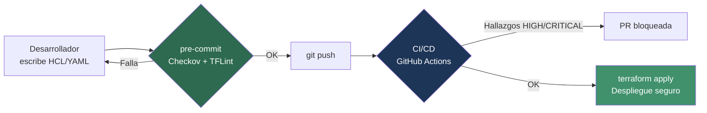

## Resumen

Escribir la infraestructura como código (IaC) es cómodo, repetible y versionable. El problema es que un error de configuración también se vuelve repetible: un bucket S3 público, un Security Group abierto a `0.0.0.0/0` o un contenedor corriendo como `root` se despliegan tantas veces como ejecutes el pipeline. Esta guía explica cómo escanear tu IaC con **Checkov** y **TFLint** para detectar esas *misconfigurations* **antes** de que lleguen a producción, aplicando el principio *shift-left* del enfoque [DevSecOps](introduccion_devsecops.md).

## Prerrequisitos

- Terraform y/o Ansible instalados y un repositorio con código IaC.
- Python 3.8+ (para Checkov) y `pip`.
- Familiaridad con pipelines CI/CD (GitHub Actions).

## ¿Qué es el escaneo de IaC y por qué importa?

El escaneo de IaC analiza **estáticamente** los ficheros de definición (HCL de Terraform, playbooks de Ansible, manifiestos de Kubernetes, Dockerfiles) buscando patrones inseguros: cifrado desactivado, logging ausente, permisos excesivos, secretos en claro, etc. A diferencia del [escaneo de vulnerabilidades](escaneo_vulnerabilidades.md) que analiza imágenes y dependencias ya construidas, aquí trabajamos sobre el **plano de definición**, mucho antes del despliegue.

!!! info "Shift-left en una frase"
    Cuanto más tarde encuentras un fallo de seguridad, más caro es corregirlo. Detectar un Security Group abierto en el editor o en el `git commit` cuesta segundos; detectarlo tras un incidente en producción cuesta mucho más.



## Checkov

[Checkov](https://www.checkov.io/) (de Prisma Cloud / Bridgecrew) es un escáner de análisis estático que cubre Terraform, Ansible, Kubernetes, Dockerfile, CloudFormation, Helm, ARM y Serverless. Trae más de mil *policies* predefinidas mapeadas a CIS Benchmarks, PCI-DSS, HIPAA, etc.

### Instalación

```bash
# Con pip (recomendado)
pip install checkov

# Con Homebrew (macOS)
brew install checkov

# Verificar
checkov --version
```

### Uso básico

```bash
# Escanear todo el directorio actual (autodetecta el tipo de IaC)
checkov -d .

# Escanear un único fichero
checkov -f main.tf

# Limitar a un framework concreto
checkov -d . --framework terraform
checkov -d . --framework ansible
checkov -d . --framework kubernetes
checkov -d . --framework dockerfile

# Salida en formato máquina para CI
checkov -d . -o json --output-file-path resultados/

# Fallar solo con severidad alta o superior (requiere API key para severidades,
# alternativamente filtra por checks concretos)
checkov -d . --compact --quiet
```

!!! tip "Silenciar falsos positivos"
    Puedes saltarte un check concreto sin desactivarlo globalmente añadiendo un comentario inline en el recurso Terraform:
    ```hcl
    resource "aws_s3_bucket" "logs" {
      # checkov:skip=CKV_AWS_18:El logging se gestiona en la cuenta central
      bucket = "mi-bucket-logs"
    }
    ```

### Ejemplo real: hallazgo en Terraform y su corrección

Código inseguro:

```hcl
resource "aws_s3_bucket" "data" {
  bucket = "frikiteam-data"
}
```

Checkov reportará, entre otros:

```text
Check: CKV_AWS_18: "Ensure the S3 bucket has access logging enabled"
        FAILED for resource: aws_s3_bucket.data
Check: CKV_AWS_21: "Ensure all data stored in the S3 bucket have versioning enabled"
        FAILED for resource: aws_s3_bucket.data
Check: CKV2_AWS_6: "Ensure that S3 bucket has a Public Access block"
        FAILED for resource: aws_s3_bucket.data
```

Versión corregida:

```hcl
resource "aws_s3_bucket" "data" {
  bucket = "frikiteam-data"
}

resource "aws_s3_bucket_versioning" "data" {
  bucket = aws_s3_bucket.data.id
  versioning_configuration {
    status = "Enabled"
  }
}

resource "aws_s3_bucket_public_access_block" "data" {
  bucket                  = aws_s3_bucket.data.id
  block_public_acls       = true
  block_public_policy     = true
  ignore_public_acls      = true
  restrict_public_buckets = true
}

resource "aws_s3_bucket_logging" "data" {
  bucket        = aws_s3_bucket.data.id
  target_bucket = aws_s3_bucket.logs.id
  target_prefix = "log/"
}
```

### Ejemplo en Ansible

Playbook inseguro:

```yaml
- name: Descargar binario
  ansible.builtin.get_url:
    url: http://example.com/app.tar.gz   # HTTP sin cifrar
    dest: /opt/app.tar.gz
    validate_certs: no                    # Verificación TLS desactivada
```

Checkov marcará `CKV2_ANSIBLE_1` (uso de HTTP en lugar de HTTPS) y la verificación de certificados desactivada. La corrección es usar `https://` y `validate_certs: yes`.

## TFLint

[TFLint](https://github.com/terraform-linters/tflint) es un *linter* específico de Terraform. No se solapa del todo con Checkov: mientras Checkov se centra en seguridad, TFLint detecta **errores de Terraform** (sintaxis obsoleta, código muerto, convenciones) y, mediante *plugins de proveedor* (AWS, Azure, GCP), valida **argumentos y tipos de instancia inválidos** que Terraform no detecta hasta el `apply`.

### Instalación

```bash
# Script oficial
curl -s https://raw.githubusercontent.com/terraform-linters/tflint/master/install_linux.sh | bash

# Homebrew (macOS)
brew install tflint

# Verificar
tflint --version
```

### Configuración con reglas de proveedor

Crea un fichero `.tflint.hcl` en la raíz del proyecto:

```hcl
plugin "aws" {
  enabled = true
  version = "0.34.0"
  source  = "github.com/terraform-linters/tflint-ruleset-aws"
}

plugin "azurerm" {
  enabled = true
  version = "0.27.0"
  source  = "github.com/terraform-linters/tflint-ruleset-azurerm"
}

config {
  call_module_type = "local"
}

rule "terraform_naming_convention" {
  enabled = true
}
```

### Uso básico

```bash
# Descargar los plugins declarados en .tflint.hcl
tflint --init

# Ejecutar el linting sobre el directorio actual
tflint

# Recorrer módulos recursivamente
tflint --recursive

# Salida para CI
tflint --format compact
```

Ejemplo de hallazgo típico del ruleset de AWS:

```text
Error: "t9.micro" is an invalid value as instance_type (aws_instance_invalid_type)

  on main.tf line 12:
  12:   instance_type = "t9.micro"
```

Un tipo de instancia inexistente que Terraform no detectaría hasta fallar en el `apply`; TFLint lo caza en segundos.

## Integración en pre-commit hooks

Instala [pre-commit](https://pre-commit.com/) (`pip install pre-commit`) y crea `.pre-commit-config.yaml`:

```yaml
repos:
  - repo: https://github.com/bridgecrewio/checkov
    rev: 3.2.0
    hooks:
      - id: checkov
        args: ["--framework", "terraform", "--framework", "ansible", "--quiet"]

  - repo: https://github.com/terraform-linters/tflint
    rev: v0.53.0
    hooks:
      - id: tflint
```

```bash
pre-commit install       # activa el hook en git commit
pre-commit run --all-files
```

!!! warning "El hook no sustituye al pipeline"
    Un desarrollador puede saltarse los hooks con `git commit --no-verify`. Los hooks son la primera capa (comodidad y rapidez), pero la barrera **bloqueante** debe vivir en CI/CD, donde nadie puede saltársela.

## Integración en CI/CD (GitHub Actions)

`.github/workflows/iac-security.yml`:

```yaml
name: IaC Security Scan

on:
  pull_request:
    paths:
      - "**/*.tf"
      - "**/*.yml"
      - "**/*.yaml"

jobs:
  scan:
    runs-on: ubuntu-latest
    steps:
      - uses: actions/checkout@v4

      - name: Checkov
        uses: bridgecrewio/checkov-action@v12
        with:
          directory: .
          framework: terraform,ansible,dockerfile
          output_format: cli,sarif
          output_file_path: console,results.sarif
          soft_fail: false        # falla el job ante hallazgos

      - name: Subir SARIF a Code Scanning
        uses: github/codeql-action/upload-sarif@v3
        if: always()
        with:
          sarif_file: results.sarif

      - name: TFLint
        uses: terraform-linters/setup-tflint@v4
        with:
          tflint_version: v0.53.0
      - run: |
          tflint --init
          tflint --recursive --format compact
```

!!! tip "SARIF y la pestaña Security"
    Exportar en formato SARIF hace que los hallazgos aparezcan directamente en la pestaña **Security → Code scanning** del repositorio en GitHub, con anotaciones inline en el PR.

## Comparativa de herramientas

| Característica            | Checkov            | TFLint                 | tfsec                  | Terrascan          |
|--------------------------|--------------------|------------------------|------------------------|--------------------|
| Enfoque principal        | Seguridad/compliance | Linting + errores TF  | Seguridad              | Seguridad/compliance |
| Terraform                | Sí                 | Sí (nativo)            | Sí                     | Sí                 |
| Ansible                  | Sí                 | No                     | No                     | No                 |
| Kubernetes / Helm        | Sí                 | No                     | Sí (limitado)          | Sí                 |
| Dockerfile               | Sí                 | No                     | No                     | Sí                 |
| Reglas de proveedor (AWS/Azure) | Vía policies | Sí (plugins)           | Vía reglas             | Vía policies       |
| Política personalizada   | Python / YAML      | Reglas TFLint          | Rego (custom)          | Rego (OPA)         |
| Estado del proyecto      | Activo             | Activo                 | Fusionado en Trivy     | Activo             |
| Lenguaje policies        | YAML / Python      | HCL                    | JSON / Rego            | Rego               |

!!! note "¿Cuál elijo?"
    No son excluyentes. La combinación habitual es **Checkov + TFLint**: Checkov cubre seguridad multi-framework y TFLint aporta el linting específico de Terraform con validación de proveedor. Ten en cuenta que **tfsec** fue absorbido por Trivy (`trivy config`), así que si ya usas Trivy para [escaneo de vulnerabilidades](escaneo_vulnerabilidades.md) puedes reutilizarlo también para IaC.

## Buenas prácticas

- Ejecuta el escaneo en **pre-commit** (rápido) y de forma **bloqueante en CI** (garantía).
- Versiona `.tflint.hcl` y `.pre-commit-config.yaml` junto al código IaC.
- Documenta cada `checkov:skip` con una justificación; los skips sin motivo son deuda de seguridad.
- Exporta SARIF para centralizar hallazgos en la pestaña Security.
- Revisa periódicamente las nuevas policies al actualizar versiones.

## Enlaces relacionados

- [Introducción a DevSecOps](introduccion_devsecops.md)
- [Escaneo de Vulnerabilidades](escaneo_vulnerabilidades.md)
- [Terraform Base](../terraform/terraform_base.md)
- [Ansible Base](../ansible/ansible_base.md)
