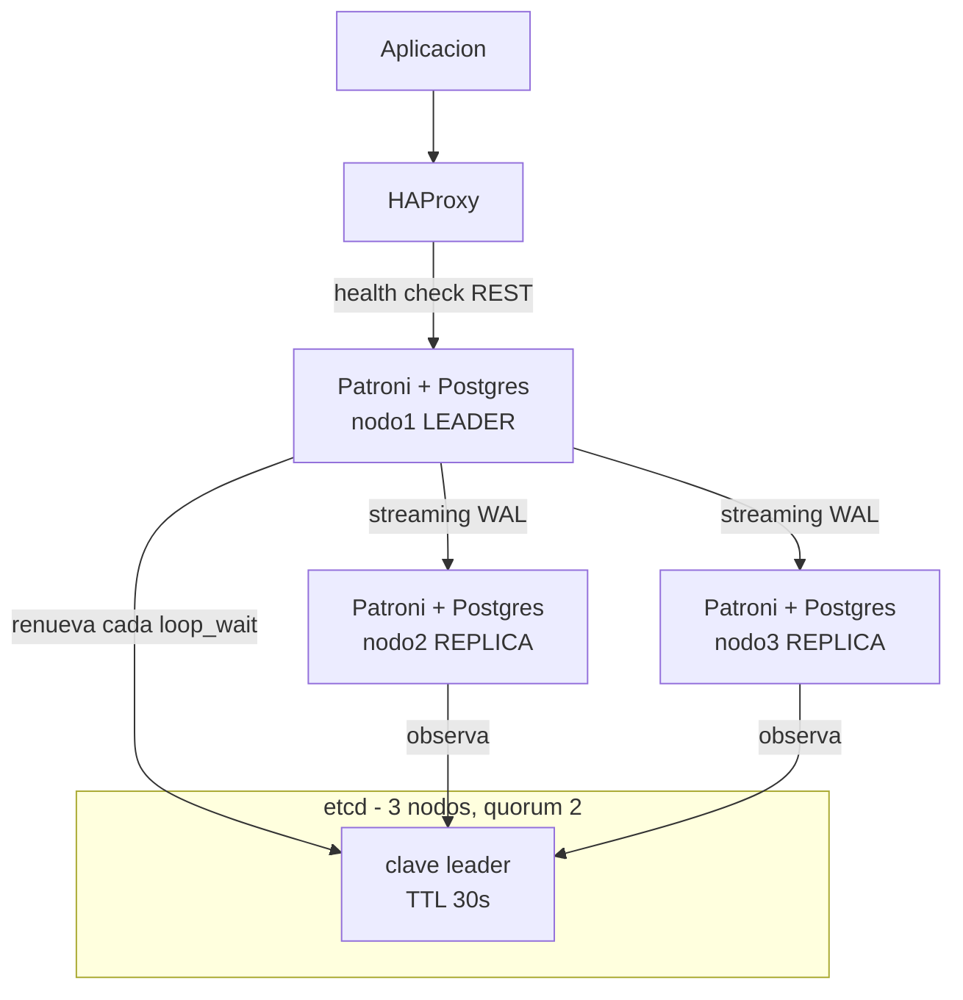
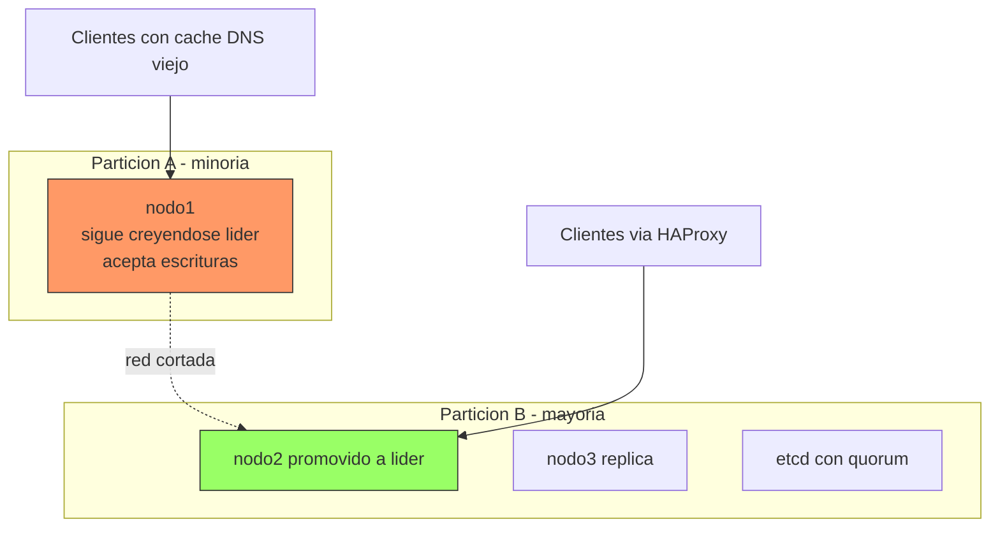

## Qué significa realmente "alta disponibilidad"

Un cluster PostgreSQL en HA no es "tengo una réplica". Es un sistema distribuido que tiene que responder a tres preguntas sin intervención humana: quién es el primario, cómo se enteran los clientes de que ha cambiado, y qué pasa con el nodo viejo cuando vuelve. Casi todos los desastres de HA salen de la tercera.

Esta guía cubre la operación: qué configurar, qué monitorizar y cómo probarlo. Da por sentado que ya sabes qué es un WAL y cómo levantar una instancia.

!!! info "Alcance"
    Aquí no se explica el despliegue básico de PostgreSQL —está en [PostgreSQL en Docker](postgres.md)— ni la capa de almacenamiento replicado, que está en [Storage para bases de datos: PostgreSQL + Ceph](../storage/postgresql_ceph.md). Ceph te da un disco que sobrevive a la muerte de un nodo; **no te da failover de la base de datos**. Son capas complementarias, no alternativas.

## Replicación streaming: el trade-off que decide todo

PostgreSQL replica enviando el WAL del primario a las réplicas por una conexión de streaming. La única decisión importante es **cuándo confirma el primario un COMMIT al cliente**, y la controla `synchronous_commit`.

### Asíncrona: el primario no espera a nadie

```ini
# postgresql.conf del primario
wal_level = replica
max_wal_senders = 10
max_replication_slots = 10
synchronous_commit = on          # fsync local, sin esperar a la réplica
synchronous_standby_names = ''   # vacío = toda la replicación es asíncrona
```

`synchronous_commit = on` con `synchronous_standby_names` vacío significa: el COMMIT se confirma cuando el WAL está en el disco **local**. La réplica lo recibirá cuando lo reciba.

- **Latencia de escritura**: la de tu disco local. Nada más.
- **RPO**: no es cero. Si el primario muere, pierdes todo lo que la réplica no había recibido aún. La cantidad exacta es el *replication lag* en ese instante, y por eso monitorizarlo no es opcional (ver más abajo).

### Síncrona: el primario espera confirmación

```ini
# postgresql.conf del primario
synchronous_commit = remote_apply
synchronous_standby_names = 'ANY 1 (nodo2, nodo3)'
```

`synchronous_standby_names` acepta dos formas: `FIRST n (...)` respeta el orden de la lista como prioridad; `ANY n (...)` acepta la confirmación de cualesquiera *n* de los nodos listados. `ANY` es casi siempre lo que quieres: no te ata a un nodo concreto.

Los niveles de `synchronous_commit`, de menos a más garantía y de menos a más latencia:

| Valor | El COMMIT vuelve cuando… | Qué pierdes en un fallo |
| --- | --- | --- |
| `off` | El WAL está en el buffer local, sin fsync | Transacciones confirmadas, incluso con el primario vivo |
| `local` | fsync local hecho, réplicas ignoradas | Lo que la réplica no haya recibido |
| `remote_write` | La réplica lo tiene en memoria (no en disco) | Se pierde si la réplica cae a la vez |
| `on` | La réplica lo ha hecho fsync a disco | Nada confirmado, si sobrevive una réplica |
| `remote_apply` | La réplica lo ha aplicado y es visible en consultas | Nada, y además las lecturas en réplica son coherentes |

El coste real de la síncrona no es "un poco más lenta". Es que **cada COMMIT paga un round-trip de red completo más el fsync remoto**. La fórmula aproximada del suelo de latencia por transacción:

```text
latencia_commit ≈ fsync_local + RTT_red + fsync_remoto  (+ tiempo de replay si remote_apply)
```

Ese suelo no se optimiza con más CPU ni más RAM. En la misma sala de máquinas puede ser despreciable frente al fsync; entre regiones distintas domina el RTT y multiplica la latencia de escritura por un factor que **tienes que medir en tu red**, no leer en una tabla. Mide con `pgbench` contra tu topología real antes de comprometerte.

!!! danger "La trampa de la síncrona con un solo standby"
    Si `synchronous_standby_names = 'FIRST 1 (nodo2)'` y `nodo2` cae, **el primario bloquea todos los COMMIT indefinidamente**. No es un fallo: es exactamente lo que le has pedido. Postgres prefiere colgarse a romper la garantía de durabilidad.

    Las salidas son: listar al menos dos candidatos (`ANY 1 (nodo2, nodo3)`), o dejar que Patroni gestione la lista dinámicamente con `synchronous_mode`, que degrada a asíncrona de forma controlada cuando no queda ningún candidato sano.

### Slots de replicación y el riesgo de llenar el disco

Un slot de replicación garantiza que el primario **no borra WAL** que una réplica todavía no ha consumido. Resuelve el problema de la réplica que se queda atrás y ya no puede alcanzar al primario. Y crea uno nuevo: una réplica caída con slot activo hace crecer `pg_wal` hasta llenar el disco del primario, que entonces se para en seco.

```ini
# Techo duro al WAL retenido por slots (PostgreSQL 13+).
# Si un slot supera este tamaño, se invalida: se salva el primario,
# se sacrifica la réplica (habrá que reconstruirla).
max_slot_wal_keep_size = 64GB
```

Ponlo siempre. Una réplica que hay que reconstruir es un incidente; un primario con el disco lleno es una caída total.

## Failover automático: Patroni + etcd

Patroni es el estándar de facto. La idea es simple y por eso funciona: Patroni **no decide** quién es el primario, sino que usa un almacén distribuido con consenso (etcd, Consul o ZooKeeper) como árbitro. El líder mantiene una clave con TTL; si no la renueva, expira, y el resto compite por tomarla.



El detalle que la gente pasa por alto: **el quórum de etcd es lo que evita el split-brain**. Un nodo Patroni que pierde contacto con etcd no puede renovar su clave, así que se degrada a sí mismo. Por eso etcd va en número impar de nodos (3 o 5) y, si es posible, **no en las mismas máquinas** que Postgres: un fallo de red que aísle un nodo debe aislar también su voto.

### Configuración de Patroni comentada

`patroni.yml` de un nodo. Los valores de `bootstrap.dcs` solo se leen **la primera vez** que se inicializa el cluster; después viven en el DCS y se cambian con `patronictl edit-config`.

```yaml
scope: pg-produccion            # nombre del cluster; comparten scope los 3 nodos
name: nodo1                     # unico por nodo
namespace: /service/            # prefijo de las claves en etcd

restapi:
  listen: 0.0.0.0:8008
  connect_address: 10.0.0.11:8008   # como lo ven los OTROS nodos y HAProxy

etcd3:
  hosts:
    - 10.0.0.21:2379
    - 10.0.0.22:2379
    - 10.0.0.23:2379

bootstrap:
  dcs:
    # TTL de la clave de liderazgo. Si el lider no la renueva en este tiempo,
    # expira y se convoca eleccion. Es el limite inferior de tu RTO.
    ttl: 30
    # Cada cuanto corre el bucle de Patroni (heartbeat).
    loop_wait: 10
    # Timeout de las operaciones contra el DCS y Postgres.
    retry_timeout: 10
    # Un candidato con mas de este lag en bytes NO puede promocionarse.
    # Es tu RPO maximo tolerado, expresado en bytes de WAL.
    maximum_lag_on_failover: 1048576   # 1 MiB
    # Replicacion sincrona gestionada por Patroni: mantiene
    # synchronous_standby_names al dia y degrada solo si no queda candidato.
    synchronous_mode: true
    # Si es true, Patroni NUNCA promociona un nodo que no estuviera sincrono.
    # Cero perdida de datos a cambio de poder quedarte sin cluster.
    synchronous_mode_strict: false
    postgresql:
      use_pg_rewind: true       # reincorpora el ex-primario sin clonar entero
      use_slots: true
      parameters:
        wal_level: replica
        hot_standby: "on"
        max_wal_senders: 10
        max_replication_slots: 10
        max_slot_wal_keep_size: 64GB
        wal_log_hints: "on"     # REQUERIDO por pg_rewind (o data checksums)

  initdb:
    - encoding: UTF8
    - data-checksums              # detecta corrupcion silenciosa; solo en initdb

postgresql:
  listen: 0.0.0.0:5432
  connect_address: 10.0.0.11:5432
  data_dir: /var/lib/postgresql/16/main
  bin_dir: /usr/lib/postgresql/16/bin
  authentication:
    replication:
      username: replicador
      password: CAMBIAME
    superuser:
      username: postgres
      password: CAMBIAME
    rewind:                       # usuario para pg_rewind (no necesita superuser en PG11+)
      username: rewind_user
      password: CAMBIAME

watchdog:
  mode: required                  # 'required' = Patroni NO arranca sin watchdog
  device: /dev/watchdog
  safety_margin: 5

tags:
  nofailover: false
  noloadbalance: false
  clonefrom: false
  nosync: false
```

Las tres decisiones que de verdad importan en ese fichero:

- **`ttl` y `loop_wait`**: el tiempo de detección está acotado por `ttl`, y `loop_wait` debe ser bastante menor (la relación habitual es `ttl` ≥ 2·`loop_wait` + `retry_timeout`). Bajarlo acelera el failover y aumenta el riesgo de failover espurio por un hipo de red. No hay número correcto universal: depende de la estabilidad de tu red.
- **`maximum_lag_on_failover`**: es tu RPO escrito en bytes. Si ningún candidato cumple, Patroni **no promociona a nadie** y el cluster se queda sin primario. Es deliberado: prefiere caída a pérdida silenciosa de datos.
- **`watchdog: required`**: el seguro contra el peor caso. Si el proceso Patroni del líder se cuelga y deja de renovar la clave pero Postgres sigue vivo aceptando escrituras, el watchdog hardware reinicia la máquina. Sin él, ese escenario **es** split-brain.

### Operación diaria

```bash
# Estado del cluster: quien es lider, lag de cada replica, timeline
patronictl -c /etc/patroni/patroni.yml list pg-produccion

# Cambiar configuracion en caliente (abre $EDITOR, se propaga por el DCS)
patronictl -c /etc/patroni/patroni.yml edit-config pg-produccion

# Switchover PLANIFICADO: sin perdida de datos, tu eliges el momento
patronictl -c /etc/patroni/patroni.yml switchover pg-produccion

# Failover FORZADO: solo cuando el primario ya no responde
patronictl -c /etc/patroni/patroni.yml failover pg-produccion

# Congelar la automatica (mantenimiento). Patroni observa pero no actua.
patronictl -c /etc/patroni/patroni.yml pause pg-produccion
patronictl -c /etc/patroni/patroni.yml resume pg-produccion

# Reincorporar un nodo que quedo divergente
patronictl -c /etc/patroni/patroni.yml reinit pg-produccion nodo2
```

!!! warning "`pause` antes de tocar nada"
    Cualquier mantenimiento que pare Postgres —un `systemctl restart`, una actualización de menor versión, un cambio de parámetro que requiera reinicio— dispara un failover si Patroni está activo. `patronictl pause` primero, siempre. Y acuérdate del `resume`: un cluster en pausa es un cluster **sin** alta disponibilidad, y no lo grita por ningún sitio.

## Alternativas y cuándo tienen sentido

Patroni es la respuesta por defecto, no la única.

| Herramienta | Árbitro | Úsalo cuando |
| --- | --- | --- |
| **Patroni** | DCS externo (etcd/Consul/ZooKeeper) | Caso general en VMs o bare metal; quieres control fino y ecosistema maduro |
| **repmgr** | `repmgrd` + nodo testigo | Ya tienes repmgr, o quieres algo más simple sin desplegar un DCS |
| **pg_auto_failover** | Nodo monitor dedicado | Topologías pequeñas (2 nodos + monitor) y quieres cero configuración de consenso |
| **CloudNativePG** | API de Kubernetes (etcd de k8s) | Ya estás en Kubernetes; no quieres un segundo plano de control |

- **repmgr** es más ligero pero el consenso es más débil: el testigo evita el caso obvio de partición, no sustituye a un quórum real. Es una opción razonable si tu tolerancia al split-brain está cubierta por fencing externo.
- **pg_auto_failover** simplifica mucho (`pg_autoctl create monitor`, `pg_autoctl create postgres`) a cambio de que **el monitor es un punto único**: si lo pierdes, pierdes la automatización. Que sea HA por su cuenta, o asume el riesgo conscientemente.
- **CloudNativePG** es un operador que usa la propia API de Kubernetes como DCS, así que no despliegas etcd aparte. Reduce piezas móviles de forma notable si ya operas un cluster de k8s.

```yaml
# CloudNativePG: cluster minimo de 3 instancias
apiVersion: postgresql.cnpg.io/v1
kind: Cluster
metadata:
  name: pg-produccion
spec:
  instances: 3
  postgresql:
    parameters:
      max_slot_wal_keep_size: "64GB"
      wal_log_hints: "on"
  # Cero perdida: exige confirmacion de al menos 1 replica.
  # Comprueba la sintaxis exacta en la version del operador que despliegues.
  storage:
    size: 100Gi
    storageClass: ceph-rbd
```

El operador crea tres Services por cluster: `<nombre>-rw` apunta siempre al primario, `<nombre>-ro` a las réplicas y `<nombre>-r` a cualquier instancia. La aplicación usa `-rw` y se olvida de quién es el líder: el failover es un cambio de endpoint, no un cambio de configuración.

!!! note "Verifica la sintaxis del operador"
    Las claves de configuración de CloudNativePG han cambiado entre versiones mayores del operador (especialmente lo relativo a replicación síncrona y backups). Contrasta el manifiesto contra la documentación de **la versión concreta** que despliegues antes de aplicarlo.

## Routing: por qué la aplicación no conecta directa

Aunque el failover funcione perfecto, si la aplicación tiene `host=10.0.0.11` en su cadena de conexión, el failover no le sirve de nada. Necesitas una capa que sepa quién es el primario **ahora**.

### HAProxy con los health checks de Patroni

La API REST de Patroni devuelve códigos HTTP según el rol del nodo: `200` en `/primary` solo si ese nodo es el líder, `200` en `/replica` solo si es una réplica sana. Eso es todo lo que HAProxy necesita.

```haproxy
listen postgres_escritura
    bind *:5432
    mode tcp
    option httpchk GET /primary
    http-check expect status 200
    default-server inter 3s fall 3 rise 2 on-marked-down shutdown-sessions
    server nodo1 10.0.0.11:5432 check port 8008
    server nodo2 10.0.0.12:5432 check port 8008
    server nodo3 10.0.0.13:5432 check port 8008

listen postgres_lectura
    bind *:5433
    mode tcp
    balance roundrobin
    option httpchk GET /replica
    http-check expect status 200
    default-server inter 3s fall 3 rise 2
    server nodo1 10.0.0.11:5432 check port 8008
    server nodo2 10.0.0.12:5432 check port 8008
    server nodo3 10.0.0.13:5432 check port 8008
```

Fíjate en `on-marked-down shutdown-sessions`: sin esa opción, las conexiones TCP ya establecidas contra el ex-primario **siguen abiertas** después del failover, y la aplicación sigue escribiendo contra un nodo que ya no es líder hasta que algo las corte. Es la causa número uno de "el failover funcionó pero la app siguió rota". Configuración general de HAProxy en [HAProxy: configuración base](../haproxy/haproxy_base.md).

El propio HAProxy no debe ser un punto único: dos instancias con una IP virtual (keepalived/VRRP), o el balanceador de tu proveedor.

### PgBouncer: pooling, y también amortiguar el failover

PostgreSQL asigna un proceso por conexión. Unos cientos de conexiones ociosas desde pods que escalan solos tumban un primario perfectamente sano. PgBouncer multiplexa: miles de clientes sobre decenas de conexiones reales.

```ini
[databases]
midb = host=127.0.0.1 port=5432 dbname=midb

[pgbouncer]
listen_addr = 0.0.0.0
listen_port = 6432
auth_type = scram-sha-256
auth_file = /etc/pgbouncer/userlist.txt

# transaction: la conexion al servidor se devuelve al pool al terminar cada
# transaccion. Es el modo util en la practica. Incompatible con prepared
# statements de sesion, LISTEN/NOTIFY y temp tables entre transacciones.
pool_mode = transaction

max_client_conn = 2000
default_pool_size = 25
reserve_pool_size = 5
server_lifetime = 3600
server_idle_timeout = 600
```

El orden importa: **aplicación → PgBouncer → HAProxy → Postgres**. Con PgBouncer pegado a cada nodo de aplicación reduces la latencia de conexión y evitas otro punto único.

Durante un failover, `PAUSE` en la consola de administración de PgBouncer retiene las nuevas consultas en cola en vez de devolver errores, y `RESUME` las libera cuando el nuevo primario está listo. Convierte un failover de "errores 500 durante 30 segundos" en "latencia alta durante 30 segundos".

```bash
psql -h 127.0.0.1 -p 6432 -U pgbouncer pgbouncer -c "PAUSE;"
psql -h 127.0.0.1 -p 6432 -U pgbouncer pgbouncer -c "RESUME;"
psql -h 127.0.0.1 -p 6432 -U pgbouncer pgbouncer -c "SHOW POOLS;"
```

!!! warning "`pool_mode = transaction` cambia la semántica"
    En modo transaction, dos consultas consecutivas del mismo cliente pueden ir por conexiones distintas. Todo lo que dependa del estado de sesión —`SET` fuera de transacción, tablas temporales, secuencias con `currval`, advisory locks de sesión, `LISTEN`— deja de comportarse como espera la aplicación. Revísalo antes de activarlo, no después.

## Split-brain: por qué pasa y cómo se corta

Split-brain es **dos nodos aceptando escrituras a la vez**. El resultado no es una caída: son dos bases de datos divergentes, ambas con datos legítimos de clientes, y ninguna herramienta que las mezcle automáticamente. Es el peor fallo posible de un cluster HA porque no se detecta hasta que alguien pregunta por un pedido que no aparece.

Se produce cuando el sistema **cree** que el primario ha muerto y en realidad solo estaba incomunicado:



Las tres defensas, en orden de importancia:

**1. Quórum.** Solo la partición con mayoría estricta de nodos del DCS puede elegir líder. Con etcd de 3 nodos, la partición de 1 nodo no puede escribir en etcd, así que no puede renovar el liderazgo. Esto exige que el número de nodos del DCS sea **impar**: un cluster de 2 no tiene mayoría posible, y de 4 tolera los mismos fallos que uno de 3 con más superficie.

**2. Fencing.** Aislar al nodo sospechoso para que no pueda escribir aunque quiera. En Patroni el mecanismo principal es el **watchdog**: el líder debe "dar de comer" al dispositivo dentro de `ttl - safety_margin`; si Patroni se cuelga, el watchdog reinicia el nodo por hardware. Complementos habituales: `callbacks` de Patroni que bajan la IP o cortan la regla de firewall al perder el rol, y en entornos virtualizados, apagar la VM vía API del hipervisor (STONITH).

```bash
# Requisito para watchdog: el modulo debe estar cargado y el device accesible
sudo modprobe softdog          # solo si no hay watchdog hardware
sudo chown postgres /dev/watchdog
```

**3. `use_pg_rewind`.** No previene el split-brain, resuelve sus secuelas. Cuando el ex-primario vuelve, su timeline diverge del nuevo líder: tiene WAL que nadie más tiene. `pg_rewind` rebobina su directorio de datos hasta el punto de divergencia y lo reengancha como réplica, sin clonar terabytes. Requiere `wal_log_hints = on` o data checksums activados en `initdb`.

!!! danger "Las escrituras divergentes se pierden"
    `pg_rewind` **descarta** las transacciones que el ex-primario confirmó después de la divergencia. Si hubo split-brain real y esas escrituras llegaron a clientes, la reconciliación es manual y arqueológica: WAL del nodo divergente, logs de aplicación y mucha paciencia.

    La conclusión operativa: `softdog` es software, y un kernel bloqueado no lo ejecuta. Si el dato es realmente crítico, usa watchdog **hardware** o STONITH a nivel de hipervisor.

## Qué monitorizar

Tres cosas se rompen en silencio: el lag, los slots y el propio consenso.

### Replication lag desde el primario

```sql
SELECT
  client_addr,
  application_name,
  state,                  -- streaming, catchup, backup, startup
  sync_state,             -- sync, async, quorum, potential
  -- Bytes que le faltan a la replica por aplicar
  pg_wal_lsn_diff(pg_current_wal_lsn(), replay_lsn) AS lag_bytes,
  -- Retardos en tiempo: escritura, fsync y aplicacion
  write_lag,
  flush_lag,
  replay_lag
FROM pg_stat_replication
ORDER BY lag_bytes DESC;
```

Alerta sobre `lag_bytes`, no sobre `replay_lag`. El lag en tiempo es engañoso: en un sistema ocioso crece sin que haya problema alguno, porque no hay WAL nuevo que enviar. **El lag en bytes es lo que compara Patroni con `maximum_lag_on_failover`**, así que es la métrica que decide si tienes candidato para promocionar. Umbral sensato: alertar bastante por debajo de tu `maximum_lag_on_failover`, para tener margen de reacción antes de quedarte sin failover posible.

Ojo también con `state`: una réplica en `catchup` permanente está leyendo WAL archivado en vez de streaming, y probablemente no vaya a alcanzar nunca al primario.

### Desde la réplica

```sql
-- ¿Este nodo es replica? (t = si)
SELECT pg_is_in_recovery();

-- Retardo real de aplicacion. NULL o 0 si no hay actividad nueva.
SELECT
  CASE
    WHEN pg_last_wal_receive_lsn() = pg_last_wal_replay_lsn() THEN 0
    ELSE EXTRACT(EPOCH FROM now() - pg_last_xact_replay_timestamp())
  END AS lag_segundos;
```

### Slots y acumulación de WAL

Este es el que te llena el disco un domingo por la noche.

```sql
SELECT
  slot_name,
  slot_type,
  active,             -- false = nadie lo consume y sigue reteniendo WAL
  wal_status,         -- reserved | extended | unreserved | lost
  safe_wal_size,      -- bytes que quedan antes de invalidarse
  pg_size_pretty(pg_wal_lsn_diff(pg_current_wal_lsn(), restart_lsn)) AS retenido
FROM pg_replication_slots
ORDER BY pg_wal_lsn_diff(pg_current_wal_lsn(), restart_lsn) DESC;
```

Alerta cuando `active = false` en un slot que debería estar en uso, y cuando `wal_status` deja de ser `reserved`. Un `wal_status = lost` significa que esa réplica ya no puede recuperarse por streaming: hay que reconstruirla.

Vigila también el tamaño de `pg_wal` en disco directamente. Es la señal más simple y la más difícil de malinterpretar:

```bash
du -sh /var/lib/postgresql/16/main/pg_wal
ls -1 /var/lib/postgresql/16/main/pg_wal | wc -l
```

### El plano de control

Monitorizar solo Postgres deja ciego el 50 % del sistema. Añade:

- **Salud de etcd**: `etcdctl endpoint health --cluster` y `etcdctl endpoint status -w table`. Un etcd sin quórum es un cluster sin failover, aunque Postgres se vea perfecto.
- **API de Patroni**: `curl -s http://10.0.0.11:8008/patroni` devuelve rol, estado, timeline y lag en JSON. Es la fuente autorizada para el dashboard.
- **Cambios de timeline**: cada promoción incrementa el número de timeline. Un timeline que sube sin que nadie haya declarado un incidente significa que estás teniendo failovers automáticos y no te has enterado.
- **Estado de `pause`**: alerta si el cluster lleva en pausa más de una ventana de mantenimiento. Ver [Stack de observabilidad](../monitoring/observability_stack.md).

## Probar el failover

Un HA no probado no es HA: es una configuración que **suponemos** que funciona. La diferencia entre las dos cosas se descubre siempre en el peor momento posible.

Lo que falla en la práctica, y ninguna revisión de configuración detecta:

- La aplicación conecta directa al primario, saltándose HAProxy, porque alguien lo puso así "temporalmente" para depurar.
- El pool de conexiones no reconecta y sigue lanzando errores diez minutos después de que el cluster esté sano.
- `pg_rewind` falla porque `wal_log_hints` estaba desactivado, y reincorporar el nodo exige clonar 2 TB.
- El watchdog no estaba cargado y Patroni arrancó igual porque `mode: automatic` en vez de `required`.
- Nadie tiene permisos de `patronictl` a las 4 de la mañana.

### Escalera de pruebas

De menos a más agresivo. Cada escalón se hace en preproducción antes que en producción.

**1. Switchover controlado.** El más barato y el que más veces se debería ejecutar. Es planificado y sin pérdida de datos.

```bash
patronictl -c /etc/patroni/patroni.yml switchover pg-produccion \
  --leader nodo1 --candidate nodo2 --force
```

**2. Matar el proceso Postgres.** Patroni debería detectarlo y reiniciarlo localmente, **sin** failover.

```bash
sudo pkill -9 -f "postgres: pg-produccion"
```

**3. Matar Patroni con Postgres vivo.** El escenario del watchdog. Si el nodo no se reinicia solo, tu protección contra split-brain no funciona y acabas de descubrirlo en un laboratorio en vez de en producción.

```bash
sudo systemctl kill -s SIGKILL patroni
```

**4. Apagado brusco del nodo primario.** El failover de verdad. Corta la alimentación de la VM, no un `shutdown` ordenado.

**5. Partición de red.** El más revelador y el que casi nadie hace: aísla al primario del DCS y del resto de nodos, pero déjalo vivo y alcanzable desde algún cliente.

```bash
# En el nodo primario: cortar salida hacia etcd y hacia los otros nodos
sudo iptables -A OUTPUT -d 10.0.0.21,10.0.0.22,10.0.0.23 -j DROP
sudo iptables -A OUTPUT -d 10.0.0.12,10.0.0.13 -j DROP

# Se deshace con:
sudo iptables -F OUTPUT
```

El resultado correcto: el nodo aislado se degrada solo (o lo reinicia el watchdog) antes de que la mayoría promocione a otro. Si en algún momento hay dos nodos respondiendo `200` en `/primary`, tienes split-brain reproducible y un problema de diseño, no de configuración.

### Qué medir durante la prueba

Cronometra y anota. Las estimaciones no sirven de nada; los números de tu prueba, sí.

| Fase | Qué la determina |
| --- | --- |
| Detección | `ttl` de Patroni y salud del DCS |
| Elección de líder | `loop_wait` + latencia contra etcd |
| Promoción | Tiempo de replay del WAL pendiente en el candidato |
| Convergencia del routing | `inter` × `fall` de HAProxy, TTL de DNS, timeout del pool |
| Reconexión de la aplicación | Política de reintentos del driver y del pool |
| **Downtime observado por el cliente** | **La suma de todo lo anterior** |

Ese último número es el único que le importa a alguien fuera del equipo de infraestructura, y casi siempre es mucho mayor que el failover "técnico" por culpa de las dos últimas filas. Un failover de Postgres de 15 segundos con un pool que reintenta cada 60 es un incidente de un minuto.

!!! tip "Deja rastro de cada prueba"
    Fecha, quién la ejecutó, qué escalón, tiempo por fase y qué salió mal. La comparación entre la primera prueba y la tercera es la única evidencia de que has mejorado algo, y es lo primero que pide una auditoría. Mismo criterio que en [Backup Seguro](../cybersecurity/backup_seguro.md).

!!! danger "HA no es backup"
    La replicación replica **todo**, incluido el `DELETE` sin `WHERE` y la migración que dejó la tabla vacía. Se propaga a todas las réplicas en milisegundos, con la misma fiabilidad con la que replica los datos buenos. Un cluster HA de tres nodos no te protege de un error humano, de una corrupción lógica ni de ransomware.

    HA cubre fallos de **infraestructura**. Los backups cubren fallos de **datos**. Necesitas los dos, y el backup necesita su propia prueba de restauración.

## Checklist accionable

Replicación:

- [ ] `synchronous_commit` elegido conscientemente, con la latencia medida en tu red y no supuesta.
- [ ] Si es síncrona, hay **al menos dos** candidatos en `synchronous_standby_names` o lo gestiona Patroni.
- [ ] `max_slot_wal_keep_size` configurado. Sin él, una réplica caída tumba el primario.
- [ ] `wal_log_hints = on` o data checksums, para que `pg_rewind` sea una opción.

Failover:

- [ ] DCS con número impar de nodos (3 o 5), en máquinas distintas a las de Postgres.
- [ ] `maximum_lag_on_failover` refleja tu RPO real y está documentado.
- [ ] `watchdog: required`, con el dispositivo cargado y comprobado. `softdog` solo si asumes su límite.
- [ ] Existe un procedimiento escrito de `pause`/`resume` para mantenimientos, y alerta si el cluster se queda en pausa.

Routing:

- [ ] La aplicación **no** conoce ninguna IP de nodo Postgres. Verificado con `pg_stat_activity`, no de memoria.
- [ ] HAProxy usa los health checks REST de Patroni, con `on-marked-down shutdown-sessions`.
- [ ] El balanceador tiene su propia redundancia (VIP, keepalived o el LB del proveedor).
- [ ] El pool de la aplicación reintenta y reconecta; su timeout está medido contra el downtime real de failover.

Monitorización:

- [ ] Alerta sobre lag **en bytes**, con umbral por debajo de `maximum_lag_on_failover`.
- [ ] Alerta sobre slots inactivos y sobre `wal_status` distinto de `reserved`.
- [ ] Alerta sobre el tamaño de `pg_wal` en disco.
- [ ] Salud y quórum del DCS monitorizados aparte de Postgres.
- [ ] Cambios de timeline alertados: revelan failovers que nadie vio.

Testing:

- [ ] Switchover ejecutado periódicamente en producción, no solo en el laboratorio.
- [ ] Prueba de partición de red hecha al menos una vez, con resultado documentado.
- [ ] Downtime **observado por el cliente** medido, no el failover técnico.
- [ ] Existe un backup independiente del cluster HA, con su propia prueba de restauración.

## Enlaces relacionados

- [PostgreSQL en Docker](postgres.md) — despliegue básico y backups con `pg_dump`.
- [Storage para bases de datos: PostgreSQL + Ceph](../storage/postgresql_ceph.md) — la capa de almacenamiento replicado bajo el cluster.
- [HAProxy: configuración base](../haproxy/haproxy_base.md) — fundamentos del balanceador que enruta al primario.
- [HAProxy avanzado](../haproxy/haproxy_advanced.md) — health checks, alta disponibilidad del propio balanceador.
- [Stack de observabilidad](../monitoring/observability_stack.md) — dónde enviar las métricas de lag y del DCS.
- [Backup Seguro](../cybersecurity/backup_seguro.md) — lo que HA no cubre: cifrado, inmutabilidad y testing de restauración.
- [Kubernetes: probes](../kubernetes/probes.md) — sondas de salud si operas Postgres con un operador.

## Referencias

- [PostgreSQL — High Availability, Load Balancing and Replication](https://www.postgresql.org/docs/current/high-availability.html)
- [Patroni — documentación oficial](https://patroni.readthedocs.io/)
- [etcd — documentación oficial](https://etcd.io/docs/)
- [PgBouncer — documentación oficial](https://www.pgbouncer.org/config.html)
- [CloudNativePG — documentación oficial](https://cloudnative-pg.io/documentation/)
- [repmgr — documentación oficial](https://www.repmgr.org/docs/current/index.html)
- [pg_auto_failover — documentación oficial](https://pg-auto-failover.readthedocs.io/)
