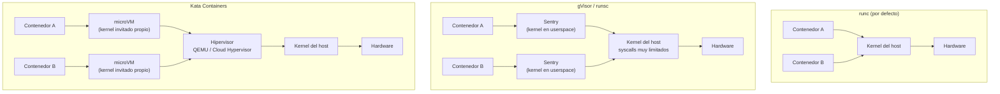

# Docker — Seguridad Runtime (gVisor y Kata Containers)

## 🎯 Introducción

Endurecer una imagen no basta si el contenedor comparte directamente el kernel del host. Con el runtime por defecto (`runc`), un contenedor es un proceso más del host aislado por namespaces, cgroups y seccomp: cualquier fallo de aislamiento del kernel (un CVE de escalada, un syscall mal filtrado) puede convertirse en una fuga hacia el host y sus vecinos.

El **aislamiento en runtime** (sandboxing) ataca ese problema poniendo una capa entre el contenedor y el kernel real. Aquí cubrimos las dos soluciones maduras: **gVisor** (un kernel en espacio de usuario) y **Kata Containers** (contenedores dentro de microVMs). No repetimos hardening de imágenes, secrets ni scanning; para eso consulta [Docker — Seguridad y Scanning](docker_security.md), que es el complemento natural de esta guía.

!!! note "¿Qué NO cubre este doc?"
    Hardening de `Dockerfile`, usuarios no-root, gestión de secretos y escaneo de vulnerabilidades. Todo eso vive en [docker_security.md](docker_security.md). Aquí hablamos solo de **aislamiento del kernel en tiempo de ejecución**.

## 🧠 El problema del kernel compartido

Con `runc`, todos los contenedores del host comparten un único kernel Linux. La superficie de ataque es enorme: cientos de syscalls, drivers, filesystems y subsistemas de red. seccomp reduce esa superficie, pero sigue siendo el mismo kernel para todos.



- **gVisor** intercepta las syscalls del contenedor y las sirve desde un kernel reimplementado en Go (el **Sentry**), que solo hace un puñado de syscalls reales al host.
- **Kata** arranca cada contenedor (o pod) dentro de una **microVM** ligera con su propio kernel invitado, aislado por virtualización de hardware.

## 🔍 gVisor (runsc)

gVisor implementa un kernel de aplicación en espacio de usuario. El proceso **Sentry** intercepta las syscalls del contenedor (vía `ptrace` o, por defecto, la plataforma `systrap`/KVM) y las procesa sin dárselas al kernel real. El acceso al filesystem pasa por un proceso separado, el **Gofer**, mediante el protocolo 9P.

### Instalación

```bash
# Descargar runsc y su shim para containerd
(
  set -e
  ARCH=$(uname -m)
  URL=https://storage.googleapis.com/gvisor/releases/release/latest/${ARCH}
  wget ${URL}/runsc ${URL}/runsc.sha512 \
       ${URL}/containerd-shim-runsc-v1 ${URL}/containerd-shim-runsc-v1.sha512
  sha512sum -c runsc.sha512 -c containerd-shim-runsc-v1.sha512
  rm -f *.sha512
  chmod a+rx runsc containerd-shim-runsc-v1
  sudo mv runsc containerd-shim-runsc-v1 /usr/local/bin
)
```

### Configuración con Docker

```bash
# Registra runsc como runtime en el daemon de Docker
sudo runsc install
sudo systemctl reload docker
```

Esto añade el runtime a `/etc/docker/daemon.json`:

```json
{
  "runtimes": {
    "runsc": {
      "path": "/usr/local/bin/runsc"
    }
  }
}
```

Ejecutar un contenedor con gVisor:

```bash
docker run --rm --runtime=runsc hello-world

# Comprobar que el kernel es el del Sentry, no el del host
docker run --rm --runtime=runsc alpine dmesg | head
# -> se ve "Starting gVisor..." en lugar del kernel real
```

### Configuración con containerd

En `/etc/containerd/config.toml`:

```toml
version = 2

[plugins."io.containerd.grpc.v1.cri".containerd.runtimes.runsc]
  runtime_type = "io.containerd.runsc.v1"
```

```bash
sudo systemctl restart containerd
```

!!! tip "Depuración de gVisor"
    Activa logs por sandbox con `runsc --debug --debug-log=/tmp/runsc/`. Es la forma más rápida de detectar una syscall no soportada que rompe una aplicación.

## 🔍 Kata Containers (microVMs)

Kata arranca cada pod dentro de una VM ligera usando un hipervisor (QEMU por defecto, o Cloud Hypervisor / Firecracker). El contenedor ve un kernel invitado completo, de modo que el aislamiento lo garantiza la virtualización de hardware (VT-x/AMD-V), no solo el software.

### Requisitos

```bash
# Verificar soporte de virtualización por hardware
kata-runtime check
# o, manualmente:
egrep -c '(vmx|svm)' /proc/cpuinfo   # > 0 = soportado
```

!!! warning "Virtualización anidada"
    En VMs cloud, Kata con QEMU necesita **nested virtualization** habilitada por el proveedor. Sin ella, arranca por software (mucho más lento) o falla. Firecracker y Cloud Hypervisor tienen los mismos requisitos de KVM.

### Instalación

```bash
# Vía kata-manager (script oficial que instala binarios + config)
bash -c "$(curl -fsSL https://raw.githubusercontent.com/kata-containers/kata-containers/main/utils/kata-manager.sh)"
```

Los binarios quedan en `/opt/kata/bin/` y la configuración en `/opt/kata/share/defaults/kata-containers/configuration.toml`.

### Configuración con containerd

```toml
version = 2

[plugins."io.containerd.grpc.v1.cri".containerd.runtimes.kata]
  runtime_type = "io.containerd.kata.v2"
  [plugins."io.containerd.grpc.v1.cri".containerd.runtimes.kata.options]
    ConfigPath = "/opt/kata/share/defaults/kata-containers/configuration.toml"
```

```bash
sudo systemctl restart containerd
```

Prueba directa con `ctr`:

```bash
sudo ctr images pull docker.io/library/alpine:latest
sudo ctr run --runtime io.containerd.kata.v2 --rm \
  docker.io/library/alpine:latest kata-test uname -r
# El kernel mostrado es el invitado de Kata, distinto al del host
```

!!! tip "Hipervisor más ligero"
    Para arranques rápidos y menor consumo, cambia a Cloud Hypervisor o Firecracker en `configuration.toml` (`[hypervisor.clh]` / `[hypervisor.fc]`). Firecracker prioriza densidad y tiempo de arranque; QEMU prioriza compatibilidad de dispositivos.

## ☸️ Integración en Kubernetes (RuntimeClass)

Ambos runtimes se exponen a Kubernetes mediante el recurso **RuntimeClass**. El `handler` debe coincidir con el nombre del runtime configurado en containerd.

```yaml
apiVersion: node.k8s.io/v1
kind: RuntimeClass
metadata:
  name: gvisor
handler: runsc          # coincide con [...runtimes.runsc]
---
apiVersion: node.k8s.io/v1
kind: RuntimeClass
metadata:
  name: kata
handler: kata           # coincide con [...runtimes.kata]
```

Asignar un pod a un runtime sandboxeado:

```yaml
apiVersion: v1
kind: Pod
metadata:
  name: untrusted-workload
spec:
  runtimeClassName: gvisor      # o "kata"
  containers:
    - name: app
      image: nginx:1.27-alpine
```

!!! note "Nodos dedicados"
    Es habitual etiquetar/taintar nodos con el runtime instalado y dejar que el `RuntimeClass` los seleccione vía `scheduling.nodeSelector`/`tolerations`, para no exigir gVisor o Kata en todos los nodos del clúster.

```yaml
# Fragmento de RuntimeClass con scheduling a nodos etiquetados
apiVersion: node.k8s.io/v1
kind: RuntimeClass
metadata:
  name: kata
handler: kata
scheduling:
  nodeSelector:
    katacontainers.io/kata-runtime: "true"
  tolerations:
    - key: "kata"
      operator: "Exists"
      effect: "NoSchedule"
```

## ⚖️ Comparativa: runc vs gVisor vs Kata

| Criterio                     | runc (por defecto)        | gVisor (runsc)                    | Kata Containers                     |
|------------------------------|---------------------------|-----------------------------------|-------------------------------------|
| Mecanismo de aislamiento     | Namespaces + cgroups + seccomp | Kernel en userspace (Sentry) | microVM con kernel invitado propio  |
| Superficie de syscall al host| Amplia (mitigable seccomp)| Muy reducida                      | Solo la del hipervisor              |
| Kernel                       | Compartido con el host    | Reimplementado (Go)               | Kernel Linux invitado independiente |
| Overhead de arranque         | Mínimo                    | Bajo                              | Medio (arranque de VM)              |
| Overhead de I/O / syscalls   | Nativo                    | Notable en I/O intensivo          | Bajo-medio (virtio)                 |
| Compatibilidad de syscalls   | Total                     | Parcial (subset implementado)     | Total (kernel real)                 |
| Requiere virtualización HW   | No                        | No                                | Sí (VT-x/AMD-V o nested)            |
| Acceso a GPU / dispositivos  | Directo                   | Limitado                          | Vía passthrough (más complejo)      |
| Caso ideal                   | Cargas de confianza       | Multi-tenant, código no confiable | Aislamiento fuerte tipo VM          |

## 🧭 ¿Cuándo usar cada uno?

!!! tip "Regla práctica"
    - **runc**: cargas propias y de confianza donde el rendimiento manda.
    - **gVisor**: ejecutar código no confiable o multi-tenant (funciones serverless, sandboxes de CI, ejecución de código de usuario) con arranque rápido, aceptando algo de overhead de I/O y compatibilidad parcial de syscalls.
    - **Kata**: necesitas aislamiento equivalente a una VM, compatibilidad total de syscalls o cumplimiento normativo estricto, y puedes pagar el coste del hipervisor y exigir virtualización por hardware.

## ⚠️ Limitaciones

!!! warning "gVisor"
    - No implementa el 100% de las syscalls: aplicaciones que usan interfaces exóticas del kernel pueden fallar o degradarse.
    - Overhead notable en cargas con mucha I/O de red o disco por la indirección del Sentry/Gofer.
    - Soporte de GPU y dispositivos especiales limitado.

!!! warning "Kata Containers"
    - Requiere virtualización por hardware; en cloud, `nested virtualization` habilitada.
    - Mayor consumo de memoria por microVM y arranque más lento que runc/gVisor.
    - Passthrough de dispositivos (GPU, red SR-IOV) es más complejo de configurar.

## 🔗 Enlaces relacionados

- [Docker — Seguridad y Scanning](docker_security.md) — hardening de imágenes, secrets y escaneo (complemento de esta guía).
- [Docker — Base](docker_base.md)
- [Docker — Optimizaciones](docker_optimizations.md)
- [gVisor — Documentación oficial](https://gvisor.dev/docs/)
- [Kata Containers — Documentación oficial](https://katacontainers.io/docs/)
- [Kubernetes — RuntimeClass](https://kubernetes.io/docs/concepts/containers/runtime-class/)
