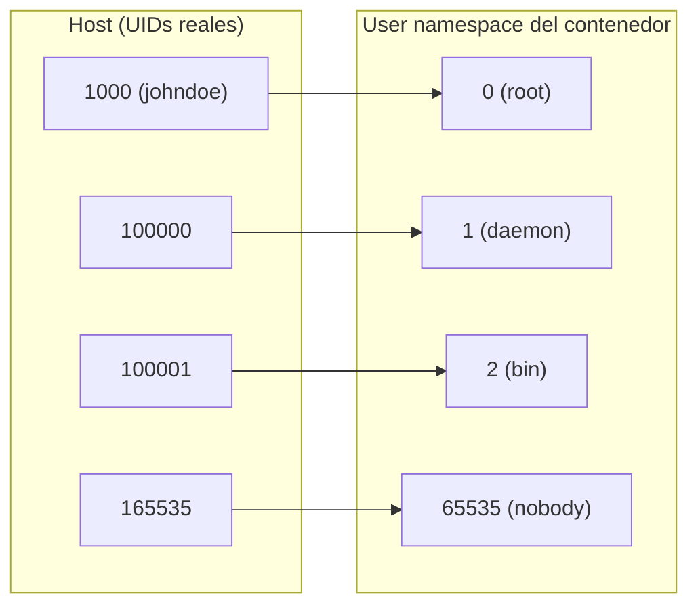
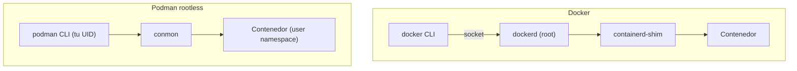

# Podman Rootless — Contenedores sin daemon ni root

## 🎯 Por qué este documento

Este documento no explica cómo instalar Podman: eso lo hace mejor la documentación oficial de tu distribución. Lo que aquí importa es **por qué el modo rootless cambia el modelo de amenaza** de tu host, qué garantías te da de verdad y cuáles no.

Si vienes de [Docker — Base](docker_base.md), el reflejo mental es "un contenedor es un proceso aislado". Con el daemon de Docker corriendo como root, ese proceso lo lanza root en tu nombre. Con Podman rootless, lo lanzas tú, con tus privilegios y ninguno más.

!!! note "Qué NO cubre este doc"
    Hardening de imágenes, gestión de secretos y escaneo: eso vive en [Docker — Seguridad y Scanning](docker_security.md). Aislamiento del kernel con gVisor o Kata: eso vive en [Docker — Seguridad Runtime](docker_runtime_security.md). Aquí hablamos solo del **modelo de privilegios del motor de contenedores**.

## 🧠 Qué significa "rootless" de verdad

Rootless no significa "el proceso dentro del contenedor no es root". Eso es `USER` en el `Dockerfile`, y es otra cosa. Rootless significa que **todo el stack** —el motor, el runtime y el contenedor— corre bajo tu UID sin privilegios en el host.

El mecanismo es el **user namespace** de Linux. Dentro del namespace tu usuario aparece como UID 0; fuera, sigue siendo tu UID normal.

```bash
# Dentro del user namespace eres "root", pero solo ahí
podman unshare id
# uid=0(root) gid=0(root) groups=0(root),65534(nobody)
```

### subuid / subgid: de dónde salen los demás UIDs

Un contenedor rara vez usa un solo UID. Necesita un rango entero para mapear los usuarios internos de la imagen. Ese rango se declara en `/etc/subuid` y `/etc/subgid`, con formato `USUARIO:UID_INICIAL:RANGO`:

```bash
cat /etc/subuid
# johndoe:100000:65536

cat /etc/subgid
# johndoe:100000:65536
```

El mapeo resultante es: **tu UID del host se mapea al UID 0 dentro del namespace**, y a continuación se añaden secuencialmente los rangos de `/etc/subuid`. Es decir, el UID 1 del contenedor es el 100000 del host, el 2 es el 100001, y así sucesivamente.



La consecuencia práctica: un proceso que consigue root **dentro** del contenedor tiene UID 0 en el namespace, pero en el host es simplemente tu usuario sin privilegios. Escapar del contenedor te deja donde ya estabas: sin ser root.

!!! warning "Esto no es una sandbox"
    Rootless reduce el impacto de una fuga, no la impide. Sigue compartiendo el kernel del host: un CVE de escalada de privilegios en el kernel te salta el user namespace igual. Si ejecutas código no confiable, rootless es un complemento a [gVisor o Kata](docker_runtime_security.md), no un sustituto.

### Storage y ficheros con UIDs raros

Los ficheros que el contenedor crea aparecen en el host con UIDs del rango de subuid, no con el tuyo. Por eso `ls` en un volumen rootless muestra números en vez de nombres. Para manipularlos entra en el namespace:

```bash
# Sin esto, chown falla: esos UIDs no te pertenecen "directamente"
podman unshare chown -R 1000:1000 ~/.local/share/containers/storage/volumes/midato/_data
```

El almacenamiento rootless vive bajo `~/.local/share/containers/storage` (y la configuración en `~/.config/containers`), no en `/var/lib/containers`. Cada usuario tiene su propio conjunto de imágenes y contenedores, invisible para los demás.

## 🔌 Daemonless: por qué importa para la superficie de ataque

Docker es cliente/servidor: el CLI habla por un socket con `dockerd`, que corre como root y es el padre de todos los contenedores. Podman no tiene daemon: el CLI hace `fork/exec` del runtime OCI (`crun` o `runc`) y los contenedores son hijos directos de tu shell o de systemd.



Qué cambia en el modelo de amenaza:

- **`/var/run/docker.sock` es root equivalente.** Cualquiera con acceso a ese socket puede lanzar un contenedor privilegiado con `/` montado y ser root en el host. Añadir un usuario al grupo `docker` es, efectivamente, darle sudo sin contraseña. Con Podman rootless no existe ese socket privilegiado.
- **No hay proceso de larga vida como root.** Un fallo de memoria o de parsing en el daemon deja de ser un vector de escalada, porque no hay daemon.
- **No hay punto único de fallo.** Reiniciar el motor no mata todos los contenedores, porque no hay motor que reiniciar.
- **Auditoría por usuario.** Los contenedores aparecen en el árbol de procesos bajo el UID que los lanzó, no todos bajo root. `auditd` y la contabilidad de cgroups atribuyen correctamente.

!!! note "Podman también tiene socket"
    Existe `podman.socket` para compatibilidad con la API de Docker (herramientas como `docker-compose` o Testcontainers). En rootless se activa con `systemctl --user enable --now podman.socket` y vive en el runtime dir del usuario, con tus privilegios. Es un socket de usuario, no un socket root: la diferencia es exactamente el punto de este apartado.

## 🔄 Migrar desde Docker: qué se rompe y qué no

El CLI de Podman es deliberadamente compatible con el de Docker. El truco clásico funciona:

```bash
alias docker=podman
# O, a nivel de sistema, el paquete podman-docker instala un
# /usr/bin/docker que apunta a podman (verifica el nombre del paquete
# en tu distribución).
```

**Lo que funciona sin cambios**: `run`, `build`, `ps`, `images`, `exec`, `logs`, `pull`, `push`, `volume`, `network`, los `Dockerfile` tal cual, y `podman-compose` o `docker compose` apuntando al socket de Podman.

**Lo que se rompe o cambia de verdad**:

| Punto de fricción | Qué pasa | Solución |
|-------------------|----------|----------|
| Puertos `<1024` | `bind: permission denied` | Ver [networking](#networking-rootless-pasta-y-slirp4netns) |
| `--privileged` | No te da más de lo que ya tienes | Sin solución: es el diseño |
| Montar `/var/run/docker.sock` | No existe | Usar `podman.socket` de usuario |
| Imágenes sin registry prefijado | Podman pregunta o falla; no asume Docker Hub | Definir `unqualified-search-registries` en `registries.conf` o escribir `docker.io/library/nginx` |
| `--net=host` con puertos bajos | Sigue sin poder bindear `<1024` | `ip_unprivileged_port_start` |
| `--cpus`, límites de memoria | Requieren cgroups v2 con delegación | Distro moderna con cgroups v2 (estándar hoy) |
| Cambiar de rootful a rootless | El storage no es el mismo | `podman system migrate` |
| Sistemas de ficheros en imágenes | Necesita `fuse-overlayfs` en kernels antiguos; overlayfs nativo en los modernos | Instalar `fuse-overlayfs` si `podman info` se queja |

!!! tip "Verifica en qué modo estás"
    `podman info` te dice el modo, el driver de storage y el backend de red. Es el primer comando que ejecutar cuando algo se comporta distinto a Docker.

## 📦 Pods: el concepto que Docker no tiene

Un **pod** de Podman es un grupo de contenedores que comparten namespaces (red y, opcionalmente, IPC y PID). Es el mismo concepto que en Kubernetes, y es nativo aquí sin necesidad de un clúster.

```bash
# Crear un pod publicando el puerto en el pod, no en el contenedor
podman pod create --name web --publish 8080:80

# Los contenedores del pod se ven entre sí por localhost
podman run -d --pod web --name app midominio/app:latest
podman run -d --pod web --name proxy nginx:alpine

podman pod ps
podman pod stop web
```

Dentro del pod, `app` alcanza a `proxy` en `localhost` porque comparten el network namespace. No hace falta una red bridge ni resolución DNS entre contenedores.

## ⚙️ Servicios de usuario: Quadlet y systemd

Aquí es donde rootless deja de ser un juguete de desarrollo. Un contenedor rootless puede ser un servicio de systemd **de usuario**, sin tocar `/etc` ni pedir sudo.

### Quadlet (recomendado)

Quadlet convierte ficheros declarativos `.container` en units de systemd generadas al vuelo. Para rootless van en `~/.config/containers/systemd/`:

```ini
# ~/.config/containers/systemd/miapp.container
[Unit]
Description=Mi aplicación
After=network-online.target

[Container]
Image=docker.io/library/nginx:alpine
PublishPort=8080:80
Volume=%h/datos:/usr/share/nginx/html:ro,Z

[Service]
Restart=always

[Install]
WantedBy=default.target
```

```bash
systemctl --user daemon-reload
systemctl --user start miapp.service
systemctl --user status miapp.service
```

!!! warning "Los servicios Quadlet no se habilitan con enable"
    La unit la genera el generador de systemd al hacer `daemon-reload`; no existe como fichero que `systemctl enable` pueda enlazar. El arranque automático se declara con `[Install] WantedBy=` dentro del propio `.container`.

### Linger: sobrevivir al logout

Por defecto, systemd mata la sesión de usuario al cerrar sesión, y con ella tus contenedores. Para un servidor eso no vale:

```bash
loginctl enable-linger $USER
loginctl show-user $USER --property=Linger
```

### `podman generate systemd` (legado)

El comando `podman generate systemd` genera units a partir de un contenedor existente. Sigue funcionando en muchas versiones pero está **deprecado en favor de Quadlet**. Úsalo solo para migrar despliegues antiguos, y verifica en tu versión si aún está disponible.

## 🌐 Networking rootless: pasta y slirp4netns

Un usuario sin privilegios no puede crear interfaces `veth` en el host ni manipular `iptables` del namespace de red raíz. Por eso el networking rootless se implementa **en espacio de usuario**.

- **pasta** (del proyecto passt): el backend por defecto en las versiones actuales de Podman rootless. Copia por defecto las direcciones y rutas IPv4/IPv6 del host, y **preserva la IP de origen** en el reenvío de puertos.
- **slirp4netns**: el backend clásico, anterior a pasta. Sigue disponible con `--network=slirp4netns`.

```bash
podman info -f '{{.Host.RootlessNetworkCmd}}'
# pasta

# Forzar un backend concreto
podman run --network=pasta ...
podman run --network=slirp4netns ...
```

Ambos traducen el tráfico en userspace, lo que tiene un coste: la ruta de datos pasa por un proceso adicional en vez de por el stack del kernel directamente. No damos cifras aquí; mídelo en tu carga si es crítico.

### Por qué no puedes bindear puertos `<1024`

No es una limitación de Podman: es Linux. Los puertos por debajo de 1024 son privilegiados y requieren `CAP_NET_BIND_SERVICE` en el namespace de red **del host**, que tu usuario no tiene. Tres salidas honestas:

**1. Bajar el umbral de puertos privilegiados** (afecta a todo el host):

```bash
# Temporal
sudo sysctl net.ipv4.ip_unprivileged_port_start=80

# Persistente
echo 'net.ipv4.ip_unprivileged_port_start=80' | sudo tee /etc/sysctl.d/99-rootless-ports.conf
sudo sysctl --system
```

**2. Redirigir con el firewall del host**: publicar en `8080` y hacer un DNAT de `80` a `8080`. Requiere sudo una sola vez, al configurarlo, no en cada arranque de contenedor.

**3. Poner un reverse proxy del sistema delante**: nginx o Caddy como servicio root escuchando en `80/443` y haciendo `proxy_pass` a los contenedores rootless en puertos altos. Es la opción habitual en producción y encaja con el [hardening del host](../cybersecurity/hardening_linux.md).

!!! danger "Piensa antes de bajar ip_unprivileged_port_start"
    Es un ajuste global: **cualquier** proceso de **cualquier** usuario podrá bindear desde ese puerto en adelante. Un usuario comprometido podría levantar un servicio falso en el 80 tras un reinicio. Si el host tiene varios usuarios, prefiere las opciones 2 o 3.

## ⚠️ Limitaciones reales de rootless

Sin adornos, esto es lo que no vas a poder hacer:

- **Puertos privilegiados**, salvo con los rodeos de arriba.
- **Montar filesystems** que requieran `CAP_SYS_ADMIN` real (NFS, CIFS, `mount -t` arbitrarios dentro del contenedor).
- **Acceso a dispositivos** que necesiten privilegios: la mayoría de `--device` con hardware crudo, y muchos escenarios de GPU requieren configuración adicional del host.
- **`--privileged` no te da poderes nuevos.** Solo levanta las restricciones que Podman añade *dentro* de tu namespace; el techo sigue siendo tu UID.
- **Ping y sockets ICMP** dependen de `net.ipv4.ping_group_range` en el host.
- **Rendimiento de red y de I/O**: el networking en userspace y `fuse-overlayfs` (en kernels que lo necesiten) añaden overhead frente al camino rootful.
- **Ajustar sysctls del host** desde el contenedor: imposible, por diseño.
- **Cargas que asumen root de verdad**: agentes de monitorización que leen todo `/proc`, herramientas de red que manipulan `iptables` del host, algunos runners de CI privilegiados.

!!! tip "Regla práctica"
    Si la carga necesita root de verdad en el host, rootless no es el problema: el diseño de la carga lo es. Si no lo necesita —que es la mayoría de servicios web, bases de datos y workers— rootless es la opción por defecto razonable.

## ⚖️ Docker vs Podman rootless

| Criterio | Docker (por defecto) | Podman rootless |
|----------|----------------------|-----------------|
| Arquitectura | Daemon `dockerd` como root | Daemonless, `fork/exec` bajo tu UID |
| Privilegios del motor | root en el host | UID sin privilegios |
| Socket de control | `/var/run/docker.sock` (root equivalente) | `podman.socket` de usuario, opcional |
| Acceso vía grupo | Grupo `docker` ≈ sudo sin contraseña | No aplica: cada usuario, su propio stack |
| Aislamiento de UIDs | Contenedor root = root del host (salvo userns-remap) | User namespace con subuid/subgid |
| Storage | `/var/lib/docker`, compartido | `~/.local/share/containers`, por usuario |
| Integración systemd | Unit del daemon | Quadlet / units de usuario, con linger |
| Pods nativos | No | Sí |
| Networking | Bridge en kernel, `iptables` | pasta / slirp4netns en userspace |
| Puertos `<1024` | Sí, el daemon es root | No sin ajustes en el host |
| Ficheros en volúmenes | UIDs directos | UIDs desplazados por el mapeo |
| Compatibilidad de CLI | Referencia | Casi total (`alias docker=podman`) |
| Impacto de una fuga | Potencialmente root en el host | Tu usuario sin privilegios |

## ✅ Checklist de adopción

- [ ] `/etc/subuid` y `/etc/subgid` con un rango suficiente por usuario (65536 es lo habitual).
- [ ] cgroups v2 con delegación activa (distro moderna).
- [ ] `podman info` sin avisos de storage ni de red.
- [ ] Decidida la estrategia de puertos: reverse proxy, DNAT o sysctl.
- [ ] Servicios definidos como Quadlet en `~/.config/containers/systemd/`.
- [ ] `loginctl enable-linger` en los usuarios de servicio.
- [ ] Registries cualificados o `unqualified-search-registries` configurado.
- [ ] Backups del storage de usuario, no de `/var/lib/containers`.
- [ ] Cargas no confiables, además, con un runtime sandboxeado.

## 🔗 Enlaces relacionados

- [Docker — Base](docker_base.md) — conceptos de contenedores e imágenes.
- [Docker — Seguridad y Scanning](docker_security.md) — hardening de imágenes, secretos y escaneo.
- [Docker — Seguridad Runtime (gVisor/Kata)](docker_runtime_security.md) — aislamiento del kernel, complementario a rootless.
- [Hardening de Servidores Linux](../cybersecurity/hardening_linux.md) — el host donde viven tus contenedores.
- [Podman — Documentación oficial](https://docs.podman.io/)
- [Podman — Repositorio en GitHub](https://github.com/containers/podman)
