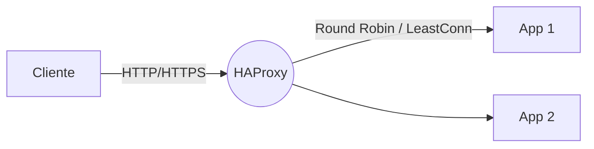
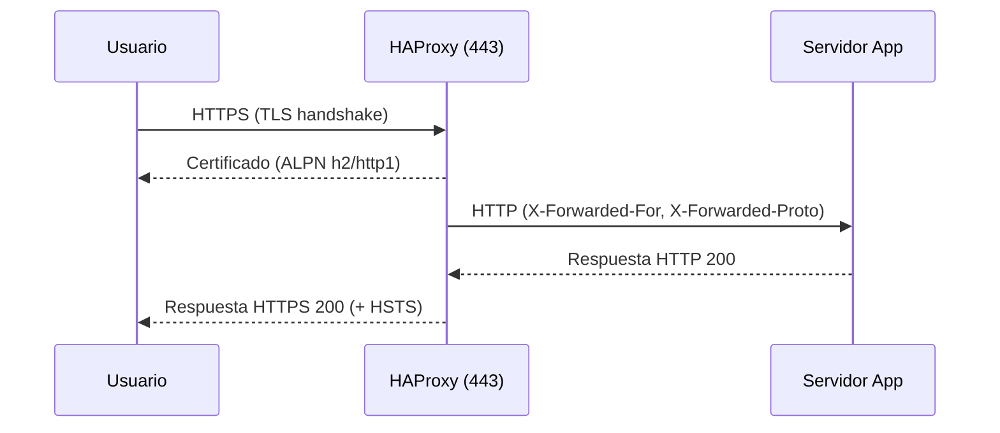

# HAProxy

Guía base de HAProxy: introducción, instalación y configuración mínima.

## Introducción

HAProxy es un balanceador de carga y proxy de alto rendimiento para TCP/HTTP.

## Instalación

- Debian/Ubuntu: `apt install haproxy`
- RHEL/CentOS/Rocky: `dnf install haproxy`

## Configuración mínima

Archivo principal: `/etc/haproxy/haproxy.cfg`.

```cfg
global
  log /dev/log local0
  maxconn 2048

defaults
  mode http
  timeout connect 5s
  timeout client  50s
  timeout server  50s

frontend http-in
  bind *:80
  default_backend app

backend app
  balance roundrobin
  server app1 10.0.0.11:8080 check
  server app2 10.0.0.12:8080 check
```

## Comprobación

```bash
haproxy -c -f /etc/haproxy/haproxy.cfg
```

## Referencias

- Documentación oficial: https://www.haproxy.org/

## Instalación avanzada

- Habilitar y arrancar:

```bash
sudo systemctl enable --now haproxy
sudo systemctl status haproxy
```

- Recarga sin corte (hot reload):

```bash
sudo haproxy -c -f /etc/haproxy/haproxy.cfg && sudo systemctl reload haproxy
```

## Terminación TLS (HTTPS)

Genera/instala un `fullchain.pem` y `privkey.pem` (por ejemplo de Let’s Encrypt) y referencia un `pem` combinado:

```bash
cat /etc/letsencrypt/live/tu-dominio/fullchain.pem \
    /etc/letsencrypt/live/tu-dominio/privkey.pem \
    | sudo tee /etc/haproxy/certs/tu-dominio.pem
```

Config en `frontend`:

```cfg
frontend https-in
  bind *:443 ssl crt /etc/haproxy/certs/tu-dominio.pem alpn h2,http/1.1
  http-response set-header Strict-Transport-Security "max-age=31536000; includeSubDomains; preload"
  redirect scheme https code 301 if !{ ssl_fc }
  default_backend app
```

Opcional: redirección 80→443

```cfg
frontend http-in
  bind *:80
  redirect scheme https code 301 if !{ ssl_fc }
```

## Health checks

Mejora la detección con `check` y paths HTTP:

```cfg
backend app
  option httpchk GET /healthz
  http-check expect status 200
  server app1 10.0.0.11:8080 check inter 3s fall 3 rise 2
  server app2 10.0.0.12:8080 check inter 3s fall 3 rise 2
```

## Sticky sessions (afinidad)

Por cookie insertada por el balanceador:

```cfg
backend app
  cookie SRV insert indirect nocache
  balance roundrobin
  server app1 10.0.0.11:8080 check cookie app1
  server app2 10.0.0.12:8080 check cookie app2
```

Por hash de IP del cliente (sin cookies):

```cfg
backend app
  balance hdr_ip(X-Forwarded-For)
```

## Métricas y panel de estado

```cfg
listen stats
  bind *:8404
  stats enable
  stats uri /
  stats refresh 10s
  stats auth admin:admin
```

## Logging

Activa logs en `global` y configura rsyslog:

```cfg
global
  log /dev/log local0
  log /dev/log local1 notice
```

En `/etc/rsyslog.d/49-haproxy.conf`:

```conf
if ($programname == 'haproxy') then /var/log/haproxy.log
& stop
```

## Buenas prácticas

- Valida la config antes de recargar: `haproxy -c -f ...`
- Usa `alpn h2,http/1.1` para mejor rendimiento en HTTPS.
- Ajusta timeouts según tus servicios y clientes.

## Ejemplo TCP (modo capa 4)

Para servicios no HTTP (p. ej., bases de datos o TCP genérico):

```cfg
defaults
  mode tcp
  timeout connect 5s
  timeout client  50s
  timeout server  50s

frontend tcp-in
  bind *:5432
  default_backend db

backend db
  balance roundrobin
  server db1 10.0.0.21:5432 check
  server db2 10.0.0.22:5432 check
```

## Balanceo `leastconn`

Distribuye al servidor con menos conexiones activas (útil para sesiones largas):

```cfg
backend app
  balance leastconn
  server app1 10.0.0.11:8080 check
  server app2 10.0.0.12:8080 check
```

## Cabeceras `X-Forwarded-*` y seguridad

Inserta cabeceras de cliente y endurece respuestas:

```cfg
frontend https-in
  bind *:443 ssl crt /etc/haproxy/certs/tu-dominio.pem alpn h2,http/1.1
  http-response set-header Strict-Transport-Security "max-age=31536000; includeSubDomains; preload"
  http-response set-header X-Content-Type-Options "nosniff"
  http-response set-header X-Frame-Options "SAMEORIGIN"
  http-response set-header Referrer-Policy "no-referrer-when-downgrade"
  http-response set-header Permissions-Policy "geolocation=(), microphone=()"
  default_backend app

backend app
  http-request set-header X-Forwarded-Proto https if { ssl_fc }
  http-request add-header X-Forwarded-Proto http if !{ ssl_fc }
  http-request set-header X-Forwarded-For %[src]
  http-request set-header X-Forwarded-Host %[req.hdr(Host)]
```

## Diagramas

### Flujo básico de balanceo HTTP



### Terminación TLS y cabeceras



## ACLs (paths/hosts) y enrutado

Rutas por path y host:

```cfg
frontend https-in
  bind *:443 ssl crt /etc/haproxy/certs/tu-dominio.pem alpn h2,http/1.1
  acl is_api path_beg /api/
  acl is_admin hdr_beg(host) -i admin.
  use_backend api if is_api
  use_backend admin if is_admin
  default_backend app

backend api
  balance leastconn
  server api1 10.0.0.31:8080 check
  server api2 10.0.0.32:8080 check

backend admin
  balance roundrobin
  server adm1 10.0.0.41:8080 check
```

## Rate limiting básico

Límite por IP usando stick-table:

```cfg
frontend https-in
  stick-table type ip size 1m expire 10m store gpc0,http_req_rate(10s)
  http-request track-sc0 src
  acl abuse sc0_http_req_rate gt 50
  http-request deny if abuse
  default_backend app
```

## Descubrimiento dinámico con `server-template`

Útil con DNS SRV/round‑robin (consul, kubernetes headless services, etc.):

```cfg
backend app
  balance roundrobin
  resolvers dns
    nameserver google 8.8.8.8:53
  server-template srv 5 _app._tcp.example.local resolvers dns resolve-prefer ipv4 check
```
