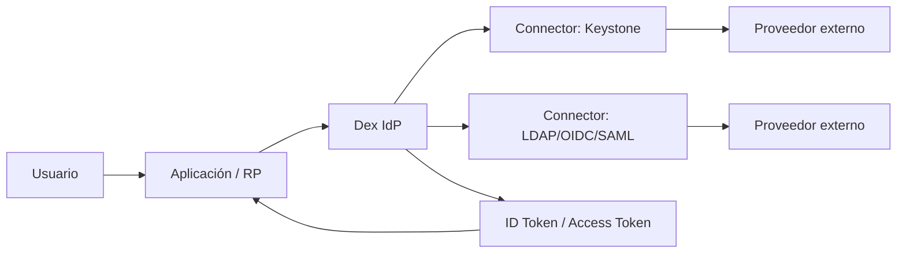
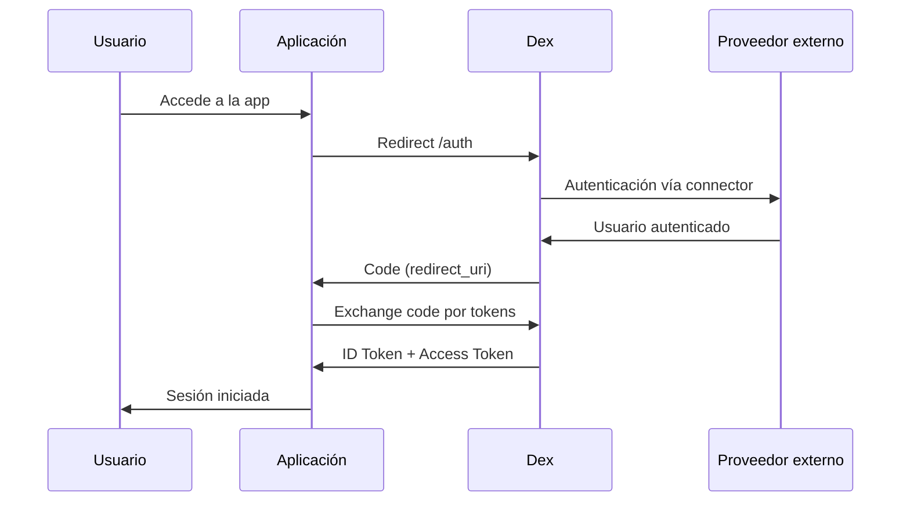

---
tags:
  - identity
  - security
  - oidc
  - dex
updated: 2026-03-01
difficulty: intermediate
estimated_time: 3 min
category: Gestión de Identidad
status: published
last_reviewed: 2026-03-01
prerequisites: ["Conocimientos básicos de OAuth2/OIDC"]
reviewers: ["@rasty94"]
contributors: ["@rasty94"]
---

# Dex IdP (OIDC Federado)

Dex es un **Identity Provider (IdP) OIDC** orientado a entornos cloud-native y self-hosted.
En Frikiteam podemos usarlo como capa de federación para centralizar autenticación de múltiples backends (LDAP, OIDC, SAML, Keystone, etc.) y exponer un flujo OIDC uniforme a nuestras aplicaciones.

- Repositorio de referencia (fork): [rasty94/dex](https://github.com/rasty94/dex)
- Imagen usada en despliegues: `ghcr.io/rasty94/dex:latest`

## Cuándo usar Dex

- Cuando varias apps necesitan **SSO** con un único endpoint OIDC.
- Cuando quieres desacoplar apps de proveedores de identidad concretos.
- Cuando necesitas una solución ligera y portable para Kubernetes o Docker.

## Arquitectura de autenticación



## Flujo OIDC (Authorization Code)



## Ejemplo rápido (Docker Compose)

```yaml
services:
  dex:
    image: ghcr.io/rasty94/dex:latest
    container_name: dex
    restart: unless-stopped
    command: ["dex", "serve", "/etc/dex/config.yaml"]
    ports:
      - "5556:5556" # OIDC HTTP
      - "5557:5557" # gRPC API (opcional)
    volumes:
      - ./config.yaml:/etc/dex/config.yaml:ro
```

## Ejemplo de `config.yaml`

```yaml
issuer: http://127.0.0.1:5556/dex

storage:
  type: sqlite3
  config:
    file: /var/dex/dex.db

web:
  http: 0.0.0.0:5556

oauth2:
  responseTypes: ["code"]
  skipApprovalScreen: false
  alwaysShowLoginScreen: true

staticClients:
  - id: grafana
    name: "Grafana"
    secret: "<client-secret>"
    redirectURIs:
      - "https://grafana.example.com/login/generic_oauth"

connectors:
  - type: keystone
    id: keystone
    name: "OpenStack Keystone"
    config:
      keystoneHost: https://keystone.example.com:5000
      domain: default
      keystoneUsername: dex-service
      keystonePassword: <keystone-password>
```

## Integración de aplicaciones (checklist)

1. Registrar la app como `staticClient` o vía API.
2. Configurar `issuer` y callback (`redirectURIs`) correctamente.
3. Validar que la URL pública de Dex sea accesible desde la app.
4. Probar login y validar claims (`sub`, `email`, `groups`).

## Buenas prácticas

- Usar TLS en producción para `web` y `grpc`.
- Mover secretos a variables de entorno/secret manager.
- Definir expiraciones y políticas de rotación de claves.
- Activar telemetría y health checks para operación day-2.

## Recursos

- Fork Frikiteam: [https://github.com/rasty94/dex](https://github.com/rasty94/dex)
- Documentación oficial Dex: [https://dexidp.io/docs/](https://dexidp.io/docs/)
