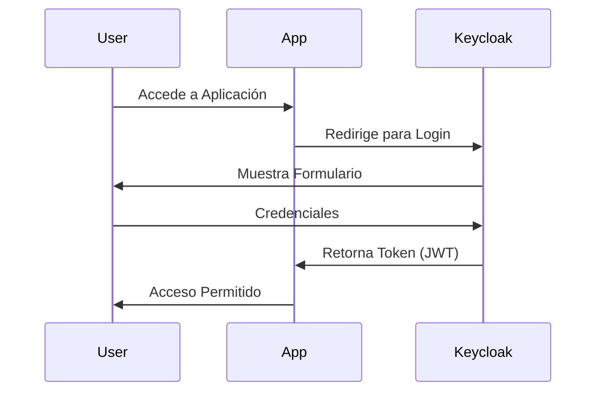

---
tags:
  - identity
  - security
  - oidc
---

# Keycloak: Gestión de Identidad

El estándar de facto open source para IAM (Identity and Access Management).

## Conceptos

- **Realm:** Espacio aislado de gestión de usuarios (ej. "Frikiteam").
- **Client:** Aplicación que delega autenticación (ej. Grafana, Proxmox).
- **Identity Provider (IdP):** Origen de usuarios externo (Google, GitHub).

## Despliegue (Docker)

```bash
docker run -p 8080:8080 -e KEYCLOAK_ADMIN=admin -e KEYCLOAK_ADMIN_PASSWORD=admin quay.io/keycloak/keycloak:24.0.1 start-dev
```

## Integración OIDC genérica

1. Crear cliente en Keycloak.
2. Obtener `Client ID` y `Client Secret`.
3. Configurar URLs de Redirect (`https://mi-app.com/callback`).

## Flujo de Autenticación OIDC


