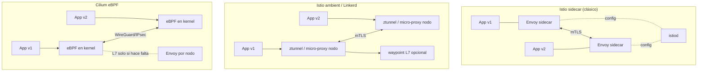

# Service Mesh en Kubernetes: Istio vs Linkerd vs Cilium

Tienes 40 microservicios hablando entre ellos en texto plano. Un equipo quiere hacer canary del 5%, otro pregunta por qué el checkout tarda 300 ms y seguridad exige cifrado en tránsito dentro del cluster. Puedes resolverlo con librerías en cada servicio (y repetirlo en Go, Python y Java), o mover esa lógica a la capa de red.

Eso es un service mesh. Y también es la pieza de infraestructura que más veces he visto instalar sin que nadie supiera exactamente qué problema estaba resolviendo. Esta guía compara las tres opciones serias que quedan en 2026 — y dedica una sección entera a la pregunta más rentable: **cuándo no instalarlo**.

## 🎯 Qué problema resuelve realmente

Un service mesh intercepta el tráfico entre pods y aplica políticas sin tocar el código de la aplicación. Cuatro capacidades justifican su existencia:

### **mTLS automático**
Cifrado y autenticación mutua entre todos los pods, con rotación de certificados gestionada. Sin mesh, cada servicio necesita su propio TLS y su propia gestión de certificados. Complementa —no sustituye— a las [NetworkPolicies y RBAC](../cybersecurity/kubernetes_security.md).

### **Observabilidad L7**
Métricas golden signals (tasa de peticiones, tasa de error, latencia p50/p95/p99) por par origen-destino, sin instrumentar la aplicación. Un mesh ve códigos HTTP y rutas; una NetworkPolicy solo ve IPs y puertos.

### **Traffic splitting**
Enviar el 5% del tráfico a la versión nueva. Sin mesh esto se hace jugando con réplicas de Deployment (granularidad pésima: con 3 pods lo mínimo es 33%).

### **Retries, timeouts y circuit breaking**
Reintentos con presupuesto, timeouts por ruta y eyección de instancias que fallan — aplicados de forma consistente en todos los lenguajes del stack.

!!! note "Lo que un service mesh NO resuelve"
    No arregla una aplicación lenta, no sustituye a un [balanceador de carga de entrada](../networking/load_balancer_comparison.md), no elimina la necesidad de trazas distribuidas con contexto de negocio (el mesh propaga headers, pero tu app debe reenviarlos) y no compensa una arquitectura de microservicios mal cortada.

## 🏗️ Arquitectura: sidecar vs sidecarless

La diferencia fundamental entre las tres opciones es **dónde vive el proxy**.



### **Istio — Envoy, dos modos**

- **Sidecar**: un contenedor Envoy inyectado en cada pod. Máxima potencia (todo el filtro L7 de Envoy), máximo coste: un proxy por pod.
- **Ambient mode**: sin sidecars. `ztunnel` (agente Rust por nodo) hace mTLS y L4; los **waypoint proxies** (Envoy, por namespace o servicio) se despliegan **solo donde necesitas L7**. Es la respuesta de Istio al coste del sidecar.
- Plano de control: `istiod`.

### **Linkerd — micro-proxy en Rust**

- Sidecar, pero un proxy propio escrito en Rust (`linkerd2-proxy`), no Envoy. Hace mucho menos que Envoy a propósito: menos superficie, menos memoria, menos configuración que romper.
- Sin CRDs de configuración masivos: usa Gateway API estándar (`HTTPRoute`) para routing.
- Plano de control: `linkerd-destination`, `linkerd-identity`, `linkerd-proxy-injector`.

### **Cilium Service Mesh — eBPF primero**

- El datapath es **eBPF en el kernel**: sin proxy en el camino para L3/L4. Cilium ya es tu CNI, así que el mesh no añade una capa nueva.
- Cifrado con **WireGuard o IPsec** a nivel de nodo (no mTLS por identidad de workload en el sentido clásico), y **mutual authentication basada en SPIFFE/SPIRE** para políticas de identidad.
- L7 (routing HTTP, Gateway API) se delega a un **Envoy por nodo**, activado solo cuando la política lo requiere.

!!! warning "Cilium no es un service mesh completo"
    Cilium cubre muy bien L3/L4, cifrado, observabilidad (Hubble) y Gateway API. Pero **no tiene el equivalente a retries con presupuesto, circuit breaking por outlier detection ni traffic splitting mesh-interno (pod a pod) al nivel de Istio/Linkerd**. El traffic splitting de Cilium pasa por Gateway API, es decir, por el gateway de entrada. Si tu caso es canary entre servicios internos, esto importa.

## 🚀 Instalación real

### **Istio — ambient mode (recomendado en despliegues nuevos)**

```bash
# Instalar Istio con el perfil ambient
istioctl install --set profile=ambient --skip-confirmation

# Enrolar un namespace en ambient (el CNI plugin usará ztunnel
# para los pods nuevos y los que se reinicien)
kubectl label namespace mi-app istio.io/dataplane-mode=ambient

# Verificar que los workloads están enrolados
istioctl ztunnel-config workloads
```

### **Istio — modo sidecar**

```bash
istioctl install --skip-confirmation

# Habilitar inyección de sidecar por namespace
kubectl label --overwrite namespace mi-app istio-injection=enabled

# Los pods existentes NO se inyectan solos: hay que reiniciarlos
kubectl rollout restart deployment -n mi-app
```

!!! tip "Migración de sidecar a ambient"
    Al pasar un namespace a ambient hay que **quitar** la etiqueta de inyección (`istio-injection` o la etiqueta de revisión) además de añadir `istio.io/dataplane-mode=ambient`. Si dejas ambas, tendrás sidecar y ztunnel a la vez.

### **Linkerd**

```bash
# Comprobar el CLI (la versión de servidor aparecerá tras instalar el control plane)
linkerd version

# 1) CRDs, 2) control plane
linkerd install --crds | kubectl apply -f -
linkerd install | kubectl apply -f -

# Validar la instalación completa
linkerd check
```

Inyección por namespace mediante anotación:

```yaml
apiVersion: v1
kind: Namespace
metadata:
  name: mi-app
  annotations:
    linkerd.io/inject: enabled
```

### **Cilium Service Mesh**

```bash
# Gateway API (requiere kube-proxy replacement)
cilium install \
    --set kubeProxyReplacement=true \
    --set gatewayAPI.enabled=true

# Mutual authentication basada en SPIRE
cilium install \
    --set authentication.mutual.spire.enabled=true \
    --set authentication.mutual.spire.install.enabled=true

# Balanceo L7 con Envoy
cilium install \
    --set kubeProxyReplacement=true \
    --set envoyConfig.enabled=true \
    --set loadBalancer.l7.backend=envoy

# Observabilidad
cilium hubble enable
```

## 🔐 mTLS y políticas de autorización

### **Istio**

mTLS estricto en todo el namespace:

```yaml
apiVersion: security.istio.io/v1
kind: PeerAuthentication
metadata:
  name: default
  namespace: mi-app
spec:
  mtls:
    mode: STRICT
```

Aislamiento por namespace (solo acepta tráfico del propio namespace):

```yaml
apiVersion: security.istio.io/v1
kind: AuthorizationPolicy
metadata:
  name: mi-app-isolation
  namespace: mi-app
spec:
  action: ALLOW
  rules:
    - from:
        - source:
            namespaces: ["mi-app"]
```

!!! danger "Migra a STRICT con PERMISSIVE de por medio"
    Aplicar `STRICT` directamente sobre un namespace con clientes sin mesh corta el tráfico al instante. El modo `PERMISSIVE` (por defecto) acepta ambos, permite verificar en métricas que todo va cifrado y luego endurecer.

### **Linkerd**

mTLS entre pods inyectados está **activo por defecto**, sin configuración. Las políticas se expresan por ruta:

```yaml
apiVersion: policy.linkerd.io/v1alpha1
kind: AuthorizationPolicy
metadata:
  name: authors-get-policy
  namespace: booksapp
spec:
  targetRef:
    group: policy.linkerd.io
    kind: HTTPRoute
    name: authors-get-route
  requiredAuthenticationRefs:
    - name: authors-get-authn
      kind: MeshTLSAuthentication
      group: policy.linkerd.io
---
apiVersion: policy.linkerd.io/v1alpha1
kind: MeshTLSAuthentication
metadata:
  name: authors-get-authn
  namespace: booksapp
spec:
  identities:
    - "books.booksapp.serviceaccount.identity.linkerd.cluster.local"
    - "webapp.booksapp.serviceaccount.identity.linkerd.cluster.local"
```

### **Cilium**

La autenticación mutua se activa dentro de una `CiliumNetworkPolicy`, no como recurso aparte:

```yaml
apiVersion: cilium.io/v2
kind: CiliumNetworkPolicy
metadata:
  name: api-requiere-auth
  namespace: mi-app
spec:
  endpointSelector:
    matchLabels:
      app: api
  ingress:
    - fromEndpoints:
        - matchLabels:
            app: frontend
      authentication:
        mode: "required"
      toPorts:
        - ports:
            - port: "8080"
              protocol: TCP
          rules:
            http:
              - method: "GET"
                path: "/api/v1/.*"
```

Con `mode: "required"`, Cilium solo permite la conexión si ambos workloads se han autenticado mutuamente vía SPIRE.

## 🔀 Canary y traffic splitting

### **Istio — VirtualService con pesos**

```yaml
apiVersion: networking.istio.io/v1
kind: VirtualService
metadata:
  name: reviews-route
spec:
  hosts:
    - reviews.prod.svc.cluster.local
  http:
    - route:
        - destination:
            host: reviews.prod.svc.cluster.local
            subset: v1
          weight: 75
        - destination:
            host: reviews.prod.svc.cluster.local
            subset: v2
          weight: 25
```

### **Linkerd — Gateway API HTTPRoute**

```yaml
apiVersion: policy.linkerd.io/v1beta2
kind: HTTPRoute
metadata:
  name: bb-route
  namespace: traffic-shift-demo
spec:
  parentRefs:
    - name: bb
      kind: Service
      group: core
      port: 8080
  rules:
    - backendRefs:
        - name: bb
          port: 8080
          weight: 90
        - name: bb-v2
          port: 8080
          weight: 10
```

### **Cilium — Gateway API en el borde**

```yaml
apiVersion: gateway.networking.k8s.io/v1beta1
kind: HTTPRoute
metadata:
  name: echo-route
spec:
  parentRefs:
    - name: cilium-gw
  hostnames:
    - "*"
  rules:
    - matches:
        - path:
            type: PathPrefix
            value: /echo
      backendRefs:
        - name: echo-1
          port: 8080
          weight: 99
        - name: echo-2
          port: 8090
          weight: 1
```

!!! tip "No shiftees tráfico a mano"
    Editar pesos manualmente en producción es cómo se producen los incidentes de viernes por la tarde. Tanto Istio como Linkerd se integran con **Flagger**, que promueve el canary automáticamente según métricas (tasa de éxito, latencia p99) y hace rollback solo si se degradan.

## 📊 Comparativa

| Aspecto | Istio (ambient) | Istio (sidecar) | Linkerd | Cilium |
|---------|-----------------|-----------------|---------|--------|
| **Datapath** | ztunnel (Rust) + waypoint Envoy | Envoy por pod | Micro-proxy Rust por pod | eBPF + Envoy por nodo |
| **mTLS por workload** | ✅ | ✅ | ✅ (por defecto) | ⚠️ SPIFFE auth + WireGuard/IPsec |
| **Traffic split interno** | ✅ | ✅ | ✅ | ❌ solo vía gateway |
| **Retries / circuit breaking** | ✅ (waypoint) | ✅ completo | ✅ básico | ❌ |
| **Observabilidad** | Prometheus + Kiali | Prometheus + Kiali | `linkerd viz` | Hubble |
| **Multi-cluster** | ⭐⭐⭐⭐⭐ | ⭐⭐⭐⭐⭐ | ⭐⭐⭐⭐ | ⭐⭐⭐⭐ Cluster Mesh |
| **Superficie de config** | Alta | Muy alta | Baja | Media |
| **Curva de aprendizaje** | ⭐⭐ dura | ⭐ muy dura | ⭐⭐⭐⭐⭐ suave | ⭐⭐⭐ (asume Cilium CNI) |
| **Requisito de CNI** | Cualquiera | Cualquiera | Cualquiera | Cilium obligatorio |
| **Gobernanza** | CNCF Graduated | CNCF Graduated | CNCF Graduated | CNCF Graduated |

## ⚡ Overhead: órdenes de magnitud, no promesas

!!! warning "Sobre estas cifras"
    Las cifras siguientes son **órdenes de magnitud** extraídas de los benchmarks publicados por los propios proyectos y del *Service Mesh Performance* de la CNCF. No son mediciones propias. El overhead depende brutalmente de RPS, tamaño de payload, si hay filtros L7 activos y del CPU del nodo. **Mide en tu cluster antes de decidir.**

| Modelo | Latencia añadida (p99, orden) | CPU/memoria por pod (orden) |
|--------|-------------------------------|-----------------------------|
| Istio sidecar (Envoy) | Unidades de ms (~2-5 ms) | ~50-100 MB y decenas de milicores **por pod** |
| Istio ambient (solo ztunnel, L4) | Menos de 1 ms | Coste por **nodo**, no por pod |
| Istio ambient + waypoint L7 | Unidades de ms en el salto L7 | Coste por namespace/servicio |
| Linkerd micro-proxy | Sub-milisegundo a ~1 ms | ~10-20 MB por pod |
| Cilium eBPF (L4) | Prácticamente nulo (sin proxy) | Coste por nodo (agente) |
| Cilium con Envoy L7 | Unidades de ms en flujos L7 | Coste por nodo |

Las conclusiones estructurales (que sí son fiables, independientemente de los números exactos):

1. **El modelo por pod escala mal.** 1.000 pods con sidecar Envoy son 1.000 proxies con su memoria base. Ambient y eBPF cambian la unidad de coste de pod a nodo.
2. **L7 cuesta.** Parsear HTTP siempre cuesta más que reenviar bytes. Si solo necesitas mTLS y L4, no pagues L7.
3. **La latencia añadida rara vez es el cuello de botella.** Suele serlo el consumo de recursos y la carga operativa.

## 🔭 Observabilidad

Los tres exportan métricas a Prometheus y encajan con el [stack de observabilidad](../monitoring/observability_stack.md) del sitio.

```bash
# Istio: dashboard Kiali (topología + tráfico en vivo)
istioctl dashboard kiali

# Linkerd: extensión viz, métricas golden signals en vivo
linkerd viz install | kubectl apply -f -
linkerd viz dashboard

# Cilium: flujos L3/L4/L7 con Hubble
cilium hubble enable
hubble observe --namespace mi-app --protocol http
```

!!! note "Métricas != trazas"
    Ningún mesh genera trazas distribuidas completas por sí solo. Propaga headers de trazado, pero **si tu aplicación no reenvía los headers `traceparent` / `b3` entre peticiones entrantes y salientes, las trazas saldrán rotas**. Ese trabajo es de la app, no del mesh.

## 🛑 Cuándo NO necesitas un service mesh

La sección más importante de esta guía. Un service mesh es una base de datos distribuida de configuración de red delante de todo tu tráfico de producción — y cuando falla, falla en todos los servicios a la vez.

**No lo instales si:**

- **Tienes menos de ~10 servicios.** Con 5 servicios conoces todas las llamadas de memoria. El mesh añade más complejidad operativa que la que elimina.
- **Todo tu stack es un lenguaje.** Si todo es Go o todo es Java, una librería compartida (o Spring Cloud, o gRPC con sus interceptores) te da retries, timeouts y mTLS con muchísima menos maquinaria.
- **Tu problema real es entrada, no este-oeste.** Si solo necesitas TLS terminado y routing por host/path, un [Ingress Controller o Gateway API](../networking/load_balancer_comparison.md) basta. El mesh es para tráfico *entre* servicios.
- **Tu requisito de cifrado es "cifrado en tránsito", sin identidad por workload.** WireGuard a nivel de CNI (Cilium, Calico) lo cubre con una fracción del coste. Si el auditor exige *identidad criptográfica por servicio*, entonces sí necesitas mTLS de mesh.
- **Tu segmentación se resuelve con NetworkPolicies.** "Frontend solo habla con API" es una [NetworkPolicy](../cybersecurity/kubernetes_security.md), no un mesh.
- **No tienes un equipo de plataforma.** Un mesh necesita alguien que entienda su modelo de datos, siga sus upgrades y sepa depurarlo a las 3 de la mañana. Sin ese dueño, el mesh es deuda técnica con dashboard bonito.
- **Aún no tienes métricas básicas.** Si no tienes ni Prometheus con métricas de aplicación, el mesh es empezar la casa por el tejado.

!!! danger "El coste oculto: depuración"
    Con mesh, un 503 puede venir de la app, del proxy origen, del proxy destino, de un timeout de política, de un certificado caducado o de una `AuthorizationPolicy` mal escrita. La superficie de depuración se multiplica. Ese coste se paga en cada incidente, no solo el día de la instalación.

## 🧭 Guía de decisión

- **Ya usas Cilium como CNI y solo quieres mTLS+observabilidad L4/L7 y Gateway API** → **Cilium Service Mesh**. Cero componentes nuevos, coste casi nulo.
- **Quieres mTLS y golden signals mañana, con el mínimo de conceptos nuevos** → **Linkerd**. Es el mesh que se instala en una tarde y no te despierta de noche.
- **Necesitas routing L7 complejo, multi-cluster, políticas de autorización finas o extensión con WASM** → **Istio en ambient mode**. Toda la potencia sin el impuesto del sidecar por pod.
- **Tienes una inversión grande en filtros Envoy o EnvoyFilter a medida** → **Istio sidecar**, hasta que ambient cubra tu caso.
- **Ninguna de las anteriores describe tu situación** → probablemente no necesites un service mesh todavía. Vuelve cuando tengas el problema.

## 🔗 Enlaces relacionados

- [Kubernetes - Orquestación de contenedores](kubernetes_base.md)
- [Probes en Kubernetes](probes.md)
- [Seguridad en Kubernetes: RBAC y NetworkPolicies](../cybersecurity/kubernetes_security.md)
- [Comparación de balanceadores de carga](../networking/load_balancer_comparison.md)
- [Stack de observabilidad](../monitoring/observability_stack.md)
- [Comparación VPN Overlay](../networking/vpn_overlay_comparison.md)

### Documentación oficial

- [Istio Ambient Mode](https://istio.io/latest/docs/ambient/)
- [Linkerd 2.18 Docs](https://linkerd.io/2.18/)
- [Cilium Service Mesh](https://docs.cilium.io/en/stable/network/servicemesh/)
