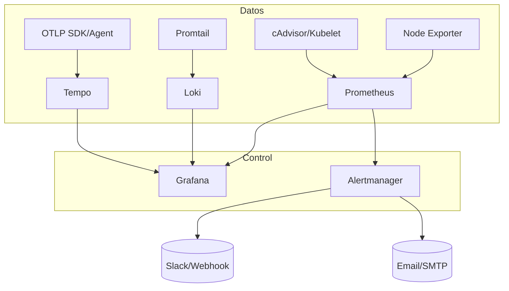

# Observabilidad: Prometheus + Grafana + Loki/Tempo + Alertmanager

Guía práctica para desplegar un stack de observabilidad unificado con métricas, logs, trazas y alertas. Incluye arquitectura, docker-compose de referencia, ajustes de retención y seguridad.

## 🎯 Objetivo
- Métricas con Prometheus + exporters
- Dashboards y alerting con Grafana
- Logs centralizados con Loki + Promtail
- Trazas distribuidas con Tempo (OTLP)
- Alertas con Alertmanager (Slack/Email)

## 🏗️ Arquitectura



## 🚀 Despliegue rápido (docker-compose)

```yaml
version: "3.9"
services:
  prometheus:
    image: prom/prometheus:v2.51.0
    volumes:
      - ./prometheus.yml:/etc/prometheus/prometheus.yml:ro
      - prom_data:/prometheus
    ports: ["9090:9090"]

  alertmanager:
    image: prom/alertmanager:v0.27.0
    volumes:
      - ./alertmanager.yml:/etc/alertmanager/alertmanager.yml:ro
    ports: ["9093:9093"]

  loki:
    image: grafana/loki:2.9.6
    command: -config.file=/etc/loki/local-config.yaml
    volumes:
      - ./loki-config.yaml:/etc/loki/local-config.yaml:ro
      - loki_data:/loki
    ports: ["3100:3100"]

  promtail:
    image: grafana/promtail:2.9.6
    command: -config.file=/etc/promtail/config.yml
    volumes:
      - ./promtail-config.yml:/etc/promtail/config.yml:ro
      - /var/log:/var/log:ro
      - /var/lib/docker/containers:/var/lib/docker/containers:ro
    depends_on: [loki]

  tempo:
    image: grafana/tempo:2.4.1
    command: ["-config.file=/etc/tempo.yaml"]
    volumes:
      - ./tempo.yaml:/etc/tempo.yaml:ro
      - tempo_data:/tmp/tempo
    ports: ["4317:4317", "3200:3200"]

  grafana:
    image: grafana/grafana:10.3.3
    ports: ["3000:3000"]
    environment:
      - GF_SECURITY_ADMIN_USER=admin
      - GF_SECURITY_ADMIN_PASSWORD=admin
      - GF_AUTH_ANONYMOUS_ENABLED=false
      - GF_FEATURE_TOGGLES_ENABLE=traceqlEditor
    volumes:
      - grafana_data:/var/lib/grafana
    depends_on: [prometheus, loki, tempo]

volumes:
  prom_data:
  loki_data:
  tempo_data:
  grafana_data:
```

## ⚙️ Configuración esencial

### Prometheus (prometheus.yml)
```yaml
global:
  scrape_interval: 15s
scrape_configs:
  - job_name: node_exporter
    static_configs:
      - targets: ["node-exporter:9100"]
  - job_name: cadvisor
    static_configs:
      - targets: ["cadvisor:8080"]
  - job_name: prometheus
    static_configs:
      - targets: ["prometheus:9090"]
alerting:
  alertmanagers:
    - static_configs:
        - targets: ["alertmanager:9093"]
```

### Alertmanager (alertmanager.yml)
```yaml
global:
  smtp_smarthost: smtp.example.com:587
  smtp_from: alerts@example.com
route:
  receiver: default
receivers:
  - name: default
    slack_configs:
      - api_url: https://hooks.slack.com/services/TOKEN
        channel: "#alerts"
```

### Loki (loki-config.yaml)
```yaml
server:
  http_listen_port: 3100
limits_config:
  retention_period: 168h  # 7d
schema_config:
  configs:
    - from: 2023-01-01
      store: boltdb-shipper
      object_store: filesystem
      schema: v12
      index:
        prefix: index_
        period: 24h
storage_config:
  filesystem:
    directory: /loki
```

### Promtail (promtail-config.yml)
```yaml
server:
  http_listen_port: 9080
positions:
  filename: /tmp/positions.yaml
clients:
  - url: http://loki:3100/loki/api/v1/push
scrape_configs:
  - job_name: varlogs
    static_configs:
      - targets: ["localhost"]
        labels:
          job: varlogs
          __path__: /var/log/*.log
```

### Tempo (tempo.yaml)
```yaml
server:
  http_listen_port: 3200
  grpc_listen_port: 4317
compactor:
  compaction:
    block_retention: 168h
storage:
  trace:
    backend: local
    local:
      path: /tmp/tempo
```

## 📈 Grafana
- **Data sources**: Prometheus, Loki, Tempo.
- **Dashboards recomendados**: Node Exporter Full, Kubernetes / Use Method, API latency percentiles, Loki logs by label, Tempo Trace Explorer.
- **Alerting**: Usa Alertmanager como notifier o alerting nativo de Grafana para casos simples.

## 🔔 Buenas prácticas de alertas
- Define SLOs (p95/p99 latencia, error rate, saturación CPU/memoria).
- Usa **inhibitions** para evitar tormenta de alertas entre servicios relacionados.
- Agrupa por `service`, `cluster`, `env` en Alertmanager para contexto claro.
- Añade **runbooks** (URL) en las anotaciones de las alertas.

## 🔒 Seguridad
- Habilita **auth** y **TLS** en Grafana y endpoints públicos (reverse proxy o ingress con mTLS).
- Restringe acceso a Prometheus/Alertmanager/Loki/Tempo detrás de VPN/ingress autenticado.
- Usa **retención** acorde a compliance (7-30 días logs; 15-30 días métricas crudas; trazas 3-7 días).
- Backup de volúmenes (Grafana, Loki index, Tempo bloques) si se requiere persistencia.

## 🧪 Verificación rápida
```bash
# Métricas
curl -s http://localhost:9090/-/ready

# Logs
curl -G -s "http://localhost:3100/loki/api/v1/labels"

# Trazas
curl -s http://localhost:3200/ready

# Dashboards
open http://localhost:3000
```

## 📌 Operación en Kubernetes (resumen)
- Usa Helm charts oficiales: `kube-prometheus-stack`, `loki-stack`, `tempo-distributed`.
- Configura `persistence.enabled=true` para Prometheus/Loki/Tempo si necesitas retención >7d.
- Habilita `serviceMonitor` y `podMonitor` para descubrir métricas automáticamente.
- Añade `networkPolicy` para limitar acceso solo desde control plane/ingress.

## ✅ Checklist
- [ ] Retención ajustada (métricas, logs, trazas)
- [ ] Alertas con contactos y runbooks
- [ ] TLS/Auth en endpoints públicos
- [ ] Dashboards base importados en Grafana
- [ ] Backups configurados si aplica
- [ ] Pruebas de carga básicas (prometheus + loki + tempo)
