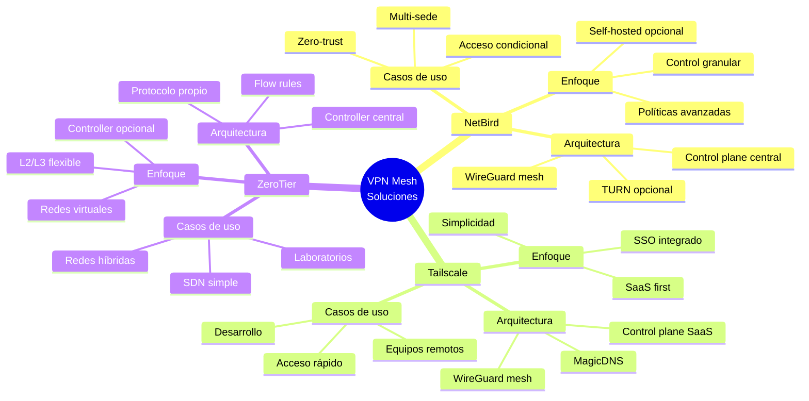
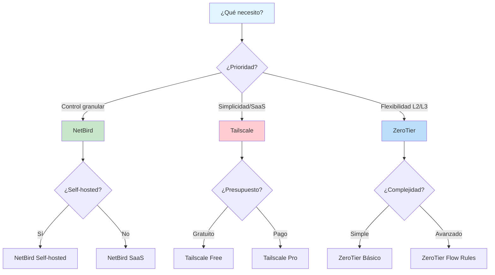
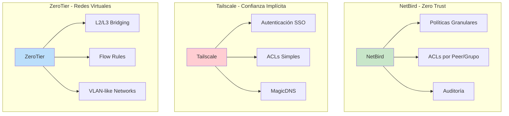

# Comparativa rápida: NetBird vs Tailscale vs ZeroTier

## Diagrama de comparación visual

## Tabla comparativa detallada

| Aspecto | NetBird | Tailscale | ZeroTier |
|---------|---------|-----------|----------|
| **Propósito** | VPN mesh con control de acceso granular | VPN mesh con SSO, enfoque simplicidad | Redes virtuales L2/L3 flexibles |
| **Instalación** | Script oficial, cliente `netbird` | Script oficial, servicio `tailscaled` | Script oficial, servicio `zerotier-one` |
| **Panel de control** | app.netbird.io o self-hosted | admin.tailscale.com (SaaS) | my.zerotier.com o controlador propio |
| **Rutas y LAN** | Políticas de acceso, rutas anunciadas | `--advertise-routes` + autorización | Managed routes por red |
| **ACLs/Políticas** | Políticas por grupos/peers | ACLs JSON centralizadas | Flow Rules a nivel de red |
| **DNS** | DNS por peer/red en panel | MagicDNS y nameservers | Asignación DNS por red |
| **Self-hosted** | Sí (control plane y TURN) | Limitado (Headscale alternativo) | Sí (controller) |
| **Casos típicos** | Acceso seguro entre sedes/servidores | Acceso entre dispositivos/equipos | Overlays L2/L3, laboratorios |

## Diagrama de flujo de decisión

## Arquitecturas comparadas

### Modelo de Seguridad

- Propósito:
  - NetBird: VPN mesh con control de acceso granular y enfoque self-hosted opcional
  - Tailscale: VPN mesh con SSO, simplicity-first, gestión central SaaS
  - ZeroTier: redes virtuales L2/L3 flexibles con controlador SaaS o propio

- Instalación:
  - NetBird: script oficial, cliente `netbird`
  - Tailscale: script oficial, servicio `tailscaled`
  - ZeroTier: script oficial, servicio `zerotier-one`

- Control/Panel:
  - NetBird: app.netbird.io o self-hosted (control plane)
  - Tailscale: admin.tailscale.com (SaaS)
  - ZeroTier: my.zerotier.com o controlador propio

- Rutas y LAN access:
  - NetBird: rutas anunciadas desde panel; políticas de acceso
  - Tailscale: `--advertise-routes` + autorización en panel
  - ZeroTier: managed routes por red

- ACLs/Políticas:
  - NetBird: políticas de acceso por grupos/peers
  - Tailscale: ACLs JSON centralizadas
  - ZeroTier: Flow Rules a nivel de red

- DNS:
  - NetBird: DNS por peer/red en panel
  - Tailscale: MagicDNS y nameservers gestionados
  - ZeroTier: asignación de DNS por red

- Self-hosted:
  - NetBird: sí (control plane y TURN opcionales)
  - Tailscale: limitado (Headscale como alternativa no oficial)
  - ZeroTier: sí (controller)

- Casos de uso típicos:
  - NetBird: acceso seguro entre sedes y servidores con control granular
  - Tailscale: acceso rápido entre dispositivos y equipos con SSO
  - ZeroTier: overlays L2/L3, laboratorios y redes híbridas
