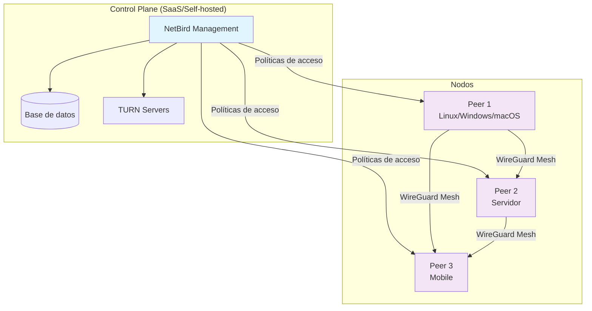
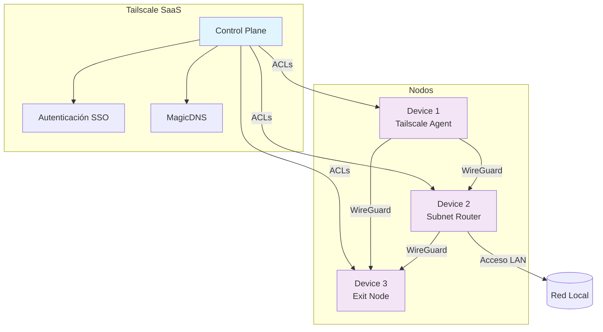
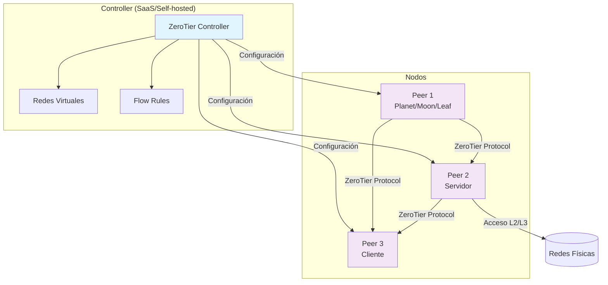

# Networking

En esta sección encontrarás guías prácticas y concisas para desplegar y configurar soluciones de red y VPN.

- [NetBird: instalación y configuración básica](netbird.md)
- [Tailscale: instalación y configuración básica](tailscale.md)
- [ZeroTier: instalación y configuración básica](zerotier.md)
- [Resolución de problemas](troubleshooting.md)
- [Comparativa rápida: NetBird vs Tailscale vs ZeroTier](compare.md)

## Arquitecturas de las soluciones VPN

### NetBird - Arquitectura Mesh con Control Plane

### Tailscale - Arquitectura con Coordinación Central

### ZeroTier - Arquitectura con Controlador Central

## Videos tutoriales

  <iframe src="https://www.youtube.com/embed/eCXl09h7lqo" frameborder="0" allowfullscreen style="position: absolute; top: 0; left: 0; width: 100%; height: 100%;"></iframe>

*Video: Redes VPN modernas - NetBird, Tailscale y ZeroTier comparados*
