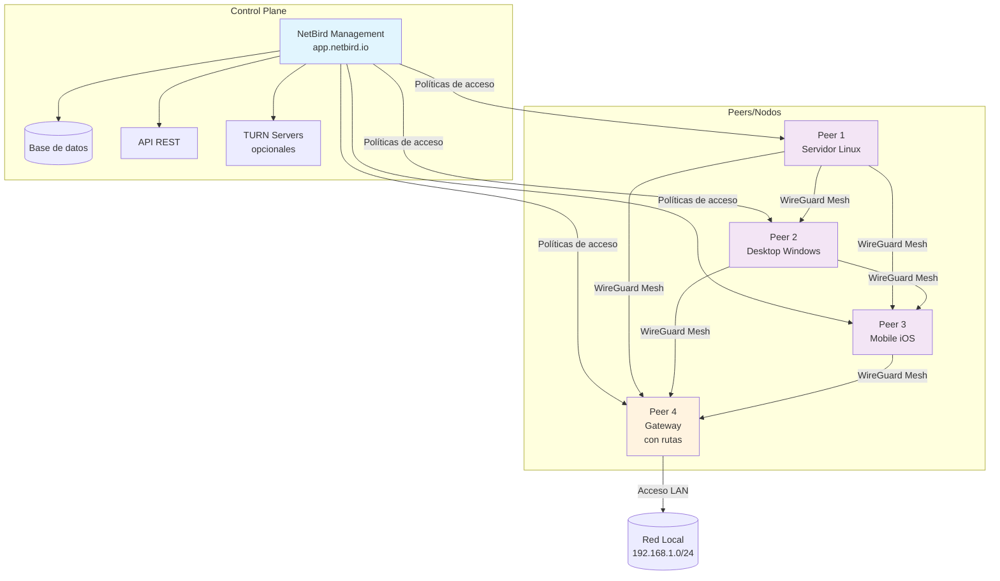
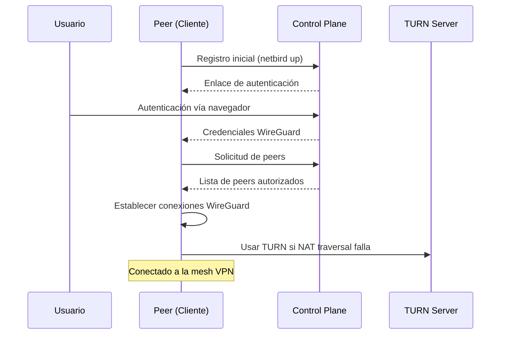

# NetBird: instalación y configuración básica

> NetBird es una solución de VPN mesh basada en WireGuard con control de acceso.

## Arquitectura de NetBird



## Flujo de conexión



## Requisitos

- Debian/Ubuntu o equivalente con `curl` y `sudo`
- Puertos salientes HTTP/HTTPS permitidos

## Instalación rápida (script oficial)

```bash
curl -fsSL https://pkgs.netbird.io/install.sh | sudo bash
```

Verifica servicio:

```bash
sudo systemctl status netbird
netbird --version
```

## Unirse a la red

1. Crea una cuenta/tenant en el panel (`https://app.netbird.io` o tu panel self-hosted)
2. Ejecuta el login y sigue el flujo del navegador:

```bash
netbird up
```

3. Verifica estado y peers:

```bash
netbird status
netbird peers
```

## Arranque y logs

```bash
sudo systemctl enable --now netbird
journalctl -u netbird -f
```

## Hardening y configuración útil

- ACLs básicas (panel):
  - Crea una política que permita tráfico solo entre grupos necesarios (ej. `role:admin` ↔ `role:infra`).
  - Deniega por defecto y permite por listas.
- DNS: configura DNS por peer o por red en el panel; en hosts Linux con `systemd-resolved` asegúrate de tenerlo activo:

```bash
sudo systemctl enable --now systemd-resolved
resolvectl status
```

- Rutas: usa rutas anunciadas en el panel para acceder a subredes detrás de un peer gateway.

### Override de systemd (orden de arranque)

```bash
sudo systemctl edit netbird
```
Contenido del drop-in:

```ini
[Unit]
After=network-online.target
Wants=network-online.target
```

Aplica cambios:

```bash
sudo systemctl daemon-reload
sudo systemctl restart netbird
```

## Notas

- NetBird usa WireGuard; evita conflictos con otras VPN activas
- Revisa políticas de acceso en el panel para permitir tráfico entre peers

## Ejemplos con contenedores (Docker)

### Conectar tus contenedores a la VPN

- Opción 1 (host networking): ejecutar NetBird en el host o en contenedor con `--network host`, y tus apps usan la pila del host.
- Opción 2 (sidecar namespace): comparte el namespace de red con tu app:

```bash
docker run -d --name netbird --cap-add NET_ADMIN --device /dev/net/tun \
  -v netbird_state:/var/lib/netbird --network container:miapp netbird:latest
```

- Opción 3 (red Docker dedicada): crea una red Docker y enruta a través del contenedor NetBird (requiere iptables/masquerade en el contenedor VPN).
