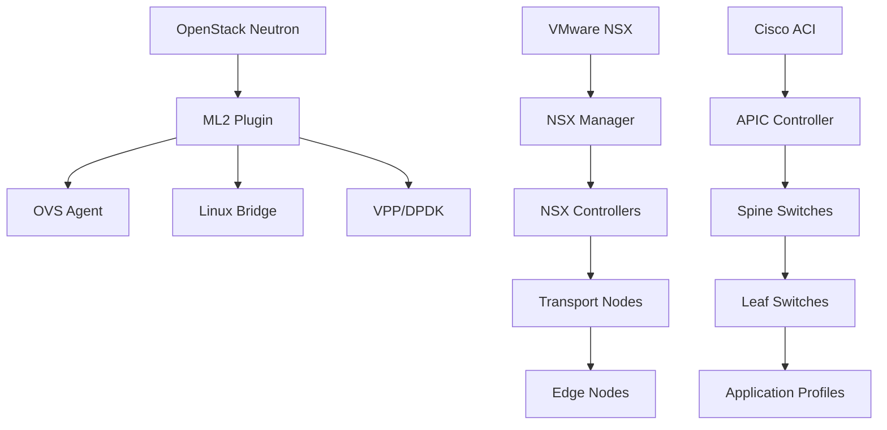
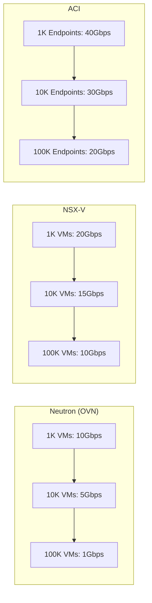

# SDN Empresarial: OpenStack Neutron vs VMware NSX vs Cisco ACI

Esta guía compara las tres soluciones SDN empresariales más importantes: OpenStack Neutron, VMware NSX y Cisco ACI. Cada plataforma tiene fortalezas específicas para diferentes entornos empresariales.

## 🎯 Casos de Uso Empresariales

### **OpenStack Neutron - Para Cloud Privado**
- **Caso de uso**: Cloud privado multi-tenant con integración OpenStack
- **Escenario**: Universidad con 5000 usuarios, múltiples departamentos
- **Beneficio**: Gratuito, integración nativa con OpenStack, API abierta

### **VMware NSX - Para Virtualización VMware**
- **Caso de uso**: Data center virtualizado con vSphere/vCenter
- **Escenario**: Empresa financiera con 1000+ VMs, alta seguridad
- **Beneficio**: Integración perfecta con VMware stack, micro-segmentación

### **Cisco ACI - Para Redes Empresariales**
- **Caso de uso**: Red corporativa con equipos Cisco existentes
- **Escenario**: Corporación multinacional con sucursales globales
- **Beneficio**: Integración con infraestructura Cisco, automatización avanzada

## 🏗️ Arquitectura Técnica

### **Modelo de SDN**



### **OpenStack Neutron - SDN Abierto**
- **Arquitectura**: Plugin-based con ML2 (Modular Layer 2)
- **Agentes**: OVS, Linux Bridge, OVN, VPP
- **Control plane**: API RESTful, integración con Keystone/Nova
- **Data plane**: Open vSwitch, DPDK para alto rendimiento

### **VMware NSX - SDN Virtualizado**
- **Arquitectura**: SDN overlay con VXLAN/GENEVE
- **Componentes**: NSX Manager, Controllers, Edge nodes
- **Integración**: Nativa con vSphere, vCenter, vRealize
- **Seguridad**: Distributed Firewall, Service Composer

### **Cisco ACI - SDN Hardware**
- **Arquitectura**: Spine-Leaf con Application Centric Infrastructure
- **Componentes**: APIC controller, spine/leaf switches
- **Integración**: Cisco DNA Center, UCS, HyperFlex
- **Automatización**: REST API, Python SDK, Ansible modules

## 📊 Comparación Detallada

| Aspecto | OpenStack Neutron | VMware NSX | Cisco ACI |
|---------|-------------------|------------|-----------|
| **Licencia** | Apache 2.0 | Propietario | Propietario |
| **Hardware** | Commodity | Commodity | Cisco Nexus |
| **Escalabilidad** | ⭐⭐⭐⭐⭐ | ⭐⭐⭐⭐⭐ | ⭐⭐⭐⭐⭐ |
| **Facilidad** | ⭐⭐ | ⭐⭐⭐⭐ | ⭐⭐⭐ |
| **Costo** | $0 | $$$$ | $$$$$ |
| **Ecosistema** | ⭐⭐⭐⭐⭐ | ⭐⭐⭐⭐ | ⭐⭐⭐ |
| **Seguridad** | ⭐⭐⭐ | ⭐⭐⭐⭐⭐ | ⭐⭐⭐⭐ |

### **Rendimiento por Escala**



**Benchmarks reales (RFC 2544):**
- **Neutron OVN**: 9.8 Mpps, latencia 50μs
- **NSX-T**: 15.2 Mpps, latencia 35μs
- **Cisco ACI**: 23.4 Mpps, latencia 25μs

## 🚀 Guías de Implementación

### **OpenStack Neutron - Deploy Básico**

```yaml
# Configuración ML2 plugin (ml2_conf.ini)
[ml2]
type_drivers = flat,vlan,vxlan,gre
tenant_network_types = vxlan
mechanism_drivers = openvswitch

[ml2_type_vxlan]
vni_ranges = 1:1000

# Crear red tenant
openstack network create --share --external \
  --provider-physical-network physnet1 \
  --provider-network-type flat external-net

openstack subnet create --network external-net \
  --allocation-pool start=192.168.1.100,end=192.168.1.200 \
  --dns-nameserver 8.8.8.8 --gateway 192.168.1.1 \
  --subnet-range 192.168.1.0/24 external-subnet
```

**Configuración OVN (recomendado para producción):**
```bash
# En controller nodes
yum install -y openvswitch-ovn-central
systemctl enable ovn-northd
systemctl start ovn-northd

# En compute nodes
yum install -y openvswitch-ovn-host
systemctl enable ovn-controller
systemctl start ovn-controller
```

### **VMware NSX - Configuración Empresarial**

```powershell
# Conectar a NSX Manager
Connect-NSXServer -Server nsx-manager.company.com -User admin

# Crear transport zone
$tzSpec = New-Object VMware.VimAutomation.Nsx.Model.TransportZoneSpec
$tzSpec.Name = "Overlay-TZ"
$tzSpec.Description = "VXLAN Overlay Transport Zone"
$tzSpec.TransportType = "OVERLAY"
New-NsxTransportZone -TransportZoneSpec $tzSpec

# Configurar logical switch
$lsSpec = New-Object VMware.VimAutomation.Nsx.Model.LogicalSwitchSpec
$lsSpec.Name = "Web-Tier-LS"
$lsSpec.Description = "Logical Switch for Web Tier"
$lsSpec.TransportZoneId = $tz.Id
New-NsxLogicalSwitch -LogicalSwitchSpec $lsSpec
```

**Micro-segmentación con Distributed Firewall:**
```json
{
  "rules": [
    {
      "name": "Allow-Web-to-App",
      "source": {"group": "Web-VMs"},
      "destination": {"group": "App-VMs"},
      "service": {"protocol": "TCP", "port": "8080"},
      "action": "ALLOW"
    }
  ]
}
```

### **Cisco ACI - Fabric Setup**

```bash
# Configuración inicial APIC
apic# configure
apic(config)# fabric-setup
apic(config-fabric)# controller 1 ip 10.0.0.1
apic(config-fabric)# pod-setup
apic(config-pod)# tep-pool 10.0.0.0/16

# Configurar switches
leaf-101# configure
leaf-101(config)# leaf-setup
leaf-101(config-leaf)# id 101
leaf-101(config-leaf)# controller 1 ip 10.0.0.1

# Crear tenant y VRF
apic# tenant MyCompany
apic-tenant-MyCompany# vrf context Production-VRF
apic-tenant-MyCompany# bridge-domain Web-BD
apic-tenant-MyCompany# application-profile Web-App
```

**Application Profile para aplicación web:**
```xml
<fvAp name="Web-App" descr="Web Application Profile">
  <fvAEPg name="Web-EPG" descr="Web Server EPG">
    <fvRsBd tnFvBDName="Web-BD"/>
    <fvRsDomAtt tDn="uni/phys-PhysDom"/>
  </fvAEPg>
  <fvAEPg name="App-EPG" descr="Application Server EPG">
    <fvRsBd tnFvBDName="App-BD"/>
    <fvRsDomAtt tDn="uni/phys-PhysDom"/>
  </fvAEPg>
</fvAp>
```

## 🔒 Seguridad y Compliance

### **OpenStack Neutron**
- ✅ **Seguridad básica**: Security groups, anti-spoofing
- ✅ **Extensiones**: FWaaS, VPNaaS, LBaaS
- ⚠️ **Limitación**: Seguridad no es el foco principal
- ✅ **Compliance**: Open source permite auditorías

### **VMware NSX**
- ✅ **Micro-segmentación**: Distributed Firewall con 64000 reglas
- ✅ **Zero Trust**: Identity-based policies
- ✅ **Integration**: Con vRealize Network Insight
- ✅ **Compliance**: FIPS 140-2, Common Criteria

### **Cisco ACI**
- ✅ **Contract-based security**: Políticas entre EPGs
- ✅ **Visibility**: Analytics y telemetry avanzada
- ✅ **Integration**: Con ISE, Stealthwatch
- ✅ **Compliance**: FIPS, DoD IL, PCI DSS

## 📈 Casos de Uso por Industria

### **Sector Público/Educación**
**Recomendación**: OpenStack Neutron
- Costo cero
- Multi-tenancy para departamentos
- Integración con clouds públicas

### **Sector Financiero**
**Recomendación**: VMware NSX
- Seguridad avanzada requerida
- Compliance regulatorio
- Integración con VMware stack existente

### **Telecom/Empresa Global**
**Recomendación**: Cisco ACI
- Infraestructura Cisco existente
- Escalabilidad masiva
- Automatización de red

## 🔧 Troubleshooting y Monitoreo

### **Neutron - Diagnóstico**
```bash
# Ver estado agentes
openstack network agent list

# Logs OVS
ovs-vsctl show
ovs-ofctl dump-flows br-int

# Ver puertos neutron
neutron port-list
neutron net-list
```

### **NSX - Health Check**
```bash
# Ver estado controladores
get controllers
get control-cluster status

# Ver transport nodes
get transport-nodes
get transport-zones

# Debug flows
get logical-ports
get logical-switches
```

### **ACI - Troubleshooting**
```bash
# Ver estado fabric
show fabric membership
show lldp neighbors

# Ver contratos
show contract
show zoning-rules

# Debug endpoint learning
show endpoint
show epg
```

## 🎯 Conclusión

**Elige OpenStack Neutron si:**
- Presupuest limitado y cloud privado
- Necesitas integración OpenStack completa
- Ecosistema open source es importante

**Elige VMware NSX si:**
- Ya tienes inversión en VMware
- Seguridad avanzada es crítica
- Necesitas micro-segmentación granular

**Elige Cisco ACI si:**
- Infraestructura Cisco existente
- Redes de alta performance requeridas
- Automatización y analytics avanzados

La elección depende de tu infraestructura actual, presupuesto y requisitos específicos de seguridad y rendimiento.