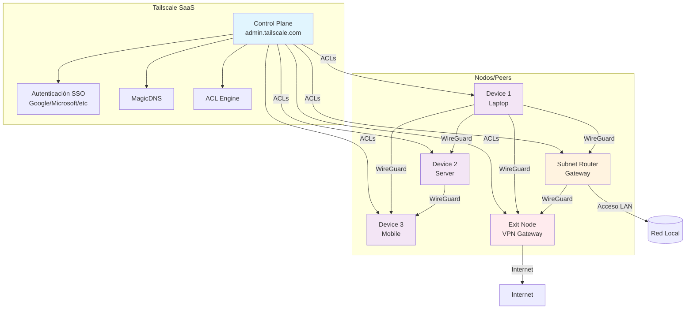
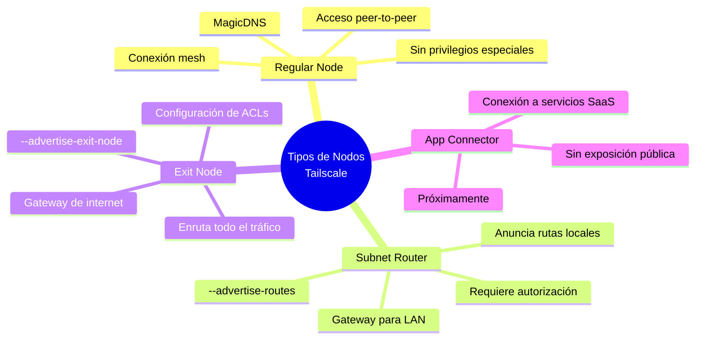

# Tailscale: instalación y configuración básica

> Tailscale crea una red mesh segura basada en WireGuard y autenticación SSO.

## Arquitectura de Tailscale



## Tipos de nodos en Tailscale



## Requisitos

- Debian/Ubuntu o equivalente con `curl` y `sudo`
- Acceso a `https://login.tailscale.com`

## Instalación rápida

```bash
curl -fsSL https://tailscale.com/install.sh | sh
```

Verifica servicio y versión:

```bash
tailscale version
sudo systemctl status tailscaled
```

## Autenticación y alta del nodo

```bash
sudo tailscale up
```

- Abre el enlace que aparece y autentícate
- En `admin.tailscale.com` autoriza el dispositivo si es necesario

## Comandos útiles

```bash
# Estado y IPs
tailscale status
ip -4 addr show tailscale0

# Habilitar al arranque
sudo systemctl enable --now tailscaled

# Salir/Desconectar
sudo tailscale down
```

## Hardening y opciones útiles

- ACLs (panel): define quién puede hablar con quién. Ejemplo mínimo (permitir a grupo admins todo):

```json
{
  "acls": [
    {"action": "accept", "src": ["group:admins"], "dst": ["*"]}
  ]
}
```

- DNS: habilita MagicDNS y define dominios de búsqueda; para fuerza DNS corporativo:

```bash
sudo tailscale up --accept-dns=true
```

- Subnet router (acceso a una LAN):

```bash
sudo tailscale up --advertise-routes=192.168.10.0/24
```
Autoriza la ruta en el panel.

### Override de systemd (asegurar red arriba)

```bash
sudo systemctl edit tailscaled
```
Contenido:

```ini
[Unit]
After=network-online.target
Wants=network-online.target
```

Aplica y reinicia:

```bash
sudo systemctl daemon-reload
sudo systemctl restart tailscaled
```

## Notas

- Evita conflictos con otras VPN WireGuard
- Revisa ACLs en el panel para controlar accesos

## Ejemplos con contenedores (Docker)

### Conectar tus contenedores a la VPN

- Opción 1 (userspace subnet router): expone puertos del contenedor Tailscale y usa `--advertise-exit-node`/`--advertise-routes` según necesidad.
- Opción 2 (namespace compartido/sidecar):

```bash
docker run -d --name tailscale \
  --cap-add NET_ADMIN --device /dev/net/tun \
  -v tailscale_state:/var/lib/tailscale \
  --network container:miapp \
  tailscale:latest
```

- Opción 3 (host networking): ejecutar Tailscale en el host o contenedor con `--network host` y el resto usa la red del host.
