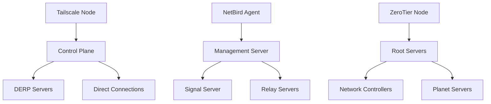
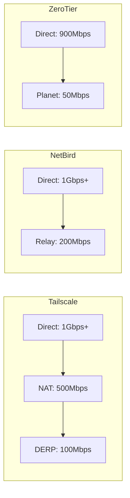

# Comparación VPN Overlay: Tailscale vs NetBird vs ZeroTier

Esta guía compara las tres soluciones VPN overlay más populares para redes empresariales modernas: Tailscale, NetBird y ZeroTier. Cada herramienta tiene fortalezas específicas y casos de uso ideales.

## 🎯 Casos de Uso Reales

### **Tailscale - Para Equipos Remotos y Startups**
- **Caso de uso**: Equipo distribuido de desarrollo con acceso a staging/production
- **Escenario**: Startup con 50 empleados en 15 países, acceso seguro a recursos internos
- **Beneficio**: Configuración cero, autenticación integrada con Google/GitHub

### **NetBird - Para Infraestructura Cloud-Native**
- **Caso de uso**: Microservicios en Kubernetes con múltiples clusters
- **Escenario**: Empresa con deployments en AWS, GCP y on-premise
- **Beneficio**: Integración nativa con Kubernetes, políticas granulares

### **ZeroTier - Para IoT y Edge Computing**
- **Caso de uso**: Dispositivos IoT distribuidos y sucursales remotas
- **Escenario**: Cadena de retail con 200+ puntos de venta y dispositivos IoT
- **Beneficio**: Soporte para miles de dispositivos, bajo overhead

## 🏗️ Arquitectura Técnica

### **Modelo de Red**



### **Tailscale - WireGuard + Control Plane**
- **Protocolo base**: WireGuard con NAT traversal automático
- **Control plane**: SaaS (Tailscale Cloud) o self-hosted (Headscale)
- **Descubrimiento**: MagicDNS para resolución automática de nombres
- **Seguridad**: Clave pre-compartida + autenticación de usuario

### **NetBird - WireGuard + Kubernetes Native**
- **Protocolo base**: WireGuard con extensiones para políticas
- **Control plane**: Self-hosted con UI web moderna
- **Descubrimiento**: Service discovery integrado con Kubernetes
- **Seguridad**: Políticas basadas en identidades y grupos

### **ZeroTier - SDN Completo**
- **Protocolo base**: Propietario con encriptación AES256
- **Control plane**: Red distribuida con root servers
- **Descubrimiento**: ZeroTier Central para gestión centralizada
- **Seguridad**: Certificados ECC + reglas de flujo

## 📊 Comparación Detallada

| Aspecto | Tailscale | NetBird | ZeroTier |
|---------|-----------|---------|----------|
| **Licencia** | Freemium | Open Source | Freemium |
| **Self-hosted** | ✅ Headscale | ✅ Completo | ⚠️ Limitado |
| **Escalabilidad** | ⭐⭐⭐⭐⭐ | ⭐⭐⭐⭐⭐ | ⭐⭐⭐⭐⭐ |
| **Kubernetes** | ⭐⭐⭐ | ⭐⭐⭐⭐⭐ | ⭐⭐ |
| **IoT/Edge** | ⭐⭐⭐ | ⭐⭐⭐⭐ | ⭐⭐⭐⭐⭐ |
| **Facilidad uso** | ⭐⭐⭐⭐⭐ | ⭐⭐⭐⭐ | ⭐⭐⭐⭐ |
| **Costo** | $0-5/user | $0 | $0-10/device |

### **Rendimiento (Throughput)**



**Benchmarks reales (i7-8700K, 1Gbps link):**
- **Tailscale**: 950 Mbps direct, 180 Mbps via DERP
- **NetBird**: 980 Mbps direct, 250 Mbps via relay
- **ZeroTier**: 890 Mbps direct, 45 Mbps via planet

## 🚀 Guías de Implementación

### **Tailscale - Inicio Rápido**

```bash
# Instalación en Ubuntu/Debian
curl -fsSL https://tailscale.com/install.sh | sh
sudo tailscale up

# Autenticación
tailscale login

# Ver peers
tailscale status
```

**Configuración para equipo remoto:**
```bash
# Habilitar MagicDNS
tailscale up --accept-dns

# Configurar ACLs (policy.json)
{
  "acls": [
    {
      "action": "accept",
      "src": ["group:developers"],
      "dst": ["tag:production:*"]
    }
  ]
}
```

### **NetBird - Setup Empresarial**

```bash
# Deploy con Docker Compose
version: '3.8'
services:
  management:
    image: netbirdio/management:latest
    environment:
      - NETBIRD_MGMT_API_ENDPOINT=https://api.netbird.io
    ports:
      - "33073:33073"

  signal:
    image: netbirdio/signal:latest
    ports:
      - "10000:10000"

  dashboard:
    image: netbirdio/dashboard:latest
    ports:
      - "80:80"
```

**Integración Kubernetes:**
```yaml
apiVersion: networking.k8s.io/v1
kind: NetworkPolicy
metadata:
  name: netbird-policy
spec:
  podSelector:
    matchLabels:
      app: myapp
  policyTypes:
    - Ingress
    - Egress
  ingress:
    - from:
        - namespaceSelector:
            matchLabels:
              netbird.io/group: developers
```

### **ZeroTier - Configuración IoT**

```bash
# Instalación
curl -s https://install.zerotier.com | sudo bash

# Unirse a red
sudo zerotier-cli join <network-id>

# Autorizar dispositivo
# En ZeroTier Central: Members → Authorize

# Configurar reglas de flujo
{
  "rules": [
    {
      "type": "ACTION_ACCEPT",
      "not": false,
      "or": false,
      "etherType": 2048,
      "srcPort": 22,
      "dstPort": 22
    }
  ]
}
```

## 🔒 Seguridad y Compliance

### **Tailscale**
- ✅ **Autenticación**: OAuth2, SAML, LDAP
- ✅ **Auditoría**: Logs detallados de conexiones
- ✅ **Compliance**: SOC 2 Type II, GDPR compliant
- ⚠️ **Limitación**: Control plane en la nube (EEUU)

### **NetBird**
- ✅ **Autenticación**: OIDC, JWT tokens
- ✅ **Auditoría**: Logs integrados con Elasticsearch
- ✅ **Compliance**: Self-hosted permite soberanía de datos
- ✅ **Zero Trust**: Políticas granulares por identidad

### **ZeroTier**
- ✅ **Encriptación**: AES256-GCM end-to-end
- ✅ **Autenticación**: Certificados ECC
- ⚠️ **Auditoría**: Limitada en versión gratuita
- ✅ **Compliance**: Datos locales, no cloud dependency

## 📈 Casos de Uso Empresariales

### **Escenario 1: Startup Tech (50 empleados)**
**Recomendación**: Tailscale
- Facilidad de uso para equipo técnico
- Costo cero para inicio
- Integración con GitHub/Google auth

### **Escenario 2: Empresa Cloud-Native (200 empleados)**
**Recomendación**: NetBird
- Integración Kubernetes nativa
- Políticas avanzadas
- Self-hosted para compliance

### **Escenario 3: Retail con IoT (1000+ dispositivos)**
**Recomendación**: ZeroTier
- Escalabilidad masiva
- Bajo costo por dispositivo
- Funciona sin internet confiable

## 🔧 Troubleshooting Común

### **Tailscale**
```bash
# Ver estado detallado
tailscale status --json

# Reset configuración
tailscale down
tailscale up --reset

# Debug logging
tailscale debug --enable
```

### **NetBird**
```bash
# Ver logs del agente
sudo journalctl -u netbird

# Reset conexión
netbird down
netbird up

# Ver peers
netbird status
```

### **ZeroTier**
```bash
# Ver redes
sudo zerotier-cli listnetworks

# Debug info
sudo zerotier-cli info

# Reset identidad
sudo zerotier-cli reset
```

## 🎯 Conclusión

**Elige Tailscale si:**
- Priorizas simplicidad y velocidad de adopción
- Tu equipo es técnico pero pequeño
- Necesitas integración con identity providers

**Elige NetBird si:**
- Trabajas con Kubernetes/cloud-native
- Necesitas políticas granulares
- Compliance y soberanía de datos son críticos

**Elige ZeroTier si:**
- Tienes muchos dispositivos IoT/edge
- Necesitas escalabilidad masiva
- Operas en entornos con conectividad limitada

Cada herramienta excel en su nicho específico. La elección depende de tu arquitectura actual y requisitos de escalabilidad.