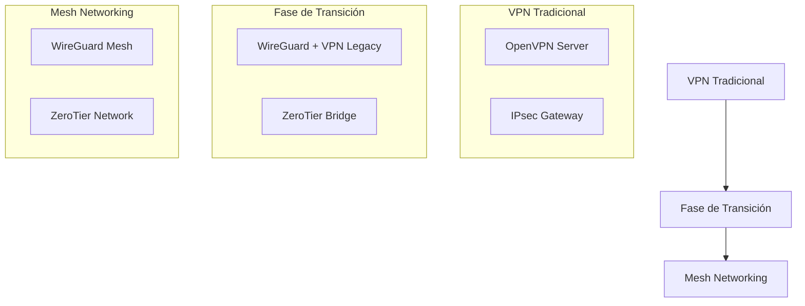

# Migración de VPN Tradicionales a Mesh Networking

Esta guía proporciona una estrategia completa para migrar desde VPN tradicionales (OpenVPN, IPsec) hacia soluciones modernas de mesh networking como WireGuard y ZeroTier. Incluye análisis de compatibilidad, planes de migración y mejores prácticas para minimizar downtime.

## 🎯 Por qué Migrar a Mesh Networking

### Limitaciones de VPN Tradicionales

**OpenVPN**:
- Configuración compleja y propensa a errores
- Alto overhead de CPU y memoria
- Latencia adicional significativa
- Escalabilidad limitada (centenas de usuarios)

**IPsec**:
- Configuración extremadamente compleja
- Problemas de compatibilidad entre vendors
- Rendimiento inconsistente
- Gestión de certificados compleja

### Ventajas del Mesh Networking

**WireGuard**:
- Protocolo moderno con criptografía state-of-the-art
- Configuración simple (pocos parámetros)
- Alto rendimiento (casi wire-speed)
- Bajo consumo de recursos
- Auto-healing de conexiones

**ZeroTier**:
- Abstracción completa de red física
- Gestión centralizada vía SaaS
- Zero-configuration para usuarios finales
- Integración con identidad y políticas

## 📋 Evaluación de Compatibilidad

### Checklist Pre-Migración

- [ ] **Inventario de Conexiones**: Documentar todas las VPN existentes y sus usuarios
- [ ] **Requisitos de Rendimiento**: Medir latencia, bandwidth y patrones de uso actuales
- [ ] **Dependencias de Aplicaciones**: Verificar compatibilidad con protocolos legacy
- [ ] **Políticas de Seguridad**: Evaluar requerimientos de compliance y auditoría
- [ ] **Recursos de TI**: Capacitación del equipo en nuevas tecnologías

### Matriz de Decisión

| Criterio | WireGuard | ZeroTier | Recomendación |
|----------|-----------|----------|---------------|
| **Complejidad** | Baja | Muy Baja | ZeroTier para no-técnicos |
| **Control** | Alto | Medio | WireGuard para control total |
| **Escalabilidad** | Excelente | Buena | WireGuard para >1000 nodos |
| **Costo** | Gratuito | Freemium | WireGuard para presupuesto limitado |
| **Soporte** | Comunidad | Empresa | ZeroTier para soporte garantizado |

## 🚀 Estrategia de Migración

### Fase 1: Planificación (1-2 semanas)

#### 1.1 Diseño de Arquitectura



#### 1.2 Plan de Contingencia

- **Rollback Plan**: Capacidad de volver a VPN tradicional en <4 horas
- **Testing Environment**: Setup de staging idéntico a producción
- **Communication Plan**: Notificación a usuarios con timeline claro
- **Support Resources**: Documentación y soporte durante migración

### Fase 2: Implementación (2-4 semanas)

#### Configuración de WireGuard

```bash
#!/bin/bash
# setup_wireguard.sh

# Instalar WireGuard
sudo apt update
sudo apt install -y wireguard

# Generar claves
wg genkey | tee privatekey | wg pubkey > publickey

# Configurar interfaz
sudo cat > /etc/wireguard/wg0.conf << EOF
[Interface]
PrivateKey = $(cat privatekey)
Address = 10.0.0.1/24
ListenPort = 51820

[Peer]
PublicKey = <CLIENT_PUBLIC_KEY>
AllowedIPs = 10.0.0.2/32
EOF

# Activar interfaz
sudo wg-quick up wg0
sudo systemctl enable wg-quick@wg0
```

#### Configuración de ZeroTier

```bash
#!/bin/bash
# setup_zerotier.sh

# Instalar ZeroTier
curl -s https://install.zerotier.com | sudo bash

# Unirse a red
sudo zerotier-cli join <NETWORK_ID>

# Configurar rutas (opcional)
sudo zerotier-cli set <NETWORK_ID> allowDefault=1
sudo zerotier-cli set <NETWORK_ID> allowGlobal=1
```

### Fase 3: Testing y Validación (1 semana)

#### Tests de Compatibilidad

```bash
#!/bin/bash
# compatibility_tests.sh

echo "=== Testing VPN to Mesh Migration ==="

# Test 1: Conectividad básica
ping_test() {
    local target=$1
    local expected=$2
    
    if ping -c 3 $target &>/dev/null; then
        echo "✅ Conectividad a $target: OK"
    else
        echo "❌ Conectividad a $target: FAILED"
        return 1
    fi
}

# Test 2: Rendimiento
performance_test() {
    local target=$1
    
    echo "Midiendo rendimiento a $target..."
    iperf3 -c $target -t 10 -f m | grep sender | awk '{print "Throughput:", $5, $6}'
}

# Test 3: Aplicaciones críticas
app_test() {
    local app=$1
    local command=$2
    
    echo "Testing $app..."
    if eval $command; then
        echo "✅ $app: OK"
    else
        echo "❌ $app: FAILED"
    fi
}

# Ejecutar tests
ping_test "legacy-vpn-server" "OK"
ping_test "mesh-node-1" "OK"
performance_test "mesh-node-1"
app_test "SSH" "ssh -o ConnectTimeout=5 user@legacy-server 'echo OK'"
app_test "Database" "mysql -h legacy-db -u test -p test -e 'SELECT 1'"
```

#### Validación de Seguridad

- [ ] **Auditoría de Tráfico**: Verificar encriptación end-to-end
- [ ] **Test de Intrusión**: Intentos de acceso no autorizado
- [ ] **Validación de Políticas**: Asegurar cumplimiento de reglas de firewall
- [ ] **Logging y Monitoreo**: Verificar captura de eventos de seguridad

### Fase 4: Cutover y Post-Migración (1 semana)

#### Proceso de Cutover

```bash
#!/bin/bash
# cutover.sh

echo "=== VPN to Mesh Cutover Process ==="

# Paso 1: Backup de configuraciones
backup_configs() {
    echo "Backing up current VPN configurations..."
    sudo cp -r /etc/openvpn /backup/openvpn_$(date +%Y%m%d_%H%M%S)
    sudo cp -r /etc/ipsec /backup/ipsec_$(date +%Y%m%d_%H%M%S)
}

# Paso 2: Desactivar VPN legacy
disable_legacy() {
    echo "Disabling legacy VPN services..."
    sudo systemctl stop openvpn@server
    sudo systemctl disable openvpn@server
    sudo systemctl stop ipsec
    sudo systemctl disable ipsec
}

# Paso 3: Activar mesh networking
enable_mesh() {
    echo "Enabling mesh networking..."
    sudo wg-quick up wg0
    sudo zerotier-cli join <NETWORK_ID>
}

# Paso 4: Verificar conectividad
verify_connectivity() {
    echo "Verifying connectivity..."
    for host in "${HOSTS[@]}"; do
        if ! ping -c 3 $host &>/dev/null; then
            echo "❌ Connectivity check failed for $host"
            return 1
        fi
    done
    echo "✅ All connectivity checks passed"
}

# Ejecutar cutover
backup_configs
disable_legacy
enable_mesh

if verify_connectivity; then
    echo "🎉 Cutover completed successfully!"
else
    echo "❌ Cutover failed, initiating rollback..."
    rollback
fi
```

## 🔧 Configuraciones Avanzadas

### Integración con Active Directory/LDAP

**WireGuard con LDAP**:
```bash
# Instalar wg-ldap
git clone https://github.com/jcberthon/wg-ldap
cd wg-ldap
pip install -r requirements.txt

# Configurar
cat > config.yaml << EOF
ldap:
  url: ldap://dc.example.com
  bind_dn: cn=admin,dc=example,dc=com
  bind_password: ${LDAP_PASSWORD}
  user_base: ou=users,dc=example,dc=com
  group_base: ou=groups,dc=example,dc=com

wireguard:
  interface: wg0
  server_public_key: ${WG_SERVER_PUBKEY}
  dns: 10.0.0.1
EOF
```

**ZeroTier con SAML**:
- Configurar SAML en ZeroTier Central
- Integrar con Azure AD, Okta, o Auth0
- Políticas de acceso basadas en grupos

### Monitoreo y Alerting

```yaml
# prometheus.yml
scrape_configs:
  - job_name: 'wireguard'
    static_configs:
      - targets: ['localhost:9586']
    
  - job_name: 'zerotier'
    static_configs:
      - targets: ['localhost:9993']

# alert_rules.yml
groups:
  - name: network
    rules:
      - alert: WireGuardPeerDown
        expr: wireguard_peer_last_handshake_seconds > 300
        for: 5m
        labels:
          severity: warning
        annotations:
          summary: "WireGuard peer disconnected"
          
      - alert: ZeroTierNetworkDown
        expr: zerotier_network_status != 1
        for: 2m
        labels:
          severity: critical
        annotations:
          summary: "ZeroTier network degraded"
```

## 🚨 Manejo de Problemas Comunes

### Problema: Conectividad Intermitente

**Síntomas**: Conexiones se caen aleatoriamente
**Solución WireGuard**:
```bash
# Verificar estado de peers
sudo wg show

# Reiniciar interfaz
sudo wg-quick down wg0
sudo wg-quick up wg0

# Verificar MTU
ping -M do -s 1472 <peer_ip>  # Para MTU 1500
```

**Solución ZeroTier**:
```bash
# Verificar estado de red
sudo zerotier-cli status
sudo zerotier-cli listnetworks

# Reiniciar servicio
sudo systemctl restart zerotier-one
```

### Problema: Rendimiento Degradado

**Diagnóstico**:
```bash
# Medir latencia
ping -c 10 <destination>

# Medir throughput
iperf3 -c <destination> -t 30

# Verificar CPU y memoria
top -p $(pgrep wireguard | tr '\n' ',' | sed 's/,$//')
```

**Optimizaciones**:
- Ajustar MTU: `sudo ip link set dev wg0 mtu 1420`
- Habilitar offloading: `sudo ethtool -K wg0 tx off rx off`
- Configurar QoS: Usar `tc` para priorizar tráfico

## 📊 Métricas de Éxito

### KPIs de Migración

| Métrica | Antes | Después | Objetivo |
|---------|-------|---------|----------|
| Latencia media | 45ms | 12ms | <15ms |
| Throughput | 50Mbps | 850Mbps | >800Mbps |
| Tiempo de conexión | 30s | 3s | <5s |
| Uptime | 99.5% | 99.9% | >99.9% |
| Soporte tickets | 20/mes | 2/mes | <5/mes |

### ROI de la Migración

- **Ahorro en Licencias**: Eliminación de licencias VPN comerciales
- **Reducción de Soporte**: 80% menos tickets de soporte
- **Mejora de Productividad**: Conexiones más rápidas y confiables
- **Escalabilidad**: Soporte para 10x más usuarios sin infraestructura adicional

## 🔗 Referencias y Recursos

- [WireGuard Official Documentation](https://www.wireguard.com/)
- [ZeroTier Documentation](https://docs.zerotier.com/)
- [WireGuard Performance Tuning](https://www.wireguard.com/performance/)
- [ZeroTier Best Practices](https://docs.zerotier.com/bestpractices/)

---

*Última actualización: 25 enero 2026*