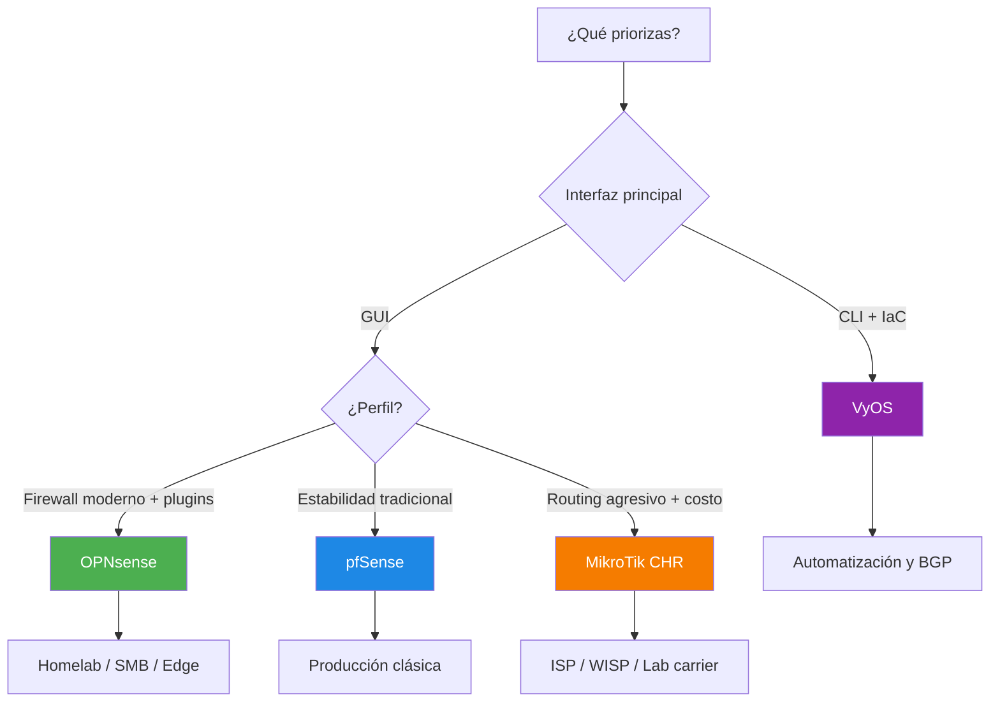

Cuando necesitas enrutamiento avanzado, firewalling y servicios de red en formato virtual, las opciones más comunes son **OPNsense**, **pfSense**, **MikroTik CHR** y **VyOS**.

Este documento resume diferencias clave y te ayuda a elegir según el escenario.

## Guías por plataforma

- [Plantilla de benchmark de vRouters](vrouter_benchmark_template.md)
- [OPNsense: guía rápida para homelab y edge](vrouter_opnsense.md)
- [pfSense: guía rápida para producción tradicional](vrouter_pfsense.md)
- [MikroTik CHR: guía rápida para routing L3](vrouter_mikrotik_chr.md)
- [VyOS: guía rápida para automatización y BGP/OSPF](vrouter_vyos.md)

## Casos de uso típicos

- Laboratorios de redes y ciberseguridad
- Routers virtuales en homelab o edge
- Firewall perimetral en infraestructura on-prem
- BGP/OSPF estático-dinámico en entornos híbridos
- VPN site-to-site y acceso remoto

## Comparativa rápida

| Solución | Base tecnológica | Fortalezas | Limitaciones | Escenario recomendado |
| -------- | ---------------- | ---------- | ------------ | --------------------- |
| **OPNsense** | FreeBSD + pf | UI moderna, buen ecosistema de plugins, actualizaciones frecuentes | Menos documentación histórica que pfSense | Homelab, pyme, edge con foco en seguridad |
| **pfSense** | FreeBSD + pf | Muy estable, comunidad amplia, gran madurez operativa | Cambios de licensing/ecosistema según edición | Producción tradicional y entornos consolidados |
| **MikroTik CHR** | RouterOS | Alto rendimiento por costo, features de routing muy amplias | Curva de aprendizaje de RouterOS, licencia por throughput | ISP/WISP, routing L3 intensivo, laboratorios de carrier |
| **VyOS** | Linux + FRR + nftables/iptables | CLI declarativa, fuerte en automatización IaC y routing avanzado | Menos amigable para quien prefiera GUI completa | Automatización, BGP/OSPF, backbone virtual |

## Tabla técnica avanzada

| Criterio | OPNsense | pfSense | MikroTik CHR | VyOS |
| -------- | -------- | ------- | ------------ | ---- |
| Plano de gestión | GUI web + CLI limitada | GUI web + shell | GUI WinBox/WebFig + CLI RouterOS | CLI declarativa + API/automatización |
| Routing dinámico (BGP/OSPF) | Soportado (plugins/FRR) | Soportado (FRR paquete) | Muy robusto en RouterOS | Muy robusto con FRR nativo |
| Enfoque principal | Firewall/UTM moderno | Firewall estable y maduro | Routing de alto rendimiento | Routing + automatización infra as code |
| VPN habitual | IPsec, OpenVPN, WireGuard | IPsec, OpenVPN, WireGuard | IPsec, WireGuard, L2TP/PPTP legacy | IPsec, OpenVPN, WireGuard |
| Alta disponibilidad | CARP/failover y sync de config | CARP/failover y sync de config | VRRP/failover según diseño | VRRP/HA según arquitectura |
| Curva de aprendizaje | Baja-media | Baja-media | Media-alta | Media-alta |
| Automatización | Media (API/plugins) | Media (API/backup config) | Alta (scripts/Ansible/API RouterOS) | Alta (GitOps + plantillas CLI) |
| Perfil recomendado | SMB, edge seguro, homelab | Producción clásica y conservadora | ISP/WISP y laboratorios carrier | Entornos DevOps/NetOps automatizados |

## Benchmarks objetivo (laboratorio inicial)

| KPI | Objetivo base | Cómo medirlo | Criterio de aceptación |
| --- | ------------- | ------------ | ---------------------- |
| Throughput L3 (sin cifrado) | >= 1 Gbps sostenido | `iperf3` TCP/UDP entre segmentos | Variación < 15% entre 3 corridas |
| Throughput VPN site-to-site | >= 300 Mbps sostenido | `iperf3` a través del túnel | Uso CPU < 80% promedio |
| Latencia intra-sede | <= 5 ms adicional | `ping` baseline vs con vRouter | Delta estable sin picos anómalos |
| Pérdida de paquetes | <= 0.5% | `mtr`/`ping -f` controlado | Sin pérdida sostenida > 1 minuto |
| Convergencia de failover | <= 30 s | Corte controlado de enlace/peer | Recuperación sin intervención manual |
| Estabilidad de sesiones | 0 reinicios no planificados | Monitorización 24-72 h | Sin caída de plano de control |

Notas:

- Ejecuta tests en hora valle y hora pico para detectar degradación por carga.
- Mantén el mismo tamaño de paquete y paralelismo al comparar plataformas.
- Repite pruebas tras cambios de versión, drivers o tipo de hipervisor.
- Si necesitas objetivos por contexto (homelab, pyme, ISP/WISP), usa la [Plantilla de benchmark de vRouters](vrouter_benchmark_template.md).

## Hardening mínimo homogéneo (todas las plataformas)

- Cambia credenciales por defecto y elimina usuarios no necesarios.
- Restringe acceso de administración por IP/red de gestión dedicada.
- Habilita MFA para GUI/portal administrativo cuando esté disponible.
- Desactiva servicios de gestión no utilizados (SSH, API, GUI pública).
- Aplica política `deny by default` en WAN y reglas explícitas por servicio.
- Separa redes de gestión, usuarios y servidores (VLAN/zonas).
- Activa logs de seguridad y envíalos a un colector central.
- Configura NTP fiable para trazabilidad de eventos y auditoría.
- Cifra y valida backups de configuración; prueba restore periódicamente.
- Define proceso de parcheo con ventana de mantenimiento y rollback.

## Qué elegir según prioridad

## Criterios técnicos clave

### 1) Routing dinámico

- **VyOS** y **MikroTik CHR** destacan en BGP/OSPF para topologías complejas.
- **OPNsense/pfSense** cubren routing dinámico, pero suelen brillar más como firewall/UTM.

### 2) Operación diaria

- Si prefieres **GUI completa**, OPNsense/pfSense te reducen fricción.
- Si priorizas **GitOps/automatización**, VyOS encaja mejor por su modelo declarativo en CLI.

### 3) VPN y acceso remoto

- Todas soportan VPN site-to-site y acceso remoto (IPsec/WireGuard/OpenVPN según versión y paquetes).
- Verifica compatibilidad exacta por versión antes de estandarizar en producción.

### 4) Licenciamiento y soporte

- Revisa siempre edición/comercialización vigente para evitar sorpresas en upgrades.
- En entornos críticos, valida soporte enterprise o partner local.

## Recomendaciones prácticas

- Empieza con una **prueba de concepto** con tráfico realista (north-south y east-west).
- Define KPIs: latencia, throughput, failover, tiempo de recuperación.
- Documenta backup/restore de configuración y procedimiento de rollback.
- Versiona la configuración (cuando sea posible) para auditar cambios.
- Cierra cada evaluación con informe ejecutivo corto (riesgos, acciones 7/30 días y decisión final).

## Checklist de decisión

- ¿Necesitas GUI o CLI declarativa?
- ¿La prioridad es firewall, routing avanzado o ambos?
- ¿Cuántos túneles VPN y peers BGP vas a mantener?
- ¿Qué capacidad de operación tiene el equipo (NetOps/SecOps)?
- ¿Hay requisitos de soporte comercial y SLA?

Si dudas entre dos opciones, compara ambas en el mismo laboratorio durante una semana y decide por métricas, no por preferencia personal.
