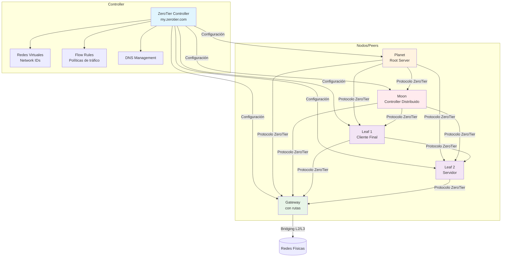
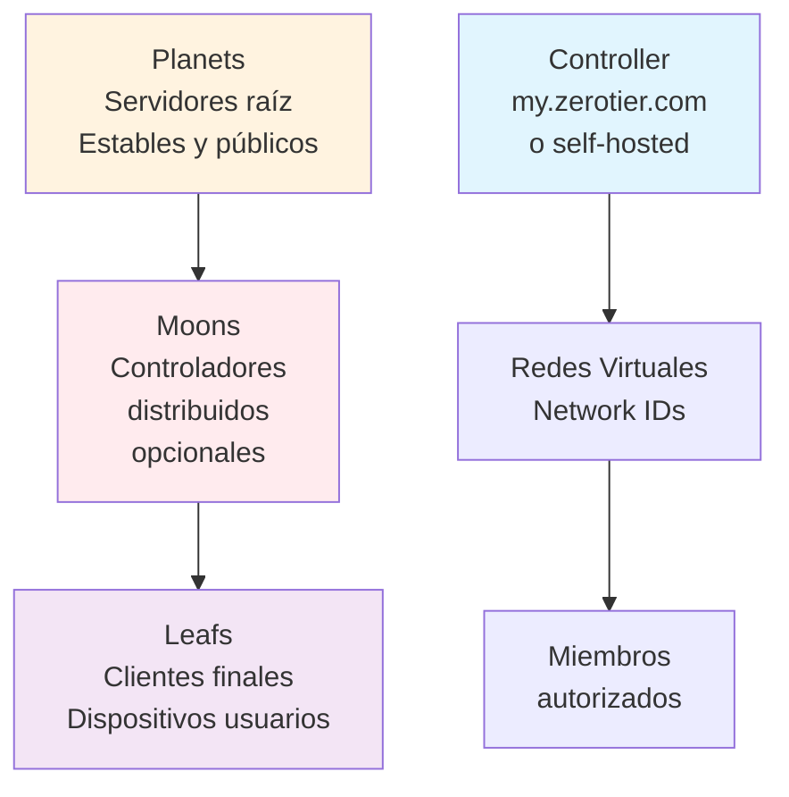

# ZeroTier: instalación y configuración básica

> ZeroTier proporciona redes virtuales L2/L3 fáciles de desplegar entre dispositivos.

## Arquitectura de ZeroTier



## Jerarquía de nodos



## Requisitos

- Debian/Ubuntu o equivalente con `curl` y `sudo`
- Acceso a `https://my.zerotier.com` o controlador propio

## Instalación

```bash
curl -s https://install.zerotier.com | sudo bash
```

Verifica servicio:

```bash
sudo zerotier-cli -v
sudo systemctl status zerotier-one
```

## Unirse a una red

1. Crea una red en `my.zerotier.com` (obtén el Network ID)
2. En el host, únete a la red con el ID:

```bash
sudo zerotier-cli join <NETWORK_ID>
```

3. Autoriza el miembro desde el panel (Members → Authorize)

4. Comprueba interfaz y conectividad:

```bash
ip -br a | grep zt
ping <peer_ip>
```

## Arranque y logs

```bash
sudo systemctl enable --now zerotier-one
journalctl -u zerotier-one -f
```

## Hardening y configuración útil

- Rutas gestionadas: define subredes en la red para que ZeroTier las instale automáticamente en los miembros autorizados.
- Reglas de flujo (Flow Rules) básicas para limitar tráfico, ejemplo mínimo (solo ICMP y TCP 22 entre miembros):

```text
accept icmp;
accept tcp dport 22;
drop;
```

- MTU: si ves fragmentación, prueba ajustar MTU de la interfaz `zt*` (ej. 2800-9001 según entorno).

### Override de systemd

```bash
sudo systemctl edit zerotier-one
```
Contenido:

```ini
[Unit]
After=network-online.target
Wants=network-online.target
```

Aplica:

```bash
sudo systemctl daemon-reload
sudo systemctl restart zerotier-one
```

## Notas

- Configura rutas administradas y asignación de IPs desde el panel
- Evita solapamiento de subredes con la red local

## Ejemplos con contenedores (Docker)

### Conectar tus contenedores a la VPN

- Opción 1 (host networking): ZeroTier con `--network host` crea interfaz `zt*` en el host.
- Opción 2 (sidecar): comparte namespace de red con tu app:

```bash
docker run -d --name zerotier \
  --cap-add NET_ADMIN --device /dev/net/tun \
  -v zt_state:/var/lib/zerotier-one \
  --network container:miapp \
  zerotier:latest
```

- Opción 3 (enrutador en contenedor): habilita NAT en el contenedor ZeroTier para que una red Docker alcance la VPN (iptables MASQUERADE).
