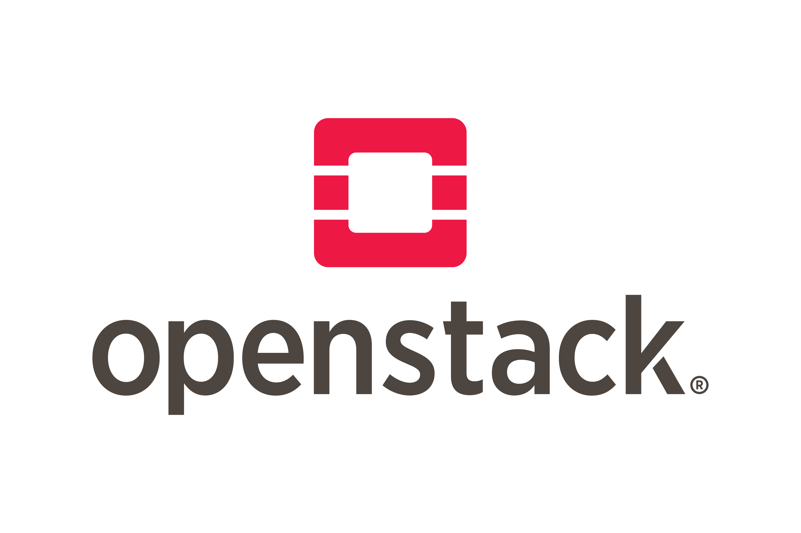
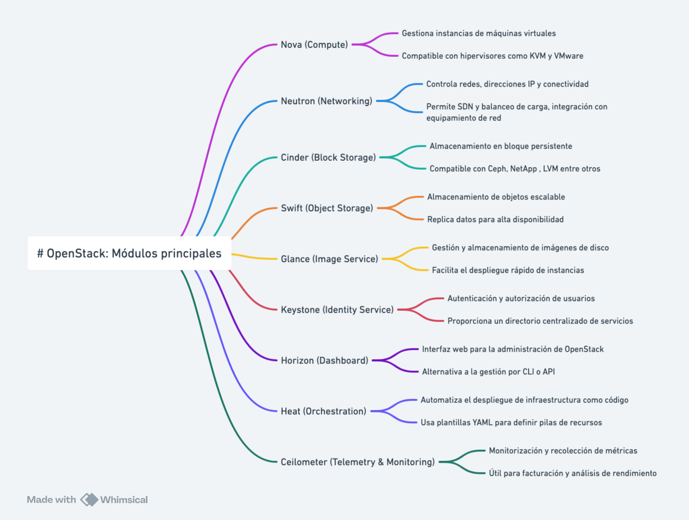

# OpenStack
{width=35%}

OpenStack es una plataforma de software de código abierto para la computación en la nube, que permite la creación y gestión de infraestructuras de nube pública y privada. Fue diseñado para ser escalable y flexible, proporcionando una solución robusta para la gestión de recursos de computación, almacenamiento y redes. OpenStack es utilizado por una amplia variedad de organizaciones, desde pequeñas empresas hasta grandes corporaciones y proveedores de servicios en la nube. 🌐

## Módulos de OpenStack 🚀

OpenStack está compuesto por una serie de módulos que se integran para ofrecer una solución completa de nube. Algunos de los módulos más importantes son:

- **Nova**: Proporciona servicios de computación, permitiendo la gestión de máquinas virtuales. Es el componente central de la gestión de instancias de computación.
- **Neutron**: Ofrece servicios de red, gestionando redes y direcciones IP. Permite la creación de redes complejas y la asignación de IPs a las instancias.
- **Cinder**: Proporciona servicios de almacenamiento en bloque, permitiendo la gestión de volúmenes de almacenamiento. Es ideal para bases de datos y aplicaciones que requieren almacenamiento persistente.
- **Swift**: Ofrece almacenamiento de objetos, permitiendo el almacenamiento y recuperación de datos no estructurados. Es altamente escalable y adecuado para almacenar grandes cantidades de datos.
- **Glance**: Proporciona servicios de gestión de imágenes, permitiendo la gestión de imágenes de disco. Facilita la creación y el mantenimiento de imágenes de sistema operativo.
- **Keystone**: Ofrece servicios de identidad, gestionando la autenticación y autorización de usuarios. Es el componente de seguridad central de OpenStack.
- **Horizon**: Proporciona una interfaz gráfica de usuario para la gestión de OpenStack. Permite a los usuarios interactuar con OpenStack a través de un navegador web.
- **Heat**: Ofrece servicios de orquestación, permitiendo la gestión de la infraestructura como código. Facilita la automatización del despliegue de recursos.
- **Ceilometer**: Proporciona servicios de telemetría, permitiendo la monitorización y medición de recursos. Es útil para la facturación y la monitorización del rendimiento.

## Entornos donde está desplegado OpenStack 🌍

OpenStack se despliega en una variedad de entornos, incluyendo:

- **Nubes Públicas**: Proveedores de servicios en la nube como Rackspace y OVH utilizan OpenStack para ofrecer servicios de nube pública a sus clientes.
- **Nubes Privadas**: Muchas empresas despliegan OpenStack en sus propios centros de datos para crear nubes privadas, proporcionando a sus empleados y departamentos una infraestructura flexible y escalable.
- **Nubes Híbridas**: OpenStack puede integrarse con otras soluciones de nube pública como AWS, Azure y Google Cloud, permitiendo la creación de nubes híbridas que combinan lo mejor de ambos mundos.
- **Centros de Datos de Investigación**: Instituciones académicas y de investigación utilizan OpenStack para gestionar sus recursos de computación y almacenamiento, facilitando la colaboración y el acceso a grandes volúmenes de datos.
- **Telecomunicaciones**: Empresas de telecomunicaciones despliegan OpenStack para gestionar sus infraestructuras de red y ofrecer servicios avanzados a sus clientes.

## Distribuciones y Métodos de Despliegue 🛠️
OpenStack es una solución poderosa y flexible para la gestión de infraestructuras de nube, utilizada por muchas organizaciones en todo el mundo para construir y gestionar sus entornos de nube. Su naturaleza de código abierto y su amplia comunidad de desarrolladores y usuarios aseguran que OpenStack continúe evolucionando y mejorando con el tiempo. 🚀

Existen varias distribuciones y métodos de despliegue de OpenStack, cada una con sus propias características y ventajas. Algunas de las más populares son:

- **Red Hat OpenStack Platform**: Una distribución comercial de OpenStack ofrecida por Red Hat, que incluye soporte y servicios adicionales. Es conocida por su estabilidad y soporte empresarial.
- **Mirantis OpenStack**: Ofrecida por Mirantis, esta distribución se centra en la facilidad de uso y la flexibilidad, proporcionando herramientas avanzadas para la gestión y el despliegue de OpenStack.
- **Canonical OpenStack**: Distribuida por Canonical, la empresa detrás de Ubuntu. Esta versión de OpenStack está optimizada para funcionar con Ubuntu y ofrece integración con otras herramientas de Canonical.
- **SUSE OpenStack Cloud**: Una distribución de OpenStack ofrecida por SUSE, que se enfoca en la facilidad de uso y la integración con otras soluciones de SUSE.
- **OpenStack-Ansible**: Un método de despliegue que utiliza Ansible para automatizar la instalación y configuración de OpenStack. Es ideal para aquellos que prefieren una solución basada en Ansible.
- **Kolla-Ansible**: Utiliza contenedores Docker y Ansible para desplegar OpenStack. Es conocido por su flexibilidad y capacidad para gestionar despliegues complejos.
- **DevStack**: Una herramienta de despliegue rápida y sencilla para desarrolladores que desean probar y desarrollar sobre OpenStack. No está destinada para entornos de producción, pero es excelente para pruebas y desarrollo.

Cada una de estas distribuciones y métodos de despliegue ofrece diferentes ventajas y puede ser adecuada para diferentes casos de uso, dependiendo de las necesidades específicas de la organización y del entorno en el que se vaya a desplegar OpenStack.

## Casos de Uso e Infraestructuras que Usan OpenStack 🏢

OpenStack se utiliza en una variedad de casos de uso e infraestructuras, incluyendo:

- **Proveedores de Servicios en la Nube**: Empresas como Rackspace y OVH utilizan OpenStack para ofrecer servicios de nube pública a sus clientes, proporcionando una infraestructura escalable y flexible.
- **Empresas de Tecnología**: Grandes corporaciones tecnológicas como Yahoo! y PayPal han implementado OpenStack para gestionar sus infraestructuras de nube privada, mejorando la eficiencia y reduciendo costos.
- **Instituciones Académicas**: Universidades y centros de investigación utilizan OpenStack para gestionar recursos de computación y almacenamiento, facilitando la colaboración y el acceso a grandes volúmenes de datos.
- **Sector Público**: Gobiernos y agencias públicas despliegan OpenStack para crear nubes privadas y gestionar sus infraestructuras de TI de manera más eficiente y segura.
- **Telecomunicaciones**: Empresas de telecomunicaciones como AT&T y Verizon utilizan OpenStack para gestionar sus infraestructuras de red y ofrecer servicios avanzados a sus clientes. Un ejemplo local es OASIX, de Grupo Aire, una de las pocas cloud españolas basadas en openstack y con desarrollo propio 🇪🇸.
- **Investigación Científica**: El CERN, la Organización Europea para la Investigación Nuclear, utiliza OpenStack para gestionar su infraestructura de computación en la nube, permitiendo el procesamiento de grandes volúmenes de datos generados por sus experimentos científicos.
Estos casos de uso demuestran la versatilidad y capacidad de OpenStack para adaptarse a diferentes necesidades y entornos, proporcionando una solución robusta y escalable para la gestión de infraestructuras de nube.

**Además, al ser un proyecto de código abierto colaborativo**, OpenStack se beneficia de una comunidad global de desarrolladores y usuarios que contribuyen continuamente a su mejora y evolución. Esto asegura que la plataforma se mantenga actualizada con las últimas innovaciones tecnológicas y que se puedan abordar rápidamente los problemas y necesidades emergentes. La naturaleza abierta de OpenStack también permite a las organizaciones personalizar y adaptar la plataforma a sus necesidades específicas, fomentando la innovación y la flexibilidad en la gestión de infraestructuras de nube.

## Recursos adicionales

### Documentación oficial
- **Sitio web oficial:** [openstack.org](https://www.openstack.org/)
- **Documentación:** [docs.openstack.org](https://docs.openstack.org/)
- **GitHub:** [github.com/openstack](https://github.com/openstack)
- **Comunidad:** [openstack.org/community](https://www.openstack.org/community/)
- **Blog oficial:** [openstack.org/blog](https://www.openstack.org/blog/)

### Herramientas de despliegue
- **Kolla-Ansible:** [github.com/openstack/kolla-ansible](https://github.com/openstack/kolla-ansible)
- **Documentación Kolla-Ansible:** [docs.openstack.org/kolla-ansible](https://docs.openstack.org/kolla-ansible/latest/)
- **OpenStack-Ansible:** [github.com/openstack/openstack-ansible](https://github.com/openstack/openstack-ansible)
- **DevStack:** [github.com/openstack/devstack](https://github.com/openstack/devstack)

### Distribuciones comerciales
- **Red Hat OpenStack Platform:** [redhat.com/en/technologies/linux-platforms/openstack-platform](https://www.redhat.com/en/technologies/linux-platforms/openstack-platform)
- **Mirantis OpenStack:** [mirantis.com/software/openstack](https://www.mirantis.com/software/openstack/)
- **Canonical OpenStack:** [ubuntu.com/openstack](https://ubuntu.com/openstack)
- **SUSE OpenStack Cloud:** [suse.com/products/openstack-cloud](https://www.suse.com/products/openstack-cloud/)

### Comunidad y soporte

### Videos tutoriales

  <iframe src="https://www.youtube.com/embed/9X8R3vZfK9Y" frameborder="0" allowfullscreen style="position: absolute; top: 0; left: 0; width: 100%; height: 100%;"></iframe>

*Video: OpenStack desde cero - Plataforma de nube completa*

- **Reddit:** [r/openstack](https://www.reddit.com/r/openstack/)
- **Stack Overflow:** [stackoverflow.com/questions/tagged/openstack](https://stackoverflow.com/questions/tagged/openstack)
- **IRC:** #openstack en freenode
- **Foros oficiales:** [ask.openstack.org](https://ask.openstack.org/)

### Casos de uso destacados
- **OASIX Cloud (Grupo Aire):** [oasixcloud.es](https://oasixcloud.es) - Una de las pocas clouds españolas basadas en OpenStack con desarrollo propio 🇪🇸

---

!!! tip "¿Buscas comandos rápidos?"
    Consulta nuestras **[Recetas rápidas](../recipes.md#openstack)** para comandos copy-paste comunes.

!!! warning "¿Problemas con OpenStack?"
    Revisa nuestra **[sección de troubleshooting](../../troubleshooting.md)** para soluciones a errores comunes.
