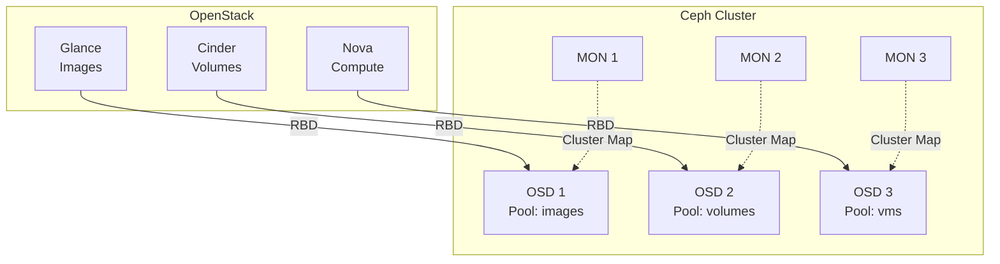

# Integración OpenStack + Ceph

## 🎯 Introducción

Ceph es el backend de storage más popular para OpenStack en producción, proporcionando:

- ✅ **Almacenamiento unificado**: Imágenes, volúmenes e instancias efímeras en un solo clúster
- ✅ **Alta disponibilidad**: Replicación nativa, sin SPOF
- ✅ **Escalabilidad**: Crece linealmente añadiendo nodos
- ✅ **Performance**: Copy-on-write, thin provisioning, snapshots instantáneos
- ✅ **Integración nativa**: Soporte RBD (RADOS Block Device) en OpenStack

### Arquitectura de Integración



## 📋 Requisitos Previos

### Ceph Cluster Funcional

- **Versión**: Ceph Reef (18.x) o superior
- **Nodos**: Mínimo 3 MON + 3 OSD
- **Salud**: `ceph -s` debe mostrar `HEALTH_OK`
- **Red**: 10 Gbps+ recomendado para storage

### OpenStack Desplegado

- Kolla-Ansible con servicios básicos funcionando
- Acceso desde controllers y computes a la red de Ceph

## 🔧 Paso 1: Preparar Ceph

### 1.1 Crear Pools

Desde un nodo MON de Ceph:

```bash
# Calcular PGs (Placement Groups)
# Fórmula: (OSDs * 100) / replicas / pools
# Ejemplo: (30 OSDs * 100) / 3 replicas / 3 pools = ~333 PGs
# Redondear a potencia de 2: 256

# Pool para imágenes de Glance
ceph osd pool create images 256
ceph osd pool application enable images rbd

# Pool para volúmenes de Cinder
ceph osd pool create volumes 256
ceph osd pool application enable volumes rbd

# Pool para snapshots de volúmenes
ceph osd pool create backups 128
ceph osd pool application enable backups rbd

# Pool para instancias efímeras de Nova
ceph osd pool create vms 256
ceph osd pool application enable vms rbd

# Configurar replicación (size=3, min_size=2 por defecto)
ceph osd pool set images size 3
ceph osd pool set volumes size 3
ceph osd pool set vms size 3
ceph osd pool set backups size 3
```

### 1.2 Configurar CRUSH Rules (Opcional)

Para mejorar performance con SSD/NVMe:

```bash
# Crear regla para SSDs (si tienes OSDs con SSD)
ceph osd crush rule create-replicated rule-ssd default host ssd

# Aplicar a pools críticos
ceph osd pool set images crush_rule rule-ssd
ceph osd pool set volumes crush_rule rule-ssd
```

### 1.3 Crear Usuarios Cephx

```bash
# Usuario para Glance
ceph auth get-or-create client.glance \
  mon 'profile rbd' \
  osd 'profile rbd pool=images' \
  -o /etc/ceph/ceph.client.glance.keyring

# Usuario para Cinder
ceph auth get-or-create client.cinder \
  mon 'profile rbd' \
  osd 'profile rbd pool=volumes, profile rbd pool=backups, profile rbd pool=vms' \
  -o /etc/ceph/ceph.client.cinder.keyring

# Nota: Nova usará el mismo usuario que Cinder

# Verificar permisos
ceph auth get client.glance
ceph auth get client.cinder
```

### 1.4 Generar ceph.conf

```bash
# Obtener ceph.conf básico
ceph config generate-minimal-conf

# Output esperado:
# [global]
# fsid = a7f64266-0894-4f1e-a635-d0aeaca0e993
# mon_host = [v2:10.0.40.30:3300/0,v1:10.0.40.30:6789/0] [v2:10.0.40.31:3300/0,v1:10.0.40.31:6789/0] [v2:10.0.40.32:3300/0,v1:10.0.40.32:6789/0]

# Guardar en archivo
ceph config generate-minimal-conf > ceph.conf.minimal
```

## 🚀 Paso 2: Configurar OpenStack (Kolla-Ansible)

### 2.1 Copiar Archivos de Ceph a Controllers y Computes

Desde el nodo deployment:

```bash
# Crear directorio para configs de Ceph
sudo mkdir -p /etc/kolla/config/glance
sudo mkdir -p /etc/kolla/config/cinder
sudo mkdir -p /etc/kolla/config/nova

# Copiar ceph.conf y keyrings desde Ceph MON
# (Asumiendo que tienes acceso SSH a storage01)

# ceph.conf
scp storage01:/etc/ceph/ceph.conf /tmp/ceph.conf
sudo cp /tmp/ceph.conf /etc/kolla/config/glance/
sudo cp /tmp/ceph.conf /etc/kolla/config/cinder/
sudo cp /tmp/ceph.conf /etc/kolla/config/nova/

# Keyrings
scp storage01:/etc/ceph/ceph.client.glance.keyring /tmp/
scp storage01:/etc/ceph/ceph.client.cinder.keyring /tmp/

sudo cp /tmp/ceph.client.glance.keyring /etc/kolla/config/glance/
sudo cp /tmp/ceph.client.cinder.keyring /etc/kolla/config/cinder/
sudo cp /tmp/ceph.client.cinder.keyring /etc/kolla/config/nova/ceph.client.cinder.keyring

# Ajustar permisos
sudo chown -R kolla:kolla /etc/kolla/config/
```

### 2.2 Configurar globals.yml

Editar `/etc/kolla/globals.yml`:

```yaml
# Habilitar Ceph
enable_ceph: "no"  # Dejarlo en "no" si Ceph está externo

# Backend Ceph para servicios
glance_backend_ceph: "yes"
glance_backend_file: "no"
cinder_backend_ceph: "yes"
nova_backend_ceph: "yes"

# Configuración de Ceph
ceph_glance_user: "glance"
ceph_glance_keyring: "ceph.client.glance.keyring"
ceph_glance_pool_name: "images"

ceph_cinder_user: "cinder"
ceph_cinder_keyring: "ceph.client.cinder.keyring"
ceph_cinder_pool_name: "volumes"
ceph_cinder_backup_pool_name: "backups"

ceph_nova_user: "cinder"  # Nova usa mismo usuario que Cinder
ceph_nova_keyring: "ceph.client.cinder.keyring"
ceph_nova_pool_name: "vms"

# FSID del clúster Ceph (obtener con: ceph -s)
ceph_cluster_fsid: "a7f64266-0894-4f1e-a635-d0aeaca0e993"

# Configuración de RBD
ceph_rbd_cache: "true"
ceph_rbd_cache_writethrough_until_flush: "true"
ceph_rbd_cache_size: "67108864"  # 64 MB
ceph_rbd_cache_max_dirty: "50331648"  # 48 MB
```

### 2.3 Configurar Cinder con Backend Ceph

Crear `/etc/kolla/config/cinder/cinder-volume.conf`:

```ini
[DEFAULT]
enabled_backends = rbd-1

[rbd-1]
volume_driver = cinder.volume.drivers.rbd.RBDDriver
volume_backend_name = rbd-1
rbd_pool = volumes
rbd_ceph_conf = /etc/ceph/ceph.conf
rbd_flatten_volume_from_snapshot = false
rbd_max_clone_depth = 5
rbd_store_chunk_size = 4
rados_connect_timeout = -1
rbd_user = cinder
rbd_secret_uuid = {{ cinder_rbd_secret_uuid }}  # Kolla lo genera automáticamente
```

### 2.4 Configurar Glance con Backend Ceph

Crear `/etc/kolla/config/glance/glance-api.conf`:

```ini
[glance_store]
stores = rbd
default_store = rbd
rbd_store_pool = images
rbd_store_user = glance
rbd_store_ceph_conf = /etc/ceph/ceph.conf
rbd_store_chunk_size = 8
```

### 2.5 Configurar Nova para Usar Ceph

Crear `/etc/kolla/config/nova/nova-compute.conf`:

```ini
[libvirt]
images_type = rbd
images_rbd_pool = vms
images_rbd_ceph_conf = /etc/ceph/ceph.conf
rbd_user = cinder
rbd_secret_uuid = {{ cinder_rbd_secret_uuid }}
disk_cachemodes = "network=writeback"
hw_disk_discard = unmap
```

## 🔄 Paso 3: Desplegar Configuración

### 3.1 Reconfiguraciones

```bash
# Activar virtualenv
source ~/kolla-venv/bin/activate

# Verificar configuración
kolla-ansible -i /etc/kolla/multinode prechecks

# Reconfigura servicios
kolla-ansible -i /etc/kolla/multinode reconfigure --tags glance,cinder,nova

# Esperar a que los contenedores se recreen (~2-5 minutos)
watch docker ps
```

### 3.2 Verificar Integración

```bash
source /etc/kolla/admin-openrc.sh

# Verificar servicios Cinder
openstack volume service list

# Output esperado:
# +------------------+------------------+------+---------+-------+----------------------------+
# | Binary           | Host             | Zone | Status  | State | Updated At                 |
# +------------------+------------------+------+---------+-------+----------------------------+
# | cinder-scheduler | controller01     | nova | enabled | up    | 2026-01-25T10:30:45.000000 |
# | cinder-volume    | controller01@rbd-1 | nova | enabled | up    | 2026-01-25T10:30:42.000000 |
# +------------------+------------------+------+---------+-------+----------------------------+

# Verificar backend Cinder
openstack volume type list

# Crear volume type para Ceph
openstack volume type create ceph-rbd
openstack volume type set ceph-rbd --property volume_backend_name=rbd-1

# Verificar Glance
openstack image list
```

## ✅ Paso 4: Pruebas de Funcionalidad

### 4.1 Probar Glance (Imágenes en Ceph)

```bash
# Descargar imagen de prueba
wget http://download.cirros-cloud.net/0.6.2/cirros-0.6.2-x86_64-disk.img

# Subir a Glance
openstack image create "cirros-ceph" \
  --file cirros-0.6.2-x86_64-disk.img \
  --disk-format qcow2 \
  --container-format bare \
  --public

# Verificar en Ceph
# Desde nodo Ceph:
rbd ls images
rbd info images/<UUID-de-la-imagen>

# Output esperado:
# rbd image 'a7f64266-0894-...':
#     size 117 MiB in 15 objects
#     order 23 (8 MiB objects)
#     snapshot_count: 0
#     block_name_prefix: rbd_data.123456789
#     format: 2
```

### 4.2 Probar Cinder (Volúmenes en Ceph)

```bash
# Crear volumen
openstack volume create --size 10 --type ceph-rbd test-volume

# Verificar estado
openstack volume list

# Verificar en Ceph
# Desde nodo Ceph:
rbd ls volumes
rbd info volumes/volume-<UUID>

# Output esperado:
# rbd image 'volume-a7f64266...':
#     size 10 GiB in 2560 objects
#     order 22 (4 MiB objects)
```

### 4.3 Probar Nova (Instancias Efímeras en Ceph)

```bash
# Crear instancia desde imagen Ceph
openstack server create \
  --flavor m1.small \
  --image cirros-ceph \
  --network demo-net \
  test-instance-ceph

# Verificar en Ceph (puede tardar unos segundos)
# Desde nodo Ceph:
rbd ls vms

# Output esperado:
# <UUID-de-la-instancia>_disk
```

### 4.4 Probar Snapshots

```bash
# Crear snapshot de volumen
openstack volume snapshot create --volume test-volume test-snapshot

# Verificar en Ceph
rbd snap ls volumes/volume-<UUID>

# Crear volumen desde snapshot
openstack volume create --snapshot test-snapshot --size 10 test-volume-from-snap

# Verificar que usa CoW (copy-on-write)
rbd info volumes/volume-<UUID-nuevo>
# Debe mostrar: parent: volumes/volume-<UUID-original>@snapshot-<UUID>
```

## 🔍 Operaciones Comunes

### Monitorizar Uso de Pools

```bash
# Desde nodo Ceph
ceph df

# Output:
# --- RAW STORAGE ---
# CLASS     SIZE    AVAIL     USED  RAW USED  %RAW USED
# ssd      30 TiB  25 TiB  5.0 TiB   5.0 TiB      16.67
# TOTAL    30 TiB  25 TiB  5.0 TiB   5.0 TiB      16.67
#
# --- POOLS ---
# POOL        ID  PGS  STORED  OBJECTS  USED    %USED  MAX AVAIL
# images       1  256  500 GiB    12.5k  1.5 TiB   6.00     8.3 TiB
# volumes      2  256  2.0 TiB      50k  6.0 TiB  24.00     8.3 TiB
# vms          3  256  1.5 TiB      37k  4.5 TiB  18.00     8.3 TiB
# backups      4  128  100 GiB     2.5k  300 GiB   1.20     8.3 TiB
```

### Ajustar Quotas de Pools

```bash
# Limitar tamaño máximo de pool
ceph osd pool set-quota volumes max_bytes $((10 * 1024**4))  # 10 TB

# Limitar número de objetos
ceph osd pool set-quota images max_objects 100000
```

### Limpiar Imágenes Huérfanas

```bash
# A veces quedan imágenes en Ceph sin referencia en Glance
# Listar imágenes en Glance
openstack image list -f value -c ID > /tmp/glance_images.txt

# Listar imágenes en Ceph
rbd ls images > /tmp/ceph_images.txt

# Comparar y eliminar huérfanas (¡CON CUIDADO!)
# Revisar manualmente antes de borrar
```

### Migrar Volumen entre Backends

```bash
# Si tienes múltiples backends (e.g., LVM + Ceph)
openstack volume migrate <volume-id> --host controller01@rbd-1
```

## 🛡️ Mejores Prácticas

### 1. Configuración de Performance

```ini
# En cinder-volume.conf y nova-compute.conf
rbd_cache = true
rbd_cache_writethrough_until_flush = true
rbd_cache_max_dirty = 50331648  # 48 MB
rbd_cache_target_dirty = 33554432  # 32 MB
```

### 2. Networking

- **Separar redes**: Storage front-end (client) y back-end (OSD replication)
- **MTU jumbo frames**: 9000 para redes de storage
- **Bonding**: LACP o activo-pasivo para redundancia

### 3. Sizing de Pools

```bash
# Regla general para PGs:
# Total PGs = (Total OSDs * 100) / Replicas
# Luego dividir entre número de pools

# Ejemplo con 30 OSDs, 3 replicas, 4 pools:
# (30 * 100) / 3 = 1000 PGs total
# 1000 / 4 pools = 250 PGs por pool
# Redondear a potencia de 2 más cercana: 256
```

### 4. Backups

```bash
# Habilitar backups de Cinder a Ceph
# En /etc/kolla/config/cinder/cinder-backup.conf
[DEFAULT]
backup_driver = cinder.backup.drivers.ceph.CephBackupDriver
backup_ceph_conf = /etc/ceph/ceph.conf
backup_ceph_user = cinder
backup_ceph_chunk_size = 134217728  # 128 MB
backup_ceph_pool = backups
backup_ceph_stripe_unit = 0
backup_ceph_stripe_count = 0
```

### 5. Monitorización

```bash
# Prometheus exporters
# Activar en globals.yml:
enable_prometheus_ceph_mgr_exporter: "yes"

# Dashboard Grafana preconfigurado:
# - Ceph Cluster Overview
# - Ceph Pools
# - Ceph OSDs
```

## 🐛 Troubleshooting Común

### Problema: Cinder-volume no arranca

```bash
# Verificar logs
docker logs cinder_volume

# Error común: "No secret with matching uuid"
# Solución: Verificar que cinder_rbd_secret_uuid esté en libvirt
# En cada compute node:
docker exec nova_libvirt virsh secret-list

# Si no existe, recrear:
kolla-ansible -i /etc/kolla/multinode reconfigure --tags nova
```

### Problema: Glance no puede subir imágenes

```bash
# Verificar permisos de keyring
docker exec glance_api ls -la /etc/ceph/
docker exec glance_api cat /etc/ceph/ceph.client.glance.keyring

# Verificar conectividad a Ceph
docker exec glance_api ceph -s --id glance
```

### Problema: Instancias no arrancan

```bash
# Verificar logs de Nova
docker logs nova_compute

# Error común: "Permission denied on RBD"
# Verificar que el usuario cinder tenga permisos en pool vms
ceph auth get client.cinder

# Debe incluir:
# osd 'profile rbd pool=vms'
```

### Problema: Performance lenta

```bash
# Verificar latencia de Ceph
ceph osd perf

# Verificar PGs balanceados
ceph pg dump pgs | awk '{print $1, $15}'

# Ajustar cache de RBD
# Ver configuración actual:
docker exec nova_compute cat /etc/nova/nova.conf | grep rbd_cache
```

## 📊 Métricas de Referencia

### Performance Esperada (SSD)

- **IOPS (4K random read)**: 20,000+ por OSD
- **Throughput (seq read)**: 500+ MB/s por OSD
- **Latencia (avg)**: <1ms para lectura, <5ms para escritura

### Sizing de Ejemplo

| Entorno | VMs | Volúmenes | OSDs | Capacidad Raw | RAM Ceph |
|---------|-----|-----------|------|---------------|----------|
| Pequeño | 50  | 100       | 6    | 12 TB         | 48 GB    |
| Mediano | 200 | 500       | 15   | 45 TB         | 120 GB   |
| Grande  | 1000| 3000      | 30   | 120 TB        | 240 GB   |

## 📚 Referencias

- [Ceph RBD OpenStack Integration](https://docs.ceph.com/en/latest/rbd/rbd-openstack/)
- [Kolla-Ansible Ceph Guide](https://docs.openstack.org/kolla-ansible/latest/reference/storage/external-ceph-guide.html)
- [OpenStack Cinder Drivers](https://docs.openstack.org/cinder/latest/configuration/block-storage/drivers/ceph-rbd-volume-driver.html)

## 🎓 Próximos Pasos

1. **Optimización**: Ver [Ceph Tuning](../storage/ceph/ceph_tuning.md)
2. **Troubleshooting**: Ver [Problemas Comunes Ceph](../storage/ceph/troubleshooting_ceph.md)
3. **Day-2 Operations**: Ver [Operaciones Avanzadas](day2.md)

---

!!! success "Integración Completada"
    Si llegaste hasta aquí, ¡tienes OpenStack + Ceph completamente funcional! 🎉

!!! tip "Performance Tuning"
    Para cargas de trabajo intensivas, revisa la configuración de [Ceph Tuning](../storage/ceph/ceph_tuning.md).
