# Troubleshooting OpenStack

## 🎯 Metodología de Diagnóstico

### Workflow General

```mermaid
graph TD
    A[Problema Detectado] --> B{¿Servicio específico?}
    B -->|Sí| C[Verificar logs del servicio]
    B -->|No| D[Verificar estado global]
    C --> E[Identificar errores]
    D --> F[openstack service list]
    E --> G[Buscar en esta guía]
    F --> G
    G --> H{¿Solución encontrada?}
    H -->|Sí| I[Aplicar fix]
    H -->|No| J[Revisar docs oficiales]
    I --> K[Verificar resolución]
    J --> K
```



### Comandos Esenciales de Diagnóstico

```bash
# Estado general de servicios
openstack endpoint list
openstack service list
openstack compute service list
openstack network agent list
openstack volume service list

# Logs de contenedores
docker logs <servicio>
docker logs --tail 100 --follow nova_compute

# Estado de contenedores
docker ps -a
docker stats

# Logs del sistema
journalctl -u docker -f
tail -f /var/log/kolla/*/
```

## 🔴 Problemas de Keystone (Autenticación)

### Error: "Unable to establish connection"

**Síntoma**:
```bash
$ openstack server list
Unable to establish connection to http://10.0.20.100:5000/v3
```

**Diagnóstico**:

```bash
# Verificar si Keystone está corriendo
docker ps | grep keystone

# Verificar logs
docker logs keystone

# Verificar puerto
netstat -tulpn | grep 5000
```

**Soluciones**:

```bash
# 1. Reiniciar Keystone
docker restart keystone

# 2. Si no existe el contenedor
kolla-ansible -i /etc/kolla/multinode deploy --tags keystone

# 3. Verificar VIP (si es HA)
ip addr show | grep 10.0.20.100

# 4. Verificar haproxy
docker logs haproxy
```

### Error: "The request you have made requires authentication"

**Síntoma**:
```bash
$ openstack server list
The request you have made requires authentication. (HTTP 401)
```

**Diagnóstico**:

```bash
# Verificar credenciales
cat /etc/kolla/admin-openrc.sh
echo $OS_AUTH_URL
echo $OS_PASSWORD

# Verificar token
openstack token issue
```

**Soluciones**:

```bash
# 1. Recargar credenciales
source /etc/kolla/admin-openrc.sh

# 2. Verificar password correcta
grep keystone_admin_password /etc/kolla/passwords.yml

# 3. Crear nuevo usuario admin si es necesario
docker exec -it keystone bash
keystone-manage bootstrap --bootstrap-password NewPassword123
```

### Error: "EndpointNotFound: publicURL endpoint not found"

**Síntoma**:
Servicios no pueden encontrar endpoints de otros servicios.

**Diagnóstico**:

```bash
# Listar endpoints
openstack endpoint list

# Verificar catalog
openstack catalog list
```

**Soluciones**:

```bash
# Recrear endpoints
kolla-ansible -i /etc/kolla/multinode deploy --tags keystone

# Verificar configuración de VIP
grep kolla_internal_vip_address /etc/kolla/globals.yml
```

## 🖥️ Problemas de Nova (Compute)

### Error: "No valid host was found"

**Síntoma**:
```bash
$ openstack server create ...
No valid host was found. There are not enough hosts available.
```

**Diagnóstico**:

```bash
# Verificar hypervisors
openstack hypervisor list
openstack hypervisor show <id>

# Verificar recursos disponibles
openstack hypervisor stats show

# Verificar estado de compute services
openstack compute service list

# Logs del scheduler
docker logs nova_scheduler | grep -i "no valid host"
```

**Causas comunes**:

1. **Recursos insuficientes**:
```bash
# Ver recursos
openstack hypervisor stats show

# Output:
# +----------------------+-------+
# | Field                | Value |
# +----------------------+-------+
# | count                | 2     |
# | current_workload     | 0     |
# | disk_available_least | 50    |
# | free_disk_gb         | 100   |
# | free_ram_mb          | 32768 |
# | local_gb             | 500   |
# | local_gb_used        | 400   |  # ¡CASI LLENO!
# | memory_mb            | 65536 |
# | memory_mb_used       | 32768 |
# | running_vms          | 10    |
# | vcpus                | 32    |
# | vcpus_used           | 20    |
# +----------------------+-------+

# Solución: Añadir más computes o limpiar instancias
```

2. **Compute service DOWN**:
```bash
# Ver servicios
openstack compute service list

# Output:
# +----+----------------+-------------+----------+---------+-------+
# | ID | Binary         | Host        | State    | Status  | Zone  |
# +----+----------------+-------------+----------+---------+-------+
# | 1  | nova-scheduler | controller  | up       | enabled | nova  |
# | 2  | nova-conductor | controller  | up       | enabled | nova  |
# | 3  | nova-compute   | compute01   | down     | enabled | nova  | # ¡PROBLEMA!
# | 4  | nova-compute   | compute02   | up       | enabled | nova  |
# +----+----------------+-------------+----------+---------+-------+

# Solución: Reiniciar servicio
# En compute01:
docker restart nova_compute
```

3. **Filtros de placement demasiado restrictivos**:
```bash
# Ver filtros activos
docker exec nova_scheduler grep scheduler_default_filters /etc/nova/nova.conf

# Deshabilitar filtros temporalmente (solo para debug)
# Editar /etc/kolla/config/nova/nova-scheduler.conf:
[filter_scheduler]
enabled_filters = RetryFilter,AvailabilityZoneFilter,ComputeFilter

# Reconfigura
kolla-ansible -i /etc/kolla/multinode reconfigure --tags nova
```

### Error: Instancia en estado ERROR

**Síntoma**:
```bash
$ openstack server list
+--------------------------------------+------+--------+------------------+
| ID                                   | Name | Status | Networks         |
+--------------------------------------+------+--------+------------------+
| 123...                               | vm1  | ERROR  | N/A (Network...) |
+--------------------------------------+------+--------+------------------+
```

**Diagnóstico**:

```bash
# Ver detalles del error
openstack server show <server-id>

# Ver logs de nova-compute
docker logs nova_compute | grep <server-id>

# Ver fault message
openstack server show <server-id> -f value -c fault
```

**Soluciones según el error**:

1. **"No such file or directory: '/etc/nova/nova-cpu.conf'"**:
```bash
# Recrear configuración
kolla-ansible -i /etc/kolla/multinode reconfigure --tags nova
```

2. **"Insufficient memory"**:
```bash
# Ajustar sobresuscripción en /etc/kolla/config/nova/nova-compute.conf
[DEFAULT]
ram_allocation_ratio = 2.0  # Permitir 2x sobresuscripción
cpu_allocation_ratio = 4.0

kolla-ansible -i /etc/kolla/multinode reconfigure --tags nova
```

3. **"Volume attachment failed"**:
```bash
# Verificar cinder
openstack volume list
docker logs cinder_volume
```

### Problema: Consola VNC no funciona

**Síntoma**:
No se puede acceder a la consola de la instancia desde Horizon.

**Diagnóstico**:

```bash
# Obtener URL de consola
openstack console url show <server-id>

# Verificar novncproxy
docker ps | grep novncproxy
docker logs nova_novncproxy

# Verificar configuración
docker exec nova_compute grep -A5 "\[vnc\]" /etc/nova/nova.conf
```

**Soluciones**:

```bash
# Verificar que novncproxy_base_url sea accesible
# En /etc/kolla/globals.yml:
nova_novncproxy_base_url: "http://192.168.100.100:6080/vnc_auto.html"

# Reconfigura
kolla-ansible -i /etc/kolla/multinode reconfigure --tags nova

# Verificar firewall
sudo ufw allow 6080/tcp
```

## 🌐 Problemas de Neutron (Networking)

### Error: "Network is not available"

**Síntoma**:
No se pueden crear instancias en una red.

**Diagnóstico**:

```bash
# Ver estado de red
openstack network show <network-id>

# Ver agents
openstack network agent list

# Verificar DHCP agent
docker logs neutron_dhcp_agent

# Verificar L3 agent
docker logs neutron_l3_agent
```

**Soluciones**:

```bash
# 1. Reiniciar agents
docker restart neutron_dhcp_agent
docker restart neutron_l3_agent
docker restart neutron_openvswitch_agent

# 2. Recrear ports DHCP
neutron dhcp-agent-network-remove <dhcp-agent-id> <network-id>
neutron dhcp-agent-network-add <dhcp-agent-id> <network-id>

# 3. Verificar configuración de red externa
openstack network show public1 --fit-width
# Debe tener: router:external=True
```

### Problema: Instancias sin IP (DHCP)

**Síntoma**:
Instancia creada pero sin IP asignada.

**Diagnóstico**:

```bash
# Ver ports
openstack port list --server <server-id>

# Ver logs DHCP
docker logs neutron_dhcp_agent | grep <port-id>

# Verificar namespace de red
sudo ip netns
sudo ip netns exec qdhcp-<network-id> ip addr
```

**Soluciones**:

```bash
# 1. Reiniciar DHCP agent
docker restart neutron_dhcp_agent

# 2. Recrear port
openstack port delete <port-id>
openstack server reboot <server-id>

# 3. Verificar subnet
openstack subnet show <subnet-id>
# enable_dhcp debe ser True
```

### Problema: Sin conectividad externa (Floating IPs)

**Síntoma**:
Floating IP asignada pero sin conectividad.

**Diagnóstico**:

```bash
# Verificar router
openstack router show <router-id>

# Verificar gateway
openstack router show <router-id> -f value -c external_gateway_info

# Verificar NAT en namespace
sudo ip netns exec qrouter-<router-id> iptables -t nat -L

# Traceroute desde instancia
```

**Soluciones**:

```bash
# 1. Verificar gateway externo
openstack router set <router-id> --external-gateway public1

# 2. Verificar security groups
openstack security group rule list default

# Añadir regla ICMP si falta:
openstack security group rule create \
  --protocol icmp \
  --ingress \
  default

# 3. Verificar physical bridge
# En network node:
sudo ovs-vsctl show
# br-ex debe tener interface externa
```

### Error: "External network <uuid> is not reachable from subnet <uuid>"

**Solución**:

```bash
# Configurar router correctamente
openstack router set <router-id> \
  --external-gateway <external-network-id> \
  --fixed-ip subnet=<external-subnet-id>,ip-address=192.168.100.10
```

## 💾 Problemas de Cinder (Volúmenes)

### Error: "Volume backend unavailable"

**Síntoma**:
```bash
$ openstack volume create --size 10 test
Volume backend unavailable (HTTP 500)
```

**Diagnóstico**:

```bash
# Ver servicios Cinder
openstack volume service list

# Ver logs
docker logs cinder_volume
docker logs cinder_scheduler

# Verificar backend
docker exec cinder_volume cinder-manage service list
```

**Soluciones según backend**:

#### Ceph RBD:

```bash
# Verificar conectividad a Ceph
docker exec cinder_volume ceph -s --id cinder

# Verificar keyring
docker exec cinder_volume cat /etc/ceph/ceph.client.cinder.keyring

# Verificar pool
docker exec cinder_volume rbd ls volumes

# Reiniciar servicio
docker restart cinder_volume
```

#### LVM:

```bash
# Verificar volume group
sudo vgs
sudo lvs

# Verificar espacio
sudo vgs cinder-volumes

# Extender VG si es necesario
sudo vgextend cinder-volumes /dev/sdb
```

### Problema: Volumen stuck en "attaching"

**Síntoma**:
Volumen no se adjunta a la instancia.

**Diagnóstico**:

```bash
# Ver estado
openstack volume show <volume-id>

# Ver conexiones
docker exec cinder_volume cinder-manage volume list

# Logs de nova-compute
docker logs nova_compute | grep <volume-id>
```

**Soluciones**:

```bash
# 1. Detach forzado
openstack volume set --detached <volume-id>

# 2. Reset state
openstack volume set --state available <volume-id>

# 3. Reiniciar servicios
docker restart cinder_volume nova_compute

# 4. Si usa Ceph, verificar rbd
rbd ls volumes
rbd status volumes/volume-<uuid>
```

## 🖼️ Problemas de Glance (Imágenes)

### Error: "Image upload failed"

**Síntoma**:
No se pueden subir imágenes.

**Diagnóstico**:

```bash
# Ver logs
docker logs glance_api

# Verificar espacio en disco
df -h

# Si usa Ceph
docker exec glance_api rbd ls images
```

**Soluciones**:

```bash
# 1. Verificar backend
docker exec glance_api grep -A10 "\[glance_store\]" /etc/glance/glance-api.conf

# 2. Limpiar imágenes antiguas
openstack image list --property status=deleted
# Eliminar manualmente las quedan

# 3. Si usa Ceph, verificar permisos
ceph auth get client.glance
```

### Problema: Imagen corrupta

**Síntoma**:
Instancias fallan al arrancar desde una imagen.

**Diagnóstico**:

```bash
# Verificar checksum
openstack image show <image-id> -c checksum

# Descargar y verificar
openstack image save --file /tmp/test.img <image-id>
md5sum /tmp/test.img

# Si usa Ceph
rbd export images/<image-uuid> /tmp/test-from-ceph.img
md5sum /tmp/test-from-ceph.img
```

**Soluciones**:

```bash
# Re-upload de imagen
openstack image delete <image-id>
openstack image create \
  --file /path/to/image.qcow2 \
  --disk-format qcow2 \
  --container-format bare \
  --public \
  --property hw_disk_bus=scsi \
  --property hw_scsi_model=virtio-scsi \
  new-image-name
```

## 🔥 Problemas de Heat (Orchestration)

### Error: "Resource CREATE failed"

**Diagnóstico**:

```bash
# Ver detalles del stack
openstack stack show <stack-name>

# Ver recursos
openstack stack resource list <stack-name>

# Ver eventos
openstack stack event list <stack-name>

# Ver logs
docker logs heat_engine
```

**Solución**:

```bash
# Ver template
openstack stack template show <stack-name> > /tmp/template.yaml

# Validar sintaxis
heat template-validate -f /tmp/template.yaml

# Recrear stack
openstack stack delete <stack-name>
openstack stack create -t /tmp/template-fixed.yaml new-stack
```

## 🔧 Herramientas de Diagnóstico

### Script de Health Check

```bash
#!/bin/bash
# openstack-health-check.sh

echo "=== OpenStack Health Check ==="
echo

echo "1. Keystone (Identity)"
openstack token issue &> /dev/null && echo "✅ OK" || echo "❌ FAIL"

echo "2. Nova (Compute)"
openstack hypervisor list &> /dev/null && echo "✅ OK" || echo "❌ FAIL"

echo "3. Neutron (Network)"
openstack network agent list &> /dev/null && echo "✅ OK" || echo "❌ FAIL"

echo "4. Cinder (Volume)"
openstack volume service list &> /dev/null && echo "✅ OK" || echo "❌ FAIL"

echo "5. Glance (Image)"
openstack image list &> /dev/null && echo "✅ OK" || echo "❌ FAIL"

echo
echo "=== Service Status ==="
openstack compute service list
echo
openstack network agent list
echo
openstack volume service list
```

### Script de Limpieza

```bash
#!/bin/bash
# cleanup-stale-resources.sh

echo "Limpiando recursos huérfanos..."

# Eliminar ports sin dispositivo
for port in $(openstack port list --device-owner none -f value -c ID); do
  echo "Eliminando port $port"
  openstack port delete $port
done

# Eliminar routers sin gateway
for router in $(openstack router list -f value -c ID); do
  gw=$(openstack router show $router -f value -c external_gateway_info)
  if [ "$gw" == "None" ]; then
    echo "Router $router sin gateway"
  fi
done

# Eliminar imágenes en estado 'queued' antiguas
openstack image list --property status=queued --sort created_at:asc
```

## 📊 Logs Importantes

### Ubicaciones de Logs

```bash
# Logs de Kolla (en cada nodo)
/var/log/kolla/<servicio>/

# Logs de contenedores
docker logs <contenedor>

# Logs del sistema
journalctl -u docker
/var/log/syslog
/var/log/messages
```

### Niveles de Debug

Editar `/etc/kolla/config/<servicio>/<servicio>.conf`:

```ini
[DEFAULT]
debug = True
verbose = True
log_date_format = %Y-%m-%d %H:%M:%S
```

Reconfigure:

```bash
kolla-ansible -i /etc/kolla/multinode reconfigure --tags <servicio>
```

## 📚 Referencias

- [OpenStack Operations Guide](https://docs.openstack.org/operations-guide/)
- [Kolla-Ansible Troubleshooting](https://docs.openstack.org/kolla-ansible/latest/user/troubleshooting.html)
- [OpenStack Logging](https://docs.openstack.org/oslo.log/latest/)

## 🎓 Próximos Pasos

1. **Monitorización proactiva**: Ver [Day-2 Operations](day2.md)
2. **Ceph troubleshooting**: Ver [Troubleshooting Ceph](../storage/ceph/troubleshooting_ceph.md)

---

!!! tip "Regla de Oro"
    Siempre verifica logs con `docker logs <servicio>` antes de reiniciar servicios.

!!! warning "Datos de Producción"
    Nunca ejecutes comandos destructivos (delete, reset-state) sin backup previo.
