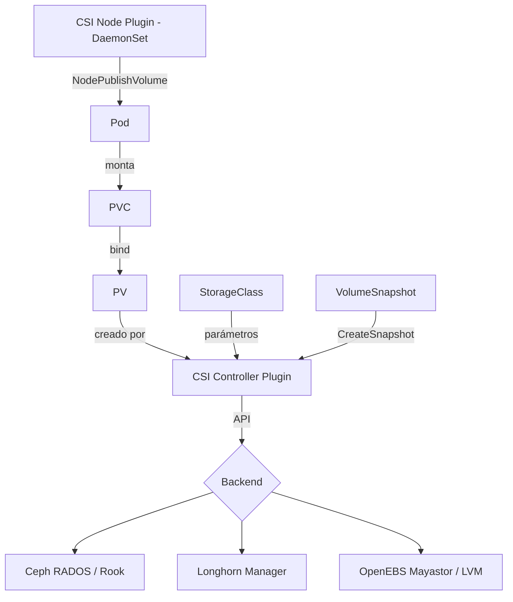
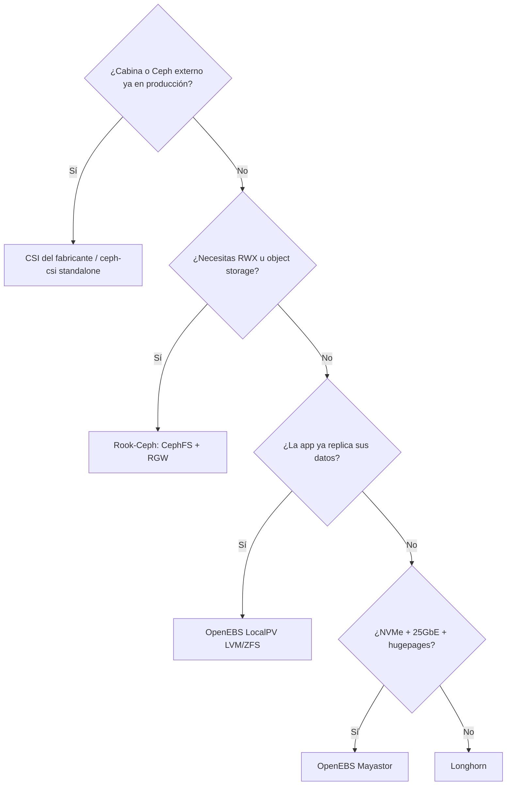

# Storage en Kubernetes: Ceph RBD vs Longhorn vs OpenEBS

Un pod muere y se reprograma en otro nodo. Si su volumen no le sigue, acabas de perder la base de datos. Esa es toda la razón de ser de CSI: desacoplar el ciclo de vida de los datos del ciclo de vida del pod, sin que Kubernetes tenga que saber nada del backend concreto.

Esta guía compara los tres backends que realmente se ven en producción y en homelabs serios: **Ceph RBD/CephFS vía Rook**, **Longhorn** y **OpenEBS**. No repetimos aquí la instalación base de Ceph — para eso está [Ceph Base](ceph/ceph_base.md) y [Ceph Tuning](ceph/ceph_tuning.md). El ángulo aquí es exclusivamente Kubernetes.

## 🧩 Qué es CSI y por qué importa

**CSI (Container Storage Interface)** es la API estándar que permite que cualquier proveedor de almacenamiento se integre con Kubernetes sin código en el árbol de Kubernetes (los antiguos *in-tree volume plugins*, ya eliminados).

Un driver CSI se compone de dos piezas:

- **Controller plugin** (Deployment/StatefulSet): habla con la API del backend para crear, borrar, snapshotear y expandir volúmenes.
- **Node plugin** (DaemonSet): monta el volumen en el nodo donde vive el pod (`NodeStageVolume` / `NodePublishVolume`).

### Objetos que necesitas conocer

| Objeto | Rol |
|--------|-----|
| **StorageClass** | Plantilla: qué driver, qué parámetros, qué política de borrado y si permite expansión |
| **PersistentVolumeClaim (PVC)** | Petición del usuario: tamaño, modo de acceso, clase |
| **PersistentVolume (PV)** | El volumen real, creado dinámicamente por el provisioner |
| **VolumeSnapshotClass / VolumeSnapshot** | Snapshots gestionados por el driver |
| **CSIDriver / CSINode** | Registro y capacidades del driver en el clúster |

### Modos de acceso

- **RWO** (`ReadWriteOnce`): un solo nodo monta en lectura/escritura. Es lo normal en almacenamiento de bloque (RBD, Longhorn, OpenEBS).
- **RWX** (`ReadWriteMany`): varios nodos a la vez. Requiere sistema de ficheros compartido (CephFS, NFS).
- **RWOP** (`ReadWriteOncePod`): un único **pod**, no un nodo. Útil para bases de datos donde dos réplicas montando el mismo volumen sería catastrófico.

!!! warning "RWO no significa 'un pod'"
    `ReadWriteOnce` permite que **varios pods del mismo nodo** monten el volumen simultáneamente. Si necesitas exclusividad real, usa `ReadWriteOncePod` (GA desde Kubernetes 1.29).



## 🏗️ Los tres backends

### Ceph RBD / CephFS con Rook

**Arquitectura.** Rook es un operador que despliega y gestiona Ceph **dentro** de Kubernetes (MON, OSD, MGR, MDS como pods). El driver `ceph-csi` expone dos provisioners: `rook-ceph.rbd.csi.ceph.com` (bloque, RWO) y `rook-ceph.cephfs.csi.ceph.com` (fichero, RWX). También puedes usar `ceph-csi` **standalone** contra un clúster Ceph externo gestionado con `cephadm` — el caso típico cuando ya tienes Ceph corriendo (ver [Ceph Base](ceph/ceph_base.md)).

**Replicación.** CRUSH, a nivel de pool: replicación x3 o erasure coding. La distribución la decide Ceph según el *failure domain* (host, rack, datacenter), no Kubernetes.

```bash
helm repo add rook-release https://charts.rook.io/release
helm install --create-namespace --namespace rook-ceph \
  rook-ceph rook-release/rook-ceph
helm install --namespace rook-ceph \
  rook-ceph-cluster rook-release/rook-ceph-cluster \
  --set operatorNamespace=rook-ceph
```

Para clúster **externo** (recomendado si ya tienes Ceph):

```bash
# En el clúster Ceph: exportar credenciales
python3 create-external-cluster-resources.py \
  --rbd-data-pool-name kubernetes \
  --cephfs-filesystem-name cephfs \
  --namespace rook-ceph-external --format bash
```

### Longhorn

**Arquitectura.** Cada volumen tiene un **engine** (proceso en user-space, uno por volumen, en el nodo del workload) y N **replicas** (procesos que escriben en discos de nodos distintos). El engine hace la replicación síncrona hacia sus réplicas. Todo en user-space, sin módulos de kernel — de ahí su facilidad de despliegue y su techo de rendimiento.

**Replicación.** A nivel de volumen: `numberOfReplicas: 3` en la StorageClass. Anti-afinidad por nodo/zona configurable.

```bash
helm repo add longhorn https://charts.longhorn.io
helm install longhorn longhorn/longhorn \
  --namespace longhorn-system --create-namespace \
  --set defaultSettings.defaultDataPath=/var/lib/longhorn \
  --set defaultSettings.replicaSoftAntiAffinity=false
```

!!! note "Requisito olvidado"
    Longhorn necesita `open-iscsi` y `nfs-common` (para RWX) instalados **en cada nodo**. Sin ellos el PVC se queda en `Pending` con un error críptico de `iscsiadm`.

### OpenEBS

OpenEBS no es un único motor, es una familia. Los que importan hoy:

- **Mayastor** (`io.openebs.csi-mayastor`): NVMe-oF + SPDK, hugepages, réplicas síncronas. El de mayor rendimiento del trío por bastante margen, y el más exigente en requisitos.
- **LocalPV LVM / ZFS** (`local.csi.openebs.io`, `zfs.csi.openebs.io`): almacenamiento **local** sin replicación. Latencia mínima, cero HA — la replicación la pone la aplicación (Cassandra, Kafka, etcd).
- **Jiva / cStor**: legacy, en modo mantenimiento. No los uses en despliegues nuevos.

```bash
helm repo add openebs https://openebs.github.io/openebs
helm install openebs openebs/openebs \
  --namespace openebs --create-namespace \
  --set engines.replicated.mayastor.enabled=true \
  --set engines.local.lvm.enabled=true
```

!!! danger "Mayastor exige hugepages"
    Cada nodo necesita al menos 2 GiB de hugepages (`vm.nr_hugepages=1024`) y el módulo `nvme_tcp` cargado. Si faltan, el DaemonSet arranca en `CrashLoopBackOff` sin mensaje claro. Verifica con `grep HugePages_Total /proc/meminfo` antes de instalar.

## 📊 Comparación detallada

| Aspecto | Ceph RBD/CephFS (Rook) | Longhorn | OpenEBS (Mayastor / LocalPV) |
|---------|------------------------|----------|------------------------------|
| **Licencia** | LGPL / Apache 2.0 | Apache 2.0 (CNCF graduated) | Apache 2.0 (CNCF sandbox) |
| **Complejidad operativa** | ⭐⭐⭐⭐⭐ (alta) | ⭐⭐ (baja) | ⭐⭐⭐ / ⭐ |
| **RWO** | ✅ RBD | ✅ | ✅ |
| **RWX** | ✅ CephFS (nativo) | ⚠️ vía share-manager NFS | ❌ Mayastor / ❌ LocalPV |
| **Snapshots CSI** | ✅ RBD + CephFS | ✅ | ✅ Mayastor / ✅ LVM+ZFS |
| **Clones** | ✅ CoW nativo | ✅ | ✅ |
| **Expansión online** | ✅ | ✅ | ✅ Mayastor, ⚠️ LVM |
| **Backup nativo** | ✅ RBD mirror / export | ✅ a S3/NFS integrado | ⚠️ depende del motor |
| **Erasure coding** | ✅ | ❌ | ❌ |
| **Object storage (S3)** | ✅ RGW | ❌ | ❌ |
| **Requisitos de nodo** | Discos crudos, red 10G+ | `open-iscsi`, `nfs-common` | Hugepages, `nvme_tcp` (Mayastor) |
| **Overhead CPU/RAM** | Alto (OSD ≈ 4 GiB c/u) | Medio | Alto (SPDK reserva cores) |
| **Rendimiento relativo** | ⭐⭐⭐⭐ | ⭐⭐⭐ | ⭐⭐⭐⭐⭐ |
| **Escala probada** | Petabytes | Decenas de TB | Decenas de TB |
| **Clúster externo** | ✅ ceph-csi standalone | ❌ | ❌ |

## 🔧 YAML de referencia

### StorageClass — Ceph RBD

```yaml
apiVersion: storage.k8s.io/v1
kind: StorageClass
metadata:
  name: ceph-rbd
provisioner: rook-ceph.rbd.csi.ceph.com
parameters:
  clusterID: rook-ceph
  pool: kubernetes
  imageFormat: "2"
  imageFeatures: layering
  csi.storage.k8s.io/provisioner-secret-name: rook-csi-rbd-provisioner
  csi.storage.k8s.io/provisioner-secret-namespace: rook-ceph
  csi.storage.k8s.io/controller-expand-secret-name: rook-csi-rbd-provisioner
  csi.storage.k8s.io/controller-expand-secret-namespace: rook-ceph
  csi.storage.k8s.io/node-stage-secret-name: rook-csi-rbd-node
  csi.storage.k8s.io/node-stage-secret-namespace: rook-ceph
  csi.storage.k8s.io/fstype: ext4
reclaimPolicy: Delete
allowVolumeExpansion: true
volumeBindingMode: Immediate
```

### StorageClass — CephFS (RWX)

```yaml
apiVersion: storage.k8s.io/v1
kind: StorageClass
metadata:
  name: ceph-fs
provisioner: rook-ceph.cephfs.csi.ceph.com
parameters:
  clusterID: rook-ceph
  fsName: cephfs
  pool: cephfs-replicated
  csi.storage.k8s.io/provisioner-secret-name: rook-csi-cephfs-provisioner
  csi.storage.k8s.io/provisioner-secret-namespace: rook-ceph
  csi.storage.k8s.io/node-stage-secret-name: rook-csi-cephfs-node
  csi.storage.k8s.io/node-stage-secret-namespace: rook-ceph
reclaimPolicy: Delete
allowVolumeExpansion: true
```

### StorageClass — Longhorn

```yaml
apiVersion: storage.k8s.io/v1
kind: StorageClass
metadata:
  name: longhorn-r3
provisioner: driver.longhorn.io
parameters:
  numberOfReplicas: "3"
  staleReplicaTimeout: "30"
  fsType: ext4
  dataLocality: best-effort
  # Snapshots automáticos y retención
  recurringJobSelector: '[{"name":"snap-daily","isGroup":false}]'
reclaimPolicy: Delete
allowVolumeExpansion: true
volumeBindingMode: Immediate
```

### StorageClass — OpenEBS Mayastor y LocalPV LVM

```yaml
---
apiVersion: storage.k8s.io/v1
kind: StorageClass
metadata:
  name: mayastor-r3
provisioner: io.openebs.csi-mayastor
parameters:
  repl: "3"
  protocol: nvmf
  fsType: xfs
reclaimPolicy: Delete
allowVolumeExpansion: true
---
apiVersion: storage.k8s.io/v1
kind: StorageClass
metadata:
  name: openebs-lvm-local
provisioner: local.csi.openebs.io
parameters:
  volgroup: vg-data
  fsType: ext4
reclaimPolicy: Delete
allowVolumeExpansion: true
# Obligatorio en almacenamiento local: el scheduler debe elegir nodo primero
volumeBindingMode: WaitForFirstConsumer
```

!!! tip "`WaitForFirstConsumer` no es opcional en LocalPV"
    Con `Immediate`, el PV se crea en un nodo cualquiera y el pod puede acabar en otro: `Pending` eterno. Con almacenamiento local **siempre** `WaitForFirstConsumer`.

### PVC y expansión

```yaml
apiVersion: v1
kind: PersistentVolumeClaim
metadata:
  name: data-postgres
spec:
  accessModes: ["ReadWriteOnce"]
  storageClassName: ceph-rbd
  resources:
    requests:
      storage: 50Gi
```

Expandir es editar el `spec.resources.requests.storage` (nunca reducir):

```bash
kubectl patch pvc data-postgres -p '{"spec":{"resources":{"requests":{"storage":"100Gi"}}}}'
kubectl get pvc data-postgres -w   # espera a que status.capacity se actualice
```

### Snapshots

```yaml
---
apiVersion: snapshot.storage.k8s.io/v1
kind: VolumeSnapshotClass
metadata:
  name: ceph-rbd-snap
driver: rook-ceph.rbd.csi.ceph.com
parameters:
  clusterID: rook-ceph
  csi.storage.k8s.io/snapshotter-secret-name: rook-csi-rbd-provisioner
  csi.storage.k8s.io/snapshotter-secret-namespace: rook-ceph
deletionPolicy: Delete
---
apiVersion: snapshot.storage.k8s.io/v1
kind: VolumeSnapshot
metadata:
  name: postgres-2026-07-18
spec:
  volumeSnapshotClassName: ceph-rbd-snap
  source:
    persistentVolumeClaimName: data-postgres
---
# Restaurar: PVC nuevo a partir del snapshot
apiVersion: v1
kind: PersistentVolumeClaim
metadata:
  name: data-postgres-restored
spec:
  accessModes: ["ReadWriteOnce"]
  storageClassName: ceph-rbd
  dataSource:
    name: postgres-2026-07-18
    kind: VolumeSnapshot
    apiGroup: snapshot.storage.k8s.io
  resources:
    requests:
      storage: 50Gi
```

!!! warning "Los CRDs de snapshot no vienen con Kubernetes"
    `VolumeSnapshot` requiere instalar los CRDs y el `snapshot-controller` del proyecto `external-snapshotter` por separado. Si `kubectl get volumesnapshotclass` da `error: the server doesn't have a resource type`, es esto.

    ```bash
    kubectl apply -k "https://github.com/kubernetes-csi/external-snapshotter//client/config/crd?ref=v8.2.0"
    kubectl apply -k "https://github.com/kubernetes-csi/external-snapshotter//deploy/kubernetes/snapshot-controller?ref=v8.2.0"
    ```

!!! danger "Un snapshot no es un backup"
    El snapshot vive en el mismo backend que el volumen. Si pierdes el pool, pierdes ambos. Los snapshots son para *rollback rápido*; los backups a S3/externos son para *desastre*.

## 📈 Benchmarks: metodología reproducible

!!! warning "Sobre los números"
    **Cualquier cifra publicada de storage distribuido es válida únicamente para el hardware exacto que la produjo.** Discos, red, CPU, tamaño de bloque, profundidad de cola y hasta el kernel cambian el resultado en un orden de magnitud. Aquí damos el **método** para medir tu clúster, no una tabla de números que puedas copiar y citar. Mide el tuyo.

### Hardware de referencia a declarar

Antes de publicar cualquier resultado, documenta como mínimo:

| Variable | Ejemplo a rellenar |
|----------|--------------------|
| Nodos | 3 × (CPU, RAM) |
| Discos | Modelo NVMe/SSD, capacidad, ¿PLP? |
| Red | 10 GbE / 25 GbE, MTU, ¿red de storage dedicada? |
| Kubernetes | Versión, CNI |
| Backend | Versión de Rook/Ceph, Longhorn u OpenEBS |
| Replicación | x3, EC 4+2, etc. |
| StorageClass | fsType, parámetros |

### Pod de benchmark

Reutiliza los jobs de [Ejemplo fio](protocols/examples/fio_example.md), pero ejecutándolos **dentro** de un pod sobre el PVC a medir:

```yaml
apiVersion: v1
kind: PersistentVolumeClaim
metadata:
  name: fio-target
spec:
  accessModes: ["ReadWriteOnce"]
  storageClassName: ceph-rbd     # cambia por longhorn-r3 / mayastor-r3
  resources:
    requests:
      storage: 50Gi
---
apiVersion: v1
kind: Pod
metadata:
  name: fio-bench
spec:
  restartPolicy: Never
  containers:
    - name: fio
      image: ghcr.io/xridge/fio:latest
      command: ["sleep", "infinity"]
      volumeMounts:
        - name: data
          mountPath: /data
      resources:
        requests: { cpu: "4", memory: "4Gi" }
        limits:   { cpu: "4", memory: "4Gi" }
  volumes:
    - name: data
      persistentVolumeClaim:
        claimName: fio-target
```

### Los cuatro perfiles que importan

```bash
kubectl exec -it fio-bench -- sh

# 1) IOPS aleatorias 4k lectura — cache de lectura y latencia de red
fio --name=randread --filename=/data/test --ioengine=libaio --direct=1 \
    --rw=randread --bs=4k --iodepth=32 --numjobs=4 --size=10G \
    --runtime=120 --time_based --group_reporting

# 2) IOPS aleatorias 4k escritura — el caso duro: replicación síncrona
fio --name=randwrite --filename=/data/test --ioengine=libaio --direct=1 \
    --rw=randwrite --bs=4k --iodepth=32 --numjobs=4 --size=10G \
    --runtime=120 --time_based --group_reporting

# 3) Latencia pura (QD=1) — lo que siente una BD en fsync
fio --name=lat --filename=/data/test --ioengine=libaio --direct=1 \
    --rw=randwrite --bs=4k --iodepth=1 --numjobs=1 --size=10G \
    --runtime=120 --time_based --group_reporting --lat_percentiles=1

# 4) Throughput secuencial 1M — restores, backups, analítica
fio --name=seqwrite --filename=/data/test --ioengine=libaio --direct=1 \
    --rw=write --bs=1M --iodepth=16 --numjobs=1 --size=20G \
    --runtime=120 --time_based --group_reporting
```

### Reglas para que la medida signifique algo

1. **`--direct=1` siempre.** Sin él mides el page cache del nodo, no el backend.
2. **`--size` mayor que la RAM del nodo** (o al menos que la caché del backend). Un dataset de 1 GiB en un nodo de 64 GiB mide RAM.
3. **`--time_based` con `--runtime` ≥ 120s.** Los primeros segundos son *burst*; el estado estacionario aparece después.
4. **Precondicionado.** En NVMe, llena el dispositivo una vez antes de medir escrituras; si no, mides celdas vírgenes.
5. **Compara p99, no la media.** La media oculta las pausas de recuperación de Ceph o el *rebuild* de Longhorn.
6. **Mismo pod, mismo nodo, misma hora.** Cambia una sola variable: la StorageClass.

!!! tip "Qué esperar cualitativamente"
    Sin dar cifras: **LocalPV** se acerca al disco crudo (sin red, sin replicación). **Mayastor** paga un salto de red NVMe-oF pero conserva la mayor parte del rendimiento. **Ceph RBD** escala en agregado mucho mejor de lo que rinde en un volumen único. **Longhorn** es el que más penaliza escrituras 4k QD=1 por su pila en user-space. El orden puede invertirse en tu hardware — por eso mides.

Para exprimir Ceph antes de comparar, aplica primero lo de [Ceph Tuning](ceph/ceph_tuning.md), y para el caso concreto de bases de datos revisa [PostgreSQL sobre Ceph](postgresql_ceph.md).

## 🎯 Cuándo elegir cada uno

### Homelab (3-5 nodos, discos de consumo, 1-2.5 GbE)

**Longhorn.** Se instala en cinco minutos, tiene UI, backups a S3/NFS integrados y no te obliga a dedicar discos crudos. El rendimiento no será brillante, pero tu cuello de botella en un homelab es la red, no el motor de storage.

**OpenEBS LocalPV LVM** si lo que corres ya replica a nivel de aplicación (un clúster de PostgreSQL con Patroni, Kafka, Elasticsearch). Replicar dos veces —en la app y en el storage— es pagar el triple para escribir lo mismo.

### Producción hyperconverged (compute y storage en los mismos nodos)

**Rook-Ceph** si necesitas RWX real, object storage S3, erasure coding o vas a superar los pocos cientos de TB. Precio: complejidad operativa alta y una guardia que necesita saber Ceph.

**OpenEBS Mayastor** si el requisito es latencia y tienes NVMe + 25 GbE + hugepages. Es el más rápido, pero renuncias a RWX y a la madurez operativa de Ceph.

### Cabina externa ya existente (NetApp, Pure, SAN)

No metas un backend software encima. Usa el **driver CSI del fabricante** ([NetApp](netapp/netapp_base.md), [Pure Storage](pure_storage/pure_storage_base.md)) y deja que la cabina haga lo que ya hace: snapshots, replicación, dedup. Si tienes un Ceph externo gestionado con `cephadm`, la respuesta equivalente es `ceph-csi` standalone, **no** Rook.

### Regla rápida



## 🛠️ Operación día 2

### Backup con Velero

Velero respalda objetos de Kubernetes **y** volúmenes. Para lo segundo, la vía moderna es el *CSI snapshot data movement*, que copia el snapshot al object storage y funciona igual con los tres backends.

```bash
velero install \
  --provider aws \
  --plugins velero/velero-plugin-for-aws:v1.11.0,velero/velero-plugin-for-csi:v0.7.0 \
  --bucket velero-backups \
  --secret-file ./credentials-velero \
  --backup-location-config region=eu-west-1,s3Url=https://s3.example.com,s3ForcePathStyle=true \
  --features=EnableCSI \
  --use-node-agent

# Backup con movimiento de datos al bucket (no depende del backend)
velero backup create postgres-daily \
  --include-namespaces databases \
  --snapshot-move-data \
  --wait

velero restore create --from-backup postgres-daily --wait
```

!!! tip "Consistencia de aplicación"
    Un snapshot de volumen es *crash-consistent*, no *application-consistent*. Para bases de datos añade hooks de Velero que hagan `CHECKPOINT` / `FLUSH TABLES WITH READ LOCK` antes del snapshot:

    ```yaml
    annotations:
      pre.hook.backup.velero.io/container: postgres
      pre.hook.backup.velero.io/command: '["/bin/sh","-c","psql -c CHECKPOINT"]'
    ```

Longhorn además trae backups nativos a S3/NFS con `RecurringJob`, útil como segunda capa independiente de Velero:

```yaml
apiVersion: longhorn.io/v1beta2
kind: RecurringJob
metadata:
  name: backup-daily
  namespace: longhorn-system
spec:
  cron: "0 3 * * *"
  task: backup
  retain: 14
  concurrency: 2
```

### Fallo de nodo: qué pasa realmente

| Backend | Comportamiento al caer un nodo |
|---------|-------------------------------|
| **Ceph RBD** | Los OSD del nodo se marcan `down`; tras `mon_osd_down_out_interval` (600s por defecto) entran `out` y arranca el *backfill*. Los volúmenes siguen accesibles si quedan réplicas suficientes. |
| **Longhorn** | El engine se reprograma en otro nodo con réplica sana; el volumen queda `Degraded` y se reconstruye una réplica nueva. |
| **Mayastor** | La *nexus* se reconstruye desde una réplica superviviente; el volumen sigue online si `repl >= 2`. |
| **LocalPV** | El volumen **no** se recupera. El pod queda `Pending` hasta que el nodo vuelva. Por diseño. |

El bloqueo clásico: los pods se quedan en `Terminating` y sus volúmenes no se liberan porque Kubernetes no sabe si el nodo está muerto o particionado.

```bash
# Ver qué volúmenes siguen "attached" al nodo caído
kubectl get volumeattachment | grep <nodo-caido>

# Confirmar que el nodo está realmente muerto y forzar el desalojo
kubectl delete node <nodo-caido>
```

!!! danger "Nunca fuerces sin confirmar"
    `kubectl delete pod --force --grace-period=0` sobre un StatefulSet con RWO puede provocar que dos pods monten el mismo volumen si el nodo original sigue vivo (split-brain, corrupción de fs). Confirma que el nodo está apagado —fencing físico o de hipervisor— antes de forzar nada. `ReadWriteOncePod` mitiga esto a nivel de API.

### Mantenimiento planificado

```bash
kubectl drain <nodo> --ignore-daemonsets --delete-emptydir-data
# Ceph: evitar rebalanceo innecesario durante el mantenimiento
kubectl -n rook-ceph exec deploy/rook-ceph-tools -- ceph osd set noout
# ... mantenimiento ...
kubectl -n rook-ceph exec deploy/rook-ceph-tools -- ceph osd unset noout
kubectl uncordon <nodo>
```

## 🔍 Troubleshooting común

### PVC en `Pending` para siempre

```bash
kubectl describe pvc <pvc>                    # eventos del provisioner
kubectl get storageclass                      # ¿existe la clase? ¿hay default?
kubectl logs -n rook-ceph deploy/csi-rbdplugin-provisioner -c csi-provisioner
```

Causas habituales, por frecuencia: nombre de StorageClass mal escrito; `volumeBindingMode: WaitForFirstConsumer` y aún no hay pod (esto es **normal**, no un error); backend sin capacidad; secret de provisioner ausente o en otro namespace.

### Pod en `ContainerCreating` con error de mount

```bash
kubectl describe pod <pod> | tail -30
kubectl logs -n rook-ceph ds/csi-rbdplugin -c csi-rbdplugin --tail=100
journalctl -u kubelet -f    # en el nodo afectado
```

- `rbd: map failed ... RBD image feature set mismatch`: el kernel del nodo no soporta features del RBD. Deja solo `imageFeatures: layering` en la StorageClass.
- `iscsiadm: not found` (Longhorn): falta `open-iscsi` en el nodo.
- `Multi-Attach error for volume`: el volumen sigue attached al nodo anterior → ver `volumeattachment` más arriba.

### El PVC no crece tras editar el tamaño

```bash
kubectl get sc <clase> -o jsonpath='{.allowVolumeExpansion}'   # debe ser true
kubectl describe pvc <pvc> | grep -A5 Conditions
```

Si aparece `FileSystemResizePending`, el bloque ya creció pero el filesystem espera al remount: reinicia el pod. `allowVolumeExpansion` no es retroactivo — activarlo ahora no expande volúmenes de una clase que antes lo tenía a `false`; hay que recrear la StorageClass.

### El PV no se borra

```bash
kubectl get pv <pv> -o jsonpath='{.spec.persistentVolumeReclaimPolicy}'
kubectl patch pv <pv> -p '{"metadata":{"finalizers":null}}'   # último recurso
```

!!! warning "Quitar finalizers deja huérfano el volumen real"
    Borra el PV en Kubernetes pero **no** en el backend. Tendrás que limpiar a mano (`rbd rm`, UI de Longhorn) o te comes el espacio en silencio.

### Diagnóstico rápido de Ceph desde Kubernetes

```bash
kubectl -n rook-ceph exec -it deploy/rook-ceph-tools -- ceph -s
kubectl -n rook-ceph exec -it deploy/rook-ceph-tools -- ceph osd df tree
kubectl -n rook-ceph exec -it deploy/rook-ceph-tools -- rbd -p kubernetes ls
```

Para el detalle de errores de Ceph (PG inactivas, `HEALTH_WARN`, OSD full) usa [Troubleshooting Ceph](ceph/troubleshooting_ceph.md).

## 📚 Enlaces relacionados

- [Ceph Base](ceph/ceph_base.md) — arquitectura e instalación con `cephadm`
- [Ceph Tuning](ceph/ceph_tuning.md) — ajuste de rendimiento del clúster
- [Troubleshooting Ceph](ceph/troubleshooting_ceph.md) — diagnóstico de errores
- [PostgreSQL sobre Ceph](postgresql_ceph.md) — bases de datos sobre RBD
- [Ejemplo fio](protocols/examples/fio_example.md) — jobs base de medición
- [Protocolos y Métricas](protocols/protocols.md) — iSCSI, NFS, NVMe-oF
- [NetApp](netapp/netapp_base.md) y [Pure Storage](pure_storage/pure_storage_base.md) — cabinas externas con CSI propio
