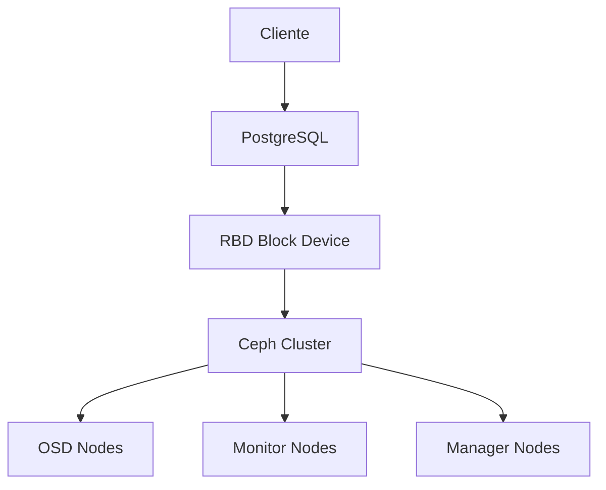

# Storage para bases de datos: PostgreSQL + Ceph

Esta guía explica cómo configurar PostgreSQL con Ceph como storage backend, optimizando rendimiento y alta disponibilidad para bases de datos críticas.

## 🏗️ Arquitectura

### Componentes principales



**Beneficios de esta combinación:**
- ✅ **Escalabilidad**: Storage ilimitado prácticamente
- ✅ **HA**: Replicación automática de datos
- ✅ **Rendimiento**: RBD optimizado para bases de datos
- ✅ **Backup**: Snapshots consistentes
- ✅ **Recuperación**: RTO/RPO mínimos

## 📋 Prerrequisitos

### Cluster Ceph
```bash
# Verificar estado del cluster
ceph status
ceph health

# Verificar pools disponibles
ceph osd pool ls
```

### Nodo PostgreSQL
```bash
# Instalar herramientas Ceph
sudo apt update
sudo apt install ceph-common

# Copiar configuración de Ceph
sudo scp ceph-admin:/etc/ceph/ceph.conf /etc/ceph/
sudo scp ceph-admin:/etc/ceph/ceph.client.admin.keyring /etc/ceph/
```

## 🚀 Configuración paso a paso

### 1. Crear pool optimizado para RBD
```bash
# Pool para datos PostgreSQL
ceph osd pool create pg_data 128 128
ceph osd pool set pg_data size 3
ceph osd pool set pg_data min_size 2

# Pool para WAL (Write-Ahead Log)
ceph osd pool create pg_wal 64 64
ceph osd pool set pg_wal size 3
ceph osd pool set pg_wal min_size 2

# Pool para backups
ceph osd pool create pg_backup 128 128
```

### 2. Crear RBD images
```bash
# Image para datos principales (100GB)
rbd create pg_data/postgres_data --size 100G --pool pg_data

# Image para WAL (20GB)
rbd create pg_wal/postgres_wal --size 20G --pool pg_wal

# Image para backups (200GB)
rbd create pg_backup/postgres_backup --size 200G --pool pg_backup

# Verificar creación
rbd ls pg_data
rbd info pg_data/postgres_data
```

### 3. Mapear y formatear RBD
```bash
# Mapear devices
sudo rbd map pg_data/postgres_data
sudo rbd map pg_wal/postgres_wal

# Verificar mapeo
rbd showmapped

# Formatear con XFS (recomendado para PostgreSQL)
sudo mkfs.xfs /dev/rbd/pg_data/postgres_data
sudo mkfs.xfs /dev/rbd/pg_wal/postgres_wal

# Crear puntos de montaje
sudo mkdir -p /var/lib/postgresql/data
sudo mkdir -p /var/lib/postgresql/wal

# Montar
sudo mount /dev/rbd/pg_data/postgres_data /var/lib/postgresql/data
sudo mount /dev/rbd/pg_wal/postgres_wal /var/lib/postgresql/wal
```

### 4. Instalar y configurar PostgreSQL
```bash
# Instalar PostgreSQL
sudo apt install postgresql postgresql-contrib

# Detener servicio
sudo systemctl stop postgresql

# Configurar permisos
sudo chown postgres:postgres /var/lib/postgresql/data
sudo chown postgres:postgres /var/lib/postgresql/wal
```

### 5. Configuración de PostgreSQL para Ceph
```bash
# Archivo: /etc/postgresql/14/main/postgresql.conf
sudo tee /etc/postgresql/14/main/postgresql.conf > /dev/null <<EOF
# Configuración optimizada para Ceph RBD
data_directory = '/var/lib/postgresql/data'
hba_file = '/etc/postgresql/14/main/pg_hba.conf'
ident_file = '/etc/postgresql/14/main/pg_ident.conf'

# Memoria
shared_buffers = 256MB
effective_cache_size = 1GB
work_mem = 4MB
maintenance_work_mem = 64MB

# WAL
wal_level = replica
wal_buffers = 16MB
wal_writer_delay = 200ms
wal_writer_flush_after = 1MB

# Checkpointing
checkpoint_completion_target = 0.9
checkpoint_timeout = 15min
max_wal_size = 2GB
min_wal_size = 80MB

# Logging
log_line_prefix = '%t [%p]: [%l-1] user=%u,db=%d,app=%a,client=%h '
log_statement = 'ddl'
log_duration = on
log_lock_waits = on

# Replication (si aplica)
max_replication_slots = 10
max_wal_senders = 10

# Conexiones
listen_addresses = '*'
max_connections = 100
EOF
```

### 6. Configuración de pg_hba.conf
```bash
# Archivo: /etc/postgresql/14/main/pg_hba.conf
sudo tee /etc/postgresql/14/main/pg_hba.conf > /dev/null <<EOF
# TYPE  DATABASE        USER            ADDRESS                 METHOD
local   all             postgres                                peer
local   all             all                                     peer
host    all             all             127.0.0.1/32            md5
host    all             all             ::1/128                 md5
host    all             all             10.0.0.0/8              md5
host    all             all             192.168.0.0/16          md5
EOF
```

## 🔧 Optimizaciones de rendimiento

### Configuración RBD
```bash
# Aumentar queue depth para mejor IOPS
rbd config global set rbd rbd_default_queue_depth 256

# Configurar QoS por pool
ceph osd pool set pg_data qos_iops_limit 10000
ceph osd pool set pg_wal qos_iops_limit 5000

# Habilitar RBD caching
rbd config image set pg_data/postgres_data rbd_cache true
rbd config image set pg_data/postgres_data rbd_cache_max_dirty 100
```

### Optimizaciones PostgreSQL
```sql
-- Configuración de base de datos
ALTER SYSTEM SET shared_preload_libraries = 'pg_stat_statements';
ALTER SYSTEM SET track_io_timing = on;
ALTER SYSTEM SET track_functions = all;

-- Crear usuario para monitoreo
CREATE USER ceph_monitor WITH PASSWORD 'secure_password';
GRANT pg_monitor TO ceph_monitor;

-- Configurar tablespaces si es necesario
CREATE TABLESPACE ceph_data OWNER postgres LOCATION '/var/lib/postgresql/data';
CREATE TABLESPACE ceph_wal OWNER postgres LOCATION '/var/lib/postgresql/wal';
```

### Monitoreo de rendimiento
```bash
# IOPS del RBD
rbd perf image iostat pg_data/postgres_data

# Latencia de Ceph
ceph tell osd.* perf dump | jq '.osd.osd_op_lat'

# Estadísticas PostgreSQL
psql -c "SELECT * FROM pg_stat_bgwriter;"
psql -c "SELECT * FROM pg_stat_database;"
```

## 🛡️ Alta disponibilidad

### Configuración de replicas
```bash
# Crear snapshot para backup
rbd snap create pg_data/postgres_data@snapshot_$(date +%Y%m%d_%H%M%S)

# Clonar para replica
rbd snap protect pg_data/postgres_data@snapshot_20231201_120000
rbd clone pg_data/postgres_data@snapshot_20231201_120000 pg_data/postgres_data_replica

# Configurar PostgreSQL streaming replication
# En postgresql.conf del slave:
# hot_standby = on
# primary_conninfo = 'host=master_ip port=5432 user=replicator'
```

### Backup strategy
```bash
#!/bin/bash
# backup_postgres_ceph.sh

DATE=$(date +%Y%m%d_%H%M%S)
SNAP_NAME="backup_$DATE"

# Crear snapshot consistente
psql -c "SELECT pg_start_backup('$SNAP_NAME');"
rbd snap create pg_data/postgres_data@$SNAP_NAME
psql -c "SELECT pg_stop_backup();"

# Exportar snapshot
rbd export pg_data/postgres_data@$SNAP_NAME /backup/postgres_$DATE.img

# Limpiar snapshots antiguos (mantener 7 días)
rbd snap ls pg_data/postgres_data | grep backup | head -n -7 | awk '{print $2}' | xargs -I {} rbd snap rm pg_data/postgres_data@{}
```

## 📊 Monitoreo y troubleshooting

### Métricas clave
```bash
# Uso de storage
ceph df
rbd du pg_data/postgres_data

# Rendimiento PostgreSQL
psql -c "SELECT * FROM pg_stat_bgwriter;"
psql -c "SELECT * FROM pg_stat_database WHERE datname = 'postgres';"

# Logs de errores
tail -f /var/log/postgresql/postgresql-14-main.log
```

### Problemas comunes

#### Rendimiento lento
```bash
# Verificar latencia RBD
rbd perf image iostat pg_data/postgres_data --period 10

# Ajustar parámetros PostgreSQL
# Aumentar shared_buffers si hay memoria disponible
# Ajustar work_mem basado en consultas complejas
```

#### Conectividad Ceph
```bash
# Verificar conectividad
ceph ping mon.a
ceph ping osd.0

# Ver logs de RBD
dmesg | grep rbd
journalctl -u ceph-rbd-mirror
```

#### Recuperación de desastres
```bash
# Simular falla
sudo umount /var/lib/postgresql/data
sudo rbd unmap /dev/rbd/pg_data/postgres_data

# Recuperar
sudo rbd map pg_data/postgres_data
sudo mount /dev/rbd/pg_data/postgres_data /var/lib/postgresql/data
sudo systemctl start postgresql
```

## 🔄 Migración desde storage tradicional

### Estrategia de migración
```bash
# 1. Crear backup completo
pg_dumpall > full_backup.sql

# 2. Detener aplicación
sudo systemctl stop myapp

# 3. Migrar datos
rsync -av /var/lib/postgresql/data/ /tmp/postgres_backup/
cp -r /tmp/postgres_backup/* /var/lib/postgresql/data/

# 4. Verificar integridad
psql -c "SELECT count(*) FROM pg_database;"

# 5. Reiniciar servicios
sudo systemctl start postgresql
sudo systemctl start myapp
```

## 📈 Escalado y crecimiento

### Añadir más OSDs
```bash
# Añadir nuevo OSD
ceph-deploy osd create node-03:sdb

# Rebalancear datos
ceph balancer on
ceph balancer mode upmap
```

### Expandir pools
```bash
# Añadir más PGs si es necesario
ceph osd pool set pg_data pg_num 256
ceph osd pool set pg_data pgp_num 256

# Monitorear rebalanceo
ceph status
watch ceph -s
```

## 📚 Recursos adicionales

- [Ceph Documentation - RBD](https://docs.ceph.com/en/latest/rbd/)
- [PostgreSQL + Ceph Best Practices](https://ceph.io/community/postgresql-and-ceph/)
- [Ceph Performance Tuning](https://docs.ceph.com/en/latest/rados/configuration/bluestore-config-ref/)
- [PostgreSQL Tuning](https://www.postgresql.org/docs/current/runtime-config.html)