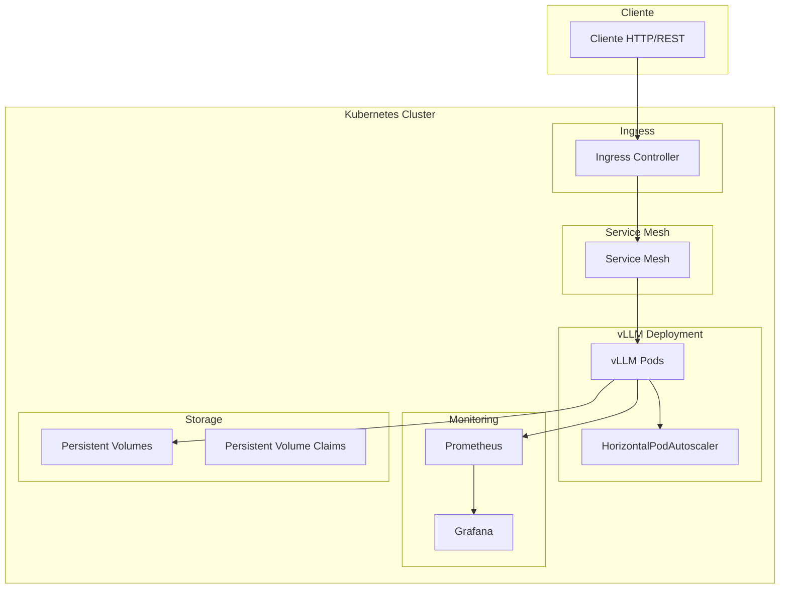

# Despliegue a Escala de LLMs con Kubernetes

## Visión General

Esta guía proporciona una implementación completa para desplegar y escalar modelos de lenguaje grandes (LLMs) en entornos de producción usando Kubernetes, con enfoque en vLLM como servidor de inferencia optimizado.

## Arquitectura de Despliegue

### Componentes Principales

- **vLLM**: Servidor de inferencia optimizado para LLMs
- **HorizontalPodAutoscaler (HPA)**: Escalado automático basado en métricas
- **Prometheus + Grafana**: Monitoreo y observabilidad
- **NVIDIA GPU Operator**: Gestión de GPUs en Kubernetes
- **Persistent Volumes**: Almacenamiento para modelos y datos

### Diagrama de Arquitectura



## Requisitos Previos

### Infraestructura
- Kubernetes 1.24+
- NVIDIA GPUs (A100, H100, V100, etc.)
- Storage con alto IOPS (NVMe recomendado)
- Network con baja latencia

### Software
- Helm 3.0+
- kubectl
- NVIDIA GPU Operator
- Prometheus Operator (opcional)

## Instalación del GPU Operator

```bash
# Agregar repositorio NVIDIA
helm repo add nvidia https://nvidia.github.io/gpu-operator
helm repo update

# Instalar GPU Operator
helm install gpu-operator nvidia/gpu-operator \
    --namespace gpu-operator \
    --create-namespace \
    --set driver.enabled=false  # Si ya tienes drivers instalados
```

## Despliegue de vLLM

### 1. Crear Namespace

```yaml
apiVersion: v1
kind: Namespace
metadata:
  name: llm-inference
  labels:
    name: llm-inference
```

### 2. ConfigMap para Configuración

```yaml
apiVersion: v1
kind: ConfigMap
metadata:
  name: vllm-config
  namespace: llm-inference
data:
  MODEL_NAME: "meta-llama/Llama-2-7b-chat-hf"
  GPU_MEMORY_UTILIZATION: "0.9"
  MAX_MODEL_LEN: "4096"
  DTYPE: "half"
  QUANTIZATION: "awq"
```

### 3. Deployment de vLLM

```yaml
apiVersion: apps/v1
kind: Deployment
metadata:
  name: vllm-deployment
  namespace: llm-inference
spec:
  replicas: 1
  selector:
    matchLabels:
      app: vllm
  template:
    metadata:
      labels:
        app: vllm
    spec:
      containers:
      - name: vllm
        image: vllm/vllm-openai:latest
        ports:
        - containerPort: 8000
          name: http
        envFrom:
        - configMapRef:
            name: vllm-config
        resources:
          limits:
            nvidia.com/gpu: 1
          requests:
            nvidia.com/gpu: 1
            memory: "16Gi"
            cpu: "4"
        volumeMounts:
        - name: model-cache
          mountPath: /root/.cache/huggingface
        - name: dshm
          mountPath: /dev/shm
      volumes:
      - name: model-cache
        persistentVolumeClaim:
          claimName: model-cache-pvc
      - name: dshm
        emptyDir:
          medium: Memory
          sizeLimit: "8Gi"
```

### 4. Service

```yaml
apiVersion: v1
kind: Service
metadata:
  name: vllm-service
  namespace: llm-inference
spec:
  selector:
    app: vllm
  ports:
  - port: 8000
    targetPort: 8000
    name: http
  type: ClusterIP
```

### 5. Ingress

```yaml
apiVersion: networking.k8s.io/v1
kind: Ingress
metadata:
  name: vllm-ingress
  namespace: llm-inference
  annotations:
    nginx.ingress.kubernetes.io/rewrite-target: /
spec:
  rules:
  - host: llm.yourdomain.com
    http:
      paths:
      - path: /
        pathType: Prefix
        backend:
          service:
            name: vllm-service
            port:
              number: 8000
```

## Escalado Automático

### HorizontalPodAutoscaler

```yaml
apiVersion: autoscaling/v2
kind: HorizontalPodAutoscaler
metadata:
  name: vllm-hpa
  namespace: llm-inference
spec:
  scaleTargetRef:
    apiVersion: apps/v1
    kind: Deployment
    name: vllm-deployment
  minReplicas: 1
  maxReplicas: 10
  metrics:
  - type: Resource
    resource:
      name: cpu
      target:
        type: Utilization
        averageUtilization: 70
  - type: Resource
    resource:
      name: memory
      target:
        type: Utilization
        averageUtilization: 80
  behavior:
    scaleDown:
      stabilizationWindowSeconds: 300
      policies:
      - type: Percent
        value: 50
        periodSeconds: 60
    scaleUp:
      stabilizationWindowSeconds: 60
      policies:
      - type: Percent
        value: 100
        periodSeconds: 60
```

### HPA Basado en Latencia Personalizada

```yaml
apiVersion: autoscaling/v2
kind: HorizontalPodAutoscaler
metadata:
  name: vllm-hpa-custom
  namespace: llm-inference
spec:
  scaleTargetRef:
    apiVersion: apps/v1
    kind: Deployment
    name: vllm-deployment
  minReplicas: 1
  maxReplicas: 20
  metrics:
  - type: Pods
    pods:
      metric:
        name: vllm_queue_size
      target:
        type: AverageValue
        averageValue: "5"
  - type: Pods
    pods:
      metric:
        name: vllm_inference_time
      target:
        type: AverageValue
        averageValue: "2"
```

## Monitoreo con Prometheus y Grafana

### ServiceMonitor para vLLM

```yaml
apiVersion: monitoring.coreos.com/v1
kind: ServiceMonitor
metadata:
  name: vllm-monitor
  namespace: llm-inference
spec:
  selector:
    matchLabels:
      app: vllm
  endpoints:
  - port: http
    path: /metrics
    interval: 30s
```

### Dashboard de Grafana

```json
{
  "dashboard": {
    "title": "vLLM Inference Dashboard",
    "panels": [
      {
        "title": "Request Rate",
        "type": "graph",
        "targets": [
          {
            "expr": "rate(vllm:requests_total[5m])",
            "legendFormat": "Requests/sec"
          }
        ]
      },
      {
        "title": "Average Inference Time",
        "type": "graph",
        "targets": [
          {
            "expr": "histogram_quantile(0.95, rate(vllm:inference_time_bucket[5m]))",
            "legendFormat": "95th percentile"
          }
        ]
      },
      {
        "title": "GPU Memory Usage",
        "type": "graph",
        "targets": [
          {
            "expr": "vllm:gpu_memory_used / vllm:gpu_memory_total",
            "legendFormat": "GPU Memory %"
          }
        ]
      }
    ]
  }
}
```

## Optimización de Rendimiento

### Configuración de GPU

```yaml
apiVersion: v1
kind: ConfigMap
metadata:
  name: gpu-config
  namespace: llm-inference
data:
  NVIDIA_VISIBLE_DEVICES: "all"
  NVIDIA_DRIVER_CAPABILITIES: "compute,utility"
  CUDA_VISIBLE_DEVICES: "0"
```

### Optimizaciones de vLLM

```yaml
# Configuración para alto rendimiento
MODEL_NAME: "meta-llama/Llama-2-70b-chat-hf"
GPU_MEMORY_UTILIZATION: "0.95"
MAX_MODEL_LEN: "8192"
DTYPE: "half"
QUANTIZATION: "gptq"
TENSOR_PARALLEL_SIZE: "4"
PIPELINE_PARALLEL_SIZE: "2"
BLOCK_SIZE: "16"
SWAP_SPACE: "4"
```

## Políticas de Seguridad

### NetworkPolicy

```yaml
apiVersion: networking.k8s.io/v1
kind: NetworkPolicy
metadata:
  name: vllm-network-policy
  namespace: llm-inference
spec:
  podSelector:
    matchLabels:
      app: vllm
  policyTypes:
  - Ingress
  - Egress
  ingress:
  - from:
    - namespaceSelector:
        matchLabels:
          name: ingress-nginx
    ports:
    - protocol: TCP
      port: 8000
  egress:
  - to:
    - podSelector:
        matchLabels:
          app: kube-dns
    ports:
    - protocol: UDP
      port: 53
  - to: []
    ports:
    - protocol: TCP
      port: 443  # Para descargas de modelos
```

### SecurityContext

```yaml
apiVersion: apps/v1
kind: Deployment
metadata:
  name: vllm-deployment
  namespace: llm-inference
spec:
  template:
    spec:
      securityContext:
        runAsUser: 1000
        runAsGroup: 1000
        fsGroup: 1000
      containers:
      - name: vllm
        securityContext:
          allowPrivilegeEscalation: false
          readOnlyRootFilesystem: true
          runAsNonRoot: true
          capabilities:
            drop:
            - ALL
```

## Optimización de Costos

### Spot Instances y Node Affinity

```yaml
apiVersion: apps/v1
kind: Deployment
metadata:
  name: vllm-deployment
  namespace: llm-inference
spec:
  template:
    spec:
      affinity:
        nodeAffinity:
          preferredDuringSchedulingIgnoredDuringExecution:
          - weight: 100
            preference:
              matchExpressions:
              - key: instance-type
                operator: In
                values:
                - g4dn.xlarge
                - g5.xlarge
          - weight: 50
            preference:
              matchExpressions:
              - key: spot-instance
                operator: Exists
```

### Auto-scaling Basado en Costo

```yaml
apiVersion: autoscaling/v2
kind: HorizontalPodAutoscaler
metadata:
  name: vllm-hpa-cost
  namespace: llm-inference
spec:
  scaleTargetRef:
    apiVersion: apps/v1
    kind: Deployment
    name: vllm-deployment
  minReplicas: 1
  maxReplicas: 5
  metrics:
  - type: Resource
    resource:
      name: cpu
      target:
        type: Utilization
        averageUtilization: 60  # Más conservador para ahorrar costos
```

## Troubleshooting

### Problemas Comunes

1. **Out of Memory (OOM)**:
   - Reducir `GPU_MEMORY_UTILIZATION`
   - Usar cuantización más agresiva
   - Aumentar `SWAP_SPACE`

2. **Lento Cold Start**:
   - Pre-cargar modelos en init containers
   - Usar Persistent Volumes optimizados
   - Implementar model caching

3. **Inconsistente Performance**:
   - Configurar CPU pinning
   - Usar node affinity para GPUs específicas
   - Monitorear contención de recursos

### Logs y Debugging

```bash
# Ver logs del pod
kubectl logs -f deployment/vllm-deployment -n llm-inference

# Debug con exec
kubectl exec -it deployment/vllm-deployment -n llm-inference -- /bin/bash

# Ver métricas
kubectl port-forward svc/prometheus-service 9090:9090 -n monitoring
```

## Próximos Pasos

- Implementar canary deployments
- Configurar A/B testing para modelos
- Integrar con sistemas de cache distribuidos
- Implementar circuit breakers
- Configurar alerting avanzado

Esta implementación proporciona una base sólida para desplegar LLMs en producción con Kubernetes, optimizando tanto rendimiento como costos operativos.