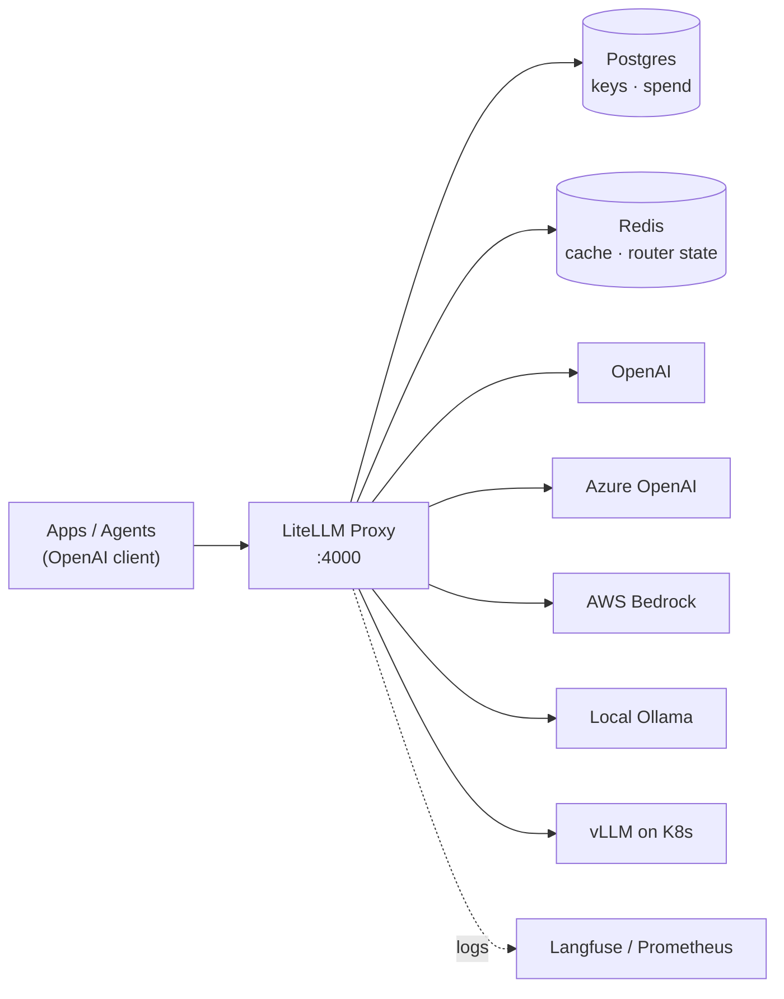

# LiteLLM: unified LLM gateway

You start with OpenAI. Then the data team wants Claude. Marketing asks for Gemini. And you, who already set up [Ollama](ollama_basics.md) for everything that must not leave the internal network, end up with four different SDKs, four error formats and zero idea of how much each team is spending.

LiteLLM solves exactly that: **a single OpenAI-compatible API in front of 100+ providers**. Your code always speaks `/v1/chat/completions`; the gateway decides whether that lands on Azure, Bedrock, a vLLM in your cluster or the Ollama on someone's laptop.

## 🎯 The problem it solves

| Without a gateway | With LiteLLM |
| --- | --- |
| One SDK per provider | A single OpenAI client |
| Provider keys scattered through the code | Revocable virtual keys |
| Real cost unknown until the invoice | Cost tracking per token, team and user |
| Provider outage = your app is down | Automatic cross-provider fallbacks |
| Rate limits handled by hand | Load balancing across deployments |



## 🐍 Python SDK vs Proxy Server

LiteLLM is two things that often get mixed up:

- **Python SDK** (`pip install litellm`): a library that normalises calls inside **your** process. Great for a script or a single service.
- **Proxy Server** (`litellm[proxy]`): a centralised HTTP server with virtual keys, budgets, logging and a UI. What you want as soon as there is **more than one consumer**.

```python
# SDK: same code, different provider
from litellm import completion

resp = completion(
    model="anthropic/claude-sonnet-4-5",
    messages=[{"role": "user", "content": "Explain Kubernetes in 3 lines"}],
)
print(resp.choices[0].message.content)
```

!!! tip "Rule of thumb"
    If you need to answer "how much did the data team spend this month?", you need the **Proxy**. Otherwise the SDK is enough.

## ⚙️ Configuration with `config.yaml`

The heart of the proxy is `config.yaml`. Its main block is `model_list`, which maps a **virtual name** (`model_name`, what your apps ask for) to the real parameters (`litellm_params`, what gets sent to the provider).

```yaml
model_list:
  - model_name: gpt-4o                      # name your apps use
    litellm_params:
      model: azure/gpt-4o-eu                # real model sent to the provider
      api_base: https://my-endpoint-europe.openai.azure.com/
      api_key: "os.environ/AZURE_API_KEY_EU"
      rpm: 6                                # rate limit for this deployment

  - model_name: anthropic-claude
    litellm_params:
      model: bedrock/anthropic.claude-instant-v1
      aws_region_name: us-east-1

  - model_name: local-llama                 # your Ollama, same API
    litellm_params:
      model: ollama/llama3
      api_base: http://ollama:11434

  - model_name: vllm-models
    litellm_params:
      model: openai/facebook/opt-125m       # the openai/ prefix = compatible API
      api_base: http://0.0.0.0:8000/v1
      api_key: none

litellm_settings:
  drop_params: True                         # silently drop params the provider doesn't support
  success_callback: ["langfuse"]

general_settings:
  master_key: sk-1234                       # require Authorization: Bearer on every call
  alerting: ["slack"]
```

Start it and consume it as if it were OpenAI:

```bash
litellm --config config.yaml --port 4000
```

```bash
curl http://0.0.0.0:4000/v1/chat/completions \
  -H "Authorization: Bearer sk-1234" \
  -H "Content-Type: application/json" \
  -d '{
    "model": "local-llama",
    "messages": [{"role": "user", "content": "Hello"}]
  }'
```

```python
# Any OpenAI client works: just change base_url
from openai import OpenAI

client = OpenAI(api_key="sk-1234", base_url="http://0.0.0.0:4000")
resp = client.chat.completions.create(
    model="gpt-4o",
    messages=[{"role": "user", "content": "Summarise this incident"}],
)
```

!!! note "The wildcard"
    A `model_name: "*"` entry with `model: "*"` lets any provider model through using environment credentials. Handy in development, a bad idea in production: you lose control over which models can be invoked.

## 🔑 Virtual keys and budgets

Your apps should never see a provider key. Instead, the proxy issues **virtual keys** through `/key/generate`, authenticating with the `master_key`.

```bash
curl -X POST 'http://0.0.0.0:4000/key/generate' \
  -H 'Authorization: Bearer sk-1234' \
  -H 'Content-Type: application/json' \
  -d '{
    "models": ["gpt-4o", "local-llama"],
    "max_budget": 50,
    "duration": "30d",
    "team_id": "data-team"
  }'
```

Spend is attributed hierarchically and budgets are inherited downwards:

```text
Organization Spend
    ├── Team 1 Spend
    │   ├── User A Spend
    │   │   ├── Key 1 Spend
    │   │   └── Key 2 Spend
    │   └── Service Account Spend
    └── Team 2 Spend
```

You can set a budget at any level, with one strict rule: **a team budget cannot exceed its organization's, and a user budget cannot exceed its team's**. If any level in the hierarchy goes over, the request is blocked in real time.

!!! warning "Requires a database"
    Virtual keys, teams and persistent spend need Postgres (`database_url` under `general_settings`). Without a DB the proxy still works, but it is ephemeral: no governance, no history.

## 💰 Cost tracking

Every request writes an entry to `LiteLLM_SpendLogs` with full attribution:

```json
{
  "api_key": "fe6b0cab4ff5a5a8df823196cc8a450*****",
  "user": "default_user",
  "team_id": "e8d1460f-846c-45d7-9b43-55f3cc52ac32",
  "request_tags": ["jobID:214590dsff09fds", "taskName:run_page_classification"],
  "end_user": "palantir",
  "model_group": "llama3",
  "api_base": "https://api.groq.com/openai/v1/",
  "spend": 0.000002,
  "total_tokens": 100,
  "completion_tokens": 80,
  "prompt_tokens": 20
}
```

With `request_tags` you can answer questions like "how much did the nightly classification batch cost us?" without instrumenting anything in the application: just tag the request.

## 🔁 Fallbacks, retries and load balancing

This is where the gateway stops being a convenience and becomes availability. Everything lives under `router_settings`.

### Load balancing

Repeat the **same `model_name`** across several entries: LiteLLM treats them as interchangeable deployments of the same group.

```yaml
model_list:
  - model_name: gpt-3.5-turbo
    litellm_params:
      model: azure/gpt-turbo-small-ca
      api_base: https://my-endpoint-canada.openai.azure.com/
      api_key: os.environ/AZURE_API_KEY_CA
      rpm: 6
  - model_name: gpt-3.5-turbo
    litellm_params:
      model: azure/gpt-turbo-large
      api_base: https://openai-france-1234.openai.azure.com/
      api_key: os.environ/AZURE_API_KEY_FR
      rpm: 1440

router_settings:
  routing_strategy: simple-shuffle   # simple-shuffle | least-busy | usage-based-routing | latency-based-routing
  num_retries: 2
  timeout: 30                        # seconds, for the entire call
  redis_host: os.environ/REDIS_HOST  # required when running multiple proxy replicas
  redis_port: os.environ/REDIS_PORT
  redis_password: os.environ/REDIS_PASSWORD
```

| `routing_strategy` | When to use it |
| --- | --- |
| `simple-shuffle` | Default. Random spread weighted by rpm/tpm |
| `least-busy` | Deployments with very different latencies under load |
| `usage-based-routing` | Squeeze TPM/RPM quotas without hitting the limits |
| `latency-based-routing` | Prioritise the fastest observed response |

!!! danger "Redis is not optional in HA"
    Router state (usage, latencies, budgets) is local to each replica. With more than one pod and no Redis, each instance counts on its own and your rate limits and budgets will drift.

### Cross-provider fallbacks

```yaml
router_settings:
  fallbacks: [{"gpt-4": ["azure/gpt-4", "anthropic-claude"]}]
  num_retries: 2
```

When the `gpt-4` group exhausts its retries, the request moves to the next model in the list transparently for the client. A very useful pattern: **cloud first, local model as last resort** to degrade instead of failing.

## ⚡ Caching

Identical responses should not be paid for twice. LiteLLM caches in Redis from `litellm_settings`:

```yaml
litellm_settings:
  cache: true
  cache_params:
    type: redis
    host: os.environ/REDIS_HOST
    port: 6379
    ttl: 600            # seconds in Redis
  enable_redis_auth_cache: true   # share key auth across workers and replicas

general_settings:
  user_api_key_cache_ttl: 300     # optional, seconds
```

`enable_redis_auth_cache` is the detail usually missing: without it, every worker validates virtual keys against Postgres and the DB becomes the bottleneck.

## 📈 Logging and observability

```yaml
litellm_settings:
  success_callback: ["langfuse", "prometheus"]
  failure_callback: ["langfuse"]
```

The `/metrics` endpoint exposes Prometheus metrics ready to alert on, including:

- `litellm_api_key_max_budget_metric` — budget assigned to the key
- `litellm_remaining_api_key_budget_metric` — remaining balance
- `litellm_api_key_budget_remaining_hours_metric` — hours until reset

!!! tip "Alert before the cut-off"
    Alert on `litellm_remaining_api_key_budget_metric` when it drops below 20%. Finding out a team ran out of budget through "the AI is broken" tickets makes for a bad day.

## 🐳 Deployment

### Docker

```bash
docker run --rm \
  --name litellm-proxy \
  -p 4000:4000 \
  -e OPENAI_API_KEY=$OPENAI_API_KEY \
  -e DATABASE_URL=$DATABASE_URL \
  -v $(pwd)/config.yaml:/app/config.yaml \
  docker.litellm.ai/berriai/litellm:latest \
  --config /app/config.yaml
```

The admin UI (keys, teams, spend) is served at `http://localhost:4000/ui`.

### Kubernetes

```yaml
apiVersion: apps/v1
kind: Deployment
metadata:
  name: litellm-proxy
spec:
  replicas: 3
  selector:
    matchLabels:
      app: litellm
  template:
    metadata:
      labels:
        app: litellm
    spec:
      containers:
        - name: litellm
          image: docker.litellm.ai/berriai/litellm:latest
          args: ["--config", "/app/config.yaml", "--port", "4000"]
          ports:
            - containerPort: 4000
          env:
            - name: DATABASE_URL
              valueFrom:
                secretKeyRef: { name: litellm-secrets, key: database-url }
            - name: REDIS_HOST
              value: redis.default.svc.cluster.local
            - name: LITELLM_MASTER_KEY
              valueFrom:
                secretKeyRef: { name: litellm-secrets, key: master-key }
          volumeMounts:
            - name: config
              mountPath: /app/config.yaml
              subPath: config.yaml
      volumes:
        - name: config
          configMap:
            name: litellm-config
```

There is also an official Helm chart that handles Postgres, Redis (including cluster mode) and secrets without writing these manifests by hand.

!!! warning "The master key is the keys to the kingdom"
    `master_key` allows creating keys, changing budgets and reading everyone's spend. It belongs in a Secret or an external manager, never in a `config.yaml` versioned in Git.

## 🔗 Related

- [Ollama: installation and first steps](ollama_basics.md) — the local backend you put behind the gateway
- [LLaMA.cpp](llama_cpp.md) — OpenAI-compatible server, plugs in with the `openai/` prefix
- [LM Studio](lm_studio.md) — another local backend exposed via API
- [Local ecosystems](local_ecosystems.md) — overview of the local stack
- [Official LiteLLM documentation](https://docs.litellm.ai/)
- [GitHub repository](https://github.com/BerriAI/litellm)
