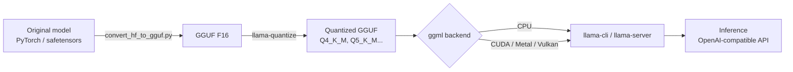

# LLaMA.cpp: Compilation, quantization and benchmarking

[llama.cpp](https://github.com/ggml-org/llama.cpp) is the LLM inference engine written in C/C++ that makes it possible to run models like LLaMA, Mistral, Qwen or Phi on your laptop, on a GPU-less server, or even on a Raspberry Pi. It is the low-level piece that tools like Ollama and LM Studio are built on: understand llama.cpp and you understand what happens underneath.

This guide is **practical and dedicated**: building per backend, the GGUF format and its quantization, real-world use of the CLI and the server, and how to measure performance. If you are after a framework comparison, start with [Local Model Ecosystems](local_ecosystems.md).

!!! info "Why compile instead of using Ollama?"
    With llama.cpp you get full control: you pick the build flags, GPU backend, quantization type and inference parameters. It is the go-to option for production on limited hardware, edge devices, and whenever you need to squeeze out every token per second.

## 🧩 Architecture at a glance



The core is **ggml**, the tensor library. Models are distributed as **GGUF**, a single-file format that bundles weights, tokenizer and metadata.

## 📦 Getting the code

```bash
git clone https://github.com/ggml-org/llama.cpp
cd llama.cpp
```

!!! warning "The repository moved"
    The project now lives at `ggml-org/llama.cpp` (formerly `ggerganov/llama.cpp`). The manual `make` build is **deprecated**: the official path is **CMake**.

## 🔨 Building per backend

### CPU (default)

```bash
# Configure and build in Release (optimized)
cmake -B build
cmake --build build --config Release -j $(nproc)

# Binaries land in build/bin/
ls build/bin/
# llama-cli  llama-server  llama-quantize  llama-bench ...
```

On CPU, llama.cpp automatically uses the available SIMD instructions (AVX2, AVX-512, NEON on ARM). To force native host optimization:

```bash
cmake -B build -DCMAKE_C_FLAGS="-march=native" -DCMAKE_CXX_FLAGS="-march=native"
cmake --build build --config Release -j $(nproc)
```

### CUDA (NVIDIA)

```bash
# Requires the CUDA Toolkit installed (nvcc on the PATH)
cmake -B build -DGGML_CUDA=ON
cmake --build build --config Release -j $(nproc)
```

!!! tip "Faster build, smaller binary"
    Limit the GPU architectures to yours with `-DCMAKE_CUDA_ARCHITECTURES=86` (86 = Ampere/RTX 30xx, 89 = Ada/RTX 40xx, 90 = Hopper). It cuts build time significantly.

### Metal (Apple Silicon)

```bash
# On macOS with M1/M2/M3/M4 chips, Metal is enabled by default.
cmake -B build
cmake --build build --config Release -j $(sysctl -n hw.ncpu)
```

Metal leverages Apple Silicon's unified memory, so you can load large models without a dedicated GPU. To force it explicitly: `-DGGML_METAL=ON`.

### Vulkan (cross-platform GPU: AMD, Intel, NVIDIA)

```bash
# Requires the Vulkan SDK (headers and glslc)
cmake -B build -DGGML_VULKAN=ON
cmake --build build --config Release -j $(nproc)
```

Vulkan is the best option for AMD/Intel GPUs without relying on ROCm, and it works on Windows, Linux and ChromeOS.

| Backend | CMake flag | Target hardware |
|---------|-----------|-----------------|
| CPU     | (default) | Any x86_64 / ARM |
| CUDA    | `-DGGML_CUDA=ON` | NVIDIA GPUs |
| Metal   | `-DGGML_METAL=ON` | Apple Silicon (M1+) |
| Vulkan  | `-DGGML_VULKAN=ON` | AMD / Intel / NVIDIA |
| HIP/ROCm | `-DGGML_HIP=ON` | AMD GPUs (ROCm) |
| SYCL    | `-DGGML_SYCL=ON` | Intel GPU / oneAPI |

## 🗜️ GGUF and quantization

**GGUF** (GPT-Generated Unified Format) is llama.cpp's model format. **Quantization** reduces the precision of the weights (from 16 bits down to 4-8 bits) to lower RAM/VRAM usage and speed up inference, at the cost of a controlled loss of quality.

### Download a model already in GGUF

The fastest route: download a quantized GGUF directly. `llama-cli` and `llama-server` accept `-hf` to pull from Hugging Face:

```bash
# Automatic download from Hugging Face (repo:quant)
./build/bin/llama-cli -hf ggml-org/gemma-3-1b-it-GGUF
```

### Convert and quantize yourself

```bash
# 1. Convert the Hugging Face model to GGUF in F16
python convert_hf_to_gguf.py ./models/my-model --outfile model-f16.gguf --outtype f16

# 2. Quantize to Q4_K_M (the best quality/size balance)
./build/bin/llama-quantize model-f16.gguf model-q4_k_m.gguf Q4_K_M
```

### Common quantization types

| Type | Approx. bits | RAM usage | Quality | Recommendation |
|------|-------------|-----------|---------|----------------|
| `Q8_0` | 8 | High | Almost identical to F16 | Maximum practical quality |
| `Q6_K` | 6.5 | Medium-high | Excellent | Very good choice |
| `Q5_K_M` | 5.5 | Medium | Very good | Quality alternative |
| `Q4_K_M` | 4.5 | Low | Good | **Recommended default** |
| `Q3_K_M` | 3.5 | Very low | Acceptable | Very limited hardware |
| `Q2_K` | 2.6 | Minimal | Degraded | Only if nothing else fits |

!!! note "Rule of thumb"
    `Q4_K_M` is the sweet spot for most cases. Drop to `Q3`/`Q2` only if it does not fit in memory, and go up to `Q6`/`Q8` if you have spare VRAM and want maximum fidelity.

## 💻 Using the CLI: `llama-cli`

### Interactive chat

```bash
./build/bin/llama-cli -m model-q4_k_m.gguf
```

### A single prompt (non-interactive mode)

```bash
./build/bin/llama-cli -m model-q4_k_m.gguf \
  -p "Explain what Kubernetes is in 3 lines" \
  -n 256 \
  --no-display-prompt
```

### Essential flags

| Flag | Description |
|------|-------------|
| `-m` | Path to the GGUF file |
| `-p` | Input prompt |
| `-n` | Max number of tokens to generate (`-1` = infinite) |
| `-c` | Context size (default 4096; `0` = the model's own) |
| `-ngl` | Layers offloaded to the GPU (*n-gpu-layers*) |
| `-t` | Number of CPU threads |
| `--temp` | Sampling temperature (0 = deterministic) |
| `-cnv` | Force conversation mode |

### GPU offload

```bash
# -ngl 99 tries to load all layers onto the GPU
./build/bin/llama-cli -m model-q4_k_m.gguf -ngl 99 -p "Hello"
```

!!! tip "How many layers fit?"
    Start with `-ngl 99` (all of them). If you run out of VRAM, lower the number until it loads. Layers that are not offloaded run on CPU (slower but functional).

## 🌐 OpenAI-compatible API server: `llama-server`

`llama-server` starts an HTTP server with endpoints **compatible with the OpenAI API**, plus a web interface at `http://localhost:8080`.

```bash
./build/bin/llama-server \
  -m model-q4_k_m.gguf \
  -c 8192 \
  -ngl 99 \
  --host 0.0.0.0 \
  --port 8080
```

### Call the chat endpoint (OpenAI-compatible)

```bash
curl http://localhost:8080/v1/chat/completions \
  -H "Content-Type: application/json" \
  -d '{
    "model": "local",
    "messages": [
      {"role": "system", "content": "You are a concise DevOps assistant."},
      {"role": "user", "content": "Give me a bash script to back up PostgreSQL"}
    ],
    "temperature": 0.7
  }'
```

### With the official OpenAI SDK in Python

```python
from openai import OpenAI

# Point at the local server; api_key is a placeholder
client = OpenAI(base_url="http://localhost:8080/v1", api_key="sk-no-key-required")

resp = client.chat.completions.create(
    model="local",
    messages=[{"role": "user", "content": "Explain Docker in 3 lines"}],
)
print(resp.choices[0].message.content)
```

!!! info "Drop-in compatibility"
    Because the endpoint mimics OpenAI, any library or tool that speaks the OpenAI API (LangChain, LlamaIndex, continue.dev...) works by changing only `base_url`. The same goes for [LM Studio](lm_studio.md), which also exposes an OpenAI-compatible server.

## 📊 Benchmarking with `llama-bench`

`llama-bench` measures performance reproducibly, separating two key metrics:

- **pp (prompt processing)**: prompt ingestion speed (tokens/s).
- **tg (text generation)**: token generation speed (tokens/s).

```bash
# Basic benchmark: 512 prompt tokens, 128 generated
./build/bin/llama-bench -m model-q4_k_m.gguf -p 512 -n 128
```

```bash
# Sweep GPU offload levels to find the optimum
./build/bin/llama-bench -m model-q4_k_m.gguf -ngl 0,20,40,99
```

Typical output (trimmed):

```
| model            | size   | backend | ngl | test  |    t/s |
| ---------------- | ------ | ------- | --- | ----- | ------ |
| llama 7B Q4_K_M  | 3.8GiB | CUDA    |  99 | pp512 | 2450.3 |
| llama 7B Q4_K_M  | 3.8GiB | CUDA    |  99 | tg128 |  118.7 |
```

!!! tip "Compare apples to apples"
    To compare quantizations or backends, always fix the same `-p` and `-n`. Repeat (`-r 5`) to average and reduce noise.

## ⚡ CPU/GPU optimization

### On CPU

```bash
# Match threads to the number of physical cores (not logical)
./build/bin/llama-cli -m model.gguf -t 8 -p "..."

# On NUMA (multi-socket servers)
./build/bin/llama-cli -m model.gguf --numa distribute -p "..."
```

- Use **physical cores**, not logical threads: hyperthreading rarely helps inference.
- Build with `-march=native` to take advantage of AVX-512 if your CPU supports it.
- `_K` quantizations (K-quants) are optimized for modern CPUs.

### On GPU

- Maximize `-ngl` until you fill the available VRAM.
- Use **flash attention** to save context memory: `-fa on`.
- For long contexts, enable the quantized KV cache: `--cache-type-k q8_0 --cache-type-v q8_0`.

```bash
./build/bin/llama-server -m model.gguf -ngl 99 -fa on \
  --cache-type-k q8_0 --cache-type-v q8_0 -c 16384
```

!!! warning "Context = memory"
    Context size (`-c`) consumes VRAM proportionally. A 32k context can double the KV cache memory usage. Quantize it or reduce `-c` if you come up short.

## 🎯 When to choose llama.cpp

- **Edge / limited hardware**: Raspberry Pi, mini-PCs, GPU-less servers.
- **Production with fine control**: you choose the quantization, backend and sampling.
- **Maximum performance per watt**: hand-optimized kernels.
- If you want a *plug and play* experience, use [Ollama](ollama_basics.md) (which uses llama.cpp underneath) or [LM Studio](lm_studio.md) for a graphical interface.

## 🔗 Additional resources

- [Official repository (ggml-org/llama.cpp)](https://github.com/ggml-org/llama.cpp)
- [Build documentation](https://github.com/ggml-org/llama.cpp/blob/master/docs/build.md)
- [llama-server documentation](https://github.com/ggml-org/llama.cpp/tree/master/tools/server)
- [GGUF models on Hugging Face](https://huggingface.co/models?library=gguf)
- [Local Model Ecosystems](local_ecosystems.md) · [Ollama](ollama_basics.md) · [LM Studio](lm_studio.md)
