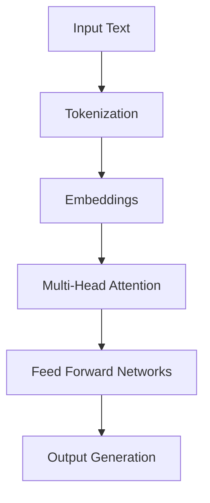

# Introduction to Large Language Models (LLMs)

🚧 **TRANSLATION PENDING** - Last updated in Spanish: 2026-01-25


Large Language Models (LLMs) are AI models capable of understanding and generating human-like text. This guide explains fundamental concepts and their application in DevOps environments.

## 🤔 What are LLMs?

LLMs are machine learning models trained on enormous amounts of text that can:

- **Understand natural language**: Interpret questions and commands in human language
- **Generate coherent text**: Create documentation, code, or responses
- **Solve problems**: Help with troubleshooting, log analysis, configuration generation
- **Automate tasks**: Create scripts, IaC, or workflows

## 🏗️ Basic Architecture

### Transformers: The Heart of LLMs

Modern LLMs are based on the Transformer architecture, introduced in 2017:



**Key components:**
- **Tokenization**: Splits text into processable units
- **Embeddings**: Converts tokens into numerical vectors
- **Attention**: Allows the model to focus on relevant parts of context
- **Decoder/Encoder**: Architectures for different tasks

## 🔄 Open-source vs Proprietary

### Open-source Models
**Advantages:**
- ✅ Full control over data
- ✅ Customization and fine-tuning
- ✅ Runnable locally (privacy)
- ✅ Cost: hardware only

**Disadvantages:**
- ❌ Requires infrastructure
- ❌ Maintenance and updates
- ❌ May be less "intelligent" than proprietary models

**Examples:** LLaMA, Mistral, Phi-2, Qwen

### Proprietary Models
**Advantages:**
- ✅ Easy to use (APIs)
- ✅ Automatic updates
- ✅ High performance
- ✅ Technical support

**Disadvantages:**
- ❌ Vendor dependency
- ❌ Usage costs
- ❌ Privacy concerns
- ❌ Rate limiting restrictions

**Examples:** GPT-4, Claude, Gemini

## 🚀 DevOps Use Cases

### 1. Analysis and troubleshooting
```bash
# Example: Analyze error logs
User: "My Kubernetes application is failing with 'ImagePullBackOff'"
LLM: "This error indicates Kubernetes cannot download the container image. Possible causes: ..."
```

### 2. Documentation generation
- Automatically create README.md files
- Document APIs and configurations
- Generate troubleshooting guides

### 3. IaC automation
```yaml
# Generate Terraform configuration
User: "Create an EKS cluster with 3 t3.medium nodes"
LLM: [Generates complete Terraform code]
```

### 4. Code review and improvements
- Review code for bugs
- Suggest optimizations
- Explain complex code

### 5. ChatOps and automation
- Chatbots for technical support
- Incident response automation
- Runbook generation

## 🛠️ Tools for running LLMs locally

### Ollama
```bash
# Simple installation
curl -fsSL https://ollama.ai/install.sh | sh

# Run a model
ollama run llama2
```

### LM Studio
- Intuitive graphical interface
- Model download and management
- Interactive prompt testing

### LLaMA.cpp
- Extreme CPU optimization
- Low resource consumption
- Ideal for constrained environments

## ⚡ Performance Considerations

### Hardware Requirements
- **Basic CPU**: 4-8 GB RAM, small models (7B parameters)
- **Recommended GPU**: NVIDIA with 8GB+ VRAM for medium models
- **Production**: Multiple GPUs for distributed inference

### Optimizations
- **Quantization**: Reduce model size (GGUF, AWQ)
- **Caching**: Store frequent prompts
- **Batch processing**: Process multiple requests together

## 🔒 Security Considerations

### Data Privacy
- Local models: data never leaves the environment
- External APIs: review retention policies
- Sanitization: avoid sensitive data in prompts

### Model Security
- **Prompt injection**: Attacks that manipulate behavior
- **Jailbreaking**: Techniques to bypass restrictions
- **Hallucinations**: Incorrect responses presented as facts

## 🚀 Next Steps

1. **Choose your tool**: Ollama for simplicity, LM Studio for testing
2. **Select a model**: Start with something small like Llama 2 7B
3. **Experiment**: Test simple prompts and measure responses
4. **Integrate**: Connect with your existing DevOps tools

## 📚 Additional Resources

- [The Illustrated Transformer](http://jalammar.github.io/illustrated-transformer/)
- [Hugging Face Model Hub](https://huggingface.co/models)
- [Papers with Code - Language Models](https://paperswithcode.com/task/language-modelling)
- [LLM Comparison](https://llm-comparison.com/)