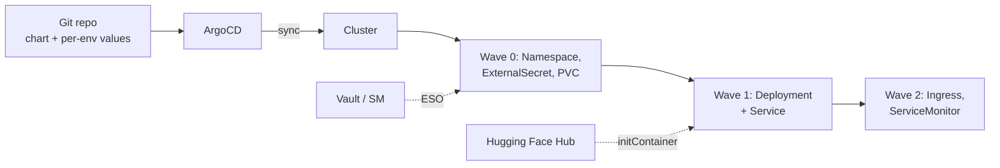
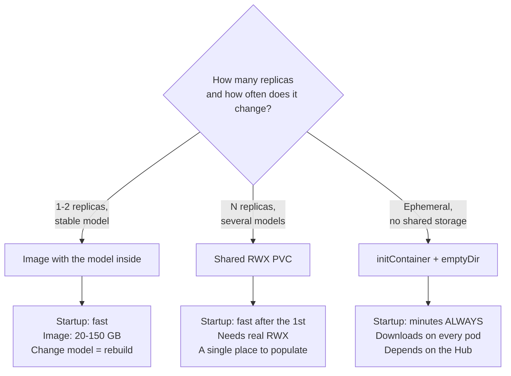

## What this guide covers (and what it does not)

This guide is about **packaging and delivery**: how to turn an inference service into a versioned Helm chart, and how to let ArgoCD sync it from Git without a manual `helm upgrade` becoming the source of truth.

It is not about the engine: if you are after PagedAttention, quantization or how to pick `--max-model-len`, that lives elsewhere.

!!! info "Where this guide fits"
    - The vLLM engine: PagedAttention, tuning, benchmarking → [vLLM](vllm.md)
    - Raw manifests, GPU-based HPA, cost optimizations → [Deployment at scale with Kubernetes](despliegue_kubernetes.md)
    - Single-node local inference → [Ollama](ollama_basics.md), [llama.cpp](llama_cpp.md)
    - Gateway and routing in front of N replicas → [LiteLLM](litellm.md)
    - Encrypting secrets in the repository → [Secrets in GitOps](../cybersecurity/secrets_gitops.md)
    - ArgoCD fundamentals → [ArgoCD](../cicd/argocd.md)

What you will find here: the chart, the `values.yaml`, probes that do not break, the ArgoCD `Application`, the real problem with a model rollout, and how to serve five models from a single chart.

## Why an inference service is not a web app

The Helm templates you use for a Go API do not work as-is. Four differences change the whole design:

| | Typical web app | Inference service |
|---|---|---|
| Startup | 1-5 seconds | 2-15 minutes (download + load into VRAM) |
| Scarce resource | CPU / memory | GPU, indivisible and expensive |
| Extra replica | Cheap, elastic | There may be no free node |
| Rollout | Two pods coexist for a second | Two pods coexist for minutes, **each with its own GPU** |
| Saturation signal | CPU at 80% | Request queue growing, CPU at 3% |

Every row breaks a Kubernetes default assumption. The rest of this guide is undoing them one by one.



## Anatomy of the chart

One chart, not one per model. The difference between serving Llama and serving Qwen is values, not templates.

```text
charts/inference/
├── Chart.yaml
├── values.yaml              # sensible defaults, everything off by default
├── values-vllm-llama8b.yaml # one file per release
├── values-ollama-dev.yaml
└── templates/
    ├── _helpers.tpl
    ├── deployment.yaml, service.yaml, ingress.yaml
    └── pvc.yaml, externalsecret.yaml, servicemonitor.yaml  # optional
```

`Chart.yaml` holds no mystery, but it pins two different versions and it is worth knowing which one you bump when:

```yaml
apiVersion: v2
name: inference
description: LLM inference service (vLLM or Ollama)
type: application
version: 0.3.0        # CHART version: bump it when you touch templates
appVersion: "0.11.0"  # version of the packaged app, informational
```

!!! warning "The model is not the `appVersion`"
    It is tempting to put the model name in `appVersion`. Do not: `appVersion` describes the runtime, and the same chart serves N models. The model belongs in `values`, and changing it is a release change, not a chart change.

## Annotated values.yaml

This is the chart's contract. Everything model-specific lives here and nowhere else.

```yaml
# values.yaml — conservative defaults. Each release overrides its own bits.

# vllm | ollama. Selects which probes and which args the template renders.
engine: vllm

image:
  repository: vllm/vllm-openai
  tag: "v0.11.0"          # NEVER "latest": it breaks GitOps reproducibility
  pullPolicy: IfNotPresent

model:
  # Hub identifier or local path inside the weights volume
  name: "meta-llama/Llama-3.1-8B-Instruct"
  # Alias exposed by the API. Lets you swap checkpoints without touching clients.
  servedName: "llama3-8b"
  # Weights strategy: pvc | initContainer | baked
  weightsStrategy: pvc

# Extra args passed to the engine binary. Concatenated as-is.
# See the vLLM guide for what each one means.
extraArgs:
  - "--max-model-len=8192"
  - "--gpu-memory-utilization=0.92"
  - "--enable-prefix-caching"

resources:
  limits:
    nvidia.com/gpu: 1     # limits and requests MUST match: a GPU is not divisible
    memory: 32Gi
    cpu: "8"
  requests:
    nvidia.com/gpu: 1
    memory: 24Gi
    cpu: "4"

# Node selection. The labels depend on your cluster; these are the ones
# published by the NVIDIA GPU Operator via node-feature-discovery.
nodeSelector:
  nvidia.com/gpu.present: "true"

tolerations:
  - key: nvidia.com/gpu
    operator: Exists
    effect: NoSchedule

# Maximum time we give the model to load before declaring the pod dead.
# failureThreshold * periodSeconds = total budget. See the probes section.
startupProbe:
  periodSeconds: 10
  failureThreshold: 90    # 15 minutes

persistence:
  enabled: true
  existingClaim: "llm-weights"   # RWX PVC shared across releases
  mountPath: /models

secrets:
  # Name of the Secret already materialised in the cluster (by ESO or Sealed Secrets)
  hfTokenSecret: "hf-credentials"
  hfTokenKey: "token"
  apiKeySecret: "inference-api-key"
  apiKeyKey: "key"

service:
  port: 8000

ingress:
  enabled: false
  className: nginx
  host: ""
```

!!! tip "One value per decision, not per field"
    `weightsStrategy: pvc` beats exposing ten volume flags. The chart translates a decision into the right configuration; the operator picks between three named options instead of assembling a puzzle. If you find yourself documenting invalid combinations of values, you have exposed too much.

## Templates: Deployment, Service, Ingress

The `Deployment`. What matters is in the comments; the rest is routine Helm.


```yaml
{{- $isVllm := eq .Values.engine "vllm" -}}
apiVersion: apps/v1
kind: Deployment
metadata:
  name: {{ include "inference.fullname" . }}
  labels: {{- include "inference.labels" . | nindent 4 }}
  annotations:
    argocd.argoproj.io/sync-wave: "1"
spec:
  replicas: {{ .Values.replicaCount | default 1 }}
  strategy:
    type: Recreate          # see the "Model rollout" section
  selector:
    matchLabels: {{- include "inference.selectorLabels" . | nindent 6 }}
  template:
    metadata:
      labels: {{- include "inference.selectorLabels" . | nindent 8 }}
    spec:
      nodeSelector: {{- toYaml .Values.nodeSelector | nindent 8 }}
      tolerations: {{- toYaml .Values.tolerations | nindent 8 }}
      {{- if eq .Values.model.weightsStrategy "initContainer" }}
      initContainers:
        - name: fetch-weights
          image: python:3.12-slim
          command: ["/bin/sh", "-c"]
          args:
            - |
              pip install --no-cache-dir "huggingface_hub[cli]"
              hf download {{ .Values.model.name }} --local-dir \
                {{ .Values.persistence.mountPath }}/{{ .Values.model.servedName }}
          env:
            - name: HF_TOKEN
              valueFrom:
                secretKeyRef:
                  name: {{ .Values.secrets.hfTokenSecret }}
                  key: {{ .Values.secrets.hfTokenKey }}
          volumeMounts:
            - name: weights
              mountPath: {{ .Values.persistence.mountPath }}
      {{- end }}
      containers:
        - name: engine
          image: "{{ .Values.image.repository }}:{{ .Values.image.tag }}"
          imagePullPolicy: {{ .Values.image.pullPolicy }}
          {{- if $isVllm }}
          args:
            - "--model={{ .Values.model.name }}"
            - "--served-model-name={{ .Values.model.servedName }}"
            - "--download-dir={{ .Values.persistence.mountPath }}"
            {{- toYaml .Values.extraArgs | nindent 12 }}
          {{- end }}
          ports:
            - name: http
              containerPort: {{ .Values.service.port }}
          {{- if not $isVllm }}
          env:
            - name: OLLAMA_MODELS
              value: {{ .Values.persistence.mountPath }}
          {{- end }}
          resources: {{- toYaml .Values.resources | nindent 12 }}
          # startup / readiness / liveness: see the probes section
          startupProbe:
            httpGet:
              path: {{ $isVllm | ternary "/health" "/api/tags" }}
              port: http
            periodSeconds: {{ .Values.startupProbe.periodSeconds }}
            failureThreshold: {{ .Values.startupProbe.failureThreshold }}
          volumeMounts:
            - name: weights
              mountPath: {{ .Values.persistence.mountPath }}
            - name: shm
              mountPath: /dev/shm
      volumes:
        - name: weights
          {{- if .Values.persistence.enabled }}
          persistentVolumeClaim:
            claimName: {{ .Values.persistence.existingClaim }}
          {{- else }}
          emptyDir: {}
          {{- end }}
        - name: shm
          emptyDir:
            medium: Memory
            sizeLimit: 8Gi
```


!!! danger "`/dev/shm` is mandatory for multi-GPU vLLM"
    A container's default `/dev/shm` is 64 MB. vLLM uses shared memory between processes for tensor parallelism, and with 64 MB startup hangs without a clear error. The `emptyDir` with `medium: Memory` is the Kubernetes equivalent of `--ipc=host` in Docker. This volume is behind 90% of the "it just sits there at startup and says nothing" reports.

The `Service` is a plain `ClusterIP` pointing at the `http` port, nothing special. The `Ingress` does have two settings you cannot skip:


```yaml
{{- if .Values.ingress.enabled }}
apiVersion: networking.k8s.io/v1
kind: Ingress
metadata:
  name: {{ include "inference.fullname" . }}
  annotations:
    argocd.argoproj.io/sync-wave: "2"
    # A long generation can take minutes. The nginx-ingress default
    # timeout (60s) cuts the stream mid-response.
    nginx.ingress.kubernetes.io/proxy-read-timeout: "600"
    nginx.ingress.kubernetes.io/proxy-send-timeout: "600"
    nginx.ingress.kubernetes.io/proxy-buffering: "off"   # required for SSE
    {{- toYaml .Values.ingress.annotations | nindent 4 }}
spec:
  ingressClassName: {{ .Values.ingress.className }}
  rules:
    - host: {{ .Values.ingress.host }}
      http:
        paths:
          - path: /
            pathType: Prefix
            backend:
              service:
                name: {{ include "inference.fullname" . }}
                port:
                  name: http
{{- end }}
```


!!! warning "`proxy-buffering: off` is not optional if you stream"
    With buffering on, the proxy accumulates the SSE response and delivers it in one go at the end. It technically "works", but the user stares at a blank screen for 40 seconds and then gets a wall of text. It is the bug that takes longest to diagnose because it shows up in no log.

## Model weights: where they live

Here is the real architecture decision. Three options, three trade-offs.



| Strategy | Cold start | Cost | When |
|---|---|---|---|
| **Shared RWX PVC** | Seconds-minutes (VRAM load only) | Shared storage, often NFS or CephFS | The default. Several replicas or several models |
| **Image with the model** | Fast if the image is cached on the node | Huge registry, slow first pulls | Air-gapped, or strict immutability |
| **initContainer** | Minutes, on **every** pod | Bandwidth on every startup | Ephemeral environments, PoCs, no RWX |

!!! danger "The initContainer that downloads on every startup is a trap"
    It works in the demo and ruins your day in production. Scaling from 3 to 6 replicas fires six simultaneous 16 GB downloads. If the node is recycled at night, the pod takes eight minutes to come back and your SLO is already gone. Use it to populate the PVC **once** (as a Job, not as an initContainer on every pod) and then just mount the PVC.

The sensible pattern separates populating from starting: a `Job` in wave 0 that downloads if missing, and a `Deployment` in wave 1 that only mounts. One storage detail that bites: if you pick a shared PVC you need **real ReadWriteMany**. A `ReadWriteOnce` on a block disk only mounts on one node, so your replicas pile up on that machine or sit in `Pending` with no useful explanation.

## Probes: why the defaults break your deployment

This is the number one failure when taking an LLM to Kubernetes, and it is a silent one: the pod enters `CrashLoopBackOff` while the logs merely show the model loading peacefully.

The sequence of the disaster:

1. The pod starts and begins loading 16 GB of weights into VRAM. It takes 4 minutes.
2. The `livenessProbe` with `initialDelaySeconds: 30` starts asking at the half-minute mark.
3. `/health` does not answer because the HTTP server is not listening yet.
4. Three failures and kubelet kills the container.
5. Back to step 1. Forever.

The fix is the `startupProbe`. **While a `startupProbe` is in progress, liveness and readiness are disabled.** The container gets `failureThreshold × periodSeconds` to start with nobody killing it; once startup passes, the other two take over with normal thresholds.

```yaml
# The startup budget: 90 × 10s = 15 minutes
startupProbe:
  httpGet: { path: /health, port: http }
  periodSeconds: 10
  failureThreshold: 90

# Aggressive, because it only acts once the model is loaded
readinessProbe:
  httpGet: { path: /health, port: http }
  periodSeconds: 5
  failureThreshold: 3

# Conservative: a nervous liveness kills healthy pods under load
livenessProbe:
  httpGet: { path: /health, port: http }
  periodSeconds: 20
  failureThreshold: 6
```

Real endpoints per engine:

| Engine | Endpoint | What it confirms |
|---|---|---|
| vLLM | `/health` | The server responds; returns 200 once the engine is ready |
| vLLM | `/v1/models` | Also which `served-model-name` is active |
| Ollama | `/api/tags` | The daemon responds and which models it has downloaded |
| Ollama | `/` | Only that the process is alive; less informative |

!!! tip "Do not use `/v1/chat/completions` as a probe"
    It is tempting because it exercises the full path, but each probe would consume real GPU and compete with user traffic. A probe every 5 seconds generating tokens is a permanent synthetic load on your most expensive resource. Health checks stay cheap; end-to-end validation belongs in the post-deploy smoke test, once.

Tune the `startupProbe` budget to your case: including the download from the Hub, a 70B can stretch to 20 minutes. Measure once with `kubectl logs -f` and set double.

## Secrets: HF_TOKEN without putting it in Git

An inference service needs at least two secrets: the `HF_TOKEN` to download gated models and the API key protecting the endpoint. Neither can live in `values.yaml`.

The chart **does not manage secrets, it consumes them**: it references a `Secret` by name and assumes somebody materialised it beforehand. That somebody is External Secrets Operator or Sealed Secrets, and the ordering mechanism is the sync wave.


```yaml
# templates/externalsecret.yaml — wave 0: exists before the Deployment
{{- if .Values.externalSecret.enabled }}
apiVersion: external-secrets.io/v1
kind: ExternalSecret
metadata:
  name: {{ .Values.secrets.hfTokenSecret }}
  annotations:
    argocd.argoproj.io/sync-wave: "0"
spec:
  refreshInterval: 1h
  secretStoreRef:
    name: {{ .Values.externalSecret.storeRef }}
    kind: ClusterSecretStore
  target:
    name: {{ .Values.secrets.hfTokenSecret }}
  data:
    - secretKey: {{ .Values.secrets.hfTokenKey }}
      remoteRef:
        key: {{ .Values.externalSecret.remoteKey }}
        property: token
{{- end }}
```


The full comparison between SOPS, Sealed Secrets and ESO —threat model, rotation, what happens when you lose the key— is in [Secrets in GitOps](../cybersecurity/secrets_gitops.md). For this specific case, the short criterion:

- **ESO**: the token already lives in Vault or your cloud's manager. Rotating it never touches Git. It is the default if you have that backend.
- **Sealed Secrets**: no external backend. The encrypted secret is versioned and only the cluster controller opens it. Rotating means a commit.

!!! warning "`HF_TOKEN` is a download credential, not a runtime one"
    It is only needed to pull gated weights. If you use a shared PVC populated by a Job, the inference container **does not need the token at all**. Take it away: less surface, and a compromised pod does not leak your Hub account.

## ArgoCD: the Application

With the chart in the repo, the `Application` is short. The fields are those of the `argoproj.io/v1alpha1` CRD.

```yaml
apiVersion: argoproj.io/v1alpha1
kind: Application
metadata:
  name: llm-llama3-8b
  namespace: argocd
  finalizers:
    - resources-finalizer.argocd.argoproj.io
spec:
  project: platform
  source:
    repoURL: https://github.com/your-org/infra-llm.git
    targetRevision: HEAD
    path: charts/inference
    helm:
      valueFiles:
        - values-vllm-llama8b.yaml
  destination:
    server: https://kubernetes.default.svc
    namespace: llm
  syncPolicy:
    automated:
      prune: true
      selfHeal: true
    syncOptions:
      - CreateNamespace=true
    retry:
      limit: 3
      backoff:
        duration: 30s
        maxDuration: 5m
```

Two warnings specific to GPU workloads:

!!! danger "`selfHeal: true` and manual changes"
    With `selfHeal` on, any `kubectl edit` on the Deployment is reverted on the next reconciliation cycle. That is what you want —it is the whole point of GitOps— but it means **you cannot tweak `--max-model-len` on the fly to get out of an incident**. If you need that escape hatch, document that it goes through a commit and a sync, or you will have someone fighting ArgoCD at 3am without understanding why their changes keep vanishing.

The other point: the default sync timeout need not cover a 12-minute startup. If your pipeline waits for `Healthy`, give it explicit room.

```bash
# Timeout matching how long the model takes, not the default one
argocd app sync llm-llama3-8b
argocd app wait llm-llama3-8b --health --timeout 1200
# Why it is still Progressing instead of Healthy
kubectl -n llm describe pod -l app.kubernetes.io/instance=llm-llama3-8b | tail -30
```

## Sync waves: order matters

ArgoCD applies resources in `argocd.argoproj.io/sync-wave` order (lower numbers first, 0 by default) and **waits for a wave to be healthy before moving to the next**. For an inference service that solves two real dependencies.

| Wave | Resources | Why there |
|---|---|---|
| `-1` | Namespace, ResourceQuota, PVC | Nothing exists without these |
| `0` | ExternalSecret / SealedSecret, ConfigMap, download Job | The Secret must be materialised before the pod mounts it |
| `1` | Deployment, Service | The bulk |
| `2` | Ingress, ServiceMonitor, HPA | No point exposing a backend that does not answer yet |

The annotation goes in each resource's `metadata.annotations`, as in the templates above. Without waves, ArgoCD applies everything at once and the pod starts before ESO has written the `Secret`. The result is a `CreateContainerConfigError` that fixes itself on the second attempt —which is worse than a clean failure, because it teaches the team to ignore the first error of every deployment.

## Model rollout: not an app rollout

Here is the difference that catches most people out. `RollingUpdate` with `maxSurge: 1` means: *bring up a new pod, wait until it is ready, kill the old one*. For a web app that is two seconds of overlap. For an LLM:

- The new pod asks for **its own GPU**. If your pool has exactly the GPUs of the current replicas, the new pod stays `Pending` forever and the rollout hangs.
- Even with a free GPU, the overlap lasts **as many minutes as loading takes**, paying for two GPUs the whole time.

```yaml
# A) Recreate — no spare GPU. There is downtime while loading.
strategy:
  type: Recreate

# B) RollingUpdate — requires at least one free GPU in the pool.
strategy:
  type: RollingUpdate
  rollingUpdate:
    maxSurge: 1
    maxUnavailable: 0
```

Option C is blue/green at release level: two ArgoCD `Application`s pointing at the same chart with a different `model.name`, and the cutover is done by moving the routing. It is the only one that lets you validate the new model with real traffic before committing.

!!! tip "The gateway does blue/green better than Kubernetes"
    If you already have [LiteLLM](litellm.md) in front, shifting traffic is a routing weight change in the gateway, not a dance of Service selectors. Register `llama3-8b-v2` as a new model, send it 5% of traffic, watch the metrics, ramp up. Kubernetes sticks to what it is good at: keeping pods alive.

And one rule that saves incidents: **changing the model should change the release name**, not edit the existing one. A different model is a different service with a different latency profile, different consumption and different quality. Treating it as "just another version" is how you end up in a meeting explaining why p99 tripled without anyone touching the code.

## Multi-model and multi-tenant: one chart, several releases

One chart, N values files, N releases. No per-model `if` inside the templates.

```bash
# Each release is independent: its own Deployment, Service and GPU
helm upgrade --install llama3-8b ./charts/inference -n llm -f values-vllm-llama8b.yaml
helm upgrade --install qwen-coder ./charts/inference -n llm -f values-vllm-qwen.yaml
helm upgrade --install ollama-dev ./charts/inference -n llm-dev -f values-ollama-dev.yaml
```

In GitOps, generating those `Application`s by hand is repetitive and drifts. The `ApplicationSet` with a `list` generator derives them from a single definition:


```yaml
apiVersion: argoproj.io/v1alpha1
kind: ApplicationSet
metadata:
  name: llm-fleet
  namespace: argocd
spec:
  goTemplate: true
  goTemplateOptions: ["missingkey=error"]
  generators:
    - list:
        elements:
          - name: llama3-8b
            valuesFile: values-vllm-llama8b.yaml
            ns: llm
          - name: ollama-dev
            valuesFile: values-ollama-dev.yaml
            ns: llm-dev
  template:
    metadata:
      name: 'llm-{{.name}}'
    spec:
      project: platform
      source:
        repoURL: https://github.com/your-org/infra-llm.git
        targetRevision: HEAD
        path: charts/inference
        helm:
          valueFiles:
            - '{{.valuesFile}}'
      destination:
        server: https://kubernetes.default.svc
        namespace: '{{.ns}}'
      syncPolicy:
        automated:
          prune: true
          selfHeal: true
```


Adding a model becomes three lines in the generator plus a values file. Removing it is deleting those three lines: with `prune: true`, ArgoCD removes the whole release. For multi-tenancy, the strong separation comes from Kubernetes rather than Helm: one `Namespace` per tenant with a `ResourceQuota` with `hard.requests.nvidia.com/gpu`, so no team can hog the pool.

!!! warning "GPU isolation: the real limit"
    Two pods do not share a GPU unless you explicitly use time-slicing or MIG, and with time-slicing **there is no memory isolation**: a tenant asking for too much context triggers a GPU OOM that takes down the neighbour. If tenants do not trust each other, give them whole GPUs or MIG partitions. The quota splits quantity, it does not protect against noise.

## Scaling: why a CPU-based HPA does not work

A CPU-based HPA on an inference service is worse than no HPA: it gives the impression there is autoscaling when in reality it never scales.

The GPU does the work. While a pod serves fifty concurrent requests and is saturated, its CPU sits at 3-8%: it only does HTTP parsing and tokenization. The 70% threshold is never crossed, and if it is, something is wrong rather than busy. GPU utilization is no better either, however good it sounds: it hits 90% with a single long request in flight. It tells you the GPU is working, not that users are waiting.

The signal that does correlate with user pain is the **queue**. vLLM exposes it on `/metrics`:

| Metric | What it means | Use |
|---|---|---|
| `vllm:num_requests_waiting` | Requests queued and not started | **The scaling signal** |
| `vllm:num_requests_running` | In flight right now | Context, not a threshold |
| `vllm:kv_cache_usage_perc` | KV cache occupancy | Memory saturation |
| `vllm:time_to_first_token_seconds` | Observed TTFT | Validating the SLO |

If `num_requests_waiting` grows steadily and `kv_cache_usage_perc` is near 100%, no amount of tuning helps: you are short on replicas.

```yaml
# Requires prometheus-adapter exposing the metric to the custom metrics API
apiVersion: autoscaling/v2
kind: HorizontalPodAutoscaler
metadata:
  name: llama3-8b
  annotations:
    argocd.argoproj.io/sync-wave: "2"
spec:
  scaleTargetRef:
    apiVersion: apps/v1
    kind: Deployment
    name: llama3-8b
  minReplicas: 1
  maxReplicas: 4
  metrics:
    - type: Pods
      pods:
        metric:
          name: vllm_num_requests_waiting
        target:
          type: AverageValue
          averageValue: "5"
  behavior:
    scaleUp:
      stabilizationWindowSeconds: 60
    scaleDown:
      stabilizationWindowSeconds: 900   # 15 min: scaling in is expensive to undo
```

!!! danger "LLM autoscaling is slow by nature"
    A new replica takes minutes to serve traffic. By the time it is up, the spike may be over. That makes the HPA a tool for **trends**, not spikes: long stabilization windows, `scaleDown` far slower than `scaleUp`, and a `minReplicas` covering your baseline load without depending on anything starting in time. If your traffic is genuinely spiky, overprovision and accept it as a cost; reactive autoscaling will not make it.

The details of HPA on external GPU metrics and the cost optimizations (spot, preemptibles) are in [Deployment at scale with Kubernetes](despliegue_kubernetes.md).

## Operations checklist

!!! success "Before signing off on the chart"
    1. `image.tag` pinned to a concrete version, never `latest`.
    2. `startupProbe` with a measured budget (double the observed real startup).
    3. `/dev/shm` as an `emptyDir` with `medium: Memory` if you use vLLM.
    4. `limits` and `requests` for `nvidia.com/gpu` identical.
    5. Weights on an RWX PVC, populated by a Job, not downloaded on every pod.
    6. Secrets via ESO or Sealed Secrets in wave 0; `HF_TOKEN` out of the runtime pod if you can.
    7. Ingress timeouts raised and `proxy-buffering: off` if you stream.
    8. HPA on `num_requests_waiting`, not CPU, with a slow `scaleDown`.
    9. Rollout strategy chosen deliberately: `Recreate` if there is no spare GPU.
    10. An `ApplicationSet` as soon as you have the second model.

## Related resources

- [vLLM](vllm.md) — the engine: PagedAttention, memory tuning and benchmarking
- [Deployment at scale with Kubernetes](despliegue_kubernetes.md) — manifests, GPU-based HPA and cost optimization
- [Ollama](ollama_basics.md) — the alternative engine, simpler to operate
- [LiteLLM](litellm.md) — gateway, routing and model blue/green in front of the cluster
- [Secrets in GitOps](../cybersecurity/secrets_gitops.md) — SOPS, Sealed Secrets and External Secrets Operator
- [ArgoCD](../cicd/argocd.md) — tool fundamentals, and its [sync waves documentation](https://argo-cd.readthedocs.io/en/stable/user-guide/sync-waves/)
- [Kubernetes: configure probes](https://kubernetes.io/docs/tasks/configure-pod-container/configure-liveness-readiness-startup-probes/) · [NVIDIA GPU Operator](https://docs.nvidia.com/datacenter/cloud-native/gpu-operator/latest/index.html)
