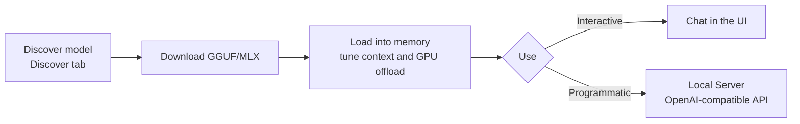

# LM Studio: local LLMs with a graphical interface

[LM Studio](https://lmstudio.ai/) is a desktop application (Windows, macOS and Linux) for **downloading, managing and running LLMs locally** from a graphical interface. If [llama.cpp](llama_cpp.md) is the engine and the command line, LM Studio is the driver's seat: you search for a model, download it with one click and chat with it without touching a terminal.

Under the hood it uses the same engines you already know — **llama.cpp** for GGUF models and **Apple MLX** on Apple Silicon — but adds a visual layer to discover models, tune parameters and spin up a server with an OpenAI-compatible API. This guide is dedicated and practical; to compare frameworks against each other, see [Local Model Ecosystems](local_ecosystems.md).

!!! info "LM Studio or Ollama?"
    [Ollama](ollama_basics.md) is CLI-first and fits automation and deployments better. LM Studio shines for interactive use: exploring models, testing prompts and tuning parameters visually. Both expose an OpenAI-compatible API.

## 🧭 Workflow



## 📦 Installation

Download the installer from the official site and follow the wizard:

```bash
# Official downloads page
# https://lmstudio.ai/download
```

- **Windows**: `.exe` installer (requires Windows 10/11, preferably with AVX2 support).
- **macOS**: `.dmg` for Apple Silicon (M1/M2/M3/M4) — leverages MLX and unified memory.
- **Linux**: `AppImage` (x64 with AVX2).

!!! warning "CPU requirement"
    LM Studio needs **AVX2** instructions on x86. On older machines without AVX2 it will not start; in that case use a custom-built [llama.cpp](llama_cpp.md).

## 🔍 Discovering and downloading models

In the **Discover** tab (🔍) you search for models by name (e.g. `Llama 3.1`, `Qwen2.5`, `Phi-4`). LM Studio lists the available variants in **GGUF** (and **MLX** on Mac) with different quantization levels.

For each model you get a recommendation based on your hardware:

| Label | Meaning |
|-------|---------|
| **Full GPU Offload Possible** | The model fits entirely in your GPU/VRAM |
| **Partial GPU Offload Possible** | It fits partially; the rest goes to CPU/RAM |
| **Likely too large** | It exceeds your memory; avoid it or drop a quantization level |

!!! tip "Which quantization to pick"
    As with [llama.cpp](llama_cpp.md), **Q4_K_M** is the recommended balance. Go up to Q5/Q6/Q8 if you have spare memory; drop to Q3 only if a model does not fit.

## 💬 Loading a model and chatting

1. Go to the **Chat** tab (💬).
2. In the top selector, choose the downloaded model: LM Studio **loads it into memory**.
3. Type your prompt and converse.

Before loading, the configuration panel lets you tune the key parameters.

## ⚙️ Parameter configuration

### Load-time parameters

| Parameter | Description |
|-----------|-------------|
| **Context Length** | Context tokens the model "remembers". More context = more RAM/VRAM |
| **GPU Offload** | How many layers are offloaded to the GPU (equivalent to llama.cpp's `-ngl`) |
| **CPU Threads** | CPU threads for inference |
| **Evaluation Batch Size** | Tokens processed per batch when ingesting the prompt |
| **Keep Model in Memory** | Keeps the model loaded even when unused |
| **Flash Attention** | Reduces context memory usage (experimental) |

!!! note "Max out GPU Offload"
    Raise the **GPU Offload** slider as far as your VRAM allows ("max" label). If loading throws memory errors, lower it slightly. Layers that are not offloaded run on CPU.

### Inference parameters (sampling)

Tuned per conversation or preset: **Temperature**, **Top P**, **Top K**, **Repeat Penalty** and **Max Tokens**. You can save combinations as reusable **presets**.

## 🌐 Local server with an OpenAI-compatible API

The **Developer** tab (or **Local Server**) starts an HTTP server with endpoints **compatible with the OpenAI API**. Perfect for connecting your scripts, IDEs or apps to a local model.

1. Open the **Developer** tab.
2. Select the model to serve and click **Start Server** (default port `1234`).

### Call the chat endpoint with curl

```bash
curl http://localhost:1234/v1/chat/completions \
  -H "Content-Type: application/json" \
  -d '{
    "model": "local-model",
    "messages": [
      {"role": "system", "content": "You are a concise DevOps assistant."},
      {"role": "user", "content": "Give me a command to list the pods in a namespace"}
    ],
    "temperature": 0.7
  }'
```

### With the OpenAI SDK in Python

```python
from openai import OpenAI

# base_url points at LM Studio's local server; api_key is a placeholder
client = OpenAI(base_url="http://localhost:1234/v1", api_key="lm-studio")

resp = client.chat.completions.create(
    model="local-model",
    messages=[{"role": "user", "content": "Explain what a Deployment is in Kubernetes"}],
)
print(resp.choices[0].message.content)
```

Available endpoints: `/v1/chat/completions`, `/v1/completions`, `/v1/embeddings` and `/v1/models`.

!!! info "Drop-in compatibility"
    Just like llama.cpp's [llama-server](llama_cpp.md), any tool that speaks the OpenAI API works by changing only `base_url`. To change the port: `1234` is LM Studio's default.

## 🖥️ The `lms` CLI: automation from the terminal

LM Studio ships `lms`, a CLI for scripting and CI. First, enable it:

```bash
# Register the lms command on the PATH (once)
npx lmstudio install-cli
```

```bash
# List downloaded models
lms ls

# Load a model into memory with context and GPU maxed out
lms load llama-3.1-8b-instruct --context-length 8192 --gpu max

# Unload the model from memory
lms unload --all

# Start the local server via CLI
lms server start --port 1234
```

!!! tip "Interactive to explore, CLI to automate"
    Use the graphical interface to discover and test; use `lms` when you want to reproduce the configuration in scripts or pipelines.

## 🎯 Use cases and integration

- **Prototyping and prompt evaluation** with no cost and no data leaking to the cloud.
- **Local backend for IDEs**: point extensions like *Continue* at the server `http://localhost:1234/v1`.
- **Local RAG**: use the `/v1/embeddings` endpoint with an embedding model to index private documents.
- **Offline demos**: carry the app and models on a laptop, no connection needed.

For automated deployments on servers or Kubernetes, [Ollama](ollama_basics.md) or [llama.cpp](llama_cpp.md) fit better thanks to their CLI/headless nature.

## 🔗 Additional resources

- [Official LM Studio site](https://lmstudio.ai/)
- [LM Studio documentation](https://lmstudio.ai/docs)
- [lms CLI reference](https://lmstudio.ai/docs/cli)
- [Local Model Ecosystems](local_ecosystems.md) · [Ollama](ollama_basics.md) · [LLaMA.cpp](llama_cpp.md)
