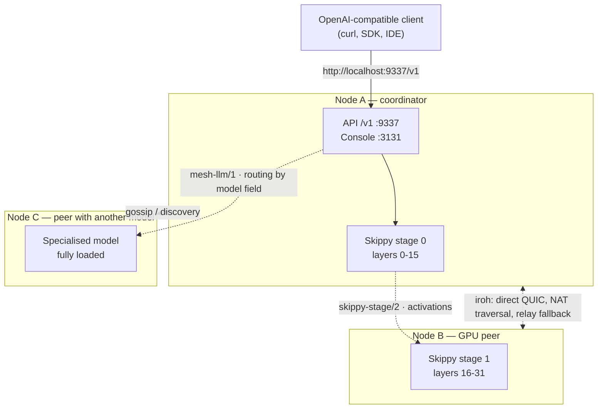

# MeshLLM: distributed LLM inference over a P2P mesh

Mesh LLM pools GPUs and memory across machines and exposes the result as **one OpenAI-compatible API** at `http://localhost:9337/v1`. You start one node, add more nodes later, and the mesh decides whether a model runs locally, routes to a peer, or uses stage splits for models that are too large for a single box.

It is open source (Apache-2.0), written mainly in Rust, and built on [iroh](https://www.iroh.computer/) for its peer-to-peer networking layer.

!!! warning "Young project: the API and CLI may change"
    Mesh LLM was publicly introduced in July 2026 and its own maintainers describe it as *"experimental distributed-systems software"*. The commands, flags and configuration formats in this guide come from the official documentation at review time (2026-07-18), but they **may change between versions**. Before automating anything, always cross-check `docs/CLI.md` in the official repository.

## 🎯 The problem it solves

The typical homelab or research-team scenario is having several *underused* GPU (or CPU) machines: an Apple Silicon laptop, a desktop with an NVIDIA card, a mini-PC. On their own, each can only load small models, and all three sit idle most of the day.

Mesh LLM attacks that from three angles:

| Situation | What the mesh does |
|---|---|
| The model fits entirely on one node | Serves it **locally**, with no stage traffic |
| Another peer already has that model loaded | **Routes** the request to that peer by the `model` field |
| The model fits on no single machine | Splits it by **layer ranges** across nodes (*Skippy stage splits*) |

The project's own tagline sums it up: *"run bigger models without buying bigger GPUs"*.

## 🧭 How it compares with what you already know

- [Ollama](ollama_basics.md) and [LM Studio](lm_studio.md): a single node, no networking, instant start. The right answer for 90 % of cases.
- [llama.cpp](llama_cpp.md): the inference engine. Mesh LLM tracks llama.cpp model-family parity with GGUF.
- [Kubernetes deployment](deployment_kubernetes.md): inference on a managed cluster (vLLM and friends), with homogeneous nodes, an orchestrator and datacenter networking.
- **Mesh LLM**: distributed compute **across your own heterogeneous machines**, with no central orchestrator or coordination server in the data plane.

See also [Local ecosystems](local_ecosystems.md) to place all these pieces in context.

## 🏗️ P2P architecture on iroh

Every node runs an iroh endpoint whose public key is its network identity. iroh handles **hole-punching**, **NAT traversal** and relay **fallback**, so nodes establish direct **QUIC** connections to each other with no central server in the data plane.

On top of QUIC, Mesh LLM defines several ALPNs according to iroh's documentation:

- `mesh-llm/1` — gossip, routing, HTTP tunnels and plugin channels.
- `mesh-llm-control/1` — control plane: operator configuration and ownership.
- `skippy-stage/2` — latency-sensitive activation transport.



!!! info "Public vs. private discovery"
    **Published** meshes advertise through Nostr discovery. **Private** meshes stay invite-token based: only holders of the token can join.

## 📦 Installation

The official installer downloads the release executable. The binary is called `mesh-llm` (`mesh-llm.exe` on Windows).

```bash
curl -fsSL https://raw.githubusercontent.com/Mesh-LLM/mesh-llm/main/install.sh | bash
```

On Windows, using PowerShell:

```powershell
irm https://raw.githubusercontent.com/Mesh-LLM/mesh-llm/main/install.ps1 | iex
```

Then finish the initial configuration:

```bash
mesh-llm setup
```

`mesh-llm setup` configures the native runtime and can install the background service on supported macOS and Linux machines.

!!! tip "Building from source"
    ```bash
    git clone https://github.com/Mesh-LLM/mesh-llm
    cd mesh-llm
    just build
    ```
    Requires `just`, `cmake`, Rust and Node.js 24 + npm. CUDA builds need `nvcc`, ROCm builds need ROCm/HIP, and Vulkan builds need Vulkan dev files plus `glslc`. Metal is macOS-only.

To remove the install later, preview the cleanup first:

```bash
mesh-llm uninstall --dry-run
mesh-llm uninstall --yes
```

Uninstall **preserves** the `~/.mesh-llm` configuration and identity data unless you explicitly pass `--purge-config`.

## 🚀 First steps

### Join the public mesh

```bash
mesh-llm serve --auto
```

That command chooses a backend flavor, downloads a suitable model if needed, joins the best discovered public mesh, starts the local API on port `9337` and the web console on port `3131`.

For server deployments, `--headless` hides the web UI while keeping the management API on the `--console` port:

```bash
mesh-llm serve --auto --headless
```

### Query models and send a request

```bash
curl -s http://localhost:9337/v1/models | jq '.data[].id'
```

```bash
curl http://localhost:9337/v1/chat/completions \
  -H "Content-Type: application/json" \
  -d '{"model":"GLM-4.7-Flash-Q4_K_M","messages":[{"role":"user","content":"hello"}]}'
```

Because it is OpenAI-compatible, any client pointed at `http://localhost:9337/v1` works unchanged: official SDKs, IDE plugins or agent tooling.

### A private mesh across your own machines

Create the mesh on the first node (it prints an invite token):

```bash
mesh-llm serve --model Qwen3-8B-Q4_K_M
```

Join from another GPU node:

```bash
mesh-llm serve --join <token>
```

Join as an API-only node that does not serve models:

```bash
mesh-llm client --join <token>
```

Publish your own mesh to public discovery:

```bash
mesh-llm serve --model Qwen3-8B-Q4_K_M --publish
```

!!! warning "Multi-interface Linux and Docker hosts"
    On hosts with several kernel-visible interfaces — especially `docker run --network host` systems — iroh can discover and advertise Docker or CNI bridge addresses such as `172.17.0.1`. If every host shares that address, peers may race the wrong local bridge instead of the real network. Pin the interface explicitly with `--bind-ip` and `--bind-port`.

## 🧩 Splitting a large model: Skippy stage splits

Skippy is Mesh LLM's embedded staged runtime. It lets the mesh run models that do not fit on one machine by loading **package-backed layer stages** across peers. The flow, per the official docs:

1. The coordinator resolves the requested model or layer package.
2. The topology planner picks peers and **contiguous** layer ranges.
3. Downstream/final stages load first.
4. Stage 0 becomes routable only after every required stage reports ready.
5. OpenAI clients keep using the normal mesh endpoint at `http://localhost:9337/v1`.

Layer packages are Hugging Face repositories containing a `model-package.json` manifest plus GGUF fragments, so each peer fetches **only** the shared artifacts plus the layer files needed for its assigned stage.

```bash
mesh-llm serve --model hf://meshllm/Qwen3-235B-A22B-UD-Q4_K_XL-layers@<revision> --split
```

!!! note "A single node always beats a split"
    If one node can load the full model, Mesh LLM **prefers** the single-node path. Splitting is used when the model physically needs it or when an explicit split run asks for it. For production runs, prefer immutable refs (`@<revision>`) over moving refs.

## 🔀 Routing and specialised models

Every node exposes the same `/v1` API. Requests are routed **by the `model` field** to the peer that can serve that model. That enables a very natural homelab pattern: one machine holds the coding model, another the large generalist, another a multimodal model — and a single endpoint fronts them all.

There is also a **Mixture-of-Agents** gateway: sending `"model": "mesh"` makes the proxy fan the request out to every model available in the mesh in parallel, arbitrate the responses with deterministic logic, and return one OpenAI-compatible reply. It requires at least two distinct models in the mesh.

```bash
curl http://localhost:9337/v1/chat/completions \
  -H "Content-Type: application/json" \
  -d '{"model":"mesh","messages":[{"role":"user","content":"What is the capital of Japan?"}]}'
```

!!! danger "MoA is flagged experimental by the project itself"
    The official documentation warns that behaviour, routing heuristics, error shapes and tuning knobs for `"model": "mesh"` **may change between versions**. Treat it as a preview; use a specific model id when you need stable semantics.

## ⚡ Speculative decoding

Mesh LLM supports speculative decoding in its staged runtime and exposes tuning through `mesh-llm benchmark tune`, which sweeps configurations and measures decode tokens/s. The documented types are `auto`, `mtp`, `draft`, `ngram` and `disabled`:

```bash
mesh-llm benchmark tune --model /models/qwen3-mtp.gguf --speculative-types auto
mesh-llm benchmark tune --model /models/qwen3-8b.gguf \
  --speculative-types draft,ngram,disabled \
  --spec-draft-models /models/qwen3-draft.gguf \
  --spec-draft-max-tokens 4,8,16
```

With `auto`, native MTP is tried first for MTP-looking targets, then locally discoverable draft models, then ngram candidates as a model-free fallback, plus a disabled baseline for comparison. `--apply` writes the recommendation into `~/.mesh-llm/config.toml`; `--no-speculative-tune` reproduces the older baseline-only sweep.

!!! info "Scope of speculative decoding"
    Draft speculation controls, along with activation wire dtype, prefill controls and manual stage layer ranges, **only execute in staged mode**. The official documentation does not describe a scheme where the draft and target models live on different peers — do not assume that topology without verifying it in the repository.

## 🔒 Security and trust model

Meshes can be created with **immutable requirements** fixed at creation time: minimum node version, protocol generation and release-attestation policy. Changing those requirements derives a new mesh id. Requirement-aware meshes use **signed bootstrap tokens**; private and unrestricted legacy meshes keep the older unsigned invite-token path.

!!! danger "Attestation is build provenance, not runtime attestation"
    The documentation is explicit: a signed release attestation proves a peer's binary was published by a trusted release signer. It does **not** prove the remote process is running unmodified code, nor that the host OS or hardware has not been tampered with. Treat peers on a public mesh as untrusted code and untrusted data: whatever inference you send to a peer, that peer can see.

Verifying a stamped packaged binary:

```bash
cargo run -p xtask -- release-attestation inspect \
  --binary <path-to-packaged-mesh-llm> \
  --public-key-file <release-signing-public-key.json>
```

A packaged release binary reports `valid`, an unstamped local or dev build reports `missing`, and a binary that changed after packaging reports `invalid`.

## 🧪 Realistic use cases

- **Multi-machine homelab**: three heterogeneous boxes (Apple Silicon + an NVIDIA desktop + a mini-PC) joined in a private mesh, serving a 70B+ model via splits that none of them could load alone.
- **Research team**: each researcher runs `mesh-llm serve --join <token>`; the group shares a private mesh with large and specialised models, and everyone points their scripts at the same `localhost:9337/v1`.
- **Thin client node**: a GPU-less laptop uses `mesh-llm client --join <token>` to consume the mesh like a remote API, without data leaving the team's network.
- **Harvesting idle hours**: desktop machines contribute their GPU to the team mesh outside working hours.

## ⚠️ Limitations and when NOT to use it

!!! warning "Read this before investing time"
    - **Network latency**: layer splits make activations travel between machines on every token. A gigabit LAN is already noticeable; over WAN or Wi-Fi the degradation is severe. The project defines a dedicated ALPN (`skippy-stage/2`) precisely because that transport is latency-sensitive.
    - **Maturity**: the project self-describes as experimental. Features like the MoA gateway are marked preview. It is not a stable basis for SLAs.
    - **Network surface**: a P2P daemon with NAT traversal and relays creates connectivity your network may not expect. On public meshes, your prompts leave your machine.
    - **Peer trust**: there is no remote runtime attestation. On a public mesh, a malicious peer sees the inference traffic you route to it.
    - **Operational complexity**: discovery, tokens, owner policy, stage planning and cross-version compatibility are all moving parts you have to operate.

**Do not use it if**:

- The model you need **fits on a single machine**: use [Ollama](ollama_basics.md) or [llama.cpp](llama_cpp.md) and skip the networking entirely.
- You need **production throughput with an SLA**: use vLLM on [Kubernetes](deployment_kubernetes.md) with homogeneous nodes.
- Your data is **sensitive and you do not control every node**: the public mesh is out; at minimum use a private mesh with tokens and your own nodes.
- You only have **one machine**: there is no mesh to form.

!!! tip "Reporting bugs"
    When reporting a failure, include the command you ran, the platform and backend flavor, `/api/status` output if available, and whether the node was private, published, or joined with `--auto`.

## 🔗 Related resources

- [Ollama: installation and first steps](ollama_basics.md) — the single-node starting point.
- [llama.cpp](llama_cpp.md) — the GGUF engine whose family parity Skippy tracks.
- [LM Studio](lm_studio.md) — graphical single-node alternative.
- [Local ecosystems](local_ecosystems.md) — overview of local LLM tooling.
- [Scaling deployment with Kubernetes](deployment_kubernetes.md) — the other end of the spectrum.

## 📚 References

Official sources consulted on 2026-07-18:

- [Mesh LLM — official site](https://meshllm.cloud/)
- [Official repository: Mesh-LLM/mesh-llm (Apache-2.0)](https://github.com/Mesh-LLM/mesh-llm)
- [Mesh LLM: distributed AI computing on iroh — iroh blog](https://www.iroh.computer/blog/mesh-llm)
- [`docs/MESHES.md`](https://github.com/Mesh-LLM/mesh-llm/blob/main/docs/MESHES.md) — private meshes, publishing, tokens, API-only clients.
- [`docs/SKIPPY_SPLITS.md`](https://github.com/Mesh-LLM/mesh-llm/blob/main/docs/SKIPPY_SPLITS.md) — layer splits.
- [`docs/CLI.md`](https://github.com/Mesh-LLM/mesh-llm/blob/main/docs/CLI.md) — full command and flag reference.
- [`docs/USAGE.md`](https://github.com/Mesh-LLM/mesh-llm/blob/main/docs/USAGE.md) — operational guide.
- [iroh documentation](https://docs.iroh.computer/)

!!! note "Disambiguation"
    This article is about **Mesh LLM**, the P2P distributed inference mesh built on iroh. Do not confuse it with the same-named academic paper on 3D mesh generation (arXiv 2508.01242), nor with Hewlett Packard Enterprise's `llmesh` (agentic tool mesh).
