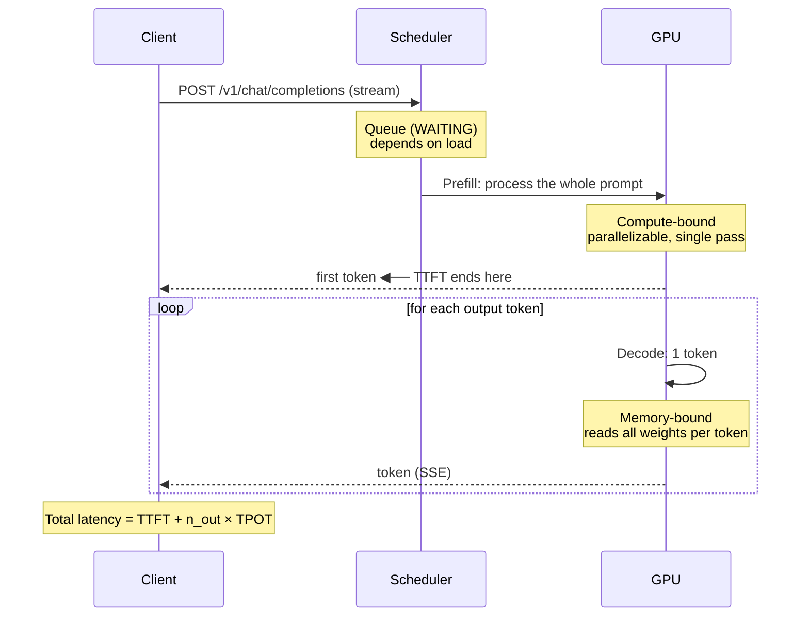
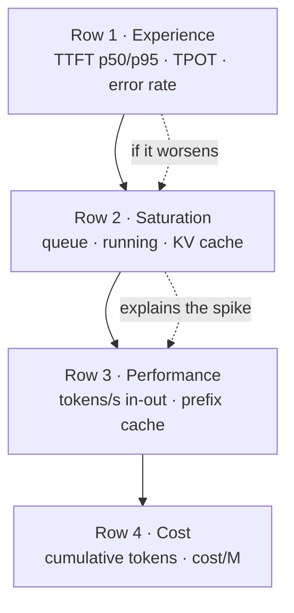

## Why an LLM is not monitored like a web API

You have Prometheus and Grafana running. You point the scrape at the inference server, import a generic HTTP dashboard, and end up staring at a panel that reads "latency p95: 47 seconds". Is it broken? Is it fine? You have no idea, because the metric you are looking at does not mean what you think it means.

Classic web service observability assumes three things that in LLM inference are **all false**:

!!! warning "The three assumptions that break"
    **1. A request lasts milliseconds.** In inference it lasts between 2 seconds and several minutes. A histogram with buckets up to 10s saturates in the `+Inf` bucket and you lose all resolution exactly where your traffic lives.

    **2. Response time is a useful number.** With SSE streaming, the user is already reading text while the request is still "open". Total duration mostly measures *how much text was generated*, not *how fast the system responds*. A 1500-token answer takes longer than a 50-token one even if the server is running exactly as fast.

    **3. Cost is proportional to requests.** It is not. It is proportional to **tokens**, with a different factor for input and output. Ten requests with 200-token prompts cost a fraction of a single request with 100k tokens of context.

The practical consequence: **the standard HTTP metrics from your ingress or your sidecar are not enough to govern an inference service.** They tell you the process is alive. For everything else you need metrics that understand tokens.

!!! info "Where this guide fits"
    - Installing and operating Prometheus, Grafana, Loki and Alertmanager → [Complete observability stack](../monitoring/observability_stack.md)
    - Measuring the *quality* of responses with benchmarks → [LLM model evaluation and testing](model_evaluation.md)
    - Tuning the engine that produces these metrics → [vLLM](vllm.md)
    - **This guide**: what to measure in production, why, and how to build the dashboard

## Anatomy of an inference request

To understand what to measure, you need to see where the time goes. A request passes through phases with radically different performance characteristics.



Two phases, two different bottlenecks:

- **Prefill** processes the N prompt tokens in one go. It is compute-bound (FLOPs). It scales with prompt length.
- **Decode** generates one token per step. It is memory-bandwidth-bound: every step has to read the model's full weights from HBM. It scales with response length.

A model can have excellent aggregate throughput and terrible TTFT, or the other way around. They are independent axes and **you need to measure both**.

## The metrics that matter

### TTFT — time to first token

**Precise definition**: elapsed time from the server accepting the request until it emits the first token of the response. It includes queue time plus the full prefill.

This is the metric the **user perceives as "the system responds"**. In a chat interface, a 400 ms TTFT with slow generation feels snappy; an 8-second TTFT followed by instant generation feels broken, even if total latency is the same or lower.

What degrades it, in order of real-world frequency:

1. **Queue time** — more requests than capacity. It is the dominant factor under load.
2. **Long prompt** — prefill is proportional to input tokens. A RAG pipeline injecting 30k tokens of context pays high TTFT by design.
3. **Preemption** — the scheduler evicted the request to make room and the state has to be recomputed.

!!! tip "Segment TTFT by prompt length"
    A global TTFT p95 mixes 100-token requests with 30k-token requests. The resulting number describes neither of them. If your traffic is heterogeneous, add a prompt-length bucket label (for example `short` / `medium` / `long`) in your application layer and measure per bucket.

### TPOT — time per output token

**Precise definition**: average time between consecutive tokens during the decode phase, once the first one has been emitted. Its inverse is **tokens per second per request**.

It is the perceived "typing speed" metric. Useful reference: comfortable human reading sits around 5-10 tokens/s, so a TPOT below ~100 ms is usually enough for chat; for an agent chaining calls with no human waiting, lower is better with no perceptual threshold.

!!! note "TPOT and ITL are not quite the same thing"
    **Inter-token latency (ITL)** is the observed interval between two specific tokens. **TPOT** per request is usually computed as `(total_latency - TTFT) / (output_tokens - 1)`, that is, a per-request average. The ITL distribution reveals jitter (stalls from preemption or scheduling) that the TPOT average hides. If users report "it freezes halfway through", look at ITL, not TPOT.

### Aggregate throughput

**Precise definition**: output tokens generated per second summed across **all** concurrent requests.

This is the operator's metric, not the user's. It determines how many users fit per GPU and therefore your unit cost. And here is the central tension of running inference:

**Aggregate throughput and per-request TPOT are in direct conflict.** Larger batches raise total throughput and lower individual speed, because each decode step splits memory bandwidth across more sequences. Tuning an inference server means picking a point on that curve, not optimizing both at once.

### Queued requests and batch size

- **Running requests**: how many sequences are in the scheduler's active batch right now.
- **Waiting requests**: how many are admitted but not yet in the batch.

The queue is your **leading indicator**. It rises before TTFT degrades and long before timeouts appear. If you are going to alert on a single saturation symptom, alert on the queue.

### GPU utilization and KV cache occupancy

Here is the most common mistake: looking at `utilization.gpu` in `nvidia-smi` and concluding there is headroom because it reads 60%.

!!! danger "GPU utilization lies in inference"
    `utilization.gpu` measures the percentage of time during which **at least one kernel is running**. It does not measure how much of the chip is being used. During decode, a memory-bound kernel can read 100% "utilization" while using a minimal fraction of compute capacity. It is an indicator of "it is doing something", not of "it is full".

The real concurrency limit is the **KV cache**. Every active sequence stores the attention keys and values for all its tokens; that state lives in VRAM and grows linearly with context. When KV cache occupancy hits 100%, the scheduler cannot admit more sequences: it queues, or it **evicts** (preemption) in-flight requests whose state must then be recomputed. That shows up as TTFT spikes and ITL jitter, without any CPU or "GPU utilization" panel flinching.

The three VRAM signals that do matter:

| Signal | What it indicates | Attention threshold |
|---|---|---|
| KV cache occupancy | Real available concurrency | > 90% sustained |
| Preemptions / recomputations | You are already over the limit | any sustained value > 0 |
| Prefix cache hits | Efficiency of shared prompts | sharp drop against baseline |

A drop in prefix cache hits is an underrated diagnostic: if your system prompt changes (a dynamic variable, an injected timestamp), the prefix stops being reusable, prefill explodes and TTFT rises without any change in load.

### Errors, timeouts and truncations

5xx errors are the easy part. The LLM-specific ones are these, and none of them shows up as an HTTP error:

- **Output limit truncation**: generation is cut when `max_tokens` is reached. The request returns **200 OK** with an incomplete answer, sometimes mid-sentence or with unclosed JSON. Detectable through the finish reason (`length` instead of `stop`).
- **Context limit rejection**: prompt plus expected output exceed `max_model_len`. Usually returns 4xx. In RAG it is the most common failure and its cause is a retriever that returned too many chunks.
- **Client timeout**: the client gives up before receiving the full response. From the server it looks like an aborted request; from the user, like a total failure.

!!! warning "Silent truncation is the most expensive failure"
    A service with 3% of responses truncated by `max_tokens` shows 0% errors on any HTTP dashboard and has a serious downstream quality problem, especially if something parses that output as JSON. **Graph the ratio of `length` versus `stop` finish reasons from day one.**

## vLLM native metrics

vLLM exposes Prometheus metrics at `/metrics` on the same port as the OpenAI-compatible server, prefixed with `vllm:` and labeled with `model_name`. No additional exporter is needed.

```bash
# Check what your specific build exposes (always do this before writing queries)
curl -s http://localhost:8000/metrics | grep '^# HELP vllm:'
```

These are the ones I can confirm in current official vLLM documentation (V1 engine):

```promql
# --- Gauges: instantaneous scheduler state ---
vllm:num_requests_running          # requests in the execution batches
vllm:num_requests_waiting          # requests waiting to be scheduled
vllm:kv_cache_usage_perc           # fraction of KV cache blocks in use (0-1)

# --- Counters: cumulative (exposed with the _total suffix) ---
vllm:prompt_tokens_total           # prefill tokens processed
vllm:generation_tokens_total       # generation tokens produced
vllm:request_success_total         # completed requests, finished_reason label
vllm:num_preemptions_total         # cumulative engine preemptions
vllm:prefix_cache_queries_total    # tokens queried against the prefix cache
vllm:prefix_cache_hits_total       # tokens served from the prefix cache

# --- Histograms: latency distributions ---
vllm:time_to_first_token_seconds        # TTFT
vllm:inter_token_latency_seconds        # ITL, interval between tokens
vllm:request_time_per_output_token_seconds  # per-request TPOT
vllm:e2e_request_latency_seconds        # end-to-end total latency
vllm:request_queue_time_seconds         # time in the WAITING phase
vllm:request_inference_time_seconds     # time in the RUNNING phase
vllm:request_prefill_time_seconds       # time in the PREFILL phase
vllm:request_decode_time_seconds        # time in the DECODE phase
```

!!! danger "Verify the names against your version"
    vLLM's metric set changed between the V0 and V1 engines, and it keeps evolving. Some historical names (for instance those referring to GPU cache occupancy in V0) were renamed. **Do not copy these queries into production without first running the `curl` above against your own server.** A panel querying a non-existent metric does not error out: it draws an empty flat line, which is worse.

    vLLM also exposes additional metrics about KV cache blocks, speculative decoding, LoRA adapters and multi-modal cache whose availability depends on startup flags and version. Discover them with the `curl`, do not assume them.

### Configuring the scrape

```yaml
# servicemonitor-vllm.yaml — requires Prometheus Operator
apiVersion: monitoring.coreos.com/v1
kind: ServiceMonitor
metadata:
  name: vllm
  namespace: observability
  labels:
    release: prometheus
spec:
  namespaceSelector:
    matchNames: ["inference"]
  selector:
    matchLabels:
      app: vllm
  endpoints:
    - port: http
      path: /metrics
      interval: 15s
      scrapeTimeout: 10s
```

A 15s `interval` is a good starting point. At 60s you lose queue spikes, which are short and are exactly what you want to see.

## Ollama: what it exposes and what it does not

[Ollama](ollama_basics.md) is designed for local and desktop use, and it shows: **it does not publish a Prometheus-format `/metrics` endpoint**. There is no queue gauge, no TTFT histogram, no KV cache occupancy. If you need observability over Ollama, you instrument it from the outside.

The good news is that the API response itself carries the raw data you need. With `"stream": false`, `/api/generate` and `/api/chat` return timing fields in nanoseconds:

```bash
curl -s http://localhost:11434/api/generate -d '{
  "model": "llama3.1:8b",
  "prompt": "Explain the KV cache in two sentences",
  "stream": false
}' | jq '{
    total_duration, load_duration,
    prompt_eval_count, prompt_eval_duration,
    eval_count, eval_duration
  }'
```

What each field means:

| Field | Meaning |
|---|---|
| `load_duration` | Model load time (high only when cold) |
| `prompt_eval_count` | Input tokens processed during prefill |
| `prompt_eval_duration` | Prefill duration, in nanoseconds |
| `eval_count` | Tokens generated |
| `eval_duration` | Generation duration, in nanoseconds |
| `total_duration` | Total request time, in nanoseconds |

From those you derive your metrics:

- **generation tokens/s** = `eval_count / (eval_duration / 1e9)`
- **prefill tokens/s** = `prompt_eval_count / (prompt_eval_duration / 1e9)`
- **TTFT approximation** = `(load_duration + prompt_eval_duration) / 1e9`

!!! note "That TTFT is an approximation, not the real metric"
    With `stream: false` there is no first token to time: you reconstruct TTFT by adding load and prefill. It is useful as a trend, but it does not include queue time or the cost of the first decode step. For an exact TTFT, measure on the client with `stream: true` and mark the instant the first *chunk* arrives.

A minimal exporter: wrap the call and publish the metrics yourself.

```python
# ollama_exporter.py — minimal sidecar to get Prometheus metrics out of Ollama
import requests
from prometheus_client import Counter, Histogram, start_http_server

NS = 1e9

TOKENS_IN = Counter("ollama_prompt_tokens_total", "Prompt tokens", ["model"])
TOKENS_OUT = Counter("ollama_generation_tokens_total", "Generated tokens", ["model"])
GEN_TPS = Histogram(
    "ollama_generation_tokens_per_second", "Tokens/s during the generation phase",
    ["model"], buckets=(5, 10, 20, 30, 50, 75, 100, 150, 250, 500),
)
PREFILL = Histogram(
    "ollama_prefill_seconds", "Prefill duration",
    ["model"], buckets=(0.05, 0.1, 0.25, 0.5, 1, 2, 5, 10, 30, 60),
)
E2E = Histogram(
    "ollama_request_seconds", "Total request duration",
    ["model"], buckets=(0.5, 1, 2, 5, 10, 20, 40, 80, 160, 320),
)


def generate(model: str, prompt: str) -> str:
    r = requests.post(
        "http://localhost:11434/api/generate",
        json={"model": model, "prompt": prompt, "stream": False},
        timeout=600,
    )
    r.raise_for_status()
    d = r.json()

    TOKENS_IN.labels(model).inc(d.get("prompt_eval_count", 0))
    TOKENS_OUT.labels(model).inc(d.get("eval_count", 0))
    E2E.labels(model).observe(d["total_duration"] / NS)

    if d.get("prompt_eval_duration"):
        PREFILL.labels(model).observe(d["prompt_eval_duration"] / NS)
    if d.get("eval_duration") and d.get("eval_count"):
        GEN_TPS.labels(model).observe(d["eval_count"] / (d["eval_duration"] / NS))

    return d["response"]


if __name__ == "__main__":
    start_http_server(9109)
    print(generate("llama3.1:8b", "say hello")[:80])
```

!!! tip "When to migrate from Ollama to vLLM"
    If you need to govern concurrency with queue and KV cache metrics, you are already outside Ollama's territory. That is an engine decision, not a monitoring one: see [vLLM](vllm.md).

## Modelling cost

Cost per request does not exist as a stable number. What exists is **cost per token**, and it is computed in completely different ways depending on whether the model is yours or a third party's.

### Paid API

The provider publishes a price per million tokens, with **input and output priced separately** (output is noticeably more expensive at practically every provider). Many also apply a discount to input tokens served from cache.

```text
period_cost = (input_tokens  / 1e6) × input_price
            + (output_tokens / 1e6) × output_price
```

!!! danger "Do not hardcode prices"
    Prices change, vary by model, by region and by commitment tier, and any figure written here would be stale before you read it. Check your provider's current price list and **store the price as a configuration variable or as a recording rule**, never embedded in a dashboard query. If a gateway like [LiteLLM](litellm.md) already computes cost for you, use its metric as the single source.

### Local model

Here you do not pay per token: you pay for **hardware powered-on time**, and cost per token depends entirely on how many tokens you squeeze out of that time.

```text
hourly_cost = hourly_hardware_amortization + hourly_energy + hourly_overhead

  hourly_hardware_amortization = acquisition_cost / (useful_life_months × 730)
  hourly_energy                = (average_power_W / 1000) × price_kWh × PUE
  hourly_overhead              = hosting, network, operations

cost_per_million_tokens = hourly_cost / (tokens_per_second × 3600) × 1e6
```

Three warnings that separate a useful model from a misleading one:

1. **Utilization dominates everything.** The denominator is *measured real* throughput, not the datasheet figure. A GPU billed 24 h a day that serves traffic 3 h has a cost per token eight times worse than the benchmark suggests. **The cost per token of a local model is mostly a utilization metric.**
2. **Average power is not TDP.** Measure real consumption under your load; during decode it usually stays below the nominal maximum.
3. **Include PUE.** Cooling and power distribution losses are a multiplier on chip consumption, not a rounding error.

Recording rules so you have the number in Prometheus without repeating the arithmetic in every panel:

```yaml
# recording-rules-llm-cost.yaml
groups:
  - name: llm-cost
    interval: 1m
    rules:
      # Adjust these values to your contract and your hardware. They are parameters, not truths.
      - record: llm:gpu_hourly_cost
        expr: vector(0)   # <-- replace with your cost/hour computed with the formula

      - record: llm:output_tokens_per_second
        expr: sum(rate(vllm:generation_tokens_total[5m])) by (model_name)

      # Cost per million generated tokens. With no traffic the result is +Inf: that is correct,
      # an idle powered-on GPU has infinite cost per token.
      - record: llm:cost_per_million_tokens
        expr: >
          scalar(llm:gpu_hourly_cost)
          / (llm:output_tokens_per_second * 3600) * 1e6
```

## The Grafana dashboard, panel by panel

Order matters. An inference dashboard reads top to bottom answering three chained questions: *is the user suffering?* → *why?* → *how much does it cost?*



**Row 1 — What the user suffers.** A time series with TTFT p50 and p95 together: the gap between them says more than either one alone.

```promql
# TTFT p95 per model
histogram_quantile(
  0.95,
  sum(rate(vllm:time_to_first_token_seconds_bucket[5m])) by (le, model_name)
)

# TPOT p95: perceived typing speed
histogram_quantile(
  0.95,
  sum(rate(vllm:request_time_per_output_token_seconds_bucket[5m])) by (le, model_name)
)
```

**Row 2 — Saturation.** Queue and KV cache on the same panel, overlaid. When TTFT rises, this panel tells you at a glance whether it was queueing (missing capacity) or long prompts (the queue is empty and TTFT rises anyway).

```promql
# Queued requests versus running requests
vllm:num_requests_waiting
vllm:num_requests_running

# KV cache occupancy as a percentage (panel unit: percentunit)
vllm:kv_cache_usage_perc

# Preemptions per second: if this is not zero, you are above the limit
sum(rate(vllm:num_preemptions_total[5m])) by (model_name)
```

**Row 3 — Performance.** Input and output throughput separately; the ratio between them characterizes your workload (RAG and classification are input-heavy, text generation is output-heavy).

```promql
# Generation and prefill tokens/s
sum(rate(vllm:generation_tokens_total[5m])) by (model_name)
sum(rate(vllm:prompt_tokens_total[5m])) by (model_name)

# Prefix cache hit ratio: a drop explains TTFT increases
sum(rate(vllm:prefix_cache_hits_total[5m]))
  / clamp_min(sum(rate(vllm:prefix_cache_queries_total[5m])), 1)
```

**Row 3b — Generation health.** The panel almost nobody adds and that almost always finds something: the ratio of responses cut off by the length limit.

```promql
# Fraction of requests truncated by max_tokens instead of finishing on their own
sum(rate(vllm:request_success_total{finished_reason="length"}[15m]))
  / clamp_min(sum(rate(vllm:request_success_total[15m])), 1)
```

**Row 4 — Cost.** Stat panels with cumulative tokens over the dashboard range and cost per million derived from the recording rules. The small boring value here is a stat with the number of powered-on GPUs: multiplied by cost/hour, that is your minimum bill regardless of traffic.

!!! tip "Choose your buckets before you need them"
    `histogram_quantile` interpolates within the bucket. If your real traffic falls entirely in the `+Inf` bucket, the p95 Grafana draws is an invention. vLLM's native histograms already ship with buckets designed for long latencies; if you instrument yourself (the Ollama case), extend the buckets into the hundreds of seconds. Changing buckets later invalidates history, so decide early.

## Alerts: the useful ones and the ones that are just noise

An alert must meet two conditions: it indicates real user harm, and there is something the on-call person can do about it. Almost every LLM alert written by default fails the second one.


```yaml
# llm-alerts.yaml
groups:
  - name: llm-inference
    rules:
      # The engine is not responding. The only legitimate candidate for a night page.
      - alert: InferenceDown
        expr: up{job="vllm"} == 0
        for: 2m
        labels: { severity: critical }
        annotations:
          summary: "Inference server {{ $labels.instance }} is not responding"

      # Sustained queue: missing capacity. Actionable = scale replicas.
      - alert: SustainedInferenceQueue
        expr: avg_over_time(vllm:num_requests_waiting[10m]) > 20
        for: 10m
        labels: { severity: warning }
        annotations:
          summary: "Sustained queue on {{ $labels.model_name }}"
          description: "Average of {{ $value }} waiting requests over 10 min."

      # Saturated KV cache + preemptions: real degradation already under way.
      - alert: KVCacheSaturated
        expr: |
          vllm:kv_cache_usage_perc > 0.95
          and rate(vllm:num_preemptions_total[10m]) > 0
        for: 10m
        labels: { severity: warning }
        annotations:
          summary: "KV cache saturated with preemptions on {{ $labels.model_name }}"

      # Sustained TTFT degradation: users are noticing it.
      - alert: DegradedTTFT
        expr: |
          histogram_quantile(
            0.95,
            sum(rate(vllm:time_to_first_token_seconds_bucket[10m])) by (le, model_name)
          ) > 10
        for: 15m
        labels: { severity: warning }
        annotations:
          summary: "TTFT p95 of {{ $value | humanizeDuration }} on {{ $labels.model_name }}"

      # Massive truncations: a quality failure invisible to HTTP monitoring.
      - alert: ExcessiveTruncations
        expr: |
          sum(rate(vllm:request_success_total{finished_reason="length"}[30m]))
            / clamp_min(sum(rate(vllm:request_success_total[30m])), 1) > 0.25
        for: 30m
        labels: { severity: warning }
        annotations:
          summary: "More than 25% of responses cut off by max_tokens"

      # Spend spike against yesterday's baseline. Business hours only.
      - alert: AnomalousSpend
        expr: |
          sum(rate(vllm:generation_tokens_total[1h]))
            > 3 * sum(rate(vllm:generation_tokens_total[1h] offset 1d))
        for: 30m
        labels: { severity: info }
        annotations:
          summary: "Token consumption 3x above the same window yesterday"
```


And the ones you should **not** create:

| Noisy alert | Why it does not work |
|---|---|
| High GPU utilization | During decode it is normal and sustained. It fires always and means nothing actionable. |
| Total latency > N seconds | A long response takes longer by definition. You alert whenever someone asks for a long summary. |
| KV cache occupancy > 80% | That is the *desirable* operating point. Below that threshold you are wasting GPU. Alert on preemptions, not on occupancy alone. |
| Any instantaneous spike without `for:` | Inference scheduling is inherently bursty. Without a sustain window, everything alerts. |
| Drop in tokens/s | It legitimately collapses when traffic drops. Measure saturation with the queue, never with throughput. |

## Quality traceability in production

Metrics tell you whether the system is fast. They do not tell you whether the responses are **correct**. For that you need to look at content, and that brings in a problem that is not technical.

!!! danger "A prompt is personal data until you prove otherwise"
    Users type into a chat things they would never put in a form: names, addresses, medical histories, credentials, confidential customer information. **Logging raw prompts turns your log backend into a personal data store with no legal basis, no retention policy and probably no encryption at rest.**

    Before writing a single prompt to disk:

    - Apply **PII redaction before the write**, never after. A log already written is a log already leaked.
    - Set a **short, explicit retention** (days, not months) and have the system delete it, not a person.
    - **Restrict access** to the prompt index the way you would restrict access to the production database.
    - Offer an **opt-out** and honour it in the pipeline, not only in the interface.
    - When in any doubt, store a **hash of the prompt** plus metadata and drop the text. A hash lets you detect duplicates and correlate without retaining content.

With that framework in place, the practical approach:

**Sample, do not store everything.** 1-2% of random traffic is enough to watch for quality drift and cuts risk surface and storage cost by two orders of magnitude. Complement random sampling with targeted sampling of the interesting cases: truncated responses, latencies in the tail of the distribution, requests with negative user feedback.

**Separate metrics from traces.** The metrics in this guide go to Prometheus, they are numeric and cheap. Content traces go to a store with its own access control and retention. Do not mix them: correlate them with a shared `request_id`. The [Loki and Tempo](../monitoring/observability_stack.md) setup serves exactly this purpose, as long as you apply redaction before sending.

```python
# quality_sampling.py — decides what gets stored and in what form
import hashlib
import random
import re

SAMPLE_RATE = 0.02            # 2% of traffic
RETENTION_DAYS = 7            # enforced in the log backend

PII_PATTERNS = [
    (re.compile(r"[\w\.\-]+@[\w\.\-]+\.\w+"), "[EMAIL]"),
    (re.compile(r"\b\d{8}[A-HJ-NP-TV-Z]\b", re.I), "[NATIONAL_ID]"),
    (re.compile(r"\b(?:\d[ -]?){13,19}\b"), "[CARD]"),
    (re.compile(r"\b(?:\+34[ -]?)?[6-9]\d{2}[ -]?\d{3}[ -]?\d{3}\b"), "[PHONE]"),
]


def redact(text: str) -> str:
    for pattern, replacement in PII_PATTERNS:
        text = pattern.sub(replacement, text)
    return text


def should_sample(finish_reason: str, latency_s: float, feedback: str | None) -> bool:
    # Always the interesting cases; everything else, at random.
    if finish_reason == "length" or latency_s > 30 or feedback == "negative":
        return True
    return random.random() < SAMPLE_RATE


def quality_record(request_id, prompt, response, meta):
    base = {
        "request_id": request_id,
        "prompt_sha256": hashlib.sha256(prompt.encode()).hexdigest(),
        "input_tokens": meta["prompt_tokens"],
        "output_tokens": meta["completion_tokens"],
        "finish_reason": meta["finish_reason"],
        "ttft_s": meta["ttft"],
        "model": meta["model"],
    }
    if not should_sample(meta["finish_reason"], meta["e2e"], meta.get("feedback")):
        return base  # metadata only: no content, no risk

    # ponytail: the PII regex covers the frequent cases; if you handle health or
    # financial data, swap it for a specialized detector before production.
    return base | {
        "prompt": redact(prompt)[:4000],
        "response": redact(response)[:4000],
    }


if __name__ == "__main__":
    r = quality_record(
        "req-1", "I am Ana, ana@example.com, 12345678Z", "Hello Ana",
        {"prompt_tokens": 12, "completion_tokens": 3, "finish_reason": "length",
         "ttft": 0.4, "e2e": 1.2, "model": "llama3.1:8b"},
    )
    assert "ana@example.com" not in r["prompt"], "email leak"
    assert "12345678Z" not in r["prompt"], "national ID leak"
    assert len(r["prompt_sha256"]) == 64
    print("ok:", r["prompt"])
```

**Evaluate offline, not on the critical path.** The sampled data feeds a batch process applying the techniques from [model evaluation](model_evaluation.md): comparison against reference answers, LLM-as-a-judge, format rules. That process produces an aggregate score that you **can** publish as a Prometheus metric and graph alongside the performance ones. Never run an LLM judge synchronously inside the user's request: you double latency and cost to obtain a number you could compute five minutes later.

**Watch for drift without reading text.** Three aggregate signals detect behaviour changes without touching content: average response length, distribution of finish reasons, and prefix cache hit ratio. A deployment that changes the system prompt shows up in all three at once.

## Rollout checklist

- [ ] Inference server `/metrics` inspected with `curl` and names verified against the deployed version
- [ ] Scrape configured with an interval of 15s or lower
- [ ] Dashboard ordered: experience → saturation → performance → cost
- [ ] TTFT p50 and p95 on the same panel
- [ ] Queue and KV cache overlaid on one panel
- [ ] Panel for `length` versus `stop` finish reasons
- [ ] Histogram buckets covering the real long tail of your traffic
- [ ] Hardware cost/hour computed with the formula and stored as a recording rule
- [ ] Alerts limited to: down, sustained queue, preemptions, degraded TTFT, truncations
- [ ] No alerts on GPU utilization or absolute total latency
- [ ] PII redaction applied **before** writing any prompt log
- [ ] Content trace retention set in days and enforced by the system
- [ ] Offline quality evaluation over sampled data, publishing its result as a metric

## References

- [Complete observability stack](../monitoring/observability_stack.md) — installing and operating Prometheus, Grafana, Loki, Tempo and Alertmanager
- [LLM model evaluation and testing](model_evaluation.md) — benchmarks and quality metrics for offline evaluation
- [vLLM](vllm.md) — the engine that produces the metrics in this guide
- [Ollama](ollama_basics.md) — local inference and the timing fields in its API
- [LiteLLM](litellm.md) — gateway with built-in cost tracking per team and per key
- [Scaling deployments with Kubernetes](despliegue_kubernetes.md) — autoscaling driven by these metrics
- [vLLM metrics documentation](https://docs.vllm.ai/en/stable/design/metrics/) — authoritative source for names, always per version
- [Prometheus: histograms and quantiles](https://prometheus.io/docs/practices/histograms/) — why bucket choice determines your percentiles
