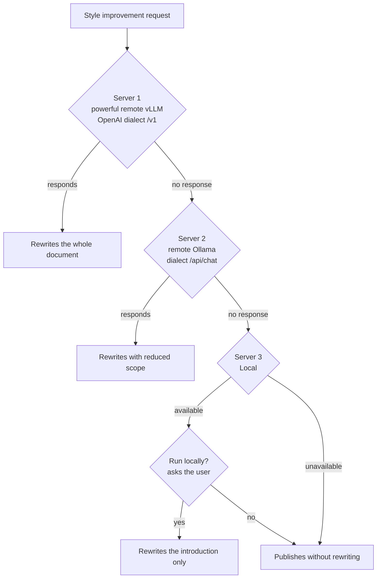

## 🎯 The question is framed wrong

"Local model or cloud API?" is a binary question for a problem that is not binary. The useful answer is almost never one of the two options: it is a split. Which requests go where, and what happens when the chosen destination does not respond.

This guide does not compare brands, nor does it publish a price table that will expire in three months. It does something else: it gives the **decision axes with actionable criteria**, and it documents a **real multi-server fallback implementation** that lives in this very repository, in `wordpress_sync.py`.

!!! info "Where this guide fits"
    - Serving an open model with high throughput → [vLLM](vllm.md)
    - Running it on your own machine → [Ollama](ollama_basics.md)
    - Overview of local runtimes and formats → [Local ecosystems](local_ecosystems.md)
    - Unified gateway with routing and managed fallback → [LiteLLM](litellm.md)

The five axes you are deciding on — cost, latency, privacy, control and quality — do not carry the same weight in every project. What follows is how to measure each one instead of having an opinion about it.

## 💰 Cost: the formula, not the intuition

The classic mistake is comparing "free" against "0.X per million tokens". The local model is not free: it is **amortised capex plus energy**, and the denominator is the volume you actually generate.

### The formula

The cost per million tokens generated locally is:

```text
local_cost_per_M_tokens =
    ( (hardware_price / useful_life_months) + (kWh_month * price_kWh) + operations_cost_month )
    / (tokens_generated_month / 1_000_000)
```

The three terms in the numerator are:

| Component | How to obtain it |
|---|---|
| Amortisation | Purchase price divided by the months of useful life you assign to it |
| Energy | Average power under load × hours of use × the kWh price on your bill |
| Operations | Maintenance hours per month × your hourly cost (do not set this to zero) |

The denominator is the one most people ignore: **cost per token is inversely proportional to volume**. The same machine that looks outrageously expensive at 2 million tokens a month looks ridiculous at 800.

### An example with labelled assumptions

!!! warning "Every number below is an illustrative ASSUMPTION"
    They are not market prices, nor those of any specific provider. API prices change several times a year and any figure written here would be obsolete before you read it. **Replace every value with your own** and with the provider's rate in force on the day you run the calculation.

```text
ASSUMPTIONS (make them again with your own real data)
  hardware_price         = 3,000 c.u.
  useful_life_months     = 36
  average_power_load     = 0.35 kW
  hours_of_use_month     = 200 h
  price_kWh              = 0.20 c.u./kWh
  operations_cost_month  = 100 c.u.   (2 h of maintenance at 50 c.u./h)

CALCULATION
  amortisation_month = 3,000 / 36          =  83.33 c.u.
  energy_month       = 0.35 * 200 * 0.20   =  14.00 c.u.
  operations_month   =                        100.00 c.u.
  ------------------------------------------------------
  fixed_cost_month                         = 197.33 c.u.
```

Now the same fixed cost spread across different volumes:

```text
SCENARIO A — low volume
  tokens_month = 2,000,000
  cost = 197.33 / 2   = 98.67 c.u. per million tokens

SCENARIO B — medium volume
  tokens_month = 50,000,000
  cost = 197.33 / 50  =  3.95 c.u. per million tokens

SCENARIO C — high volume
  tokens_month = 500,000,000
  cost = 197.33 / 500 =  0.39 c.u. per million tokens
```

The right reading is not "scenario C wins". It is this: **the break-even point exists and you know how to calculate it**. Take your provider's rate per million tokens today, put it into the equation and solve for the monthly volume above which local comes out cheaper:

```text
break_even_tokens_month = (fixed_cost_month / API_price_per_M_tokens) * 1,000,000
```

If your real volume is far below that threshold, standing up inference infrastructure is a hobby, not an economic decision. If it is far above, continuing to pay per token is a leak.

### What the formula does not capture

Three real costs that do not appear in the numerator and are worth noting separately:

- **Opportunity cost of the hardware**: if the machine already exists and was underused, the amortisation you charge to it is debatable. If you buy it *for this*, it is not.
- **Cost of unavailability**: an API with an SLA has a value that your server under the desk does not. Quantify it, or at least name it.
- **Cost of input tokens**: almost every API charges input and output at different rates, and with long prompts or RAG the input dominates the bill. Locally, a long prompt is paid in latency (prefill), not in money.

## ⚡ Latency: TTFT, tokens/s and the cold start

"It is faster" means nothing without saying *which* metric. There are two, and they measure different things:

- **TTFT** (*time to first token*): how long until the first word appears. This is what the user perceives as "it responds or it doesn't".
- **Tokens/s** during generation: the rate at which the rest comes out. This determines how long a long answer takes to complete.

### The small local model can win on TTFT

Counter-intuitive but common: **a small model on your own machine can deliver a better TTFT than a remote API running a huge model**. The reason is not power, it is the time budget:

```text
TTFT of a remote API =
      network latency (round trip)
    + time queued at the provider
    + prompt prefill on a large model

TTFT of a small local model =
      0 network
    + 0 queue (you are the only client)
    + prompt prefill on a small model
```

Remove the network and the queue and local starts ahead. On short, low-complexity tasks — classifying, extracting a field, rewriting a sentence — that advantage is the one you feel, and the large model does not contribute enough to make up for it.

On sustained tokens/s, however, the provider's infrastructure usually wins by a landslide: dedicated hardware, continuous batching and models served by optimised engines. If you generate long answers at scale, measure tokens/s; if you generate short interactive answers, measure TTFT.

### The cold start everybody forgets

Here is the hidden cost of local: **loading the model weights into memory**. A model of several gigabytes has to travel from disk to RAM or VRAM before it generates the first token. That first start can cost from seconds to tens of seconds, depending on model size and storage speed.

And it does not only happen the first time:

- Runtimes usually **unload the model from memory** after a period of inactivity to free up RAM.
- If you alternate between two models that do not fit at the same time, every switch is a full reload.
- Restarting the service, updating the runtime or rebooting the machine resets the clock.

Practical consequence: a benchmark that only measures request number fifty is lying. Measure the first one too, and decide whether your usage pattern is spaced bursts (where the cold start dominates) or continuous flow (where it amortises to zero).

!!! tip "Cheap mitigation"
    If your usage is bursty, keep the model loaded with the runtime's *keep-alive* or with a periodic one-token request. You spend a little RAM permanently in exchange for removing the cold start from the critical path.

## 🔒 Privacy: what leaves your network

This axis is not negotiated for convenience, and it is where a preference is most often confused with an obligation.

### The operational question

It is not "do I trust the provider?". It is: **which exact bytes cross my network perimeter, and what can be reconstructed from them?**

With a cloud API, at minimum the following leaves:

- The full prompt, including everything you injected into it (RAG chunks, conversation history, file contents).
- The request metadata: when, how often, from which billing identity.
- Often, the response is logged on the provider's side for a retention window.

With a local model, none of that leaves. That is the whole difference, and it is enormous when the content is sensitive.

### When it is a legal requirement, not a preference

There are three situations where "I would rather it did not leave" becomes "it cannot leave":

1. **Personal data under GDPR or equivalent regulation.** Sending personal data to a third party requires a legal basis, a data processor under contract, and control over international transfers. It is not a checkbox: it is documentation somebody has to sign.
2. **Customer data under contract.** Many confidentiality and service agreements explicitly forbid passing customer content to unapproved subprocessors. An LLM provider is a subprocessor. If they are not on the list, sending them customer code or documents is a breach of contract, regardless of how good their privacy policy is.
3. **Regulated sectors.** Healthcare, banking, defence and public administration have their own frameworks that often dictate where data may reside and be processed.

!!! danger "The case that always slips through"
    Personal data rarely arrives as a field called `national_id`. It arrives **embedded**: in a log that includes user emails, in a support ticket pasted in full, in a RAG chunk that dragged along a name and an address. If your pipeline sends unfiltered context to an API, assume that sooner or later it will send personal data. Local, or real anonymisation before it leaves.

### The grey zone of the internal network

A detail this repository writes down in its own `.env.example`: an "own" inference server you call over unencrypted `http://` **exposes the key and the content to anyone on the network path**. "Local" and "private" are not synonyms. If the content is not public, use `https` or a genuinely private network.

## 🎛️ Control: versioning, reproducibility and ground that shifts

With a downloaded open model you have an artefact: weights with a hash, which behave the same today and a year from now. With an API you have a **contract with a third party over a system they can change**.

The three concrete risks:

- **Deprecation.** A provider announces end of life for a model and you have a window to migrate. Your evaluation, your tuned prompts and your quality thresholds all get revalidated from scratch.
- **Silent drift.** The model identifier does not change, but the behaviour does (new version, a change in the moderation system, adjusted default parameters). Your prompts start failing without you having touched anything.
- **Changed terms.** Prices, rate limits, usage policies and available regions are unilateral.

The countermeasure is not to stop using APIs. It is **not to depend on a model identifier as if it were a constant**:

```python
# Bad: the model name, embedded in the code, in twenty places.
resp = client.chat(model="generic-model-v3", messages=messages)

# Good: the model is configuration, and the code does not know which one it is.
#   MODEL=... in the environment, not in the repository
resp = client.chat(model=os.getenv("MODEL"), messages=messages)
```

And above all: **an evaluation suite you can run against any candidate**. Without it, migrating models is an act of faith. With it, it is an afternoon. This is covered in [Model evaluation](model_evaluation.md).

On reproducibility, local wins without argument: you can pin the weights, the runtime, the quantisation and the seed, and archive all of it alongside the result. If you need to defend to an auditor why the system answered what it answered eight months ago, this stops being an engineering preference.

## 🧪 Quality: be honest about this axis

A document concluding that local always wins is useless for making decisions. The reality, as of today:

**Paid frontier models are still ahead on complex tasks.** Multi-step reasoning, non-trivial code with many simultaneous constraints, synthesis of long documents while keeping coherence, faithful instruction-following with many rules at once. On those tasks the difference is not a nuance: a small open model fails where a frontier one succeeds.

This repository has empirical proof of it, written as a comment in the code of `wordpress_sync.py`: when a small local model was asked to rewrite an entire document while preserving its structure, it **failed 100% of the time**, even when the structure was hidden behind markers. The solution was not to insist: it was to **reduce the scope of the small model's task** to rewriting only the introduction, which is where the tone lives and where there is no structure to lose.

That is the actionable criterion, and it is not "use the biggest model":

!!! success "Fit the task to the model, not the other way round"
    Before concluding that a local model is not good enough, check whether the task can be **broken down into pieces that are within its reach**. Many tasks a small model fails whole, it solves in slices. And many tasks that look hard are easy with the right context.

Where an open model is perfectly sufficient:

- Classification and labelling
- Field extraction from unstructured text
- Rewriting and style correction on short fragments
- Summarising texts of moderate length
- Generating *embeddings* (here local is simply the default option)

Where a frontier model is warranted:

- Reasoning with several dependent steps
- Code with interlocking requirements
- Tasks with many simultaneous instructions that all have to be respected
- Anything where the cost of a failure vastly exceeds the cost of the call

## 🖥️ The hardware picks the model, not the other way round

A concrete and very common example: **a laptop with 18 GB of unified RAM**.

The practical ceiling there is not 18 GB of model. You have to subtract the operating system, the browser, the editor and headroom for the KV cache, which grows with context length. In practice the comfortable limit sits around **models of roughly 10 GB on disk**, which under common 4-bit quantisations leaves room for mid-sized models, not large ones.

```text
18 GB total RAM
 - 4 to 6 GB   operating system and open applications
 - headroom    KV cache, which grows with context
 ------------------------------------------------
 ~10 GB        practical ceiling for model weights
```

And the important consequence: if you try to load something bigger, the system starts paging to disk and performance does not degrade gently, **it falls off a cliff**. You go from usable tokens per second to a system that does not respond.

!!! note "The rule"
    First you measure your hardware, then you choose the model that fits with headroom, and finally you fit the task to what that model can do. Doing it the other way round — picking the model you would like to use and then fighting the machine — is the fast route to a slow, unstable system. The details of quantisation and sizes are in [Model optimization](model_optimization.md) and [Local ecosystems](local_ecosystems.md).

## 🏗️ Case study: this repository's fallback chain

So far, axes. Now a real implementation that applies all of them at once.

This repository's `wordpress_sync.py` script publishes documentation to WordPress and, with the `--enhance` option, asks an LLM to improve the style of the text before publishing it. That LLM is not one: it is a **chain of servers tried in priority order**.

### The chain



Three levels, and a different decision at each one:

1. **Powerful remote server**: a vLLM speaking the OpenAI dialect. It is the one that can handle the whole document.
2. **Intermediate server**: a remote Ollama, with a more modest model. Reduced scope.
3. **Local**: last resort, and the only one that **asks before running**.

And a fourth branch that is almost never implemented and is the most important one: **if nobody is there, the document is published without rewriting**. Style improvement is optional; publishing is not. A fallback that aborts the main task when the optional part fails is badly designed.

## 🔍 Anatomy of the code: four functions

The whole mechanism fits in four small functions. They are worth looking at because the pattern is reusable as is.

### 1. Parse the configuration

The server list is not in the code: it is read from the environment, in a compact format.

```python
# Servidores de inferencia por orden de prioridad, leídos de .env para no dejar
# ninguna URL de infraestructura en el código. Formato de INFERENCE_SERVERS:
#   url|modelo|clave_opcional ; url|modelo ; ...
# Una URL con /v1 habla el dialecto OpenAI (vLLM); el resto, el de Ollama.
def _parsear_servidores():
    servidores = []
    for entrada in os.getenv('INFERENCE_SERVERS', '').split(';'):
        partes = [p.strip() for p in entrada.split('|')]
        if len(partes) >= 2 and partes[0]:
            servidores.append({
                'url': partes[0].rstrip('/'),
                'modelo': partes[1],
                'clave': os.getenv(partes[2], partes[2]) if len(partes) > 2 and partes[2] else '',
            })
    return servidores
```

The detail that matters: the third field is **not the key, it is the name of the environment variable that holds the key**. `os.getenv(partes[2], partes[2])` resolves it. That way the configuration file can carry `VLLM_API_KEY` written in the clear without that being a secret, and the secret lives only where it should.

### 2. Check availability

Before sending a long job to a server, you check that it exists. And the check endpoint depends on the dialect:

```python
# ¿Responde el servidor? Prueba el endpoint que corresponda a su dialecto.
def servidor_disponible(srv, timeout=8):
    es_openai = '/v1' in srv['url']
    url = f"{srv['url']}/models" if es_openai else f"{srv['url']}/api/tags"
    cabeceras = {'Authorization': f"Bearer {srv['clave']}"} if srv['clave'] else {}
    try:
        return requests.get(url, headers=cabeceras, timeout=timeout).status_code == 200
    except requests.RequestException:
        return False
```

The `timeout=8` is deliberate and short. An availability probe that takes a minute to fail turns the fallback into something worse than not having one.

### 3. Resolve the server

Here is the priority logic, and the question to the user:

```python
# Recorre los servidores por prioridad. Si el primero (el potente) no responde,
# avisa y sigue; antes de caer al último (local) pregunta, porque ahí la carga
# la soporta la máquina del usuario.
def resolver_servidor(interactivo=True):
    if not SERVIDORES:
        print('  Aviso: INFERENCE_SERVERS no configurado en .env')
        return None

    for i, srv in enumerate(SERVIDORES):
        es_ultimo_local = 'localhost' in srv['url'] or '127.0.0.1' in srv['url']
        if not servidor_disponible(srv):
            print(f"  Aviso: {srv['url']} no responde.")
            continue
        if es_ultimo_local and i > 0 and interactivo and sys.stdin.isatty():
            if input('  ¿Ejecutar en local? (S/n): ').strip().lower() in ('n', 'no'):
                return None
        return srv

    print('  Ningún servidor de inferencia disponible; se publica sin reescribir.')
    return None
```

Three design decisions worth copying:

- **It resolves once per run**, not per document. Probing the whole chain on every call multiplies latency without adding anything.
- **`sys.stdin.isatty()`** stops the script from hanging while it waits for an answer when it runs in CI or in a cron job. With no terminal, there is no question and no blocking.
- **Returning `None` is a valid result**, not an error. The caller knows what to do with it: publish without rewriting.

### 4. Abstract the dialect

And the actual call, which is where you can see how cheap the abstraction is:

```python
# Una sola llamada de chat, hablando el dialecto que toque.
def chat_inferencia(srv, system_prompt, user_content, timeout=600):
    es_openai = '/v1' in srv['url']
    cabeceras = {'Content-Type': 'application/json'}
    if srv['clave']:
        cabeceras['Authorization'] = f"Bearer {srv['clave']}"
    mensajes = [{'role': 'system', 'content': system_prompt},
                {'role': 'user', 'content': user_content}]

    if es_openai:
        url = f"{srv['url']}/chat/completions"
        payload = {'model': srv['modelo'], 'messages': mensajes, 'max_tokens': 32000}
    else:
        url = f"{srv['url']}/api/chat"
        payload = {'model': srv['modelo'], 'messages': mensajes, 'stream': False}

    resp = requests.post(url, headers=cabeceras, json=payload, timeout=timeout)
    resp.raise_for_status()
    datos = resp.json()
    if es_openai:
        return datos['choices'][0]['message']['content'].strip()
    return datos.get('message', {}).get('content', '').strip()
```

### The dialect heuristic

The whole trick is one line: **`'/v1' in srv['url']`**.

| If the URL contains | Dialect | Chat endpoint | Probe endpoint | Response extraction |
|---|---|---|---|---|
| `/v1` | OpenAI (vLLM and compatibles) | `/chat/completions` | `/models` | `choices[0].message.content` |
| anything else | Ollama | `/api/chat` | `/api/tags` | `message.content` |

It is a heuristic, not a standard, and that is exactly what makes it good here: **the information about which dialect a server speaks was already in its URL**, so no extra configuration field is needed that somebody could fill in wrong. The message body format (`role` / `content`) is identical in both, so the divergence comes down to three things: the path, the name of the length parameter and the shape of the response.

!!! tip "When this stops being enough"
    With two dialects and four functions, this is the correct solution. When you need retries with *backoff*, per-provider rate limits, cost accounting, caching or half a dozen dialects, the place to move to is a ready-made gateway: [LiteLLM](litellm.md). Do not reimplement that by hand.

## ❓ Why the local fallback asks first

It is the least obvious decision in the whole design, and the one most often copied wrong.

When the fallback goes from one remote server to another remote server, there is nothing to ask: the load is still carried by a machine that is there for that. But **when the last link is local, the one paying is the computer of whoever launched the command**. And that changes the nature of the fallback:

- The machine stays busy for as long as generation lasts, which with a long document is minutes, not seconds.
- RAM fills up with the model weights, with the cliff effect described earlier if the user had other things open.
- The fans, the power draw and the battery are the user's.
- And the quality will be lower than that of the server that failed, so it may not even be worth it.

A silent fallback to local is a degradation the user discovers when their laptop becomes unusable. The question turns a surprise into a choice:

```text
  Aviso: http://tu-servidor:8000/v1 no responde.
  ¿Ejecutar en local? (S/n):
```

The general principle, which is worth far more than just LLMs:

!!! warning "Degradation rule"
    A fallback can be automatic as long as the cost keeps being paid by whoever was paying it before. **The moment the cost shifts to somebody else — the user's machine, their battery, their time, their bill — it stops being an implementation detail and becomes a decision that belongs to them.**

And the exception is in the code too: `sys.stdin.isatty()`. If nobody is watching, there is nobody to ask, so the question is skipped and it does not run locally. Asking in a context without a terminal is not prudent, it is hanging.

## ⚙️ Configuration externalised in `.env`

The whole chain is defined in a single environment variable. This is the repository's `.env.example`, with no real values:

```bash
# --- Inference for style improvement with --enhance ---
#
# List of servers in PRIORITY ORDER, separated by ';'.
# Format of each one:  url|model|name_of_variable_holding_the_key
#
#   - A url containing /v1 speaks the OpenAI dialect (vLLM, etc.)
#   - The rest are treated as Ollama (/api/chat)
#   - The third field is optional; it names the variable holding the key,
#     so you never write it inside this line
#
# They are tried in order: if one does not respond, it moves to the next. Before
# using a local server (when it is not the first) the script asks, because there
# the load is carried by your machine.

VLLM_API_KEY=TU_CLAVE
INFERENCE_SERVERS=https://tu-servidor:8000/v1|tu-modelo-grande|VLLM_API_KEY;https://tu-ollama:11434|tu-modelo-medio;http://localhost:11434|tu-modelo-local
```

Broken down, the chain above is three entries separated by `;`:

```text
1)  https://tu-servidor:8000/v1 | tu-modelo-grande | VLLM_API_KEY
       ^ contains /v1 -> OpenAI dialect     ^ variable name, NOT the key

2)  https://tu-ollama:11434 | tu-modelo-medio
       ^ no /v1 -> Ollama dialect           ^ no third field: needs no key

3)  http://localhost:11434 | tu-modelo-local
       ^ local -> will ask before being used
```

!!! danger "Never write the key in `INFERENCE_SERVERS`"
    The third field is **the name of a variable**, not its value. Writing the key there puts it in a line that gets copied, pasted into issues and ends up in screenshots. `VLLM_API_KEY` on that line is not a secret; the secret lives in its own variable, and `.env` is never committed. Check that it is in your `.gitignore` before creating it.

Changing the entire topology — adding a server, reordering priorities, removing local — means editing one line of text. No deployment, no code change.

## 🔀 The hybrid pattern as a reasonable conclusion

The five axes do not all point in the same direction, and that is why the binary answer fails. Put together:

| Axis | Favours local when | Favours cloud when |
|---|---|---|
| Cost | Monthly volume exceeds break-even | Volume is low or very irregular |
| Latency | Short tasks, TTFT critical, continuous use | Long answers, sustained tokens/s |
| Privacy | There is personal, customer or regulated data | Content is public or already anonymised |
| Control | You need reproducibility or auditability | You accept migrating when the provider changes |
| Quality | The task is within a small model's reach | Complex reasoning, difficult code |

The split that follows from the table is the same one this repository implements:

**Local for volume and sensitive data. Cloud for the hard stuff.**

Translated into concrete routing rules:

```text
if the content contains personal or customer data
    -> local, always, no exception

if the task is classifying, extracting, labelling or embedding
    -> local (high volume, task within a small model's reach)

if the task is multi-step reasoning or complex code
    -> cloud (the quality gap justifies the cost)

if the chosen destination does not respond
    -> next in the chain; and if the next one is local, ask
```

What makes the hybrid work is not having both options available. It is having decided **in advance** what goes where, and having written that decision into configuration instead of leaving it to the judgement of whoever launches the command.

## ✅ Decision checklist

Before committing to an architecture:

- [ ] I have calculated the **monthly fixed cost** of the local option with my real numbers, operations included.
- [ ] I have calculated the **break-even volume** using the provider's rate in force, checked today.
- [ ] I know whether my load is **bursty** or **continuous**, and I have measured the cold start in the bursty case.
- [ ] I have measured **TTFT and tokens/s separately**, not "the latency".
- [ ] I have reviewed whether my content includes personal or customer data, **including data embedded** in logs and RAG context.
- [ ] If I use an API, I have the provider **approved as a subprocessor** in the contracts that apply.
- [ ] I have an **evaluation suite** I can run against a new model the day the current one disappears.
- [ ] I have verified that the local model **fits with headroom** in the available RAM, counting the KV cache.
- [ ] My fallback **does not abort the main task** when the optional part fails.
- [ ] My fallback **asks** before shifting the load onto the user's machine.
- [ ] No key is written in the repository, and `.env` is in `.gitignore`.

## 🚫 Common mistakes

**Comparing "free" with the API price.** Local is not free. If you have not put amortisation and operations into the equation, you have not made the comparison.

**Measuring latency with request number fifty.** The cold start is real and your warm benchmark hides it.

**Treating "local" as a synonym for "private".** Your own server over `http://` on a shared network protects nothing.

**Embedding the model identifier in the code.** The day the provider deprecates it, the change will span twenty files instead of one variable.

**Concluding that the local model is no good without having sliced up the task.** The lesson from this repository's `wordpress_sync.py`: the whole document failed 100% of the time; the introduction alone works.

**Silent fallback to local.** The user discovers the degradation when their laptop stops responding.

**A fallback that aborts when nobody is left.** If the part that failed was optional, carry on without it.

**Choosing the model before looking at the RAM.** The hardware decides, and when it does not fit, performance does not drop: it collapses.

## 📚 Next steps

- [vLLM](vllm.md) — serving open models with high throughput, the first link in the chain
- [Ollama](ollama_basics.md) — the intermediate link and the local one
- [Local ecosystems](local_ecosystems.md) — which models and formats fit on your hardware
- [LiteLLM](litellm.md) — the gateway to move to when the two-dialect heuristic falls short
- [Model evaluation](model_evaluation.md) — the suite without which migrating models is an act of faith
- [Model optimization](model_optimization.md) — quantisation and the real ceiling of your memory
