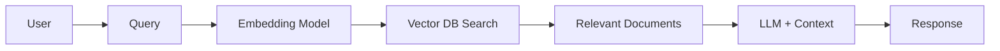

# RAG: Retrieval-Augmented Generation

## Introduction

**RAG (Retrieval-Augmented Generation)** is a technique that combines large language models (LLMs) with information retrieval systems to improve the accuracy and relevance of generated responses. Instead of relying solely on the model's pre-trained knowledge, RAG allows the LLM to access updated external information.

## RAG Architecture



### Main Components

1. **Embedding Model**: Converts text into numerical vectors (embeddings)
2. **Vector Database**: Stores and searches documents by semantic similarity
3. **Retriever**: Searches for relevant documents based on the query
4. **LLM**: Generates response using retrieved context

## Use Cases in DevOps

### 1. Internal Knowledge Base
```python
from langchain.embeddings import OpenAIEmbeddings
from langchain.vectorstores import Chroma
from langchain.llms import Ollama
from langchain.chains import RetrievalQA

# Initialize embedding model
embeddings = OpenAIEmbeddings()

# Load documents into vector DB
vectorstore = Chroma.from_documents(
    documents=docs,
    embedding=embeddings,
    persist_directory="./chroma_db"
)

# Create RAG chain
llm = Ollama(model="llama2")
qa_chain = RetrievalQA.from_chain_type(
    llm=llm,
    retriever=vectorstore.as_retriever()
)

# Query
response = qa_chain.run("How to configure Prometheus in Kubernetes?")
```

### 2. Log Analysis
```python
from langchain.document_loaders import DirectoryLoader
from langchain.text_splitter import RecursiveCharacterTextSplitter

# Load logs
loader = DirectoryLoader('/var/log/', glob='**/*.log')
documents = loader.load()

# Split into chunks
text_splitter = RecursiveCharacterTextSplitter(
    chunk_size=1000,
    chunk_overlap=200
)
chunks = text_splitter.split_documents(documents)

# Create RAG for analysis
vectorstore = Chroma.from_documents(chunks, embeddings)
```

### 3. Assisted Technical Documentation
```python
# Load project documentation
from langchain.document_loaders import UnstructuredMarkdownLoader

docs = []
for md_file in ["README.md", "CONTRIBUTING.md", "docs/**/*.md"]:
    loader = UnstructuredMarkdownLoader(md_file)
    docs.extend(loader.load())

# RAG to answer about the project
qa = RetrievalQA.from_chain_type(
    llm=Ollama(model="mistral"),
    retriever=Chroma.from_documents(docs, embeddings).as_retriever()
)
```

## Frameworks and Tools

### LangChain
Most popular framework for RAG with Python.

**Advantages:**
- Wide integration with LLMs and vector DBs
- Modular components (chains, agents)
- Large community and documentation

**Installation:**
```bash
pip install langchain chromadb openai
```

### LlamaIndex
Specialized in document indexing and querying.

**Advantages:**
- Optimized for large data volumes
- Efficient indexing
- Support for multiple backends

**Installation:**
```bash
pip install llama-index
```

### Haystack
Search and RAG framework by Deepset.

**Advantages:**
- Flexible pipelines
- Elasticsearch integration
- Semantic search support

## RAG Optimization

### 1. Chunking Strategy
```python
# Recursive strategy with overlap
text_splitter = RecursiveCharacterTextSplitter(
    chunk_size=1000,
    chunk_overlap=200,
    separators=["\n\n", "\n", " ", ""]
)
```

### 2. Reranking
```python
from langchain.retrievers import ContextualCompressionRetriever
from langchain.retrievers.document_compressors import LLMChainExtractor

# Use LLM to reorder results
compressor = LLMChainExtractor.from_llm(llm)
compression_retriever = ContextualCompressionRetriever(
    base_compressor=compressor,
    base_retriever=vectorstore.as_retriever()
)
```

### 3. Hybrid Search
```python
# Combine semantic search with keyword search
from langchain.retrievers import BM25Retriever, EnsembleRetriever

bm25_retriever = BM25Retriever.from_documents(docs)
ensemble_retriever = EnsembleRetriever(
    retrievers=[bm25_retriever, vectorstore.as_retriever()],
    weights=[0.3, 0.7]
)
```

## Evaluation Metrics

### 1. Retrieved Document Relevance
```python
from langchain.evaluation import RetrievalQAEvalChain

# Evaluate retrieval quality
eval_chain = RetrievalQAEvalChain.from_llm(llm)
results = eval_chain.evaluate(
    examples=test_cases,
    predictions=predictions
)
```

### 2. Latency
```python
import time

start = time.time()
response = qa_chain.run(query)
latency = time.time() - start
print(f"Latency: {latency:.2f}s")
```

### 3. Costs
```python
from langchain.callbacks import get_openai_callback

with get_openai_callback() as cb:
    response = qa_chain.run(query)
    print(f"Tokens: {cb.total_tokens}")
    print(f"Cost: ${cb.total_cost}")
```

## Production Architecture

### Docker Compose
```yaml
version: '3.8'
services:
  rag-api:
    image: rag-service:latest
    ports:
      - "8000:8000"
    environment:
      - OLLAMA_HOST=ollama:11434
      - CHROMA_HOST=chromadb:8000
    depends_on:
      - ollama
      - chromadb

  ollama:
    image: ollama/ollama:latest
    ports:
      - "11434:11434"
    volumes:
      - ollama_data:/root/.ollama

  chromadb:
    image: chromadb/chroma:latest
    ports:
      - "8001:8000"
    volumes:
      - chroma_data:/chroma/chroma

volumes:
  ollama_data:
  chroma_data:
```

### Kubernetes Deployment
```yaml
apiVersion: apps/v1
kind: Deployment
metadata:
  name: rag-service
spec:
  replicas: 3
  selector:
    matchLabels:
      app: rag-service
  template:
    metadata:
      labels:
        app: rag-service
    spec:
      containers:
      - name: rag
        image: rag-service:latest
        ports:
        - containerPort: 8000
        env:
        - name: OLLAMA_HOST
          value: "ollama-service:11434"
        - name: CHROMA_HOST
          value: "chroma-service:8000"
        resources:
          requests:
            memory: "2Gi"
            cpu: "1000m"
          limits:
            memory: "4Gi"
            cpu: "2000m"
```

## Best Practices

### 1. Security
- **Input sanitization**: Validate user queries
- **Access control**: Implement authentication for RAG API
- **Encryption**: Protect sensitive data in vector DB

### 2. Performance
- **Embedding cache**: Avoid recalculating repeated embeddings
- **Batch processing**: Process documents in batches
- **Incremental indexing**: Update only new/modified documents

### 3. Monitoring
```python
from prometheus_client import Counter, Histogram

rag_queries = Counter('rag_queries_total', 'Total RAG queries')
rag_latency = Histogram('rag_query_duration_seconds', 'RAG query duration')

@rag_latency.time()
def query_rag(question):
    rag_queries.inc()
    return qa_chain.run(question)
```

## Troubleshooting

### Issue: Irrelevant responses
**Solution:**
- Adjust chunk size
- Improve embedding quality
- Use reranking

### Issue: High latency
**Solution:**
- Implement cache
- Reduce number of retrieved documents
- Use approximate indexes (ANN)

### Issue: High costs
**Solution:**
- Use local models (Ollama)
- Implement response cache
- Optimize number of tokens in context

## References

- [LangChain Documentation](https://python.langchain.com/docs/get_started/introduction)
- [LlamaIndex](https://docs.llamaindex.ai/)
- [RAG Paper - Lewis et al.](https://arxiv.org/abs/2005.11401)
- [Chroma DB](https://www.trychroma.com/)

## Next Steps

- [Vector Databases](vector_databases.md) - Deep dive into vector databases
- [Ollama Basics](ollama_basics.md) - Local LLM models
- [Model Evaluation](model_evaluation.md) - Performance evaluation
